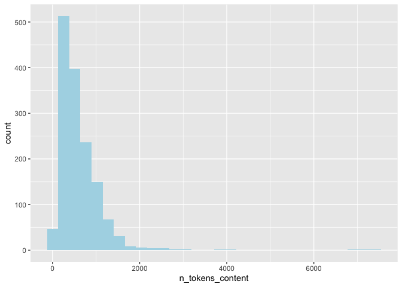
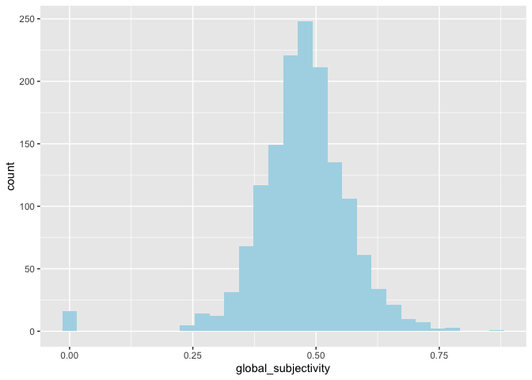
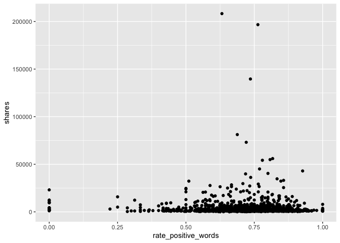
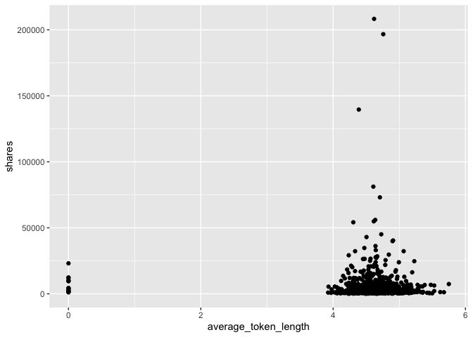
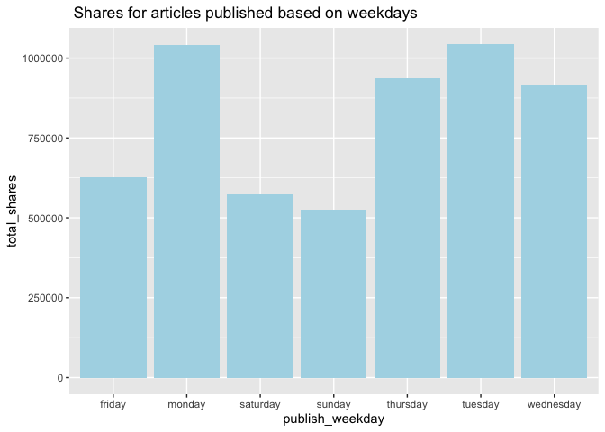
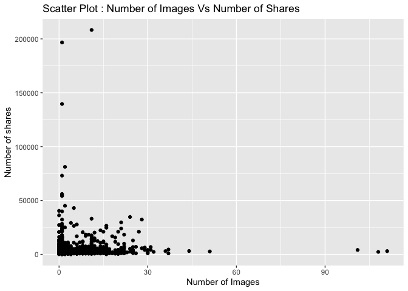

Project 3
================
Shaoyu Wang, Aniket Walimbe
2022-11-14

-   <a href="#introduction" id="toc-introduction">Introduction</a>
-   <a href="#required-packages" id="toc-required-packages">Required
    Packages</a>
-   <a href="#data" id="toc-data">Data</a>
-   <a href="#summarizations" id="toc-summarizations">Summarizations</a>
-   <a href="#contingency-tables" id="toc-contingency-tables">Contingency
    tables</a>
-   <a href="#model" id="toc-model">Model</a>

# Introduction

This [online News Popularity Data
Set](https://archive.ics.uci.edu/ml/datasets/Online+News+Popularity)
summarizes a heterogeneous set of features about articles published by
Mashable in a period of two years.

# Required Packages

First, we will load the required packages:

``` r
# Load libraries
library(readr)
library(tidyverse)
library(dplyr)
library(caret)
library(leaps)
library(ggplot2)
library(corrplot)
library(GGally)
library(randomForest)
```

# Data

Use a relative path to import the data and subset the data to work on
the data channel of interest.

``` r
#Read in the data file
newsData <- read_csv("OnlineNewsPopularity.csv",show_col_types = FALSE)
#Choose the data channel of interest
if (params$channel != "") {
  paramChannelName <- params$channel
} else {
  paramChannelName <- "lifestyle"
}
channel <- paste("data_channel_is_", paramChannelName, sep = "")
#Merge the weekdays columns channels as one single column.
news <- newsData %>% 
  filter(.data[[channel]] == 1) %>% 
  select(url, starts_with("weekday_is_")) %>% 
  pivot_longer(-url) %>% 
  filter(value != 0) %>% 
  mutate(publish_weekday = substr(name, 12, 20)) %>% 
  left_join(newsData, by = "url") %>% 
#Remove non predictive variables
  select(-c(url, name, value, timedelta, starts_with("data_channel_is_"), starts_with("weekday_is_")))
news$publish_weekday <- as.factor(news$publish_weekday)
news
```

Split the data into a training set and a test set.

``` r
set.seed(111)
trainIndex <- createDataPartition(news$shares, p = 0.7, list = FALSE)
newsTrain <- news[trainIndex,]
newsTest <- news[-trainIndex,]
newsTrain
```

# Summarizations

Some basic summary statistics and plots about the training data.

``` r
#summary for training data
summary(newsTrain)
```

    ##   publish_weekday n_tokens_title   n_tokens_content n_unique_tokens  n_non_stop_words n_non_stop_unique_tokens
    ##  friday   :208    Min.   : 3.000   Min.   :   0.0   Min.   :0.0000   Min.   :0.0000   Min.   :0.0000          
    ##  monday   :221    1st Qu.: 8.000   1st Qu.: 305.0   1st Qu.:0.4636   1st Qu.:1.0000   1st Qu.:0.6292          
    ##  saturday :133    Median :10.000   Median : 497.5   Median :0.5208   Median :1.0000   Median :0.6840          
    ##  sunday   :135    Mean   : 9.764   Mean   : 607.3   Mean   :0.5241   Mean   :0.9891   Mean   :0.6837          
    ##  thursday :254    3rd Qu.:11.000   3rd Qu.: 793.0   3rd Qu.:0.5899   3rd Qu.:1.0000   3rd Qu.:0.7521          
    ##  tuesday  :240    Max.   :17.000   Max.   :7413.0   Max.   :0.8248   Max.   :1.0000   Max.   :1.0000          
    ##  wednesday:281                                                                                                
    ##    num_hrefs      num_self_hrefs      num_imgs         num_videos      average_token_length  num_keywords   
    ##  Min.   :  0.00   Min.   : 0.000   Min.   :  0.000   Min.   : 0.0000   Min.   :0.000        Min.   : 3.000  
    ##  1st Qu.:  6.00   1st Qu.: 1.000   1st Qu.:  1.000   1st Qu.: 0.0000   1st Qu.:4.457        1st Qu.: 7.000  
    ##  Median : 10.00   Median : 2.000   Median :  1.000   Median : 0.0000   Median :4.621        Median : 9.000  
    ##  Mean   : 13.21   Mean   : 2.518   Mean   :  4.888   Mean   : 0.4572   Mean   :4.586        Mean   : 8.233  
    ##  3rd Qu.: 18.00   3rd Qu.: 3.000   3rd Qu.:  8.000   3rd Qu.: 0.0000   3rd Qu.:4.793        3rd Qu.:10.000  
    ##  Max.   :118.00   Max.   :27.000   Max.   :111.000   Max.   :50.0000   Max.   :5.749        Max.   :10.000  
    ##                                                                                                             
    ##    kw_min_min       kw_max_min      kw_avg_min        kw_min_max       kw_max_max       kw_avg_max       kw_min_avg  
    ##  Min.   : -1.00   Min.   :    0   Min.   :   -1.0   Min.   :     0   Min.   :     0   Min.   :     0   Min.   :   0  
    ##  1st Qu.: -1.00   1st Qu.:  488   1st Qu.:  184.2   1st Qu.:     0   1st Qu.:690400   1st Qu.:118659   1st Qu.:   0  
    ##  Median :  4.00   Median :  813   Median :  301.1   Median :     0   Median :843300   Median :181881   Median :   0  
    ##  Mean   : 41.45   Mean   : 1664   Mean   :  418.1   Mean   :  7217   Mean   :702035   Mean   :183400   Mean   :1054  
    ##  3rd Qu.:  4.00   3rd Qu.: 1300   3rd Qu.:  439.1   3rd Qu.:  6200   3rd Qu.:843300   3rd Qu.:248982   3rd Qu.:2274  
    ##  Max.   :377.00   Max.   :98700   Max.   :14187.8   Max.   :208300   Max.   :843300   Max.   :491771   Max.   :3610  
    ##                                                                                                                      
    ##    kw_max_avg      kw_avg_avg    self_reference_min_shares self_reference_max_shares self_reference_avg_sharess
    ##  Min.   :    0   Min.   :    0   Min.   :     0            Min.   :     0.0          Min.   :     0.0          
    ##  1st Qu.: 4042   1st Qu.: 2642   1st Qu.:   624            1st Qu.:   965.2          1st Qu.:   942.5          
    ##  Median : 5036   Median : 3221   Median :  1700            Median :  2850.0          Median :  2500.0          
    ##  Mean   : 6625   Mean   : 3404   Mean   :  4741            Mean   :  8053.0          Mean   :  6168.2          
    ##  3rd Qu.: 7166   3rd Qu.: 3926   3rd Qu.:  3800            3rd Qu.:  7225.0          3rd Qu.:  5625.0          
    ##  Max.   :98700   Max.   :20378   Max.   :144900            Max.   :690400.0          Max.   :401450.0          
    ##                                                                                                                
    ##    is_weekend         LDA_00            LDA_01            LDA_02            LDA_03            LDA_04       
    ##  Min.   :0.0000   Min.   :0.01818   Min.   :0.01819   Min.   :0.01819   Min.   :0.01820   Min.   :0.02014  
    ##  1st Qu.:0.0000   1st Qu.:0.02251   1st Qu.:0.02222   1st Qu.:0.02223   1st Qu.:0.02249   1st Qu.:0.31664  
    ##  Median :0.0000   Median :0.02914   Median :0.02507   Median :0.02792   Median :0.03043   Median :0.57032  
    ##  Mean   :0.1821   Mean   :0.17903   Mean   :0.06506   Mean   :0.08074   Mean   :0.14444   Mean   :0.53073  
    ##  3rd Qu.:0.0000   3rd Qu.:0.25518   3rd Qu.:0.04001   3rd Qu.:0.11889   3rd Qu.:0.21061   3rd Qu.:0.79919  
    ##  Max.   :1.0000   Max.   :0.91980   Max.   :0.62253   Max.   :0.67623   Max.   :0.91837   Max.   :0.91995  
    ##                                                                                                            
    ##  global_subjectivity global_sentiment_polarity global_rate_positive_words global_rate_negative_words
    ##  Min.   :0.0000      Min.   :-0.37271          Min.   :0.00000            Min.   :0.00000           
    ##  1st Qu.:0.4263      1st Qu.: 0.09868          1st Qu.:0.03464            1st Qu.:0.01050           
    ##  Median :0.4762      Median : 0.14874          Median :0.04348            Median :0.01532           
    ##  Mean   :0.4736      Mean   : 0.15064          Mean   :0.04419            Mean   :0.01626           
    ##  3rd Qu.:0.5248      3rd Qu.: 0.20520          3rd Qu.:0.05296            3rd Qu.:0.02085           
    ##  Max.   :0.8667      Max.   : 0.51389          Max.   :0.12139            Max.   :0.06180           
    ##                                                                                                     
    ##  rate_positive_words rate_negative_words avg_positive_polarity min_positive_polarity max_positive_polarity
    ##  Min.   :0.0000      Min.   :0.0000      Min.   :0.0000        Min.   :0.00000       Min.   :0.00         
    ##  1st Qu.:0.6632      1st Qu.:0.1852      1st Qu.:0.3359        1st Qu.:0.05000       1st Qu.:0.70         
    ##  Median :0.7377      Median :0.2586      Median :0.3832        Median :0.10000       Median :0.90         
    ##  Mean   :0.7214      Mean   :0.2677      Mean   :0.3828        Mean   :0.09355       Mean   :0.83         
    ##  3rd Qu.:0.8112      3rd Qu.:0.3333      3rd Qu.:0.4343        3rd Qu.:0.10000       3rd Qu.:1.00         
    ##  Max.   :1.0000      Max.   :1.0000      Max.   :0.7553        Max.   :0.50000       Max.   :1.00         
    ##                                                                                                           
    ##  avg_negative_polarity min_negative_polarity max_negative_polarity title_subjectivity title_sentiment_polarity
    ##  Min.   :-1.0000       Min.   :-1.0000       Min.   :-1.000        Min.   :0.0000     Min.   :-1.0000         
    ##  1st Qu.:-0.3232       1st Qu.:-0.7143       1st Qu.:-0.125        1st Qu.:0.0000     1st Qu.: 0.0000         
    ##  Median :-0.2612       Median :-0.5000       Median :-0.100        Median :0.1000     Median : 0.0000         
    ##  Mean   :-0.2671       Mean   :-0.5566       Mean   :-0.105        Mean   :0.2827     Mean   : 0.1052         
    ##  3rd Qu.:-0.2033       3rd Qu.:-0.4000       3rd Qu.:-0.050        3rd Qu.:0.5000     3rd Qu.: 0.2000         
    ##  Max.   : 0.0000       Max.   : 0.0000       Max.   : 0.000        Max.   :1.0000     Max.   : 1.0000         
    ##                                                                                                               
    ##  abs_title_subjectivity abs_title_sentiment_polarity     shares      
    ##  Min.   :0.0000         Min.   :0.0000               Min.   :    28  
    ##  1st Qu.:0.2000         1st Qu.:0.0000               1st Qu.:  1100  
    ##  Median :0.5000         Median :0.0000               Median :  1700  
    ##  Mean   :0.3531         Mean   :0.1688               Mean   :  3847  
    ##  3rd Qu.:0.5000         3rd Qu.:0.2927               3rd Qu.:  3225  
    ##  Max.   :0.5000         Max.   :1.0000               Max.   :208300  
    ## 

``` r
#numerical summary for our Y variable shares
summary(newsTrain$shares)
```

    ##    Min. 1st Qu.  Median    Mean 3rd Qu.    Max. 
    ##      28    1100    1700    3847    3225  208300

``` r
newsTrain %>% 
  summarise(mean = round(mean(shares), 0), sd = round(sd(shares), 0), 
            median = round(median(shares), 0), IQR = round(IQR(shares), 0))
```

``` r
#numerical summaries on subgroups
newsTrain %>% 
  group_by(publish_weekday) %>% 
  summarise(mean = round(mean(shares), 0), sd = round(sd(shares), 0), 
            median = round(median(shares), 0), IQR = round(IQR(shares), 0))
newsTrain %>% 
  group_by(num_imgs) %>% 
  summarise(mean = round(mean(shares), 0), sd = round(sd(shares), 0), 
            median = round(median(shares), 0), IQR = round(IQR(shares), 0))
newsTrain %>% 
  group_by(num_videos) %>% 
  summarise(mean = round(mean(shares), 0), sd = round(sd(shares), 0), 
            median = round(median(shares), 0), IQR = round(IQR(shares), 0))
newsTrain %>% 
  group_by(num_keywords) %>% 
  summarise(mean = round(mean(shares), 0), sd = round(sd(shares), 0), 
            median = round(median(shares), 0), IQR = round(IQR(shares), 0))
```

# Contingency tables

Contingency tables : Here, the title subjectivity is divided into 3
categories : high, medium and low based on the values. If the value is
greater than 0.8, it is high, greater than 0.4 and less than 0.8 is
medium and remaining is low. The contingency table is then shown below.

``` r
newsTrain$subject_activity_type <- ifelse(newsTrain$title_subjectivity >= 0.8, "High", 
                                          ifelse(newsTrain$title_subjectivity >= 0.4, "Medium",
                                                 ifelse(airquality$Wind >= 0, "Low", "None")))
table(newsTrain$subject_activity_type)
```

    ## 
    ##   High    Low Medium 
    ##    161    930    381

``` r
table(newsTrain$publish_weekday)
```

    ## 
    ##    friday    monday  saturday    sunday  thursday   tuesday wednesday 
    ##       208       221       133       135       254       240       281

``` r
g <- ggplot(newsTrain, aes(x = n_tokens_title))
g + geom_histogram(fill = "lightblue", binwidth = 1) + 
  labs()
```

<!-- -->

``` r
g <- ggplot(newsTrain, aes(x = n_tokens_content))
g + geom_histogram(fill = "lightblue") + 
  labs()
```

<!-- -->

``` r
g <- ggplot(newsTrain, aes(x = global_subjectivity))
g + geom_histogram(fill = "lightblue") + 
  labs()
```

<!-- -->

``` r
g <- ggplot(newsTrain, aes(x = global_sentiment_polarity))
g + geom_histogram(fill = "lightblue") + 
  labs()
```

<!-- -->

``` r
g <- ggplot(newsTrain, aes(x = rate_positive_words, y = shares))
g + geom_point() + 
  labs()
```

<!-- -->

``` r
g <- ggplot(newsTrain, aes(x = average_token_length, y = shares))
g + geom_point() + 
  labs()
```

<!-- -->

Plot between title subjectivity and number of shares: We can inspect the
trend of the shares as a function of title subjectivity.

``` r
g <- ggplot(data = newsTrain, aes(x = title_subjectivity, y = shares))
g + geom_point() + 
  labs(x = "Title subjectivity" , y = "Number of shares", title = "Scatter Plot : Title Subjectivity Vs Number of Shares") 
```

<!-- -->

Plot between number of shares and article published day: This plot shows
the number of shares an article has based on the day it has been
published.

``` r
newsTrainday <- newsTrain %>%
  select(publish_weekday, shares) %>%
  group_by(publish_weekday) %>% 
  summarise(total_shares=sum(shares))

g <- ggplot(data = newsTrainday, aes(x=publish_weekday, y=total_shares))
g + geom_col(fill = "lightblue")+
  labs(title = " Shares for articles published based on weekdays")
```

<!-- -->

Plot between number of images and number of shares:

``` r
g <- ggplot(data = newsTrain, aes(x = num_imgs, y = shares))
g + geom_point() +
  labs(x = "Number of Images" , y = "Number of shares", title = "Scatter Plot : Number of Images Vs Number of Shares") 
```

<!-- -->

Plotting the correlation between numeric variables.

``` r
correlation <- cor(newsTrain %>% select(-c(publish_weekday, subject_activity_type)), method = "spearman")
corrplot(correlation, type = "upper", tl.pos = "lt", tl.col = "black", tl.cex = 0.5, mar = c(2, 0, 1, 0)) 
corrplot(correlation, type = "lower", add = TRUE, diag = FALSE, tl.pos = "n", number.cex = 0.5)
```

<!-- -->

Select predictors: publish_weekday, n_tokens_title, n_tokens_content,
num_self_hrefs, num_videos, average_token_length, num_keywords,
kw_avg_avg, self_reference_avg_sharess, LDA_04, global_subjectivity,
global_sentiment_polarity, avg_positive_polarity, avg_negative_polarity,
title_subjectivity, shares.

``` r
set.seed(111)
Train <- newsTrain %>% 
  select(publish_weekday, n_tokens_title, n_tokens_content, num_self_hrefs, num_videos, average_token_length, num_keywords, kw_avg_avg, self_reference_avg_sharess, LDA_04, global_subjectivity, global_sentiment_polarity, avg_positive_polarity, avg_negative_polarity, title_subjectivity, shares)
Test <- newsTest %>% 
  select(publish_weekday, n_tokens_title, n_tokens_content, num_self_hrefs, num_videos, average_token_length, num_keywords, kw_avg_avg, self_reference_avg_sharess, LDA_04, global_subjectivity, global_sentiment_polarity, avg_positive_polarity, avg_negative_polarity, title_subjectivity, shares)
Train
```

# Model

## Linear Regression Model

``` r
#forward stepwise
set.seed(111)
fwFit <- train(shares ~ ., data = Train,
                   method = "leapForward",
                   preProcess = c("center", "scale"))
fwFit
```

    ## Linear Regression with Forward Selection 
    ## 
    ## 1472 samples
    ##   15 predictor
    ## 
    ## Pre-processing: centered (20), scaled (20) 
    ## Resampling: Bootstrapped (25 reps) 
    ## Summary of sample sizes: 1472, 1472, 1472, 1472, 1472, 1472, ... 
    ## Resampling results across tuning parameters:
    ## 
    ##   nvmax  RMSE      Rsquared     MAE     
    ##   2      9801.072  0.004031191  3620.379
    ##   3      9798.712  0.006010639  3625.675
    ##   4      9818.258  0.005488719  3643.106
    ## 
    ## RMSE was used to select the optimal model using the smallest value.
    ## The final value used for the model was nvmax = 3.

``` r
#summary(fwFit)
```

``` r
#backward stepwise
set.seed(111)
bwFit <- train(shares ~ ., data = Train,
                   method = "leapBackward",
                   preProcess = c("center", "scale"))
bwFit
```

    ## Linear Regression with Backwards Selection 
    ## 
    ## 1472 samples
    ##   15 predictor
    ## 
    ## Pre-processing: centered (20), scaled (20) 
    ## Resampling: Bootstrapped (25 reps) 
    ## Summary of sample sizes: 1472, 1472, 1472, 1472, 1472, 1472, ... 
    ## Resampling results across tuning parameters:
    ## 
    ##   nvmax  RMSE      Rsquared     MAE     
    ##   2      9799.978  0.003717326  3626.314
    ##   3      9804.399  0.004915806  3630.710
    ##   4      9824.213  0.004739317  3647.786
    ## 
    ## RMSE was used to select the optimal model using the smallest value.
    ## The final value used for the model was nvmax = 2.

``` r
#summary(bwFit)
```

``` r
#fit a linear regression model with 2 predictors: num_videos, kw_avg_avg
set.seed(111)
lrFit_2 <- train(shares ~ num_videos + kw_avg_avg, data = Train,
               method = "lm",
               trControl = trainControl(method = "cv", number = 5))
lrFit_2
```

    ## Linear Regression 
    ## 
    ## 1472 samples
    ##    2 predictor
    ## 
    ## No pre-processing
    ## Resampling: Cross-Validated (5 fold) 
    ## Summary of sample sizes: 1176, 1178, 1178, 1178, 1178 
    ## Resampling results:
    ## 
    ##   RMSE      Rsquared   MAE     
    ##   8855.734  0.0192847  3515.802
    ## 
    ## Tuning parameter 'intercept' was held constant at a value of TRUE

``` r
#fit a linear regression model with 3 predictors: n_tokens_content, num_videos, kw_avg_avg
set.seed(111)
lrFit_3 <- train(shares ~ n_tokens_content + num_videos + kw_avg_avg, data = Train,
               method = "lm",
               trControl = trainControl(method = "cv", number = 5))
lrFit_3
```

    ## Linear Regression 
    ## 
    ## 1472 samples
    ##    3 predictor
    ## 
    ## No pre-processing
    ## Resampling: Cross-Validated (5 fold) 
    ## Summary of sample sizes: 1176, 1178, 1178, 1178, 1178 
    ## Resampling results:
    ## 
    ##   RMSE      Rsquared    MAE    
    ##   8878.246  0.01441459  3537.39
    ## 
    ## Tuning parameter 'intercept' was held constant at a value of TRUE

``` r
#fit a linear regression model with all predictors
set.seed(111)
lrFit <- train(shares ~ ., data = Train,
               method = "lm",
               trControl = trainControl(method = "cv", number = 5))
lrFit
```

    ## Linear Regression 
    ## 
    ## 1472 samples
    ##   15 predictor
    ## 
    ## No pre-processing
    ## Resampling: Cross-Validated (5 fold) 
    ## Summary of sample sizes: 1176, 1178, 1178, 1178, 1178 
    ## Resampling results:
    ## 
    ##   RMSE      Rsquared     MAE     
    ##   8983.161  0.005559754  3627.885
    ## 
    ## Tuning parameter 'intercept' was held constant at a value of TRUE

## Random Forest Model

``` r
set.seed(111)
randomFit <- train(shares ~ ., 
                   data = Train, 
                   method = "rf",
                   preProcess = c("center","scale"),
                   trControl = trainControl(method = "cv", number = 5),
                   tuneGrid = data.frame(mtry = ncol(Train)/3))
randomFit
```

    ## Random Forest 
    ## 
    ## 1472 samples
    ##   15 predictor
    ## 
    ## Pre-processing: centered (20), scaled (20) 
    ## Resampling: Cross-Validated (5 fold) 
    ## Summary of sample sizes: 1176, 1178, 1178, 1178, 1178 
    ## Resampling results:
    ## 
    ##   RMSE      Rsquared    MAE     
    ##   9123.384  0.01024489  3783.749
    ## 
    ## Tuning parameter 'mtry' was held constant at a value of 5.333333

## Boosted Tree Model

``` r
set.seed(111)
boostedFit <- train(shares ~ ., 
                    data = Train, 
                    method = "gbm", 
                    preProcess = c("center", "scale"),
                    trControl = trainControl(method = "cv", number = 5),
                    tuneGrid = expand.grid(n.trees = c(25,50,100,150,200), 
                                           interaction.depth = c(1,2,3,4), 
                                           shrinkage = 0.1, 
                                           n.minobsinnode = 10),
                    verbose = FALSE)
boostedFit
```

    ## Stochastic Gradient Boosting 
    ## 
    ## 1472 samples
    ##   15 predictor
    ## 
    ## Pre-processing: centered (20), scaled (20) 
    ## Resampling: Cross-Validated (5 fold) 
    ## Summary of sample sizes: 1176, 1178, 1178, 1178, 1178 
    ## Resampling results across tuning parameters:
    ## 
    ##   interaction.depth  n.trees  RMSE      Rsquared     MAE     
    ##   1                   25      9004.486  0.003738019  3591.563
    ##   1                   50      9039.288  0.004726933  3599.448
    ##   1                  100      9066.086  0.005349205  3603.760
    ##   1                  150      9151.304  0.005543044  3647.226
    ##   1                  200      9165.702  0.004644262  3663.997
    ##   2                   25      9079.858  0.005125629  3618.520
    ##   2                   50      9177.102  0.006511629  3666.499
    ##   2                  100      9307.758  0.005312415  3791.247
    ##   2                  150      9334.711  0.006592770  3801.339
    ##   2                  200      9445.209  0.008105837  3885.666
    ##   3                   25      9079.659  0.010071723  3670.427
    ##   3                   50      9215.029  0.009249126  3735.285
    ##   3                  100      9342.434  0.010310894  3833.884
    ##   3                  150      9395.307  0.010345525  3902.359
    ##   3                  200      9451.649  0.009580368  3957.343
    ##   4                   25      9134.564  0.007450924  3658.033
    ##   4                   50      9130.482  0.013540063  3681.188
    ##   4                  100      9298.116  0.011840821  3803.806
    ##   4                  150      9334.298  0.012007943  3863.891
    ##   4                  200      9433.876  0.015328202  3925.800
    ## 
    ## Tuning parameter 'shrinkage' was held constant at a value of 0.1
    ## Tuning parameter 'n.minobsinnode' was held
    ##  constant at a value of 10
    ## RMSE was used to select the optimal model using the smallest value.
    ## The final values used for the model were n.trees = 25, interaction.depth = 1, shrinkage = 0.1 and n.minobsinnode = 10.

## Comparison

All the models are compared by RMSE on the test set

``` r
#pred_Fit2 <- predict(lrFit_2, newdata = Test)
fit2_mod <- postResample(predict(lrFit_2, newdata = Test), obs = Test$shares)
#pred_Fit3 <- predict(lrFit_3, newdata = Test)
fit3_mod <- postResample(predict(lrFit_3, newdata = Test), obs = Test$shares)
#fit a linear regression model
#pred_lrFit <- predict(lrFit, newdata = Test)
lr_mod <- postResample(predict(lrFit, newdata = Test), obs = Test$shares)
#random forest
#pred_randomFit <- predict(randomFit, newdata = Test)
random_mod <- postResample(predict(randomFit, newdata = Test), obs = Test$shares)
#boosted tree
#pred_boostedFit <- predict(boostedFit, newdata = Test)
boosted_mod <- postResample(predict(boostedFit, newdata = Test), obs = Test$shares)
#compare all models
comparison <- tibble(model = c("LR with 2 predictors",
                               "LR with 3 predictors",
                               "LR with all predictors",
                               "Random Forest",
                               "Boosted Tree"), 
                     RMSE = c(fit2_mod[1],
                              fit3_mod[1],
                              lr_mod[1],
                              random_mod[1],
                              boosted_mod[1]))
comparison
```
