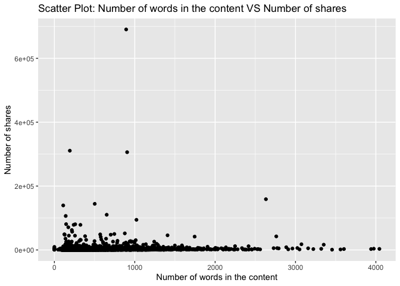

Project 3
================
Shaoyu Wang, Aniket Walimbe
2022-11-14

-   <a href="#introduction" id="toc-introduction">Introduction</a>
-   <a href="#required-packages" id="toc-required-packages">Required
    Packages</a>
-   <a href="#data" id="toc-data">Data</a>
-   <a href="#summarizations" id="toc-summarizations">Summarizations</a>
-   <a href="#model" id="toc-model">Model</a>
-   <a href="#comparison" id="toc-comparison">Comparison</a>
-   <a href="#automation" id="toc-automation">Automation</a>

# Introduction

This [online News Popularity Data
Set](https://archive.ics.uci.edu/ml/datasets/Online+News+Popularity)
summarizes a heterogeneous set of features about articles published by
Mashable in a period of two years.

# Required Packages

First, we will load the required packages:

``` r
# Load libraries
library(readr)
library(tidyverse)
library(dplyr)
library(caret)
library(leaps)
library(ggplot2)
library(corrplot)
library(GGally)
library(randomForest)
```

# Data

Read in the data and subset the data to work on the data channel of
interest. We found that there are seven similar columns for weekday from
Monday to Sunday, so we merged these columns and named the new variable
as `publush_weekday`. For this step, we also removed the non-predictive
variables.

``` r
#Read in the data file
newsData <- read_csv("OnlineNewsPopularity.csv",show_col_types = FALSE)
#Choose the data channel of interest
if (params$channel != "") {
  paramChannelName <- params$channel
} else {
  paramChannelName <- "lifestyle"
}
channel <- paste("data_channel_is_", paramChannelName, sep = "")
#Merge the weekdays columns as one single column.
news <- newsData %>% 
  filter(.data[[channel]] == 1) %>% 
  select(url, starts_with("weekday_is_")) %>% 
  pivot_longer(-url) %>% 
  filter(value != 0) %>% 
  mutate(publish_weekday = substr(name, 12, 20)) %>% 
  left_join(newsData, by = "url") %>% 
#Remove non predictive variables
  select(-c(url, name, value, timedelta, starts_with("data_channel_is_"), starts_with("weekday_is_")))
news$publish_weekday <- as.factor(news$publish_weekday)
news
```

    ## # A tibble: 6,258 × 47
    ##    publish_…¹ n_tok…² n_tok…³ n_uni…⁴ n_non…⁵ n_non…⁶ num_h…⁷ num_s…⁸ num_i…⁹
    ##    <fct>        <dbl>   <dbl>   <dbl>   <dbl>   <dbl>   <dbl>   <dbl>   <dbl>
    ##  1 monday           9     255   0.605    1.00   0.792       3       1       1
    ##  2 monday           9     211   0.575    1.00   0.664       3       1       1
    ##  3 monday           8     397   0.625    1.00   0.806      11       0       1
    ##  4 monday          13     244   0.560    1.00   0.680       3       2       1
    ##  5 monday          11     723   0.491    1.00   0.642      18       1       1
    ##  6 monday           8     708   0.482    1.00   0.688       8       3       1
    ##  7 monday          10     142   0.655    1.00   0.792       2       1       1
    ##  8 monday          12     444   0.601    1.00   0.755       9       8      23
    ##  9 monday           6     109   0.667    1.00   0.737       3       2       1
    ## 10 tuesday         13     306   0.535    1.00   0.705       3       2       1
    ## # … with 6,248 more rows, 38 more variables: num_videos <dbl>,
    ## #   average_token_length <dbl>, num_keywords <dbl>, kw_min_min <dbl>,
    ## #   kw_max_min <dbl>, kw_avg_min <dbl>, kw_min_max <dbl>, kw_max_max <dbl>,
    ## #   kw_avg_max <dbl>, kw_min_avg <dbl>, kw_max_avg <dbl>, kw_avg_avg <dbl>,
    ## #   self_reference_min_shares <dbl>, self_reference_max_shares <dbl>,
    ## #   self_reference_avg_sharess <dbl>, is_weekend <dbl>, LDA_00 <dbl>,
    ## #   LDA_01 <dbl>, LDA_02 <dbl>, LDA_03 <dbl>, LDA_04 <dbl>, …

Split the data into a training set and a test set.

``` r
set.seed(111)
trainIndex <- createDataPartition(news$shares, p = 0.7, list = FALSE)
newsTrain <- news[trainIndex,]
newsTest <- news[-trainIndex,]
#newsTrain
```

# Summarizations

Some basic summary statistics and plots about the training data.

## Tables

Firstly, we summarized the training data.

``` r
summary(newsTrain)
```

    ##   publish_weekday n_tokens_title  n_tokens_content n_unique_tokens 
    ##  friday   :588    Min.   : 3.00   Min.   :   0.0   Min.   :0.0000  
    ##  monday   :804    1st Qu.: 9.00   1st Qu.: 242.0   1st Qu.:0.4782  
    ##  saturday :172    Median :10.00   Median : 403.0   Median :0.5472  
    ##  sunday   :240    Mean   :10.29   Mean   : 539.9   Mean   :0.5463  
    ##  thursday :871    3rd Qu.:12.00   3rd Qu.: 730.8   3rd Qu.:0.6113  
    ##  tuesday  :792    Max.   :19.00   Max.   :4044.0   Max.   :0.8732  
    ##  wednesday:915                                                     
    ##  n_non_stop_words n_non_stop_unique_tokens   num_hrefs      
    ##  Min.   :0.0000   Min.   :0.0000           Min.   :  0.000  
    ##  1st Qu.:1.0000   1st Qu.:0.6484           1st Qu.:  4.000  
    ##  Median :1.0000   Median :0.7037           Median :  7.000  
    ##  Mean   :0.9968   Mean   :0.7036           Mean   :  9.346  
    ##  3rd Qu.:1.0000   3rd Qu.:0.7604           3rd Qu.: 11.000  
    ##  Max.   :1.0000   Max.   :0.9730           Max.   :122.000  
    ##                                                             
    ##  num_self_hrefs      num_imgs        num_videos      average_token_length
    ##  Min.   : 0.000   Min.   : 0.000   Min.   : 0.0000   Min.   :0.000       
    ##  1st Qu.: 1.000   1st Qu.: 1.000   1st Qu.: 0.0000   1st Qu.:4.528       
    ##  Median : 2.000   Median : 1.000   Median : 0.0000   Median :4.686       
    ##  Mean   : 2.833   Mean   : 1.844   Mean   : 0.6207   Mean   :4.691       
    ##  3rd Qu.: 4.000   3rd Qu.: 1.000   3rd Qu.: 0.0000   3rd Qu.:4.858       
    ##  Max.   :56.000   Max.   :51.000   Max.   :75.0000   Max.   :6.383       
    ##                                                                          
    ##   num_keywords      kw_min_min       kw_max_min       kw_avg_min     
    ##  Min.   : 2.000   Min.   : -1.00   Min.   :     0   Min.   :   -1.0  
    ##  1st Qu.: 5.000   1st Qu.: -1.00   1st Qu.:   438   1st Qu.:  152.7  
    ##  Median : 6.000   Median : -1.00   Median :   633   Median :  253.2  
    ##  Mean   : 6.501   Mean   : 29.54   Mean   :  1061   Mean   :  317.2  
    ##  3rd Qu.: 8.000   3rd Qu.:  4.00   3rd Qu.:  1100   3rd Qu.:  373.2  
    ##  Max.   :10.000   Max.   :318.00   Max.   :298400   Max.   :42827.9  
    ##                                                                      
    ##    kw_min_max       kw_max_max       kw_avg_max       kw_min_avg  
    ##  Min.   :     0   Min.   :     0   Min.   :     0   Min.   :   0  
    ##  1st Qu.:     0   1st Qu.:690400   1st Qu.:234950   1st Qu.:   0  
    ##  Median :  1600   Median :843300   Median :312600   Median :1065  
    ##  Mean   : 19591   Mean   :743493   Mean   :314897   Mean   :1098  
    ##  3rd Qu.:  7000   3rd Qu.:843300   3rd Qu.:400115   3rd Qu.:1929  
    ##  Max.   :690400   Max.   :843300   Max.   :766850   Max.   :3531  
    ##                                                                   
    ##    kw_max_avg       kw_avg_avg    self_reference_min_shares
    ##  Min.   :     0   Min.   :    0   Min.   :     0           
    ##  1st Qu.:  3484   1st Qu.: 2332   1st Qu.:   435           
    ##  Median :  4100   Median : 2766   Median :  1100           
    ##  Mean   :  5366   Mean   : 2963   Mean   :  3594           
    ##  3rd Qu.:  5300   3rd Qu.: 3343   3rd Qu.:  2300           
    ##  Max.   :298400   Max.   :43568   Max.   :690400           
    ##                                                            
    ##  self_reference_max_shares self_reference_avg_sharess   is_weekend     
    ##  Min.   :     0.0          Min.   :     0.0           Min.   :0.00000  
    ##  1st Qu.:   732.8          1st Qu.:   714.2           1st Qu.:0.00000  
    ##  Median :  2500.0          Median :  2000.0           Median :0.00000  
    ##  Mean   : 10579.0          Mean   :  6316.8           Mean   :0.09402  
    ##  3rd Qu.:  6300.0          3rd Qu.:  4400.0           3rd Qu.:0.00000  
    ##  Max.   :690400.0          Max.   :690400.0           Max.   :1.00000  
    ##                                                                        
    ##      LDA_00           LDA_01            LDA_02            LDA_03       
    ##  Min.   :0.1031   Min.   :0.01820   Min.   :0.01818   Min.   :0.01818  
    ##  1st Qu.:0.5115   1st Qu.:0.02857   1st Qu.:0.02857   1st Qu.:0.02857  
    ##  Median :0.7009   Median :0.03571   Median :0.04000   Median :0.03337  
    ##  Mean   :0.6551   Mean   :0.07657   Mean   :0.08162   Mean   :0.06594  
    ##  3rd Qu.:0.8400   3rd Qu.:0.05001   3rd Qu.:0.05010   3rd Qu.:0.05000  
    ##  Max.   :0.9200   Max.   :0.71244   Max.   :0.77500   Max.   :0.83654  
    ##                                                                        
    ##      LDA_04        global_subjectivity global_sentiment_polarity
    ##  Min.   :0.01818   Min.   :0.0000      Min.   :-0.2176          
    ##  1st Qu.:0.02864   1st Qu.:0.3867      1st Qu.: 0.0871          
    ##  Median :0.04000   Median :0.4386      Median : 0.1346          
    ##  Mean   :0.12073   Mean   :0.4356      Mean   : 0.1356          
    ##  3rd Qu.:0.15937   3rd Qu.:0.4880      3rd Qu.: 0.1859          
    ##  Max.   :0.79742   Max.   :0.8489      Max.   : 0.6226          
    ##                                                                 
    ##  global_rate_positive_words global_rate_negative_words rate_positive_words
    ##  Min.   :0.00000            Min.   :0.000000           Min.   :0.0000     
    ##  1st Qu.:0.03190            1st Qu.:0.009132           1st Qu.:0.6667     
    ##  Median :0.04203            Median :0.014068           Median :0.7500     
    ##  Mean   :0.04320            Mean   :0.014723           Mean   :0.7373     
    ##  3rd Qu.:0.05364            3rd Qu.:0.019498           3rd Qu.:0.8333     
    ##  Max.   :0.12500            Max.   :0.060811           Max.   :1.0000     
    ##                                                                           
    ##  rate_negative_words avg_positive_polarity min_positive_polarity
    ##  Min.   :0.0000      Min.   :0.0000        Min.   :0.00000      
    ##  1st Qu.:0.1667      1st Qu.:0.3073        1st Qu.:0.03333      
    ##  Median :0.2500      Median :0.3541        Median :0.10000      
    ##  Mean   :0.2592      Mean   :0.3531        Mean   :0.08703      
    ##  3rd Qu.:0.3333      3rd Qu.:0.4000        3rd Qu.:0.10000      
    ##  Max.   :1.0000      Max.   :0.7950        Max.   :0.70000      
    ##                                                                 
    ##  max_positive_polarity avg_negative_polarity min_negative_polarity
    ##  Min.   :0.0000        Min.   :-1.0000       Min.   :-1.0000      
    ##  1st Qu.:0.6000        1st Qu.:-0.3011       1st Qu.:-0.7000      
    ##  Median :0.8000        Median :-0.2373       Median :-0.5000      
    ##  Mean   :0.7668        Mean   :-0.2427       Mean   :-0.4806      
    ##  3rd Qu.:1.0000        3rd Qu.:-0.1778       3rd Qu.:-0.2500      
    ##  Max.   :1.0000        Max.   : 0.0000       Max.   : 0.0000      
    ##                                                                   
    ##  max_negative_polarity title_subjectivity title_sentiment_polarity
    ##  Min.   :-1.0000       Min.   :0.00000    Min.   :-1.0000         
    ##  1st Qu.:-0.1250       1st Qu.:0.00000    1st Qu.: 0.0000         
    ##  Median :-0.1000       Median :0.06667    Median : 0.0000         
    ##  Mean   :-0.1088       Mean   :0.24838    Mean   : 0.0770         
    ##  3rd Qu.:-0.0500       3rd Qu.:0.45455    3rd Qu.: 0.1364         
    ##  Max.   : 0.0000       Max.   :1.00000    Max.   : 1.0000         
    ##                                                                   
    ##  abs_title_subjectivity abs_title_sentiment_polarity     shares        
    ##  Min.   :0.0000         Min.   :0.0000               Min.   :     1.0  
    ##  1st Qu.:0.1667         1st Qu.:0.0000               1st Qu.:   952.2  
    ##  Median :0.5000         Median :0.0000               Median :  1400.0  
    ##  Mean   :0.3416         Mean   :0.1378               Mean   :  3037.1  
    ##  3rd Qu.:0.5000         3rd Qu.:0.2000               3rd Qu.:  2500.0  
    ##  Max.   :0.5000         Max.   :1.0000               Max.   :690400.0  
    ## 

Then let’s check our response variable `shares`. It shows that the mean
of `shares` is 3847, standard deviation is 10112, median is 1700, IQR is
2125.

``` r
#numerical summary for the variable shares
newsTrain %>% 
  summarise(mean = round(mean(shares), 0), sd = round(sd(shares), 0), 
            median = round(median(shares), 0), IQR = round(IQR(shares), 0))
```

    ## # A tibble: 1 × 4
    ##    mean    sd median   IQR
    ##   <dbl> <dbl>  <dbl> <dbl>
    ## 1  3037 13961   1400  1548

``` r
#numerical summaries on subgroups
newsTrain %>% 
  group_by(publish_weekday) %>% 
  summarise(mean = round(mean(shares), 0), sd = round(sd(shares), 0), 
            median = round(median(shares), 0), IQR = round(IQR(shares), 0))
```

    ## # A tibble: 7 × 5
    ##   publish_weekday  mean    sd median   IQR
    ##   <fct>           <dbl> <dbl>  <dbl> <dbl>
    ## 1 friday           2115  2156   1400  1374
    ## 2 monday           3710 24901   1400  1647
    ## 3 saturday         4726 11700   2600  2300
    ## 4 sunday           3477  4420   2100  2325
    ## 5 thursday         2715 11670   1300  1298
    ## 6 tuesday          3090 12497   1300  1378
    ## 7 wednesday        2866  9448   1300  1304

``` r
newsTrain %>% 
  group_by(num_imgs) %>% 
  summarise(mean = round(mean(shares), 0), sd = round(sd(shares), 0), 
            median = round(median(shares), 0), IQR = round(IQR(shares), 0))
```

    ## # A tibble: 38 × 5
    ##    num_imgs  mean    sd median   IQR
    ##       <dbl> <dbl> <dbl>  <dbl> <dbl>
    ##  1        0  6374 35495   1400  1557
    ##  2        1  2344  5420   1300  1379
    ##  3        2  2437  3647   1500  1500
    ##  4        3  3217  4945   2000  2575
    ##  5        4  2873  1915   2400  1800
    ##  6        5  5583  4977   3800  4575
    ##  7        6  4353  4683   3400  3650
    ##  8        7  3311  3344   2150  2175
    ##  9        8  3667  3547   2000  3900
    ## 10        9  3470  3368   1800  3200
    ## # … with 28 more rows

``` r
newsTrain %>% 
  group_by(num_videos) %>% 
  summarise(mean = round(mean(shares), 0), sd = round(sd(shares), 0), 
            median = round(median(shares), 0), IQR = round(IQR(shares), 0))
```

    ## # A tibble: 27 × 5
    ##    num_videos  mean    sd median   IQR
    ##         <dbl> <dbl> <dbl>  <dbl> <dbl>
    ##  1          0  2397  6929   1300  1374
    ##  2          1  3978 11078   1600  1925
    ##  3          2  8664 30518   2000  3300
    ##  4          3  2758  2962   1900  1200
    ##  5          4  2345  1339   2100  1500
    ##  6          5  2011  1267   1800   600
    ##  7          6  2811  2699   1900  2577
    ##  8          7  1538   572   1450   562
    ##  9          8  1467   550   1500   549
    ## 10          9  9338 12108   9338  8562
    ## # … with 17 more rows

``` r
newsTrain %>% 
  group_by(num_keywords) %>% 
  summarise(mean = round(mean(shares), 0), sd = round(sd(shares), 0), 
            median = round(median(shares), 0), IQR = round(IQR(shares), 0))
```

    ## # A tibble: 9 × 5
    ##   num_keywords  mean    sd median   IQR
    ##          <dbl> <dbl> <dbl>  <dbl> <dbl>
    ## 1            2  1011   410    939   429
    ## 2            3  2066  4079   1200  1044
    ## 3            4  2205  3959   1300  1156
    ## 4            5  2938 12609   1400  1367
    ## 5            6  3317 23847   1400  1589
    ## 6            7  3070  8697   1500  1718
    ## 7            8  3275  9435   1500  1898
    ## 8            9  3689 17371   1400  1625
    ## 9           10  3250  7192   1700  2100

Contingency tables :  
Here, the title subjectivity is divided into 3 categories : high, medium
and low based on the values. If the value is greater than 0.8, it is
high, greater than 0.4 and less than 0.8 is medium and remaining is low.
The contingency table is then shown below.

``` r
newsTrain$subject_activity_type <- ifelse(newsTrain$title_subjectivity >= 0.8, "High", 
                                          ifelse(newsTrain$title_subjectivity >= 0.4, "Medium",
                                                 ifelse(airquality$Wind >= 0, "Low", "None")))
table(newsTrain$subject_activity_type)
```

    ## 
    ##   High    Low Medium 
    ##    314   2949   1119

The contingency table below shows the counts for each published weekday.
From this table, we can find that the highest count is Wednesday, the
lowest count is Saturday.

``` r
table(newsTrain$publish_weekday)
```

    ## 
    ##    friday    monday  saturday    sunday  thursday   tuesday wednesday 
    ##       588       804       172       240       871       792       915

## Plots

``` r
g <- ggplot(newsTrain, aes(x = n_tokens_title))
g + geom_histogram(fill = "lightblue", binwidth = 1) + 
  labs()
```

<!-- -->

``` r
g <- ggplot(newsTrain, aes(x = n_tokens_content))
g + geom_histogram(fill = "lightblue") + 
  labs()
```

<!-- -->

``` r
g <- ggplot(newsTrain, aes(x = global_subjectivity))
g + geom_histogram(fill = "lightblue") + 
  labs()
```

<!-- -->

``` r
g <- ggplot(newsTrain, aes(x = global_sentiment_polarity))
g + geom_histogram(fill = "lightblue") + 
  labs()
```

<!-- -->

``` r
g <- ggplot(newsTrain, aes(x = rate_positive_words, y = shares))
g + geom_point() + 
  labs()
```

<!-- -->

``` r
g <- ggplot(newsTrain, aes(x = average_token_length, y = shares))
g + geom_point() + 
  labs()
```

<!-- -->

Plot between title subjectivity and number of shares: We can inspect the
trend of the shares as a function of title subjectivity.

``` r
g <- ggplot(data = newsTrain, aes(x = title_subjectivity, y = shares))
g + geom_point() + 
  labs(x = "Title subjectivity" , y = "Number of shares", title = "Scatter Plot : Title Subjectivity Vs Number of Shares") 
```

<!-- -->

Plot between number of shares and article published day: This plot shows
the number of shares an article has based on the day it has been
published.

``` r
newsTrainday <- newsTrain %>%
  select(publish_weekday, shares) %>%
  group_by(publish_weekday) %>% 
  summarise(total_shares=sum(shares))

g <- ggplot(data = newsTrainday, aes(x=publish_weekday, y=total_shares))
g + geom_col(fill = "lightblue")+
  labs(title = " Shares for articles published based on weekdays")
```

<!-- -->

Plot between number of images and number of shares:

``` r
g <- ggplot(data = newsTrain, aes(x = num_imgs, y = shares))
g + geom_point() +
  labs(x = "Number of Images" , y = "Number of shares", title = "Scatter Plot : Number of Images Vs Number of Shares") 
```

<!-- -->

Plotting the correlation between numeric variables.

``` r
correlation <- cor(newsTrain %>% select(-c(publish_weekday, subject_activity_type)), method = "spearman")
corrplot(correlation, type = "upper", tl.pos = "lt", tl.col = "black", tl.cex = 0.5, mar = c(2, 0, 1, 0)) 
corrplot(correlation, type = "lower", add = TRUE, diag = FALSE, tl.pos = "n", number.cex = 0.5)
```

<!-- -->

Select predictors: publish_weekday, n_tokens_title, n_tokens_content,
num_self_hrefs, num_videos, average_token_length, num_keywords,
kw_avg_avg, self_reference_avg_sharess, LDA_04, global_subjectivity,
global_sentiment_polarity, avg_positive_polarity, avg_negative_polarity,
title_subjectivity, shares.

``` r
set.seed(111)
Train <- newsTrain %>% 
  select(publish_weekday, n_tokens_title, n_tokens_content, num_self_hrefs, num_videos, average_token_length, num_keywords, kw_avg_avg, self_reference_avg_sharess, LDA_04, global_subjectivity, global_sentiment_polarity, avg_positive_polarity, avg_negative_polarity, title_subjectivity, shares)
Test <- newsTest %>% 
  select(publish_weekday, n_tokens_title, n_tokens_content, num_self_hrefs, num_videos, average_token_length, num_keywords, kw_avg_avg, self_reference_avg_sharess, LDA_04, global_subjectivity, global_sentiment_polarity, avg_positive_polarity, avg_negative_polarity, title_subjectivity, shares)
Train
```

    ## # A tibble: 4,382 × 16
    ##    publish_…¹ n_tok…² n_tok…³ num_s…⁴ num_v…⁵ avera…⁶ num_k…⁷ kw_av…⁸ self_…⁹
    ##    <fct>        <dbl>   <dbl>   <dbl>   <dbl>   <dbl>   <dbl>   <dbl>   <dbl>
    ##  1 monday           9     255       1       0    4.91       4      0       0 
    ##  2 monday           8     397       0       0    5.45       6      0       0 
    ##  3 monday          13     244       2       0    4.42       4      0    2800 
    ##  4 monday           8     708       3       1    4.62       7      0    6100 
    ##  5 monday          10     142       1       0    4.27       5      0       0 
    ##  6 monday          12     444       8       0    4.81      10      0     997.
    ##  7 wednesday        9     759       9       0    4.66       6    650.   2989 
    ##  8 wednesday        9     233       1       0    4.64       4    802.   2000 
    ##  9 wednesday       10     424       0       0    4.98       6    535.      0 
    ## 10 wednesday       11     173       2       0    4.94      10    955.   2100 
    ## # … with 4,372 more rows, 7 more variables: LDA_04 <dbl>,
    ## #   global_subjectivity <dbl>, global_sentiment_polarity <dbl>,
    ## #   avg_positive_polarity <dbl>, avg_negative_polarity <dbl>,
    ## #   title_subjectivity <dbl>, shares <dbl>, and abbreviated variable names
    ## #   ¹​publish_weekday, ²​n_tokens_title, ³​n_tokens_content, ⁴​num_self_hrefs,
    ## #   ⁵​num_videos, ⁶​average_token_length, ⁷​num_keywords, ⁸​kw_avg_avg,
    ## #   ⁹​self_reference_avg_sharess

# Model

## Linear Regression Model

``` r
#forward stepwise
set.seed(111)
fwFit <- train(shares ~ ., data = Train,
                   method = "leapForward",
                   preProcess = c("center", "scale"))
fwFit
```

    ## Linear Regression with Forward Selection 
    ## 
    ## 4382 samples
    ##   15 predictor
    ## 
    ## Pre-processing: centered (20), scaled (20) 
    ## Resampling: Bootstrapped (25 reps) 
    ## Summary of sample sizes: 4382, 4382, 4382, 4382, 4382, 4382, ... 
    ## Resampling results across tuning parameters:
    ## 
    ##   nvmax  RMSE      Rsquared     MAE     
    ##   2      13249.08  0.009708444  2674.613
    ##   3      13240.07  0.010062268  2669.676
    ##   4      13254.79  0.009164534  2687.270
    ## 
    ## RMSE was used to select the optimal model using the smallest value.
    ## The final value used for the model was nvmax = 3.

``` r
#summary(fwFit)
```

``` r
#backward stepwise
set.seed(111)
bwFit <- train(shares ~ ., data = Train,
                   method = "leapBackward",
                   preProcess = c("center", "scale"))
bwFit
```

    ## Linear Regression with Backwards Selection 
    ## 
    ## 4382 samples
    ##   15 predictor
    ## 
    ## Pre-processing: centered (20), scaled (20) 
    ## Resampling: Bootstrapped (25 reps) 
    ## Summary of sample sizes: 4382, 4382, 4382, 4382, 4382, 4382, ... 
    ## Resampling results across tuning parameters:
    ## 
    ##   nvmax  RMSE      Rsquared     MAE     
    ##   2      13249.08  0.009708444  2674.613
    ##   3      13240.07  0.010062268  2669.676
    ##   4      13254.58  0.009198229  2687.190
    ## 
    ## RMSE was used to select the optimal model using the smallest value.
    ## The final value used for the model was nvmax = 3.

``` r
#summary(bwFit)
```

``` r
#fit a linear regression model with all predictors
set.seed(111)
lrFit <- train(shares ~ ., data = Train,
               method = "lm",
               trControl = trainControl(method = "cv", number = 5))
lrFit
```

    ## Linear Regression 
    ## 
    ## 4382 samples
    ##   15 predictor
    ## 
    ## No pre-processing
    ## Resampling: Cross-Validated (5 fold) 
    ## Summary of sample sizes: 3505, 3506, 3505, 3506, 3506 
    ## Resampling results:
    ## 
    ##   RMSE      Rsquared    MAE    
    ##   11685.79  0.02319194  2668.34
    ## 
    ## Tuning parameter 'intercept' was held constant at a value of TRUE

## Random Forest Model

``` r
set.seed(111)
randomFit <- train(shares ~ ., 
                   data = Train, 
                   method = "rf",
                   preProcess = c("center","scale"),
                   trControl = trainControl(method = "cv", number = 5),
                   tuneGrid = data.frame(mtry = ncol(Train)/3))
randomFit
```

    ## Random Forest 
    ## 
    ## 4382 samples
    ##   15 predictor
    ## 
    ## Pre-processing: centered (20), scaled (20) 
    ## Resampling: Cross-Validated (5 fold) 
    ## Summary of sample sizes: 3505, 3506, 3505, 3506, 3506 
    ## Resampling results:
    ## 
    ##   RMSE     Rsquared    MAE    
    ##   12118.8  0.01630453  2791.17
    ## 
    ## Tuning parameter 'mtry' was held constant at a value of 5.333333

## Boosted Tree Model

``` r
set.seed(111)
boostedFit <- train(shares ~ ., 
                    data = Train, 
                    method = "gbm", 
                    preProcess = c("center", "scale"),
                    trControl = trainControl(method = "cv", number = 5),
                    tuneGrid = expand.grid(n.trees = c(25,50,100,150,200), 
                                           interaction.depth = c(1,2,3,4), 
                                           shrinkage = 0.1, 
                                           n.minobsinnode = 10),
                    verbose = FALSE)
boostedFit
```

    ## Stochastic Gradient Boosting 
    ## 
    ## 4382 samples
    ##   15 predictor
    ## 
    ## Pre-processing: centered (20), scaled (20) 
    ## Resampling: Cross-Validated (5 fold) 
    ## Summary of sample sizes: 3505, 3506, 3505, 3506, 3506 
    ## Resampling results across tuning parameters:
    ## 
    ##   interaction.depth  n.trees  RMSE      Rsquared     MAE     
    ##   1                   25      11770.72  0.020646918  2724.910
    ##   1                   50      11816.42  0.024578520  2772.359
    ##   1                  100      11856.47  0.025412621  2767.057
    ##   1                  150      11879.26  0.024147981  2753.259
    ##   1                  200      11903.31  0.020077343  2782.226
    ##   2                   25      12129.98  0.011055653  2727.505
    ##   2                   50      12416.89  0.013132080  2878.354
    ##   2                  100      12772.30  0.010101678  2962.277
    ##   2                  150      12970.63  0.014532546  3095.902
    ##   2                  200      12960.09  0.015520154  3109.675
    ##   3                   25      12253.77  0.016239422  2783.515
    ##   3                   50      12485.76  0.008267621  2897.634
    ##   3                  100      12819.06  0.005556003  3020.904
    ##   3                  150      13063.31  0.006190181  3106.613
    ##   3                  200      13260.81  0.006754528  3150.607
    ##   4                   25      12023.86  0.037711976  2768.161
    ##   4                   50      12293.03  0.015688525  2844.068
    ##   4                  100      12648.89  0.010124671  2971.396
    ##   4                  150      12927.90  0.010178010  3083.716
    ##   4                  200      13188.37  0.007665280  3152.948
    ## 
    ## Tuning parameter 'shrinkage' was held constant at a value of 0.1
    ## 
    ## Tuning parameter 'n.minobsinnode' was held constant at a value of 10
    ## RMSE was used to select the optimal model using the smallest value.
    ## The final values used for the model were n.trees = 25, interaction.depth
    ##  = 1, shrinkage = 0.1 and n.minobsinnode = 10.

# Comparison

All the models are compared by RMSE on the test set

``` r
#fit a linear regression model
fw_mod <- postResample(predict(fwFit, newdata = Test), obs = Test$shares)
bw_mod <- postResample(predict(bwFit, newdata = Test), obs = Test$shares)
lr_mod <- postResample(predict(lrFit, newdata = Test), obs = Test$shares)
#random forest
random_mod <- postResample(predict(randomFit, newdata = Test), obs = Test$shares)
#boosted tree
boosted_mod <- postResample(predict(boostedFit, newdata = Test), obs = Test$shares)
#compare all models
tibble(model = c("Forward",
                 "Backward",
                 "LR with all predictors",
                 "Random Forest",
                 "Boosted Tree"), 
       RMSE = c(fw_mod[1],
                bw_mod[1],
                lr_mod[1],
                random_mod[1],
                boosted_mod[1]))
```

    ## # A tibble: 5 × 2
    ##   model                    RMSE
    ##   <chr>                   <dbl>
    ## 1 Forward                17296.
    ## 2 Backward               17296.
    ## 3 LR with all predictors 17216.
    ## 4 Random Forest          16935.
    ## 5 Boosted Tree           17169.

# Automation

``` automate
#create channel names
channelIDs <- data.frame("lifestyle","entertainment","bus","socmed","tech","world")
#create filenames
output_file <- paste0(channelIDs,".md")
#create a list for each channel with the channel name parameter
params = lapply(channelIDs, FUN = function(x){list(channel = x)})
#put into a data frame
reports <- tibble(output_file, params)
#render code
apply(reports, MARGIN = 1,
          FUN = function(x){
             rmarkdown::render(input = "project3.Rmd",
             output_format = "github_document",
             output_file = x[[1]],
             params = x[[2]],
             output_options = list(toc=TRUE, toc_depth=1, toc_float=TRUE))
             })
```
