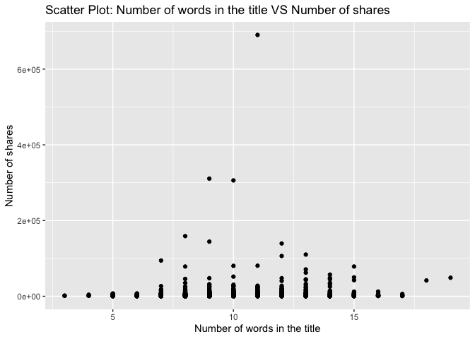
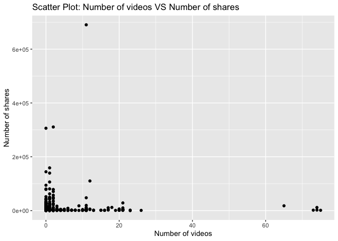

Project 3
================
Shaoyu Wang, Aniket Walimbe
2022-11-14

- <a href="#introduction" id="toc-introduction">Introduction</a>
- <a href="#required-packages" id="toc-required-packages">Required
  Packages</a>
- <a href="#data" id="toc-data">Data</a>
- <a href="#summarizations" id="toc-summarizations">Summarizations</a>
- <a href="#model" id="toc-model">Model</a>
- <a href="#comparison" id="toc-comparison">Comparison</a>
- <a href="#automation" id="toc-automation">Automation</a>

# Introduction

This [online news popularity data
set](https://archive.ics.uci.edu/ml/datasets/Online+News+Popularity)
summarizes a heterogeneous set of features about articles published by
Mashable in a period of two years.

# Required Packages

First, we need to load the required packages:

``` r
# Load libraries
library(readr)
library(tidyverse)
library(dplyr)
library(caret)
library(leaps)
library(ggplot2)
library(corrplot)
library(GGally)
library(randomForest)
```

# Data

Read in the data and subset the data to work on the data channel of
interest. We found that there are seven similar columns for weekday from
Monday to Sunday, so we merged these columns and named the new variable
as `publish_weekday`. For this step, we also removed the non-predictive
variables.

``` r
#Read in the data file
newsData <- read_csv("OnlineNewsPopularity.csv", show_col_types = FALSE)
#Choose the data channel of interest
if (params$channelID != "") {
  paramChannelName <- params$channelID
} else {
  paramChannelName <- "lifestyle"
}
channelID <- paste("data_channel_is_", paramChannelName, sep = "")
#Merge the weekday columns as one single column.
news <- newsData %>% 
  filter(.data[[channelID]] == 1) %>% 
  select(url, starts_with("weekday_is_")) %>% 
  pivot_longer(-url) %>% 
  filter(value != 0) %>% 
  mutate(publish_weekday = substr(name, 12, 20)) %>% 
  left_join(newsData, by = "url") %>% 
#Remove non predictive variables
  select(-c(url, name, value, timedelta, starts_with("data_channel_is_"), starts_with("weekday_is_")))
news$publish_weekday <- as.factor(news$publish_weekday)
news
```

Split the data into a training set and a test set.

``` r
set.seed(111)
trainIndex <- createDataPartition(news$shares, p = 0.7, list = FALSE)
newsTrain <- news[trainIndex,]
newsTest <- news[-trainIndex,]
#newsTrain
```

# Summarizations

For this part, we created some basic summary statistics and plots about
the training data.

- Tables

Firstly, let’s look at some tables. We summarized the training data, so
that we can know all of the variables roughly. For example, this table
shows each count for published on weekdays, we can see which has the
most count and which has the least count. It also shows the minimum, 1st
quantile, median, mean, 3rd quantile and maximum of other variables.

``` r
summary(newsTrain)
```

    ##   publish_weekday n_tokens_title  n_tokens_content n_unique_tokens  n_non_stop_words n_non_stop_unique_tokens
    ##  friday   :588    Min.   : 3.00   Min.   :   0.0   Min.   :0.0000   Min.   :0.0000   Min.   :0.0000          
    ##  monday   :804    1st Qu.: 9.00   1st Qu.: 242.0   1st Qu.:0.4782   1st Qu.:1.0000   1st Qu.:0.6484          
    ##  saturday :172    Median :10.00   Median : 403.0   Median :0.5472   Median :1.0000   Median :0.7037          
    ##  sunday   :240    Mean   :10.29   Mean   : 539.9   Mean   :0.5463   Mean   :0.9968   Mean   :0.7036          
    ##  thursday :871    3rd Qu.:12.00   3rd Qu.: 730.8   3rd Qu.:0.6113   3rd Qu.:1.0000   3rd Qu.:0.7604          
    ##  tuesday  :792    Max.   :19.00   Max.   :4044.0   Max.   :0.8732   Max.   :1.0000   Max.   :0.9730          
    ##  wednesday:915                                                                                               
    ##    num_hrefs       num_self_hrefs      num_imgs        num_videos      average_token_length  num_keywords   
    ##  Min.   :  0.000   Min.   : 0.000   Min.   : 0.000   Min.   : 0.0000   Min.   :0.000        Min.   : 2.000  
    ##  1st Qu.:  4.000   1st Qu.: 1.000   1st Qu.: 1.000   1st Qu.: 0.0000   1st Qu.:4.528        1st Qu.: 5.000  
    ##  Median :  7.000   Median : 2.000   Median : 1.000   Median : 0.0000   Median :4.686        Median : 6.000  
    ##  Mean   :  9.346   Mean   : 2.833   Mean   : 1.844   Mean   : 0.6207   Mean   :4.691        Mean   : 6.501  
    ##  3rd Qu.: 11.000   3rd Qu.: 4.000   3rd Qu.: 1.000   3rd Qu.: 0.0000   3rd Qu.:4.858        3rd Qu.: 8.000  
    ##  Max.   :122.000   Max.   :56.000   Max.   :51.000   Max.   :75.0000   Max.   :6.383        Max.   :10.000  
    ##                                                                                                             
    ##    kw_min_min       kw_max_min       kw_avg_min        kw_min_max       kw_max_max       kw_avg_max    
    ##  Min.   : -1.00   Min.   :     0   Min.   :   -1.0   Min.   :     0   Min.   :     0   Min.   :     0  
    ##  1st Qu.: -1.00   1st Qu.:   438   1st Qu.:  152.7   1st Qu.:     0   1st Qu.:690400   1st Qu.:234950  
    ##  Median : -1.00   Median :   633   Median :  253.2   Median :  1600   Median :843300   Median :312600  
    ##  Mean   : 29.54   Mean   :  1061   Mean   :  317.2   Mean   : 19591   Mean   :743493   Mean   :314897  
    ##  3rd Qu.:  4.00   3rd Qu.:  1100   3rd Qu.:  373.2   3rd Qu.:  7000   3rd Qu.:843300   3rd Qu.:400115  
    ##  Max.   :318.00   Max.   :298400   Max.   :42827.9   Max.   :690400   Max.   :843300   Max.   :766850  
    ##                                                                                                        
    ##    kw_min_avg     kw_max_avg       kw_avg_avg    self_reference_min_shares self_reference_max_shares
    ##  Min.   :   0   Min.   :     0   Min.   :    0   Min.   :     0            Min.   :     0.0         
    ##  1st Qu.:   0   1st Qu.:  3484   1st Qu.: 2332   1st Qu.:   435            1st Qu.:   732.8         
    ##  Median :1065   Median :  4100   Median : 2766   Median :  1100            Median :  2500.0         
    ##  Mean   :1098   Mean   :  5366   Mean   : 2963   Mean   :  3594            Mean   : 10579.0         
    ##  3rd Qu.:1929   3rd Qu.:  5300   3rd Qu.: 3343   3rd Qu.:  2300            3rd Qu.:  6300.0         
    ##  Max.   :3531   Max.   :298400   Max.   :43568   Max.   :690400            Max.   :690400.0         
    ##                                                                                                     
    ##  self_reference_avg_sharess   is_weekend          LDA_00           LDA_01            LDA_02            LDA_03       
    ##  Min.   :     0.0           Min.   :0.00000   Min.   :0.1031   Min.   :0.01820   Min.   :0.01818   Min.   :0.01818  
    ##  1st Qu.:   714.2           1st Qu.:0.00000   1st Qu.:0.5115   1st Qu.:0.02857   1st Qu.:0.02857   1st Qu.:0.02857  
    ##  Median :  2000.0           Median :0.00000   Median :0.7009   Median :0.03571   Median :0.04000   Median :0.03337  
    ##  Mean   :  6316.8           Mean   :0.09402   Mean   :0.6551   Mean   :0.07657   Mean   :0.08162   Mean   :0.06594  
    ##  3rd Qu.:  4400.0           3rd Qu.:0.00000   3rd Qu.:0.8400   3rd Qu.:0.05001   3rd Qu.:0.05010   3rd Qu.:0.05000  
    ##  Max.   :690400.0           Max.   :1.00000   Max.   :0.9200   Max.   :0.71244   Max.   :0.77500   Max.   :0.83654  
    ##                                                                                                                     
    ##      LDA_04        global_subjectivity global_sentiment_polarity global_rate_positive_words
    ##  Min.   :0.01818   Min.   :0.0000      Min.   :-0.2176           Min.   :0.00000           
    ##  1st Qu.:0.02864   1st Qu.:0.3867      1st Qu.: 0.0871           1st Qu.:0.03190           
    ##  Median :0.04000   Median :0.4386      Median : 0.1346           Median :0.04203           
    ##  Mean   :0.12073   Mean   :0.4356      Mean   : 0.1356           Mean   :0.04320           
    ##  3rd Qu.:0.15937   3rd Qu.:0.4880      3rd Qu.: 0.1859           3rd Qu.:0.05364           
    ##  Max.   :0.79742   Max.   :0.8489      Max.   : 0.6226           Max.   :0.12500           
    ##                                                                                            
    ##  global_rate_negative_words rate_positive_words rate_negative_words avg_positive_polarity min_positive_polarity
    ##  Min.   :0.000000           Min.   :0.0000      Min.   :0.0000      Min.   :0.0000        Min.   :0.00000      
    ##  1st Qu.:0.009132           1st Qu.:0.6667      1st Qu.:0.1667      1st Qu.:0.3073        1st Qu.:0.03333      
    ##  Median :0.014068           Median :0.7500      Median :0.2500      Median :0.3541        Median :0.10000      
    ##  Mean   :0.014723           Mean   :0.7373      Mean   :0.2592      Mean   :0.3531        Mean   :0.08703      
    ##  3rd Qu.:0.019498           3rd Qu.:0.8333      3rd Qu.:0.3333      3rd Qu.:0.4000        3rd Qu.:0.10000      
    ##  Max.   :0.060811           Max.   :1.0000      Max.   :1.0000      Max.   :0.7950        Max.   :0.70000      
    ##                                                                                                                
    ##  max_positive_polarity avg_negative_polarity min_negative_polarity max_negative_polarity title_subjectivity
    ##  Min.   :0.0000        Min.   :-1.0000       Min.   :-1.0000       Min.   :-1.0000       Min.   :0.00000   
    ##  1st Qu.:0.6000        1st Qu.:-0.3011       1st Qu.:-0.7000       1st Qu.:-0.1250       1st Qu.:0.00000   
    ##  Median :0.8000        Median :-0.2373       Median :-0.5000       Median :-0.1000       Median :0.06667   
    ##  Mean   :0.7668        Mean   :-0.2427       Mean   :-0.4806       Mean   :-0.1088       Mean   :0.24838   
    ##  3rd Qu.:1.0000        3rd Qu.:-0.1778       3rd Qu.:-0.2500       3rd Qu.:-0.0500       3rd Qu.:0.45455   
    ##  Max.   :1.0000        Max.   : 0.0000       Max.   : 0.0000       Max.   : 0.0000       Max.   :1.00000   
    ##                                                                                                            
    ##  title_sentiment_polarity abs_title_subjectivity abs_title_sentiment_polarity     shares        
    ##  Min.   :-1.0000          Min.   :0.0000         Min.   :0.0000               Min.   :     1.0  
    ##  1st Qu.: 0.0000          1st Qu.:0.1667         1st Qu.:0.0000               1st Qu.:   952.2  
    ##  Median : 0.0000          Median :0.5000         Median :0.0000               Median :  1400.0  
    ##  Mean   : 0.0770          Mean   :0.3416         Mean   :0.1378               Mean   :  3037.1  
    ##  3rd Qu.: 0.1364          3rd Qu.:0.5000         3rd Qu.:0.2000               3rd Qu.:  2500.0  
    ##  Max.   : 1.0000          Max.   :0.5000         Max.   :1.0000               Max.   :690400.0  
    ## 

Then we can check our response variable `shares`. It shows that the
mean, standard deviation, median, IQR of `shares` as follows.

``` r
#numerical summary for the variable shares
newsTrain %>% 
  summarise(mean = round(mean(shares), 0), sd = round(sd(shares), 0), 
            median = round(median(shares), 0), IQR = round(IQR(shares), 0))
```

We also obtain the numerical summaries on some subgroups.

``` r
#numerical summaries on subgroups
newsTrain %>% 
  group_by(publish_weekday) %>% 
  summarise(mean = round(mean(shares), 0), sd = round(sd(shares), 0), 
            median = round(median(shares), 0), IQR = round(IQR(shares), 0))
newsTrain %>% 
  group_by(num_imgs) %>% 
  summarise(mean = round(mean(shares), 0), sd = round(sd(shares), 0), 
            median = round(median(shares), 0), IQR = round(IQR(shares), 0))
newsTrain %>% 
  group_by(num_keywords) %>% 
  summarise(mean = round(mean(shares), 0), sd = round(sd(shares), 0), 
            median = round(median(shares), 0), IQR = round(IQR(shares), 0))
```

Moreover, we divide the title subjectivity into 3 categories:  
1. High: greater than 0.8  
2. Medium: 0.4 to less than 0.8  
3. Low: less than 0.4  
The contingency table is then shown below.

``` r
newsTrain$subject_activity_type <- ifelse(newsTrain$title_subjectivity >= 0.8, "High", 
                                          ifelse(newsTrain$title_subjectivity >= 0.4, "Medium",
                                                 ifelse(airquality$Wind >= 0, "Low")))
table(newsTrain$subject_activity_type)
```

    ## 
    ##   High    Low Medium 
    ##    314   2949   1119

- Plots

Plotting the correlation between numeric variables.

``` r
newsTrainsub <- newsTrain %>% select(-c(publish_weekday, subject_activity_type))
correlation <- cor(newsTrainsub, method = "spearman")
corrplot(correlation, tl.col = "black", tl.cex = 0.5)
```

<!-- --> From the
correlation graph above, we can see that some variables are strongly
correlated.

For further EDA, we are plotting several graphs to see trends between
different variables with respect to the number of shares.

A plot between number of shares and article published day: This plot
shows the number of shares an article has based on the day it has been
published.

``` r
newsTrainday <- newsTrain %>%
  select(publish_weekday, shares) %>%
  group_by(publish_weekday) %>% 
  summarise(total_shares=sum(shares))

g <- ggplot(data = newsTrainday, aes(x=publish_weekday, y=total_shares))
g + geom_col(fill = "lightblue")+
  labs(title = " Shares for articles published based on weekdays")
```

<!-- -->

Here, we have plotted the histogram for number of words in a title for
the data. It can be seen that the graph shows the variable following
normal distribution.

``` r
g <- ggplot(newsTrain, aes(x = n_tokens_title))
g + geom_histogram(fill = "lightblue", binwidth = 1) + 
  labs(x = "Number of words in the title",
       title = "Histogram: Number of words in the title")
```

<!-- -->

Then we have plotted the histogram for number of words in content for
the data.

``` r
g <- ggplot(newsTrain, aes(x = n_tokens_content))
g + geom_histogram(fill = "lightblue") + 
  labs(x = "Number of words in the content", 
       title = "Histogram: Number of words in the content")
```

<!-- -->

A histogram for text subjectivity.

``` r
g <- ggplot(newsTrain, aes(x = global_subjectivity))
g + geom_histogram(fill = "lightblue") + 
  labs(x = "Text subjectivity", 
       title = "Histogram: Text subjectivity")
```

<!-- -->

A histogram for text sentiment polarity.

``` r
g <- ggplot(newsTrain, aes(x = global_sentiment_polarity))
g + geom_histogram(fill = "lightblue") + 
  labs(x = "Text sentiment polarity", 
       title = "Histogram: Text sentiment polarity")
```

<!-- -->

A plot between number of images and number of shares.

``` r
g <- ggplot(data = newsTrain, aes(x = num_imgs, y = shares))
g + geom_point() +
  labs(x = "Number of images" , y = "Number of shares", 
       title = "Scatter Plot: Number of images VS Number of shares") 
```

<!-- -->

A plot between average length of words in content and number of shares:
We can inspect the trend of the shares as a function of average length
of words in content.

``` r
g <- ggplot(newsTrain, aes(x = average_token_length, y = shares))
g + geom_point() + 
  labs(x = "Average token length" , y = "Number of shares", 
       title = "Scatter Plot: Average token length VS Number of shares")
```

<!-- -->

A plot between title subjectivity and number of shares: We can inspect
the trend of the shares as a function of title subjectivity.

``` r
g <- ggplot(data = newsTrain, aes(x = title_subjectivity, y = shares))
g + geom_point() + 
  labs(x = "Title subjectivity" , y = "Number of shares", 
       title = "Scatter Plot: Title subjectivity VS Number of shares") 
```

<!-- -->

Select predictors: publish_weekday, n_tokens_title, n_tokens_content,
num_self_hrefs, num_imgs, average_token_length, num_keywords,
kw_avg_avg, self_reference_avg_sharess, LDA_04, global_subjectivity,
global_sentiment_polarity, avg_positive_polarity, avg_negative_polarity,
title_subjectivity, shares.

``` r
set.seed(111)
Train <- newsTrain %>% 
  select(publish_weekday, n_tokens_title, n_tokens_content, num_self_hrefs, num_imgs, average_token_length, num_keywords, kw_avg_avg, self_reference_avg_sharess, LDA_04, global_subjectivity, global_sentiment_polarity, avg_positive_polarity, avg_negative_polarity, title_subjectivity, shares)
Test <- newsTest %>% 
  select(publish_weekday, n_tokens_title, n_tokens_content, num_self_hrefs, num_imgs, average_token_length, num_keywords, kw_avg_avg, self_reference_avg_sharess, LDA_04, global_subjectivity, global_sentiment_polarity, avg_positive_polarity, avg_negative_polarity, title_subjectivity, shares)
#Train
```

# Model

- Linear Regression Model

Here, we have fitted a forward stepwise linear regression model for the
training dataset having 15 variables. The data is centered and scaled
and number of shares is the response variable.

``` r
#forward stepwise
set.seed(111)
fwFit <- train(shares ~ ., data = Train,
               method = "leapForward",
               preProcess = c("center", "scale"))
#summary(fwFit)
fwFit
```

    ## Linear Regression with Forward Selection 
    ## 
    ## 4382 samples
    ##   15 predictor
    ## 
    ## Pre-processing: centered (20), scaled (20) 
    ## Resampling: Bootstrapped (25 reps) 
    ## Summary of sample sizes: 4382, 4382, 4382, 4382, 4382, 4382, ... 
    ## Resampling results across tuning parameters:
    ## 
    ##   nvmax  RMSE      Rsquared     MAE     
    ##   2      13207.57  0.009329199  2661.206
    ##   3      13221.78  0.008219798  2676.229
    ##   4      13231.22  0.007563947  2687.423
    ## 
    ## RMSE was used to select the optimal model using the smallest value.
    ## The final value used for the model was nvmax = 2.

Here, we have fitted a backward stepwise linear regression model for the
training dataset having 15 variables. The data is centered and scaled
and number of shares is the response variable.

``` r
#backward stepwise
set.seed(111)
bwFit <- train(shares ~ ., data = Train,
               method = "leapBackward",
               preProcess = c("center", "scale"))
#summary(bwFit)
bwFit
```

    ## Linear Regression with Backwards Selection 
    ## 
    ## 4382 samples
    ##   15 predictor
    ## 
    ## Pre-processing: centered (20), scaled (20) 
    ## Resampling: Bootstrapped (25 reps) 
    ## Summary of sample sizes: 4382, 4382, 4382, 4382, 4382, 4382, ... 
    ## Resampling results across tuning parameters:
    ## 
    ##   nvmax  RMSE      Rsquared     MAE     
    ##   2      13207.57  0.009329199  2661.206
    ##   3      13222.85  0.008116982  2677.441
    ##   4      13233.73  0.007413731  2690.233
    ## 
    ## RMSE was used to select the optimal model using the smallest value.
    ## The final value used for the model was nvmax = 2.

``` r
#fit a linear regression model with all predictors
set.seed(111)
lrFit <- train(shares ~ ., data = Train,
               method = "lm",
               trControl = trainControl(method = "cv", number = 5))
lrFit
```

    ## Linear Regression 
    ## 
    ## 4382 samples
    ##   15 predictor
    ## 
    ## No pre-processing
    ## Resampling: Cross-Validated (5 fold) 
    ## Summary of sample sizes: 3505, 3506, 3505, 3506, 3506 
    ## Resampling results:
    ## 
    ##   RMSE      Rsquared    MAE     
    ##   11697.35  0.01887229  2689.063
    ## 
    ## Tuning parameter 'intercept' was held constant at a value of TRUE

- Random Forest Model

Here, we have fitted a random forest model which is chosen using the
cross validation method. The RMSE value for the model is as shown below.
The tuning parameter is given as number of columns in the training data
divided by 3.

``` r
set.seed(111)
randomFit <- train(shares ~ ., 
                   data = Train, 
                   method = "rf",
                   preProcess = c("center","scale"),
                   trControl = trainControl(method = "cv", number = 5),
                   tuneGrid = data.frame(mtry = ncol(Train)/3))
randomFit
```

    ## Random Forest 
    ## 
    ## 4382 samples
    ##   15 predictor
    ## 
    ## Pre-processing: centered (20), scaled (20) 
    ## Resampling: Cross-Validated (5 fold) 
    ## Summary of sample sizes: 3505, 3506, 3505, 3506, 3506 
    ## Resampling results:
    ## 
    ##   RMSE      Rsquared    MAE     
    ##   12172.01  0.01285558  2818.557
    ## 
    ## Tuning parameter 'mtry' was held constant at a value of 5.333333

- Boosted Tree Model

Here, we have fitted a random forest model which is chosen using the
cross validation method. The RMSE value for the model is as shown below.
Tuning parameters are n.trees, interaction.depth, shrinkage and
n.minobsinnode.

``` r
set.seed(111)
boostedFit <- train(shares ~ ., 
                    data = Train, 
                    method = "gbm", 
                    preProcess = c("center", "scale"),
                    trControl = trainControl(method = "cv", number = 5),
                    tuneGrid = expand.grid(n.trees = c(25,50,100,150,200), 
                                           interaction.depth = c(1,2,3,4), 
                                           shrinkage = 0.1, 
                                           n.minobsinnode = 10),
                    verbose = FALSE)
boostedFit
```

    ## Stochastic Gradient Boosting 
    ## 
    ## 4382 samples
    ##   15 predictor
    ## 
    ## Pre-processing: centered (20), scaled (20) 
    ## Resampling: Cross-Validated (5 fold) 
    ## Summary of sample sizes: 3505, 3506, 3505, 3506, 3506 
    ## Resampling results across tuning parameters:
    ## 
    ##   interaction.depth  n.trees  RMSE      Rsquared     MAE     
    ##   1                   25      11813.56  0.017960096  2740.326
    ##   1                   50      11855.81  0.022356533  2771.555
    ##   1                  100      11913.15  0.023493654  2777.793
    ##   1                  150      11893.26  0.025904436  2765.835
    ##   1                  200      11861.44  0.022070039  2781.501
    ##   2                   25      12216.95  0.008024380  2780.159
    ##   2                   50      12479.20  0.012517079  2915.294
    ##   2                  100      12638.06  0.014743364  2981.371
    ##   2                  150      12846.30  0.015307589  3065.542
    ##   2                  200      12973.79  0.011299838  3094.625
    ##   3                   25      12347.06  0.011740965  2795.074
    ##   3                   50      12457.39  0.010282300  2875.682
    ##   3                  100      12865.41  0.005259320  3043.178
    ##   3                  150      12971.91  0.006353109  3073.853
    ##   3                  200      13172.51  0.004474013  3120.277
    ##   4                   25      12310.10  0.008143630  2831.203
    ##   4                   50      12391.23  0.007574724  2884.681
    ##   4                  100      12747.05  0.006495716  3002.840
    ##   4                  150      12974.52  0.008683650  3041.381
    ##   4                  200      13166.30  0.005967805  3095.655
    ## 
    ## Tuning parameter 'shrinkage' was held constant at a value of 0.1
    ## Tuning parameter 'n.minobsinnode' was held
    ##  constant at a value of 10
    ## RMSE was used to select the optimal model using the smallest value.
    ## The final values used for the model were n.trees = 25, interaction.depth = 1, shrinkage = 0.1 and n.minobsinnode = 10.

# Comparison

All the models are compared by RMSE on the test set.

``` r
#fit a linear regression model
fw_mod <- postResample(predict(fwFit, newdata = Test), obs = Test$shares)
bw_mod <- postResample(predict(bwFit, newdata = Test), obs = Test$shares)
lr_mod <- postResample(predict(lrFit, newdata = Test), obs = Test$shares)
#random forest
random_mod <- postResample(predict(randomFit, newdata = Test), obs = Test$shares)
#boosted tree
boosted_mod <- postResample(predict(boostedFit, newdata = Test), obs = Test$shares)
#compare all models
tibble(model = c("Forward",
                 "Backward",
                 "LR with all predictors",
                 "Random Forest",
                 "Boosted Tree"), 
       RMSE = c(fw_mod[1],
                bw_mod[1],
                lr_mod[1],
                random_mod[1],
                boosted_mod[1]))
```

# Automation

``` r
#create channel names
channelID <- data.frame("lifestyle", "entertainment", "bus", "socmed", "tech", "world")
#create filenames
output_file <- paste0(channelID,".md")
#create a list for each channel with the channel name parameter
params = lapply(channelID, FUN = function(x){list(channelID = x)})
#put into a data frame
reports <- tibble(output_file, params)
#render code
apply(reports, MARGIN = 1,
          FUN = function(x){
             rmarkdown::render(input = "project3.Rmd",
             output_format = "github_document",
             output_file = x[[1]],
             params = x[[2]],
             output_options = list(toc=TRUE, toc_depth=1, toc_float=TRUE))
             })
```
