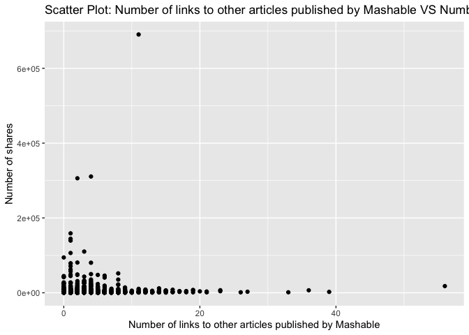
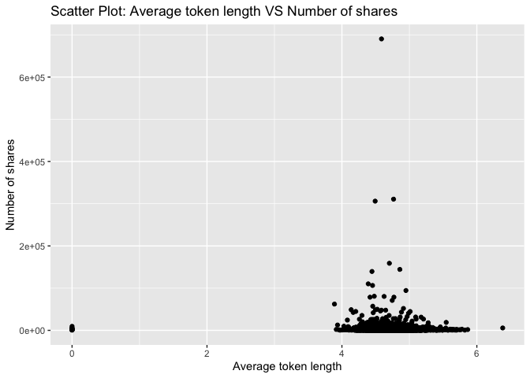
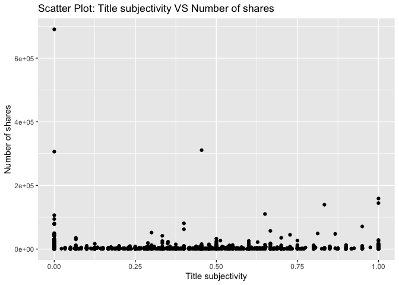

Project 3
================
Shaoyu Wang, Aniket Walimbe
2022-11-16

# Data Channel: bus

## Introduction

This [online news popularity data
set](https://archive.ics.uci.edu/ml/datasets/Online+News+Popularity)
summarizes a heterogeneous set of features about articles published by
Mashable in a period of two years. There are 61 attributes, including 58
predictive attributes, 2 non-predictive, 1 goal field. The number of
shares is our target variable, and we select predictive variables from
the remaining variables based on the exploratory data analysis. The
purpose of our analysis is to predict the the number of shares. During
this project, we read and subset the data set at first, and split data
into training set and test set, then we create some basic summary
statistics and plots about the training data, at last we fit linear
regression models and ensemble tree-based models and test the
predictions.

**Variable information**

The target variable is the following:  
- `shares`: Number of shares

The predictive variables are the following:  
- `publish_weekday`: The article published day  
- `n_tokens_title`: Number of words in the title  
- `n_tokens_content`: Number of words in the content  
- `num_self_hrefs`: Number of links to other articles published by
Mashable  
- `num_imgs`: Number of images  
- `num_videos`: Number of videos  
- `average_token_length`: Average length of the words in the content  
- `num_keywords`: Number of keywords in the metadata  
- `kw_avg_avg`: Avg. keyword (avg. shares)  
- `self_reference_avg_sharess`: Avg. shares of referenced articles in
Mashable  
- `LDA_04`: Closeness to LDA topic 4  
- `global_subjectivity`: Text subjectivity  
- `global_sentiment_polarity`: Text sentiment polarity  
- `avg_positive_polarity`: Avg. polarity of positive words  
- `avg_negative_polarity`: Avg. polarity of negative words

**Required packages**

We need to load the required packages:

``` r
# Load libraries
library(readr)
library(tidyverse)
library(dplyr)
library(caret)
library(leaps)
library(ggplot2)
library(corrplot)
library(GGally)
library(randomForest)
```

## Data

Read in the data and subset the data to work on the data channel of
interest. We find that there are seven similar columns for weekdays from
Monday to Sunday, so we merge these columns and name the new variable as
`publish_weekday` and convert it to factor. For this step, we also
remove the non-predictive variables.

``` r
#Read in the data file
newsData <- read_csv("OnlineNewsPopularity.csv")
#Select the data channel of interest
selectChannel <- paste0("data_channel_is_", params[[1]])
news <- newsData %>% 
  filter(get(selectChannel) == 1) %>% 
  select(url, starts_with("weekday_is_")) %>% 
  pivot_longer(-url) %>% 
  filter(value != 0) %>% 
  mutate(publish_weekday = substr(name, 12, 20)) %>% 
  left_join(newsData, by = "url") %>% 
#Remove non predictive variables
  select(-c(url, name, value, timedelta, starts_with("data_channel_is_"), starts_with("weekday_is_")))
#convert publish_weekday to factor
news$publish_weekday <- as.factor(news$publish_weekday)
news
```

    ## # A tibble: 6,258 × 47
    ##    publish_…¹ n_tok…² n_tok…³ n_uni…⁴ n_non…⁵ n_non…⁶ num_h…⁷ num_s…⁸ num_i…⁹
    ##    <fct>        <dbl>   <dbl>   <dbl>   <dbl>   <dbl>   <dbl>   <dbl>   <dbl>
    ##  1 monday           9     255   0.605    1.00   0.792       3       1       1
    ##  2 monday           9     211   0.575    1.00   0.664       3       1       1
    ##  3 monday           8     397   0.625    1.00   0.806      11       0       1
    ##  4 monday          13     244   0.560    1.00   0.680       3       2       1
    ##  5 monday          11     723   0.491    1.00   0.642      18       1       1
    ##  6 monday           8     708   0.482    1.00   0.688       8       3       1
    ##  7 monday          10     142   0.655    1.00   0.792       2       1       1
    ##  8 monday          12     444   0.601    1.00   0.755       9       8      23
    ##  9 monday           6     109   0.667    1.00   0.737       3       2       1
    ## 10 tuesday         13     306   0.535    1.00   0.705       3       2       1
    ## # … with 6,248 more rows, 38 more variables: num_videos <dbl>,
    ## #   average_token_length <dbl>, num_keywords <dbl>, kw_min_min <dbl>,
    ## #   kw_max_min <dbl>, kw_avg_min <dbl>, kw_min_max <dbl>, kw_max_max <dbl>,
    ## #   kw_avg_max <dbl>, kw_min_avg <dbl>, kw_max_avg <dbl>, kw_avg_avg <dbl>,
    ## #   self_reference_min_shares <dbl>, self_reference_max_shares <dbl>,
    ## #   self_reference_avg_sharess <dbl>, is_weekend <dbl>, LDA_00 <dbl>,
    ## #   LDA_01 <dbl>, LDA_02 <dbl>, LDA_03 <dbl>, LDA_04 <dbl>, …

Split the data into a training set and a test set.

``` r
set.seed(111)
trainIndex <- createDataPartition(news$shares, p = 0.7, list = FALSE)
newsTrain <- news[trainIndex,]
newsTest <- news[-trainIndex,]
#newsTrain
```

## Summarizations

For this part, we produce some basic summary statistics and plots about
the training data.

**Tables**

Firstly, here is a quick summary of all variables as shown below, so
that we can know the variables roughly.

``` r
summary(newsTrain)
```

    ##   publish_weekday n_tokens_title  n_tokens_content n_unique_tokens 
    ##  friday   :588    Min.   : 3.00   Min.   :   0.0   Min.   :0.0000  
    ##  monday   :804    1st Qu.: 9.00   1st Qu.: 242.0   1st Qu.:0.4782  
    ##  saturday :172    Median :10.00   Median : 403.0   Median :0.5472  
    ##  sunday   :240    Mean   :10.29   Mean   : 539.9   Mean   :0.5463  
    ##  thursday :871    3rd Qu.:12.00   3rd Qu.: 730.8   3rd Qu.:0.6113  
    ##  tuesday  :792    Max.   :19.00   Max.   :4044.0   Max.   :0.8732  
    ##  wednesday:915                                                     
    ##  n_non_stop_words n_non_stop_unique_tokens   num_hrefs      
    ##  Min.   :0.0000   Min.   :0.0000           Min.   :  0.000  
    ##  1st Qu.:1.0000   1st Qu.:0.6484           1st Qu.:  4.000  
    ##  Median :1.0000   Median :0.7037           Median :  7.000  
    ##  Mean   :0.9968   Mean   :0.7036           Mean   :  9.346  
    ##  3rd Qu.:1.0000   3rd Qu.:0.7604           3rd Qu.: 11.000  
    ##  Max.   :1.0000   Max.   :0.9730           Max.   :122.000  
    ##                                                             
    ##  num_self_hrefs      num_imgs        num_videos      average_token_length
    ##  Min.   : 0.000   Min.   : 0.000   Min.   : 0.0000   Min.   :0.000       
    ##  1st Qu.: 1.000   1st Qu.: 1.000   1st Qu.: 0.0000   1st Qu.:4.528       
    ##  Median : 2.000   Median : 1.000   Median : 0.0000   Median :4.686       
    ##  Mean   : 2.833   Mean   : 1.844   Mean   : 0.6207   Mean   :4.691       
    ##  3rd Qu.: 4.000   3rd Qu.: 1.000   3rd Qu.: 0.0000   3rd Qu.:4.858       
    ##  Max.   :56.000   Max.   :51.000   Max.   :75.0000   Max.   :6.383       
    ##                                                                          
    ##   num_keywords      kw_min_min       kw_max_min       kw_avg_min     
    ##  Min.   : 2.000   Min.   : -1.00   Min.   :     0   Min.   :   -1.0  
    ##  1st Qu.: 5.000   1st Qu.: -1.00   1st Qu.:   438   1st Qu.:  152.7  
    ##  Median : 6.000   Median : -1.00   Median :   633   Median :  253.2  
    ##  Mean   : 6.501   Mean   : 29.54   Mean   :  1061   Mean   :  317.2  
    ##  3rd Qu.: 8.000   3rd Qu.:  4.00   3rd Qu.:  1100   3rd Qu.:  373.2  
    ##  Max.   :10.000   Max.   :318.00   Max.   :298400   Max.   :42827.9  
    ##                                                                      
    ##    kw_min_max       kw_max_max       kw_avg_max       kw_min_avg  
    ##  Min.   :     0   Min.   :     0   Min.   :     0   Min.   :   0  
    ##  1st Qu.:     0   1st Qu.:690400   1st Qu.:234950   1st Qu.:   0  
    ##  Median :  1600   Median :843300   Median :312600   Median :1065  
    ##  Mean   : 19591   Mean   :743493   Mean   :314897   Mean   :1098  
    ##  3rd Qu.:  7000   3rd Qu.:843300   3rd Qu.:400115   3rd Qu.:1929  
    ##  Max.   :690400   Max.   :843300   Max.   :766850   Max.   :3531  
    ##                                                                   
    ##    kw_max_avg       kw_avg_avg    self_reference_min_shares
    ##  Min.   :     0   Min.   :    0   Min.   :     0           
    ##  1st Qu.:  3484   1st Qu.: 2332   1st Qu.:   435           
    ##  Median :  4100   Median : 2766   Median :  1100           
    ##  Mean   :  5366   Mean   : 2963   Mean   :  3594           
    ##  3rd Qu.:  5300   3rd Qu.: 3343   3rd Qu.:  2300           
    ##  Max.   :298400   Max.   :43568   Max.   :690400           
    ##                                                            
    ##  self_reference_max_shares self_reference_avg_sharess   is_weekend     
    ##  Min.   :     0.0          Min.   :     0.0           Min.   :0.00000  
    ##  1st Qu.:   732.8          1st Qu.:   714.2           1st Qu.:0.00000  
    ##  Median :  2500.0          Median :  2000.0           Median :0.00000  
    ##  Mean   : 10579.0          Mean   :  6316.8           Mean   :0.09402  
    ##  3rd Qu.:  6300.0          3rd Qu.:  4400.0           3rd Qu.:0.00000  
    ##  Max.   :690400.0          Max.   :690400.0           Max.   :1.00000  
    ##                                                                        
    ##      LDA_00           LDA_01            LDA_02            LDA_03       
    ##  Min.   :0.1031   Min.   :0.01820   Min.   :0.01818   Min.   :0.01818  
    ##  1st Qu.:0.5115   1st Qu.:0.02857   1st Qu.:0.02857   1st Qu.:0.02857  
    ##  Median :0.7009   Median :0.03571   Median :0.04000   Median :0.03337  
    ##  Mean   :0.6551   Mean   :0.07657   Mean   :0.08162   Mean   :0.06594  
    ##  3rd Qu.:0.8400   3rd Qu.:0.05001   3rd Qu.:0.05010   3rd Qu.:0.05000  
    ##  Max.   :0.9200   Max.   :0.71244   Max.   :0.77500   Max.   :0.83654  
    ##                                                                        
    ##      LDA_04        global_subjectivity global_sentiment_polarity
    ##  Min.   :0.01818   Min.   :0.0000      Min.   :-0.2176          
    ##  1st Qu.:0.02864   1st Qu.:0.3867      1st Qu.: 0.0871          
    ##  Median :0.04000   Median :0.4386      Median : 0.1346          
    ##  Mean   :0.12073   Mean   :0.4356      Mean   : 0.1356          
    ##  3rd Qu.:0.15937   3rd Qu.:0.4880      3rd Qu.: 0.1859          
    ##  Max.   :0.79742   Max.   :0.8489      Max.   : 0.6226          
    ##                                                                 
    ##  global_rate_positive_words global_rate_negative_words rate_positive_words
    ##  Min.   :0.00000            Min.   :0.000000           Min.   :0.0000     
    ##  1st Qu.:0.03190            1st Qu.:0.009132           1st Qu.:0.6667     
    ##  Median :0.04203            Median :0.014068           Median :0.7500     
    ##  Mean   :0.04320            Mean   :0.014723           Mean   :0.7373     
    ##  3rd Qu.:0.05364            3rd Qu.:0.019498           3rd Qu.:0.8333     
    ##  Max.   :0.12500            Max.   :0.060811           Max.   :1.0000     
    ##                                                                           
    ##  rate_negative_words avg_positive_polarity min_positive_polarity
    ##  Min.   :0.0000      Min.   :0.0000        Min.   :0.00000      
    ##  1st Qu.:0.1667      1st Qu.:0.3073        1st Qu.:0.03333      
    ##  Median :0.2500      Median :0.3541        Median :0.10000      
    ##  Mean   :0.2592      Mean   :0.3531        Mean   :0.08703      
    ##  3rd Qu.:0.3333      3rd Qu.:0.4000        3rd Qu.:0.10000      
    ##  Max.   :1.0000      Max.   :0.7950        Max.   :0.70000      
    ##                                                                 
    ##  max_positive_polarity avg_negative_polarity min_negative_polarity
    ##  Min.   :0.0000        Min.   :-1.0000       Min.   :-1.0000      
    ##  1st Qu.:0.6000        1st Qu.:-0.3011       1st Qu.:-0.7000      
    ##  Median :0.8000        Median :-0.2373       Median :-0.5000      
    ##  Mean   :0.7668        Mean   :-0.2427       Mean   :-0.4806      
    ##  3rd Qu.:1.0000        3rd Qu.:-0.1778       3rd Qu.:-0.2500      
    ##  Max.   :1.0000        Max.   : 0.0000       Max.   : 0.0000      
    ##                                                                   
    ##  max_negative_polarity title_subjectivity title_sentiment_polarity
    ##  Min.   :-1.0000       Min.   :0.00000    Min.   :-1.0000         
    ##  1st Qu.:-0.1250       1st Qu.:0.00000    1st Qu.: 0.0000         
    ##  Median :-0.1000       Median :0.06667    Median : 0.0000         
    ##  Mean   :-0.1088       Mean   :0.24838    Mean   : 0.0770         
    ##  3rd Qu.:-0.0500       3rd Qu.:0.45455    3rd Qu.: 0.1364         
    ##  Max.   : 0.0000       Max.   :1.00000    Max.   : 1.0000         
    ##                                                                   
    ##  abs_title_subjectivity abs_title_sentiment_polarity     shares        
    ##  Min.   :0.0000         Min.   :0.0000               Min.   :     1.0  
    ##  1st Qu.:0.1667         1st Qu.:0.0000               1st Qu.:   952.2  
    ##  Median :0.5000         Median :0.0000               Median :  1400.0  
    ##  Mean   :0.3416         Mean   :0.1378               Mean   :  3037.1  
    ##  3rd Qu.:0.5000         3rd Qu.:0.2000               3rd Qu.:  2500.0  
    ##  Max.   :0.5000         Max.   :1.0000               Max.   :690400.0  
    ## 

Then we can check our response variable `shares`. The below table shows
that the mean, standard deviation, median, IQR of `shares`.

``` r
#numerical summary for the variable shares
newsTrain %>% 
  summarise(mean = round(mean(shares), 0), sd = round(sd(shares), 0), 
            median = round(median(shares), 0), IQR = round(IQR(shares), 0))
```

    ## # A tibble: 1 × 4
    ##    mean    sd median   IQR
    ##   <dbl> <dbl>  <dbl> <dbl>
    ## 1  3037 13961   1400  1548

We also obtain the numerical summaries on some subgroups. We choose four
example subgroups: number of images, number of videos, and number of
keywords, since people may concern more on these when they do searching
and sharing.

``` r
#numerical summaries on subgroups
newsTrain %>% 
  group_by(num_imgs) %>% 
  summarise(mean = round(mean(shares), 0), sd = round(sd(shares), 0), 
            median = round(median(shares), 0), IQR = round(IQR(shares), 0))
```

    ## # A tibble: 38 × 5
    ##    num_imgs  mean    sd median   IQR
    ##       <dbl> <dbl> <dbl>  <dbl> <dbl>
    ##  1        0  6374 35495   1400  1557
    ##  2        1  2344  5420   1300  1379
    ##  3        2  2437  3647   1500  1500
    ##  4        3  3217  4945   2000  2575
    ##  5        4  2873  1915   2400  1800
    ##  6        5  5583  4977   3800  4575
    ##  7        6  4353  4683   3400  3650
    ##  8        7  3311  3344   2150  2175
    ##  9        8  3667  3547   2000  3900
    ## 10        9  3470  3368   1800  3200
    ## # … with 28 more rows

``` r
newsTrain %>% 
  group_by(num_videos) %>% 
  summarise(mean = round(mean(shares), 0), sd = round(sd(shares), 0), 
            median = round(median(shares), 0), IQR = round(IQR(shares), 0))
```

    ## # A tibble: 27 × 5
    ##    num_videos  mean    sd median   IQR
    ##         <dbl> <dbl> <dbl>  <dbl> <dbl>
    ##  1          0  2397  6929   1300  1374
    ##  2          1  3978 11078   1600  1925
    ##  3          2  8664 30518   2000  3300
    ##  4          3  2758  2962   1900  1200
    ##  5          4  2345  1339   2100  1500
    ##  6          5  2011  1267   1800   600
    ##  7          6  2811  2699   1900  2577
    ##  8          7  1538   572   1450   562
    ##  9          8  1467   550   1500   549
    ## 10          9  9338 12108   9338  8562
    ## # … with 17 more rows

``` r
newsTrain %>% 
  group_by(num_keywords) %>% 
  summarise(mean = round(mean(shares), 0), sd = round(sd(shares), 0), 
            median = round(median(shares), 0), IQR = round(IQR(shares), 0))
```

    ## # A tibble: 9 × 5
    ##   num_keywords  mean    sd median   IQR
    ##          <dbl> <dbl> <dbl>  <dbl> <dbl>
    ## 1            2  1011   410    939   429
    ## 2            3  2066  4079   1200  1044
    ## 3            4  2205  3959   1300  1156
    ## 4            5  2938 12609   1400  1367
    ## 5            6  3317 23847   1400  1589
    ## 6            7  3070  8697   1500  1718
    ## 7            8  3275  9435   1500  1898
    ## 8            9  3689 17371   1400  1625
    ## 9           10  3250  7192   1700  2100

Moreover, we divide the title subjectivity into 3 categories:  
1. High: greater than 0.8  
2. Medium: 0.4 to less than 0.8  
3. Low: less than 0.4  
The contingency table is then shown below.

``` r
newsTrain$subject_activity_type <- ifelse(newsTrain$title_subjectivity >= 0.8, "High", 
                                          ifelse(newsTrain$title_subjectivity >= 0.4, "Medium",
                                                 ifelse(airquality$Wind >= 0, "Low")))
table(newsTrain$subject_activity_type)
```

    ## 
    ##   High    Low Medium 
    ##    314   2949   1119

**Plots**

At the beginning, let’s plot the correlation between the numeric
variables.

``` r
newsTrainsub <- newsTrain %>% select(-c(publish_weekday, subject_activity_type))
correlation <- cor(newsTrainsub, method = "spearman")
corrplot(correlation, tl.col = "black", tl.cex = 0.5)
```

<!-- -->

From the correlation graph above, we can see that the following
variables seem to be moderately correlated:  
- `n_tokens_contents`, `n_unique_tokens`, `n_non_stop_words`,
`n_non_stop_unique_tokens`, `num_hrefs`, `num_imgs`  
- `kw_min_min`, `kw_max_min`, `kw_avg_min`, `kw_min_max`, `kw_max_max`,
`kw_avg_max`, `kw_min_avg`, `kw_max_avg`, `kw_avg_avg`  
- `self_reference_min_shares`, `self_reference_max_shares`,
`self_reference_avg_sharess`  
- `LDA_00`, `LDA_01`, `LDA_02`, `LDA_03`  
- `global_sentiment_polarity`, `global_rate_positive_words`,
`global_rate_negative_words`, `rate_positive_words`,
`rate_negative_words`  
- `avg_positive_polarity`, `min_positive_polarity`,
`max_positive_polarity`  
- `avg_negative_polarity`, `min_negative_polarity`,
`max_negative_polarity`  
- `title_subjectivity`, `title_sentiment_polarity`,
`abs_title_subjectivity`, `abs_title_sentiment_polarity`

For further EDA, we are going to plot graphs to see trends between
different variables with respect to the number of shares.

A plot between number of shares and article published day: This plot
shows the number of shares an article has based on the day that has been
published.

``` r
newsTrainday <- newsTrain %>%
  select(publish_weekday, shares) %>%
  group_by(publish_weekday) %>% 
  summarise(total_shares=sum(shares))

g <- ggplot(data = newsTrainday, aes(x=publish_weekday, y=total_shares))
g + geom_col(fill = "lightblue", color = "black") +
  labs(title = " Shares for articles published based on weekdays")
```

<!-- -->

Let’s select some variables as example to plot scatter plots.

A scatter plot with the number of shares on the y-axis and the number of
words in the title on the x-axis is created:

``` r
g <- ggplot(data = newsTrain, aes(x = n_tokens_title, y = shares))
g + geom_point() +
  labs(x = "Number of words in the title", y = "Number of shares", 
       title = "Scatter Plot: Number of words in the title VS Number of shares")
```

<!-- -->

We can inspect the trend of shares as a function of the number of words
in the title. Therefore, we can see that the number of words in title
has an effect on the number of shares.

A scatter plot with the number of shares on the y-axis and the number of
words in the content on the x-axis is created:

``` r
g <- ggplot(data = newsTrain, aes(x = n_tokens_content, y = shares))
g + geom_point() +
  labs(x = "Number of words in the content", y = "Number of shares", 
       title = "Scatter Plot: Number of words in the content VS Number of shares") 
```

<!-- -->

From the plot above, we can easily see that the number of shares is
decreasing while the the number of words in the content is increasing.
So it can be illustrated that the number of words in the content will
affect the number of shares.

A scatter plot with the number of shares on the y-axis and the number of
links to other articles published by Mashable on the x-axis is created:

``` r
g <- ggplot(data = newsTrain, aes(x = num_self_hrefs, y = shares))
g + geom_point() +
  labs(x = "Number of links to other articles published by Mashable", y = "Number of shares", 
       title = "Scatter Plot: Number of links to other articles published by Mashable VS Number of shares")
```

<!-- -->

The plot above shows that as the number of links to other articles
increasing, the number of shares is decreasing. So the the number of
links to other articles has an infulence on the number of shares.

A scatter plot with the number of shares on the y-axis and the number of
images on the x-axis is created:

``` r
g <- ggplot(data = newsTrain, aes(x = num_imgs, y = shares))
g + geom_point() +
  labs(x = "Number of images", y = "Number of shares", 
       title = "Scatter Plot: Number of images VS Number of shares")
```

<!-- -->

The plot above shows that the number of shares decreases as the number
of images increasing. Therefore, the number of images will affect the
number of shares as well.

A scatter plot with the number of shares on the y-axis and the number of
videos on the x-axis is created:

``` r
g <- ggplot(data = newsTrain, aes(x = num_videos, y = shares))
g + geom_point() +
  labs(x = "Number of videos", y = "Number of shares", 
       title = "Scatter Plot: Number of videos VS Number of shares") 
```

<!-- -->

A scatter plot with the number of shares on the y-axis and the average
length of words in content on the x-axis is created:

``` r
g <- ggplot(newsTrain, aes(x = average_token_length, y = shares))
g + geom_point() + 
  labs(x = "Average token length", y = "Number of shares", 
       title = "Scatter Plot: Average token length VS Number of shares")
```

<!-- -->

Through the plot above, we can see that the most of shares are between 4
and 6 words. The average token length will also affect the number of
shares.

A scatter plot with the number of shares on the y-axis and the number of
keywords in the metadata on the x-axis is created:

``` r
g <- ggplot(newsTrain, aes(x = num_keywords, y = shares))
g + geom_point() + 
  labs(x = "Number of keywords in the metadata", y = "Number of shares", 
       title = "Scatter Plot: Number of keywords in the metadata VS Number of shares")
```

<!-- -->

According to the plot above, we can find that as the number of keywords
increasing, the number of shares is increasing. So the number of
keywords in the metadata will influence the number of shares.

A scatter plot with the number of shares on the y-axis and the text
subjectivity on the x-axis is created:

``` r
g <- ggplot(data = newsTrain, aes(x = global_subjectivity, y = shares))
g + geom_point() + 
  labs(x = "Text subjectivity", y = "Number of shares", 
       title = "Scatter Plot: Text subjectivity VS Number of shares")
```

<!-- -->

From the plot above, it presents that the most of shares are between
0.25 and 0.75 text subjectivity. So the text subjectivity will influence
the number of shares as well.

A scatter plot with the number of shares on the y-axis and the title
subjectivity on the x-axis is created:

``` r
g <- ggplot(data = newsTrain, aes(x = title_subjectivity, y = shares))
g + geom_point() + 
  labs(x = "Title subjectivity", y = "Number of shares", 
       title = "Scatter Plot: Title subjectivity VS Number of shares")
```

<!-- -->

The plot above shows that the title subjectivity has less effect on the
number of shares.

**Select variables**

Through the analysis above, we will select predictors as follows:  
- `publish_weekday`: The article published day  
- `n_tokens_title`: Number of words in the title  
- `n_tokens_content`: Number of words in the content  
- `num_self_hrefs`: Number of links to other articles published by
Mashable  
- `num_imgs`: Number of images  
- `num_videos`: Number of videos  
- `average_token_length`: Average length of the words in the content  
- `num_keywords`: Number of keywords in the metadata  
- `kw_avg_avg`: Avg. keyword (avg. shares)  
- `self_reference_avg_sharess`: Avg. shares of referenced articles in
Mashable  
- `LDA_04`: Closeness to LDA topic 4  
- `global_subjectivity`: Text subjectivity  
- `global_sentiment_polarity`: Text sentiment polarity  
- `avg_positive_polarity`: Avg. polarity of positive words  
- `avg_negative_polarity`: Avg. polarity of negative words

The target variable is `shares`.

Let’s do selection for training set and test set.

``` r
#select variables for training set and test set
set.seed(111)
Train <- newsTrain %>% 
  select(publish_weekday, n_tokens_title, n_tokens_content, num_self_hrefs, num_imgs, num_videos, average_token_length, num_keywords, kw_avg_avg, self_reference_avg_sharess, LDA_04, global_subjectivity, global_sentiment_polarity, avg_positive_polarity, avg_negative_polarity, shares)
Test <- newsTest %>% 
  select(publish_weekday, n_tokens_title, n_tokens_content, num_self_hrefs, num_imgs, num_videos, average_token_length, num_keywords, kw_avg_avg, self_reference_avg_sharess, LDA_04, global_subjectivity, global_sentiment_polarity, avg_positive_polarity, avg_negative_polarity, shares)
```

## Model

**Linear Regression Model**

First, we fit a forward stepwise linear regression model for the
training dataset. The data is centered and scaled and number of shares
is the response variable.

``` r
#forward stepwise
set.seed(111)
fwFit <- train(shares ~ ., data = Train,
               method = "leapForward",
               preProcess = c("center", "scale"),
               trControl = trainControl(method = "cv", number = 5))
#summary(fwFit)
fwFit
```

    ## Linear Regression with Forward Selection 
    ## 
    ## 4382 samples
    ##   15 predictor
    ## 
    ## Pre-processing: centered (20), scaled (20) 
    ## Resampling: Cross-Validated (5 fold) 
    ## Summary of sample sizes: 3505, 3506, 3505, 3506, 3506 
    ## Resampling results across tuning parameters:
    ## 
    ##   nvmax  RMSE      Rsquared    MAE     
    ##   2      11659.10  0.02475457  2644.325
    ##   3      11654.59  0.02587199  2622.886
    ##   4      11667.05  0.02336621  2635.785
    ## 
    ## RMSE was used to select the optimal model using the smallest value.
    ## The final value used for the model was nvmax = 3.

We also fit a backward stepwise linear regression model for the training
dataset. The data is centered and scaled and number of shares is the
response variable.

``` r
#backward stepwise
set.seed(111)
bwFit <- train(shares ~ ., data = Train,
               method = "leapBackward",
               preProcess = c("center", "scale"),
               trControl = trainControl(method = "cv", number = 5))
#summary(bwFit)
bwFit
```

    ## Linear Regression with Backwards Selection 
    ## 
    ## 4382 samples
    ##   15 predictor
    ## 
    ## Pre-processing: centered (20), scaled (20) 
    ## Resampling: Cross-Validated (5 fold) 
    ## Summary of sample sizes: 3505, 3506, 3505, 3506, 3506 
    ## Resampling results across tuning parameters:
    ## 
    ##   nvmax  RMSE      Rsquared    MAE     
    ##   2      11659.10  0.02475457  2644.325
    ##   3      11654.59  0.02587199  2622.886
    ##   4      11667.05  0.02336621  2635.785
    ## 
    ## RMSE was used to select the optimal model using the smallest value.
    ## The final value used for the model was nvmax = 3.

Then we fit a linear regression model with all predictors.

``` r
#with all predictors
set.seed(111)
lrFit <- train(shares ~ ., data = Train,
               method = "lm",
               trControl = trainControl(method = "cv", number = 5))
lrFit
```

    ## Linear Regression 
    ## 
    ## 4382 samples
    ##   15 predictor
    ## 
    ## No pre-processing
    ## Resampling: Cross-Validated (5 fold) 
    ## Summary of sample sizes: 3505, 3506, 3505, 3506, 3506 
    ## Resampling results:
    ## 
    ##   RMSE      Rsquared    MAE     
    ##   11699.69  0.02230294  2680.375
    ## 
    ## Tuning parameter 'intercept' was held constant at a value of TRUE

**Random Forest Model**

Next, we have fitted a random forest model which is an example of an
ensemble based-tree model. Instead of traditional decision trees, a
random forest tree will take a random subset of the predictors for each
tree fit and calculate the average of results.

``` r
set.seed(111)
randomFit <- train(shares ~ ., 
                   data = Train, 
                   method = "rf",
                   preProcess = c("center","scale"),
                   trControl = trainControl(method = "cv", number = 5),
                   tuneGrid = data.frame(mtry = ncol(Train)/3))
randomFit
```

    ## Random Forest 
    ## 
    ## 4382 samples
    ##   15 predictor
    ## 
    ## Pre-processing: centered (20), scaled (20) 
    ## Resampling: Cross-Validated (5 fold) 
    ## Summary of sample sizes: 3505, 3506, 3505, 3506, 3506 
    ## Resampling results:
    ## 
    ##   RMSE      Rsquared   MAE     
    ##   12179.82  0.0159649  2822.439
    ## 
    ## Tuning parameter 'mtry' was held constant at a value of 5.333333

**Boosted Tree Model**

Moreover, we have fitted a boosted tree model which is another ensemble
based-tree model. Boosted tree models are combination of two techniques:
decision tree algorithms and boosting methods. It repeatedly fits many
decision trees to improve the accuracy of the model.

``` r
set.seed(111)
boostedFit <- train(shares ~ ., 
                    data = Train, 
                    method = "gbm", 
                    preProcess = c("center", "scale"),
                    trControl = trainControl(method = "cv", number = 5),
                    tuneGrid = expand.grid(n.trees = c(25,50,100,150,200), 
                                           interaction.depth = c(1,2,3,4), 
                                           shrinkage = 0.1, 
                                           n.minobsinnode = 10),
                    verbose = FALSE)
boostedFit
```

    ## Stochastic Gradient Boosting 
    ## 
    ## 4382 samples
    ##   15 predictor
    ## 
    ## Pre-processing: centered (20), scaled (20) 
    ## Resampling: Cross-Validated (5 fold) 
    ## Summary of sample sizes: 3505, 3506, 3505, 3506, 3506 
    ## Resampling results across tuning parameters:
    ## 
    ##   interaction.depth  n.trees  RMSE      Rsquared     MAE     
    ##   1                   25      11801.95  0.017686254  2746.931
    ##   1                   50      11909.26  0.021708845  2811.894
    ##   1                  100      11987.59  0.021716603  2819.925
    ##   1                  150      11983.87  0.024121944  2804.246
    ##   1                  200      11974.93  0.021924948  2829.690
    ##   2                   25      12156.54  0.009155861  2748.936
    ##   2                   50      12428.13  0.012525225  2883.517
    ##   2                  100      12638.09  0.015009040  2941.952
    ##   2                  150      12911.85  0.014742731  3099.958
    ##   2                  200      12899.40  0.016646766  3127.822
    ##   3                   25      12255.40  0.018567391  2800.231
    ##   3                   50      12531.43  0.010366064  2925.564
    ##   3                  100      12869.76  0.006945052  3057.321
    ##   3                  150      13086.78  0.007718816  3133.986
    ##   3                  200      13274.29  0.007825192  3172.075
    ##   4                   25      12085.96  0.033917687  2792.546
    ##   4                   50      12289.49  0.017269303  2843.274
    ##   4                  100      12630.47  0.011622614  2991.489
    ##   4                  150      12906.27  0.013409249  3079.008
    ##   4                  200      13240.26  0.008415962  3165.496
    ## 
    ## Tuning parameter 'shrinkage' was held constant at a value of 0.1
    ## 
    ## Tuning parameter 'n.minobsinnode' was held constant at a value of 10
    ## RMSE was used to select the optimal model using the smallest value.
    ## The final values used for the model were n.trees = 25, interaction.depth
    ##  = 1, shrinkage = 0.1 and n.minobsinnode = 10.

## Comparison

All the models are compared by RMSE on the test set.

``` r
#fit a linear regression model
fw_mod <- postResample(predict(fwFit, newdata = Test), obs = Test$shares)
bw_mod <- postResample(predict(bwFit, newdata = Test), obs = Test$shares)
lr_mod <- postResample(predict(lrFit, newdata = Test), obs = Test$shares)
#random forest
random_mod <- postResample(predict(randomFit, newdata = Test), obs = Test$shares)
#boosted tree
boosted_mod <- postResample(predict(boostedFit, newdata = Test), obs = Test$shares)
#compare all models
tibble(model = c("Forward",
                 "Backward",
                 "LR with all predictors",
                 "Random Forest",
                 "Boosted Tree"), 
       RMSE = c(fw_mod[1],
                bw_mod[1],
                lr_mod[1],
                random_mod[1],
                boosted_mod[1]))
```

    ## # A tibble: 5 × 2
    ##   model                    RMSE
    ##   <chr>                   <dbl>
    ## 1 Forward                17296.
    ## 2 Backward               17296.
    ## 3 LR with all predictors 17211.
    ## 4 Random Forest          16885.
    ## 5 Boosted Tree           17223.

From the above table, we can find that forward and backward stepwise
models have the same RMSE value. So we can say that, among these models,
the best model is forward or backward stepwise model since it has the
least RMSE value as compared to the other models.

## Automation

For this automation part, we want to produce the similar reports for
each news channels. We firstly create a set of parameters, which match
with 6 channels. Then read the parameter and subset the data with the
specified channel. After everything is ready, run the below chunk of
code in the console, we will automatically get the reports for each news
channel.

``` r
#create channel names
channelID <- data.frame("lifestyle", "entertainment", "bus", "socmed", "tech", "world")
#create filenames
output_file <- paste0(channelID,".md")
#create a list for each channel with the channel name parameter
params = lapply(channelID, FUN = function(x){list(channelID = x)})
#put into a data frame
reports <- tibble(output_file, params)
#render code
apply(reports, MARGIN = 1,
      FUN = function(x){
        rmarkdown::render(input = "project3.Rmd",
                          output_format = "github_document",
                          output_file = x[[1]],
                          params = x[[2]])
        })
```
