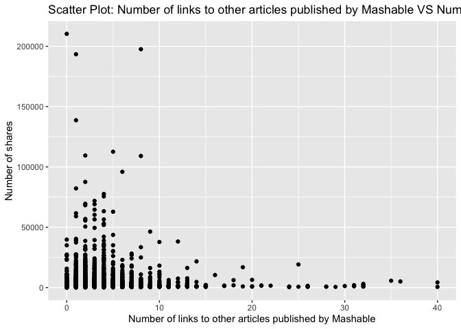
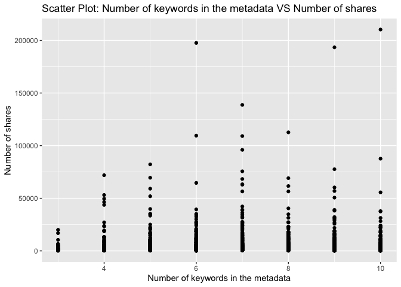
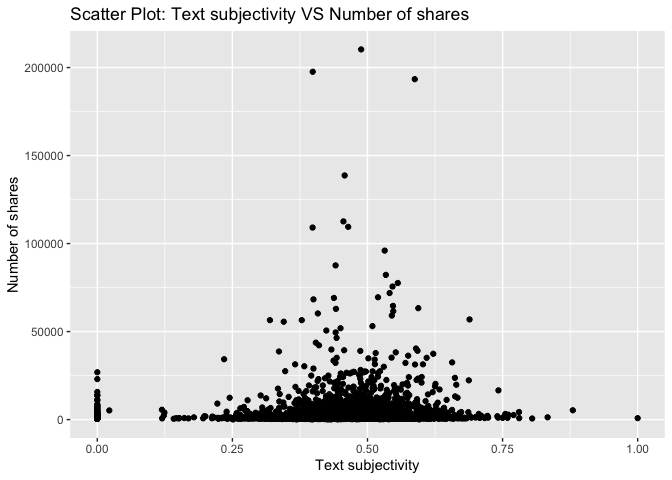

Project 3
================
Shaoyu Wang, Aniket Walimbe
2022-11-14

-   <a href="#introduction" id="toc-introduction">Introduction</a>
-   <a href="#required-packages" id="toc-required-packages">Required
    Packages</a>
-   <a href="#data" id="toc-data">Data</a>
-   <a href="#summarizations" id="toc-summarizations">Summarizations</a>
-   <a href="#model" id="toc-model">Model</a>
-   <a href="#comparison" id="toc-comparison">Comparison</a>
-   <a href="#automation" id="toc-automation">Automation</a>

# Introduction

This [online News Popularity Data
Set](https://archive.ics.uci.edu/ml/datasets/Online+News+Popularity)
summarizes a heterogeneous set of features about articles published by
Mashable in a period of two years.

# Required Packages

First, we will load the required packages:

``` r
# Load libraries
library(readr)
library(tidyverse)
library(dplyr)
library(caret)
library(leaps)
library(ggplot2)
library(corrplot)
library(GGally)
library(randomForest)
```

# Data

Read in the data and subset the data to work on the data channel of
interest. We found that there are seven similar columns for weekday from
Monday to Sunday, so we merged these columns and named the new variable
as `publush_weekday`. For this step, we also removed the non-predictive
variables.

``` r
#Read in the data file
newsData <- read_csv("OnlineNewsPopularity.csv",show_col_types = FALSE)
#Choose the data channel of interest
if (params$channel != "") {
  paramChannelName <- params$channel
} else {
  paramChannelName <- "lifestyle"
}
channel <- paste("data_channel_is_", paramChannelName, sep = "")
#Merge the weekdays columns as one single column.
news <- newsData %>% 
  filter(.data[[channel]] == 1) %>% 
  select(url, starts_with("weekday_is_")) %>% 
  pivot_longer(-url) %>% 
  filter(value != 0) %>% 
  mutate(publish_weekday = substr(name, 12, 20)) %>% 
  left_join(newsData, by = "url") %>% 
#Remove non predictive variables
  select(-c(url, name, value, timedelta, starts_with("data_channel_is_"), starts_with("weekday_is_")))
news$publish_weekday <- as.factor(news$publish_weekday)
news
```

    ## # A tibble: 7,057 × 47
    ##    publish_…¹ n_tok…² n_tok…³ n_uni…⁴ n_non…⁵ n_non…⁶ num_h…⁷ num_s…⁸ num_i…⁹
    ##    <fct>        <dbl>   <dbl>   <dbl>   <dbl>   <dbl>   <dbl>   <dbl>   <dbl>
    ##  1 monday          12     219   0.664    1.00   0.815       4       2       1
    ##  2 monday           9     531   0.504    1.00   0.666       9       0       1
    ##  3 monday          14     194   0.765    1.00   0.840       4       4       0
    ##  4 monday          12     161   0.669    1.00   0.752       5       4       0
    ##  5 monday          11     454   0.566    1.00   0.755       5       3       1
    ##  6 monday          12     177   0.741    1.00   0.823       4       3       1
    ##  7 monday           5     356   0.618    1.00   0.766       3       3      12
    ##  8 tuesday         11     281   0.611    1.00   0.766       5       4       1
    ##  9 tuesday         10     909   0.450    1.00   0.670       3       2       1
    ## 10 wednesday       10     413   0.606    1.00   0.729       6       1      13
    ## # … with 7,047 more rows, 38 more variables: num_videos <dbl>,
    ## #   average_token_length <dbl>, num_keywords <dbl>, kw_min_min <dbl>,
    ## #   kw_max_min <dbl>, kw_avg_min <dbl>, kw_min_max <dbl>, kw_max_max <dbl>,
    ## #   kw_avg_max <dbl>, kw_min_avg <dbl>, kw_max_avg <dbl>, kw_avg_avg <dbl>,
    ## #   self_reference_min_shares <dbl>, self_reference_max_shares <dbl>,
    ## #   self_reference_avg_sharess <dbl>, is_weekend <dbl>, LDA_00 <dbl>,
    ## #   LDA_01 <dbl>, LDA_02 <dbl>, LDA_03 <dbl>, LDA_04 <dbl>, …

Split the data into a training set and a test set.

``` r
set.seed(111)
trainIndex <- createDataPartition(news$shares, p = 0.7, list = FALSE)
newsTrain <- news[trainIndex,]
newsTest <- news[-trainIndex,]
#newsTrain
```

# Summarizations

Some basic summary statistics and plots about the training data.

## Tables

Firstly, we summarized the training data.

``` r
summary(newsTrain)
```

    ##   publish_weekday n_tokens_title  n_tokens_content n_unique_tokens 
    ##  friday   :668    Min.   : 3.00   Min.   :   0.0   Min.   :0.0000  
    ##  monday   :948    1st Qu.:10.00   1st Qu.: 253.0   1st Qu.:0.4709  
    ##  saturday :266    Median :11.00   Median : 428.0   Median :0.5430  
    ##  sunday   :372    Mean   :10.99   Mean   : 610.2   Mean   :0.5340  
    ##  thursday :862    3rd Qu.:12.00   3rd Qu.: 810.0   3rd Qu.:0.6181  
    ##  tuesday  :906    Max.   :18.00   Max.   :6505.0   Max.   :0.9355  
    ##  wednesday:919                                                     
    ##  n_non_stop_words n_non_stop_unique_tokens   num_hrefs      num_self_hrefs  
    ##  Min.   :0.0000   Min.   :0.0000           Min.   :  0.00   Min.   : 0.000  
    ##  1st Qu.:1.0000   1st Qu.:0.6230           1st Qu.:  4.00   1st Qu.: 1.000  
    ##  Median :1.0000   Median :0.6919           Median :  7.00   Median : 3.000  
    ##  Mean   :0.9735   Mean   :0.6727           Mean   : 10.72   Mean   : 3.517  
    ##  3rd Qu.:1.0000   3rd Qu.:0.7614           3rd Qu.: 13.00   3rd Qu.: 5.000  
    ##  Max.   :1.0000   Max.   :1.0000           Max.   :304.00   Max.   :40.000  
    ##                                                                             
    ##     num_imgs        num_videos     average_token_length  num_keywords   
    ##  Min.   :  0.00   Min.   : 0.000   Min.   :0.000        Min.   : 3.000  
    ##  1st Qu.:  1.00   1st Qu.: 0.000   1st Qu.:4.427        1st Qu.: 5.000  
    ##  Median :  1.00   Median : 1.000   Median :4.585        Median : 7.000  
    ##  Mean   :  6.29   Mean   : 2.624   Mean   :4.486        Mean   : 6.933  
    ##  3rd Qu.:  8.00   3rd Qu.: 1.000   3rd Qu.:4.750        3rd Qu.: 8.000  
    ##  Max.   :128.00   Max.   :74.000   Max.   :7.696        Max.   :10.000  
    ##                                                                         
    ##    kw_min_min       kw_max_min       kw_avg_min        kw_min_max    
    ##  Min.   : -1.00   Min.   :     0   Min.   :   -1.0   Min.   :     0  
    ##  1st Qu.: -1.00   1st Qu.:   417   1st Qu.:  124.0   1st Qu.:     0  
    ##  Median : -1.00   Median :   600   Median :  210.8   Median :  1400  
    ##  Mean   : 21.45   Mean   :  1069   Mean   :  289.3   Mean   : 13203  
    ##  3rd Qu.:  4.00   3rd Qu.:   926   3rd Qu.:  323.1   3rd Qu.: 11400  
    ##  Max.   :294.00   Max.   :138700   Max.   :34855.1   Max.   :210300  
    ##                                                                      
    ##    kw_max_max       kw_avg_max       kw_min_avg     kw_max_avg    
    ##  Min.   :     0   Min.   :     0   Min.   :   0   Min.   :     0  
    ##  1st Qu.:843300   1st Qu.:178600   1st Qu.:   0   1st Qu.:  3682  
    ##  Median :843300   Median :231340   Median :1018   Median :  4448  
    ##  Mean   :766220   Mean   :243588   Mean   :1115   Mean   :  5655  
    ##  3rd Qu.:843300   3rd Qu.:303775   3rd Qu.:2056   3rd Qu.:  6015  
    ##  Max.   :843300   Max.   :670750   Max.   :3285   Max.   :138700  
    ##                                                                   
    ##    kw_avg_avg    self_reference_min_shares self_reference_max_shares
    ##  Min.   :    0   Min.   :     0            Min.   :     0           
    ##  1st Qu.: 2545   1st Qu.:   700            1st Qu.:  1100           
    ##  Median : 2964   Median :  1100            Median :  2700           
    ##  Mean   : 3152   Mean   :  2735            Mean   :  8959           
    ##  3rd Qu.: 3547   3rd Qu.:  2000            3rd Qu.:  9200           
    ##  Max.   :36023   Max.   :210300            Max.   :837700           
    ##                                                                     
    ##  self_reference_avg_sharess   is_weekend         LDA_00       
    ##  Min.   :     0             Min.   :0.0000   Min.   :0.01824  
    ##  1st Qu.:  1040             1st Qu.:0.0000   1st Qu.:0.02508  
    ##  Median :  2050             Median :0.0000   Median :0.03333  
    ##  Mean   :  5064             Mean   :0.1291   Mean   :0.06670  
    ##  3rd Qu.:  4900             3rd Qu.:0.0000   3rd Qu.:0.05000  
    ##  Max.   :281685             Max.   :1.0000   Max.   :0.79368  
    ##                                                               
    ##      LDA_01            LDA_02            LDA_03            LDA_04       
    ##  Min.   :0.01898   Min.   :0.01818   Min.   :0.01818   Min.   :0.01818  
    ##  1st Qu.:0.04128   1st Qu.:0.02502   1st Qu.:0.03365   1st Qu.:0.02500  
    ##  Median :0.44268   Median :0.03333   Median :0.25041   Median :0.03333  
    ##  Mean   :0.42521   Mean   :0.09047   Mean   :0.35499   Mean   :0.06264  
    ##  3rd Qu.:0.73155   3rd Qu.:0.05015   3rd Qu.:0.69831   3rd Qu.:0.04011  
    ##  Max.   :0.92595   Max.   :0.78708   Max.   :0.92554   Max.   :0.71889  
    ##                                                                         
    ##  global_subjectivity global_sentiment_polarity global_rate_positive_words
    ##  Min.   :0.0000      Min.   :-0.37766          Min.   :0.00000           
    ##  1st Qu.:0.4131      1st Qu.: 0.04752          1st Qu.:0.02967           
    ##  Median :0.4651      Median : 0.11381          Median :0.04089           
    ##  Mean   :0.4538      Mean   : 0.11179          Mean   :0.04073           
    ##  3rd Qu.:0.5143      3rd Qu.: 0.17346          3rd Qu.:0.05147           
    ##  Max.   :1.0000      Max.   : 0.72784          Max.   :0.15278           
    ##                                                                          
    ##  global_rate_negative_words rate_positive_words rate_negative_words
    ##  Min.   :0.00000            Min.   :0.0000      Min.   :0.0000     
    ##  1st Qu.:0.01077            1st Qu.:0.5789      1st Qu.:0.2000     
    ##  Median :0.01724            Median :0.6905      Median :0.3000     
    ##  Mean   :0.01919            Mean   :0.6675      Mean   :0.3060     
    ##  3rd Qu.:0.02508            3rd Qu.:0.7857      3rd Qu.:0.4038     
    ##  Max.   :0.09358            Max.   :1.0000      Max.   :1.0000     
    ##                                                                    
    ##  avg_positive_polarity min_positive_polarity max_positive_polarity
    ##  Min.   :0.0000        Min.   :0.00000       Min.   :0.0000       
    ##  1st Qu.:0.3182        1st Qu.:0.05000       1st Qu.:0.6000       
    ##  Median :0.3725        Median :0.10000       Median :0.8500       
    ##  Mean   :0.3663        Mean   :0.09392       Mean   :0.7971       
    ##  3rd Qu.:0.4222        3rd Qu.:0.10000       3rd Qu.:1.0000       
    ##  Max.   :0.8727        Max.   :0.80000       Max.   :1.0000       
    ##                                                                   
    ##  avg_negative_polarity min_negative_polarity max_negative_polarity
    ##  Min.   :-1.0000       Min.   :-1.0000       Min.   :-1.0000      
    ##  1st Qu.:-0.3697       1st Qu.:-0.8000       1st Qu.:-0.1250      
    ##  Median :-0.3000       Median :-0.6000       Median :-0.1000      
    ##  Mean   :-0.2945       Mean   :-0.5884       Mean   :-0.1109      
    ##  3rd Qu.:-0.2208       3rd Qu.:-0.4000       3rd Qu.:-0.0500      
    ##  Max.   : 0.0000       Max.   : 0.0000       Max.   : 0.0000      
    ##                                                                   
    ##  title_subjectivity title_sentiment_polarity abs_title_subjectivity
    ##  Min.   :0.0000     Min.   :-1.00000         Min.   :0.0000        
    ##  1st Qu.:0.0000     1st Qu.: 0.00000         1st Qu.:0.1224        
    ##  Median :0.3000     Median : 0.00000         Median :0.4000        
    ##  Mean   :0.3245     Mean   : 0.06662         Mean   :0.3194        
    ##  3rd Qu.:0.5357     3rd Qu.: 0.18750         3rd Qu.:0.5000        
    ##  Max.   :1.0000     Max.   : 1.00000         Max.   :0.5000        
    ##                                                                    
    ##  abs_title_sentiment_polarity     shares      
    ##  Min.   :0.00000              Min.   :    49  
    ##  1st Qu.:0.00000              1st Qu.:   833  
    ##  Median :0.08333              Median :  1200  
    ##  Mean   :0.17554              Mean   :  3075  
    ##  3rd Qu.:0.30000              3rd Qu.:  2100  
    ##  Max.   :1.00000              Max.   :210300  
    ## 

Then let’s check our response variable `shares`. It shows that the mean
of `shares` is 3847, standard deviation is 10112, median is 1700, IQR is
2125.

``` r
#numerical summary for the variable shares
newsTrain %>% 
  summarise(mean = round(mean(shares), 0), sd = round(sd(shares), 0), 
            median = round(median(shares), 0), IQR = round(IQR(shares), 0))
```

    ## # A tibble: 1 × 4
    ##    mean    sd median   IQR
    ##   <dbl> <dbl>  <dbl> <dbl>
    ## 1  3075  8525   1200  1267

``` r
#numerical summaries on subgroups
newsTrain %>% 
  group_by(publish_weekday) %>% 
  summarise(mean = round(mean(shares), 0), sd = round(sd(shares), 0), 
            median = round(median(shares), 0), IQR = round(IQR(shares), 0))
```

    ## # A tibble: 7 × 5
    ##   publish_weekday  mean    sd median   IQR
    ##   <fct>           <dbl> <dbl>  <dbl> <dbl>
    ## 1 friday           3144 10401   1200  1076
    ## 2 monday           3105  7569   1100  1202
    ## 3 saturday         3333  6103   1600  1675
    ## 4 sunday           3921  6641   1700  2925
    ## 5 thursday         3015 10595   1100  1180
    ## 6 tuesday          2736  6490   1100  1116
    ## 7 wednesday        2969  8805   1100  1170

``` r
newsTrain %>% 
  group_by(num_imgs) %>% 
  summarise(mean = round(mean(shares), 0), sd = round(sd(shares), 0), 
            median = round(median(shares), 0), IQR = round(IQR(shares), 0))
```

    ## # A tibble: 72 × 5
    ##    num_imgs  mean    sd median   IQR
    ##       <dbl> <dbl> <dbl>  <dbl> <dbl>
    ##  1        0  3545  7599   1200  1754
    ##  2        1  2377  6461   1100   997
    ##  3        2  3020  8868   1100   871
    ##  4        3  2115  3315   1100  1071
    ##  5        4  2843  4001   1250  1733
    ##  6        5  2345  5493   1200   702
    ##  7        6  2965  4041   1450  1980
    ##  8        7  1811  1609   1200  1115
    ##  9        8  4581  9330   1200  2384
    ## 10        9  2557  3058   1400  1706
    ## # … with 62 more rows

``` r
newsTrain %>% 
  group_by(num_videos) %>% 
  summarise(mean = round(mean(shares), 0), sd = round(sd(shares), 0), 
            median = round(median(shares), 0), IQR = round(IQR(shares), 0))
```

    ## # A tibble: 45 × 5
    ##    num_videos  mean    sd median   IQR
    ##         <dbl> <dbl> <dbl>  <dbl> <dbl>
    ##  1          0  2563  7003   1100   998
    ##  2          1  3632 10534   1200  1644
    ##  3          2  3418  8800   1200  1540
    ##  4          3  3240  8094   1200  1510
    ##  5          4  3477  7971   1300  1200
    ##  6          5  3220  6596   1500  1949
    ##  7          6  8195 24034   1300  1339
    ##  8          7  3406  5219   1300  2298
    ##  9          8  1839  1770   1100   961
    ## 10          9  1649  1418   1250   895
    ## # … with 35 more rows

``` r
newsTrain %>% 
  group_by(num_keywords) %>% 
  summarise(mean = round(mean(shares), 0), sd = round(sd(shares), 0), 
            median = round(median(shares), 0), IQR = round(IQR(shares), 0))
```

    ## # A tibble: 8 × 5
    ##   num_keywords  mean    sd median   IQR
    ##          <dbl> <dbl> <dbl>  <dbl> <dbl>
    ## 1            3  2206  3418   1100   819
    ## 2            4  2487  6350   1000   741
    ## 3            5  2519  6039   1100  1002
    ## 4            6  2857  8596   1100  1189
    ## 5            7  3592  9568   1200  1339
    ## 6            8  3075  7141   1200  1459
    ## 7            9  3918 11169   1300  2094
    ## 8           10  3171  9822   1300  1646

Contingency tables :  
Here, the title subjectivity is divided into 3 categories : high, medium
and low based on the values. If the value is greater than 0.8, it is
high, greater than 0.4 and less than 0.8 is medium and remaining is low.
The contingency table is then shown below.

``` r
newsTrain$subject_activity_type <- ifelse(newsTrain$title_subjectivity >= 0.8, "High", 
                                          ifelse(newsTrain$title_subjectivity >= 0.4, "Medium",
                                                 ifelse(airquality$Wind >= 0, "Low", "None")))
table(newsTrain$subject_activity_type)
```

    ## 
    ##   High    Low Medium 
    ##    550   2741   1650

The contingency table below shows the counts for each published weekday.
From this table, we can find that the highest count is Wednesday, the
lowest count is Saturday.

``` r
table(newsTrain$publish_weekday)
```

    ## 
    ##    friday    monday  saturday    sunday  thursday   tuesday wednesday 
    ##       668       948       266       372       862       906       919

## Plots

``` r
g <- ggplot(newsTrain, aes(x = n_tokens_title))
g + geom_histogram(fill = "lightblue", binwidth = 1) + 
  labs()
```

<!-- -->

``` r
g <- ggplot(newsTrain, aes(x = n_tokens_content))
g + geom_histogram(fill = "lightblue") + 
  labs()
```

<!-- -->

``` r
g <- ggplot(newsTrain, aes(x = global_subjectivity))
g + geom_histogram(fill = "lightblue") + 
  labs()
```

<!-- -->

``` r
g <- ggplot(newsTrain, aes(x = global_sentiment_polarity))
g + geom_histogram(fill = "lightblue") + 
  labs()
```

<!-- -->

``` r
g <- ggplot(newsTrain, aes(x = rate_positive_words, y = shares))
g + geom_point() + 
  labs()
```

<!-- -->

``` r
g <- ggplot(newsTrain, aes(x = average_token_length, y = shares))
g + geom_point() + 
  labs()
```

<!-- -->

Plot between title subjectivity and number of shares: We can inspect the
trend of the shares as a function of title subjectivity.

``` r
g <- ggplot(data = newsTrain, aes(x = title_subjectivity, y = shares))
g + geom_point() + 
  labs(x = "Title subjectivity" , y = "Number of shares", title = "Scatter Plot : Title Subjectivity Vs Number of Shares") 
```

<!-- -->

Plot between number of shares and article published day: This plot shows
the number of shares an article has based on the day it has been
published.

``` r
newsTrainday <- newsTrain %>%
  select(publish_weekday, shares) %>%
  group_by(publish_weekday) %>% 
  summarise(total_shares=sum(shares))

g <- ggplot(data = newsTrainday, aes(x=publish_weekday, y=total_shares))
g + geom_col(fill = "lightblue")+
  labs(title = " Shares for articles published based on weekdays")
```

<!-- -->

Plot between number of images and number of shares:

``` r
g <- ggplot(data = newsTrain, aes(x = num_imgs, y = shares))
g + geom_point() +
  labs(x = "Number of Images" , y = "Number of shares", title = "Scatter Plot : Number of Images Vs Number of Shares") 
```

<!-- -->

Plotting the correlation between numeric variables.

``` r
correlation <- cor(newsTrain %>% select(-c(publish_weekday, subject_activity_type)), method = "spearman")
corrplot(correlation, type = "upper", tl.pos = "lt", tl.col = "black", tl.cex = 0.5, mar = c(2, 0, 1, 0)) 
corrplot(correlation, type = "lower", add = TRUE, diag = FALSE, tl.pos = "n", number.cex = 0.5)
```

<!-- -->

Select predictors: publish_weekday, n_tokens_title, n_tokens_content,
num_self_hrefs, num_videos, average_token_length, num_keywords,
kw_avg_avg, self_reference_avg_sharess, LDA_04, global_subjectivity,
global_sentiment_polarity, avg_positive_polarity, avg_negative_polarity,
title_subjectivity, shares.

``` r
set.seed(111)
Train <- newsTrain %>% 
  select(publish_weekday, n_tokens_title, n_tokens_content, num_self_hrefs, num_videos, average_token_length, num_keywords, kw_avg_avg, self_reference_avg_sharess, LDA_04, global_subjectivity, global_sentiment_polarity, avg_positive_polarity, avg_negative_polarity, title_subjectivity, shares)
Test <- newsTest %>% 
  select(publish_weekday, n_tokens_title, n_tokens_content, num_self_hrefs, num_videos, average_token_length, num_keywords, kw_avg_avg, self_reference_avg_sharess, LDA_04, global_subjectivity, global_sentiment_polarity, avg_positive_polarity, avg_negative_polarity, title_subjectivity, shares)
Train
```

    ## # A tibble: 4,941 × 16
    ##    publish_…¹ n_tok…² n_tok…³ num_s…⁴ num_v…⁵ avera…⁶ num_k…⁷ kw_av…⁸ self_…⁹
    ##    <fct>        <dbl>   <dbl>   <dbl>   <dbl>   <dbl>   <dbl>   <dbl>   <dbl>
    ##  1 monday          12     219       2       0    4.68       5      0     496 
    ##  2 monday           9     531       0       0    4.40       7      0       0 
    ##  3 monday          12     161       4       6    4.45      10      0    8261.
    ##  4 monday          11     454       3       0    4.89       6      0       0 
    ##  5 monday          12     177       3       0    5.06       9      0    1300 
    ##  6 monday           5     356       3       1    4.47      10      0    2100 
    ##  7 tuesday         10     909       2       1    4.34       5    714.  20900 
    ##  8 wednesday        6     241       5       0    4.85       5    849.   2692.
    ##  9 wednesday       13     464       3       1    4.44       6    827.   1834.
    ## 10 wednesday        9      81       1       0    4.52       8   1334.      0 
    ## # … with 4,931 more rows, 7 more variables: LDA_04 <dbl>,
    ## #   global_subjectivity <dbl>, global_sentiment_polarity <dbl>,
    ## #   avg_positive_polarity <dbl>, avg_negative_polarity <dbl>,
    ## #   title_subjectivity <dbl>, shares <dbl>, and abbreviated variable names
    ## #   ¹​publish_weekday, ²​n_tokens_title, ³​n_tokens_content, ⁴​num_self_hrefs,
    ## #   ⁵​num_videos, ⁶​average_token_length, ⁷​num_keywords, ⁸​kw_avg_avg,
    ## #   ⁹​self_reference_avg_sharess

# Model

## Linear Regression Model

``` r
#forward stepwise
set.seed(111)
fwFit <- train(shares ~ ., data = Train,
                   method = "leapForward",
                   preProcess = c("center", "scale"))
fwFit
```

    ## Linear Regression with Forward Selection 
    ## 
    ## 4941 samples
    ##   15 predictor
    ## 
    ## Pre-processing: centered (20), scaled (20) 
    ## Resampling: Bootstrapped (25 reps) 
    ## Summary of sample sizes: 4941, 4941, 4941, 4941, 4941, 4941, ... 
    ## Resampling results across tuning parameters:
    ## 
    ##   nvmax  RMSE      Rsquared    MAE     
    ##   2      8748.860  0.04301703  3087.662
    ##   3      8751.958  0.04030883  3091.389
    ##   4      8755.423  0.03767714  3091.901
    ## 
    ## RMSE was used to select the optimal model using the smallest value.
    ## The final value used for the model was nvmax = 2.

``` r
#summary(fwFit)
```

``` r
#backward stepwise
set.seed(111)
bwFit <- train(shares ~ ., data = Train,
                   method = "leapBackward",
                   preProcess = c("center", "scale"))
bwFit
```

    ## Linear Regression with Backwards Selection 
    ## 
    ## 4941 samples
    ##   15 predictor
    ## 
    ## Pre-processing: centered (20), scaled (20) 
    ## Resampling: Bootstrapped (25 reps) 
    ## Summary of sample sizes: 4941, 4941, 4941, 4941, 4941, 4941, ... 
    ## Resampling results across tuning parameters:
    ## 
    ##   nvmax  RMSE      Rsquared    MAE     
    ##   2      8748.860  0.04301703  3087.662
    ##   3      8751.453  0.04043886  3090.593
    ##   4      8755.329  0.03782593  3092.212
    ## 
    ## RMSE was used to select the optimal model using the smallest value.
    ## The final value used for the model was nvmax = 2.

``` r
#summary(bwFit)
```

``` r
#fit a linear regression model with all predictors
set.seed(111)
lrFit <- train(shares ~ ., data = Train,
               method = "lm",
               trControl = trainControl(method = "cv", number = 5))
lrFit
```

    ## Linear Regression 
    ## 
    ## 4941 samples
    ##   15 predictor
    ## 
    ## No pre-processing
    ## Resampling: Cross-Validated (5 fold) 
    ## Summary of sample sizes: 3952, 3954, 3951, 3954, 3953 
    ## Resampling results:
    ## 
    ##   RMSE      Rsquared    MAE    
    ##   8216.793  0.02717068  3102.78
    ## 
    ## Tuning parameter 'intercept' was held constant at a value of TRUE

## Random Forest Model

``` r
set.seed(111)
randomFit <- train(shares ~ ., 
                   data = Train, 
                   method = "rf",
                   preProcess = c("center","scale"),
                   trControl = trainControl(method = "cv", number = 5),
                   tuneGrid = data.frame(mtry = ncol(Train)/3))
randomFit
```

    ## Random Forest 
    ## 
    ## 4941 samples
    ##   15 predictor
    ## 
    ## Pre-processing: centered (20), scaled (20) 
    ## Resampling: Cross-Validated (5 fold) 
    ## Summary of sample sizes: 3952, 3954, 3951, 3954, 3953 
    ## Resampling results:
    ## 
    ##   RMSE      Rsquared    MAE     
    ##   8281.433  0.02668241  3193.584
    ## 
    ## Tuning parameter 'mtry' was held constant at a value of 5.333333

## Boosted Tree Model

``` r
set.seed(111)
boostedFit <- train(shares ~ ., 
                    data = Train, 
                    method = "gbm", 
                    preProcess = c("center", "scale"),
                    trControl = trainControl(method = "cv", number = 5),
                    tuneGrid = expand.grid(n.trees = c(25,50,100,150,200), 
                                           interaction.depth = c(1,2,3,4), 
                                           shrinkage = 0.1, 
                                           n.minobsinnode = 10),
                    verbose = FALSE)
boostedFit
```

    ## Stochastic Gradient Boosting 
    ## 
    ## 4941 samples
    ##   15 predictor
    ## 
    ## Pre-processing: centered (20), scaled (20) 
    ## Resampling: Cross-Validated (5 fold) 
    ## Summary of sample sizes: 3952, 3954, 3951, 3954, 3953 
    ## Resampling results across tuning parameters:
    ## 
    ##   interaction.depth  n.trees  RMSE      Rsquared     MAE     
    ##   1                   25      8232.290  0.011900992  3092.240
    ##   1                   50      8237.555  0.013981707  3073.152
    ##   1                  100      8271.104  0.012906535  3070.998
    ##   1                  150      8278.239  0.013500213  3088.819
    ##   1                  200      8288.218  0.014060553  3079.088
    ##   2                   25      8241.432  0.014445139  3057.667
    ##   2                   50      8257.019  0.015548312  3072.187
    ##   2                  100      8292.553  0.014531119  3070.040
    ##   2                  150      8294.346  0.014759825  3093.281
    ##   2                  200      8282.990  0.015129221  3076.838
    ##   3                   25      8263.381  0.014713109  3086.755
    ##   3                   50      8332.309  0.013196080  3101.471
    ##   3                  100      8360.158  0.010364596  3092.397
    ##   3                  150      8399.626  0.010421761  3100.429
    ##   3                  200      8467.068  0.007694115  3141.325
    ##   4                   25      8290.451  0.017948497  3080.825
    ##   4                   50      8345.096  0.016820536  3078.252
    ##   4                  100      8397.367  0.015077189  3093.126
    ##   4                  150      8463.886  0.012934781  3129.325
    ##   4                  200      8492.362  0.011075008  3151.693
    ## 
    ## Tuning parameter 'shrinkage' was held constant at a value of 0.1
    ## 
    ## Tuning parameter 'n.minobsinnode' was held constant at a value of 10
    ## RMSE was used to select the optimal model using the smallest value.
    ## The final values used for the model were n.trees = 25, interaction.depth
    ##  = 1, shrinkage = 0.1 and n.minobsinnode = 10.

# Comparison

All the models are compared by RMSE on the test set

``` r
#fit a linear regression model
fw_mod <- postResample(predict(fwFit, newdata = Test), obs = Test$shares)
bw_mod <- postResample(predict(bwFit, newdata = Test), obs = Test$shares)
lr_mod <- postResample(predict(lrFit, newdata = Test), obs = Test$shares)
#random forest
random_mod <- postResample(predict(randomFit, newdata = Test), obs = Test$shares)
#boosted tree
boosted_mod <- postResample(predict(boostedFit, newdata = Test), obs = Test$shares)
#compare all models
tibble(model = c("Forward",
                 "Backward",
                 "LR with all predictors",
                 "Random Forest",
                 "Boosted Tree"), 
       RMSE = c(fw_mod[1],
                bw_mod[1],
                lr_mod[1],
                random_mod[1],
                boosted_mod[1]))
```

    ## # A tibble: 5 × 2
    ##   model                   RMSE
    ##   <chr>                  <dbl>
    ## 1 Forward                5961.
    ## 2 Backward               5961.
    ## 3 LR with all predictors 5975.
    ## 4 Random Forest          6103.
    ## 5 Boosted Tree           6040.

# Automation

``` automate
#create channel names
channelIDs <- data.frame("lifestyle","entertainment","bus","socmed","tech","world")
#create filenames
output_file <- paste0(channelIDs,".md")
#create a list for each channel with the channel name parameter
params = lapply(channelIDs, FUN = function(x){list(channel = x)})
#put into a data frame
reports <- tibble(output_file, params)
#render code
apply(reports, MARGIN = 1,
          FUN = function(x){
             rmarkdown::render(input = "project3.Rmd",
             output_format = "github_document",
             output_file = x[[1]],
             params = x[[2]],
             output_options = list(toc=TRUE, toc_depth=1, toc_float=TRUE))
             })
```
