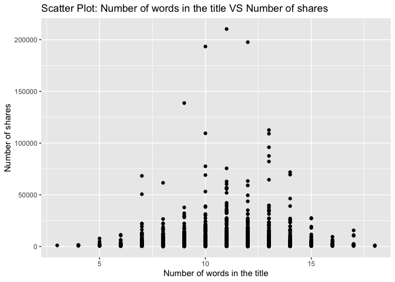
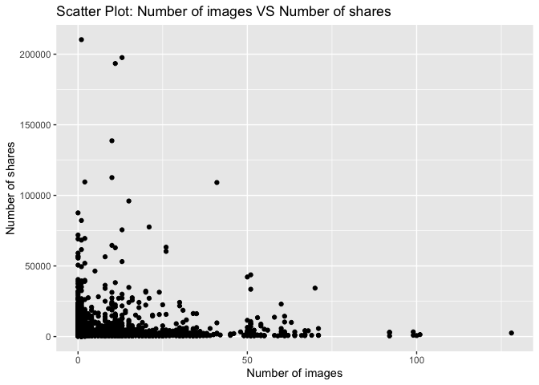
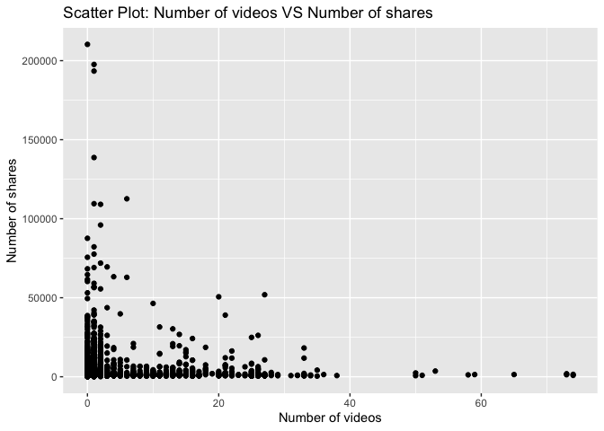

Project 3
================
Shaoyu Wang, Aniket Walimbe
2022-11-14

- <a href="#introduction" id="toc-introduction">Introduction</a>
- <a href="#required-packages" id="toc-required-packages">Required
  Packages</a>
- <a href="#data" id="toc-data">Data</a>
- <a href="#summarizations" id="toc-summarizations">Summarizations</a>
- <a href="#model" id="toc-model">Model</a>
- <a href="#comparison" id="toc-comparison">Comparison</a>
- <a href="#automation" id="toc-automation">Automation</a>

# Introduction

This [online news popularity data
set](https://archive.ics.uci.edu/ml/datasets/Online+News+Popularity)
summarizes a heterogeneous set of features about articles published by
Mashable in a period of two years.

# Required Packages

First, we need to load the required packages:

``` r
# Load libraries
library(readr)
library(tidyverse)
library(dplyr)
library(caret)
library(leaps)
library(ggplot2)
library(corrplot)
library(GGally)
library(randomForest)
```

# Data

Read in the data and subset the data to work on the data channel of
interest. We found that there are seven similar columns for weekday from
Monday to Sunday, so we merged these columns and named the new variable
as `publish_weekday`. For this step, we also removed the non-predictive
variables.

``` r
#Read in the data file
newsData <- read_csv("OnlineNewsPopularity.csv", show_col_types = FALSE)
#Choose the data channel of interest
if (params$channelID != "") {
  paramChannelName <- params$channelID
} else {
  paramChannelName <- "lifestyle"
}
channelID <- paste("data_channel_is_", paramChannelName, sep = "")
#Merge the weekday columns as one single column.
news <- newsData %>% 
  filter(.data[[channelID]] == 1) %>% 
  select(url, starts_with("weekday_is_")) %>% 
  pivot_longer(-url) %>% 
  filter(value != 0) %>% 
  mutate(publish_weekday = substr(name, 12, 20)) %>% 
  left_join(newsData, by = "url") %>% 
#Remove non predictive variables
  select(-c(url, name, value, timedelta, starts_with("data_channel_is_"), starts_with("weekday_is_")))
news$publish_weekday <- as.factor(news$publish_weekday)
news
```

Split the data into a training set and a test set.

``` r
set.seed(111)
trainIndex <- createDataPartition(news$shares, p = 0.7, list = FALSE)
newsTrain <- news[trainIndex,]
newsTest <- news[-trainIndex,]
#newsTrain
```

# Summarizations

For this part, we created some basic summary statistics and plots about
the training data.

- Tables

Firstly, let’s look at some tables. We summarized the training data, so
that we can know all of the variables roughly. For example, this table
shows each count for published on weekdays, we can see which has the
most count and which has the least count. It also shows the minimum, 1st
quantile, median, mean, 3rd quantile and maximum of other variables.

``` r
summary(newsTrain)
```

    ##   publish_weekday n_tokens_title  n_tokens_content n_unique_tokens  n_non_stop_words n_non_stop_unique_tokens
    ##  friday   :668    Min.   : 3.00   Min.   :   0.0   Min.   :0.0000   Min.   :0.0000   Min.   :0.0000          
    ##  monday   :948    1st Qu.:10.00   1st Qu.: 253.0   1st Qu.:0.4709   1st Qu.:1.0000   1st Qu.:0.6230          
    ##  saturday :266    Median :11.00   Median : 428.0   Median :0.5430   Median :1.0000   Median :0.6919          
    ##  sunday   :372    Mean   :10.99   Mean   : 610.2   Mean   :0.5340   Mean   :0.9735   Mean   :0.6727          
    ##  thursday :862    3rd Qu.:12.00   3rd Qu.: 810.0   3rd Qu.:0.6181   3rd Qu.:1.0000   3rd Qu.:0.7614          
    ##  tuesday  :906    Max.   :18.00   Max.   :6505.0   Max.   :0.9355   Max.   :1.0000   Max.   :1.0000          
    ##  wednesday:919                                                                                               
    ##    num_hrefs      num_self_hrefs      num_imgs        num_videos     average_token_length  num_keywords   
    ##  Min.   :  0.00   Min.   : 0.000   Min.   :  0.00   Min.   : 0.000   Min.   :0.000        Min.   : 3.000  
    ##  1st Qu.:  4.00   1st Qu.: 1.000   1st Qu.:  1.00   1st Qu.: 0.000   1st Qu.:4.427        1st Qu.: 5.000  
    ##  Median :  7.00   Median : 3.000   Median :  1.00   Median : 1.000   Median :4.585        Median : 7.000  
    ##  Mean   : 10.72   Mean   : 3.517   Mean   :  6.29   Mean   : 2.624   Mean   :4.486        Mean   : 6.933  
    ##  3rd Qu.: 13.00   3rd Qu.: 5.000   3rd Qu.:  8.00   3rd Qu.: 1.000   3rd Qu.:4.750        3rd Qu.: 8.000  
    ##  Max.   :304.00   Max.   :40.000   Max.   :128.00   Max.   :74.000   Max.   :7.696        Max.   :10.000  
    ##                                                                                                           
    ##    kw_min_min       kw_max_min       kw_avg_min        kw_min_max       kw_max_max       kw_avg_max    
    ##  Min.   : -1.00   Min.   :     0   Min.   :   -1.0   Min.   :     0   Min.   :     0   Min.   :     0  
    ##  1st Qu.: -1.00   1st Qu.:   417   1st Qu.:  124.0   1st Qu.:     0   1st Qu.:843300   1st Qu.:178600  
    ##  Median : -1.00   Median :   600   Median :  210.8   Median :  1400   Median :843300   Median :231340  
    ##  Mean   : 21.45   Mean   :  1069   Mean   :  289.3   Mean   : 13203   Mean   :766220   Mean   :243588  
    ##  3rd Qu.:  4.00   3rd Qu.:   926   3rd Qu.:  323.1   3rd Qu.: 11400   3rd Qu.:843300   3rd Qu.:303775  
    ##  Max.   :294.00   Max.   :138700   Max.   :34855.1   Max.   :210300   Max.   :843300   Max.   :670750  
    ##                                                                                                        
    ##    kw_min_avg     kw_max_avg       kw_avg_avg    self_reference_min_shares self_reference_max_shares
    ##  Min.   :   0   Min.   :     0   Min.   :    0   Min.   :     0            Min.   :     0           
    ##  1st Qu.:   0   1st Qu.:  3682   1st Qu.: 2545   1st Qu.:   700            1st Qu.:  1100           
    ##  Median :1018   Median :  4448   Median : 2964   Median :  1100            Median :  2700           
    ##  Mean   :1115   Mean   :  5655   Mean   : 3152   Mean   :  2735            Mean   :  8959           
    ##  3rd Qu.:2056   3rd Qu.:  6015   3rd Qu.: 3547   3rd Qu.:  2000            3rd Qu.:  9200           
    ##  Max.   :3285   Max.   :138700   Max.   :36023   Max.   :210300            Max.   :837700           
    ##                                                                                                     
    ##  self_reference_avg_sharess   is_weekend         LDA_00            LDA_01            LDA_02            LDA_03       
    ##  Min.   :     0             Min.   :0.0000   Min.   :0.01824   Min.   :0.01898   Min.   :0.01818   Min.   :0.01818  
    ##  1st Qu.:  1040             1st Qu.:0.0000   1st Qu.:0.02508   1st Qu.:0.04128   1st Qu.:0.02502   1st Qu.:0.03365  
    ##  Median :  2050             Median :0.0000   Median :0.03333   Median :0.44268   Median :0.03333   Median :0.25041  
    ##  Mean   :  5064             Mean   :0.1291   Mean   :0.06670   Mean   :0.42521   Mean   :0.09047   Mean   :0.35499  
    ##  3rd Qu.:  4900             3rd Qu.:0.0000   3rd Qu.:0.05000   3rd Qu.:0.73155   3rd Qu.:0.05015   3rd Qu.:0.69831  
    ##  Max.   :281685             Max.   :1.0000   Max.   :0.79368   Max.   :0.92595   Max.   :0.78708   Max.   :0.92554  
    ##                                                                                                                     
    ##      LDA_04        global_subjectivity global_sentiment_polarity global_rate_positive_words
    ##  Min.   :0.01818   Min.   :0.0000      Min.   :-0.37766          Min.   :0.00000           
    ##  1st Qu.:0.02500   1st Qu.:0.4131      1st Qu.: 0.04752          1st Qu.:0.02967           
    ##  Median :0.03333   Median :0.4651      Median : 0.11381          Median :0.04089           
    ##  Mean   :0.06264   Mean   :0.4538      Mean   : 0.11179          Mean   :0.04073           
    ##  3rd Qu.:0.04011   3rd Qu.:0.5143      3rd Qu.: 0.17346          3rd Qu.:0.05147           
    ##  Max.   :0.71889   Max.   :1.0000      Max.   : 0.72784          Max.   :0.15278           
    ##                                                                                            
    ##  global_rate_negative_words rate_positive_words rate_negative_words avg_positive_polarity min_positive_polarity
    ##  Min.   :0.00000            Min.   :0.0000      Min.   :0.0000      Min.   :0.0000        Min.   :0.00000      
    ##  1st Qu.:0.01077            1st Qu.:0.5789      1st Qu.:0.2000      1st Qu.:0.3182        1st Qu.:0.05000      
    ##  Median :0.01724            Median :0.6905      Median :0.3000      Median :0.3725        Median :0.10000      
    ##  Mean   :0.01919            Mean   :0.6675      Mean   :0.3060      Mean   :0.3663        Mean   :0.09392      
    ##  3rd Qu.:0.02508            3rd Qu.:0.7857      3rd Qu.:0.4038      3rd Qu.:0.4222        3rd Qu.:0.10000      
    ##  Max.   :0.09358            Max.   :1.0000      Max.   :1.0000      Max.   :0.8727        Max.   :0.80000      
    ##                                                                                                                
    ##  max_positive_polarity avg_negative_polarity min_negative_polarity max_negative_polarity title_subjectivity
    ##  Min.   :0.0000        Min.   :-1.0000       Min.   :-1.0000       Min.   :-1.0000       Min.   :0.0000    
    ##  1st Qu.:0.6000        1st Qu.:-0.3697       1st Qu.:-0.8000       1st Qu.:-0.1250       1st Qu.:0.0000    
    ##  Median :0.8500        Median :-0.3000       Median :-0.6000       Median :-0.1000       Median :0.3000    
    ##  Mean   :0.7971        Mean   :-0.2945       Mean   :-0.5884       Mean   :-0.1109       Mean   :0.3245    
    ##  3rd Qu.:1.0000        3rd Qu.:-0.2208       3rd Qu.:-0.4000       3rd Qu.:-0.0500       3rd Qu.:0.5357    
    ##  Max.   :1.0000        Max.   : 0.0000       Max.   : 0.0000       Max.   : 0.0000       Max.   :1.0000    
    ##                                                                                                            
    ##  title_sentiment_polarity abs_title_subjectivity abs_title_sentiment_polarity     shares      
    ##  Min.   :-1.00000         Min.   :0.0000         Min.   :0.00000              Min.   :    49  
    ##  1st Qu.: 0.00000         1st Qu.:0.1224         1st Qu.:0.00000              1st Qu.:   833  
    ##  Median : 0.00000         Median :0.4000         Median :0.08333              Median :  1200  
    ##  Mean   : 0.06662         Mean   :0.3194         Mean   :0.17554              Mean   :  3075  
    ##  3rd Qu.: 0.18750         3rd Qu.:0.5000         3rd Qu.:0.30000              3rd Qu.:  2100  
    ##  Max.   : 1.00000         Max.   :0.5000         Max.   :1.00000              Max.   :210300  
    ## 

Then we can check our response variable `shares`. It shows that the
mean, standard deviation, median, IQR of `shares` as follows.

``` r
#numerical summary for the variable shares
newsTrain %>% 
  summarise(mean = round(mean(shares), 0), sd = round(sd(shares), 0), 
            median = round(median(shares), 0), IQR = round(IQR(shares), 0))
```

We also obtain the numerical summaries on some subgroups.

``` r
#numerical summaries on subgroups
newsTrain %>% 
  group_by(publish_weekday) %>% 
  summarise(mean = round(mean(shares), 0), sd = round(sd(shares), 0), 
            median = round(median(shares), 0), IQR = round(IQR(shares), 0))
newsTrain %>% 
  group_by(num_imgs) %>% 
  summarise(mean = round(mean(shares), 0), sd = round(sd(shares), 0), 
            median = round(median(shares), 0), IQR = round(IQR(shares), 0))
newsTrain %>% 
  group_by(num_keywords) %>% 
  summarise(mean = round(mean(shares), 0), sd = round(sd(shares), 0), 
            median = round(median(shares), 0), IQR = round(IQR(shares), 0))
```

Moreover, we divide the title subjectivity into 3 categories:  
1. High: greater than 0.8  
2. Medium: 0.4 to less than 0.8  
3. Low: less than 0.4  
The contingency table is then shown below.

``` r
newsTrain$subject_activity_type <- ifelse(newsTrain$title_subjectivity >= 0.8, "High", 
                                          ifelse(newsTrain$title_subjectivity >= 0.4, "Medium",
                                                 ifelse(airquality$Wind >= 0, "Low")))
table(newsTrain$subject_activity_type)
```

    ## 
    ##   High    Low Medium 
    ##    550   2741   1650

- Plots

Plotting the correlation between numeric variables.

``` r
newsTrainsub <- newsTrain %>% select(-c(publish_weekday, subject_activity_type))
correlation <- cor(newsTrainsub, method = "spearman")
corrplot(correlation, tl.col = "black", tl.cex = 0.5)
```

<!-- --> From
the correlation graph above, we can see that some variables are strongly
correlated.

For further EDA, we are plotting several graphs to see trends between
different variables with respect to the number of shares.

A plot between number of shares and article published day: This plot
shows the number of shares an article has based on the day it has been
published.

``` r
newsTrainday <- newsTrain %>%
  select(publish_weekday, shares) %>%
  group_by(publish_weekday) %>% 
  summarise(total_shares=sum(shares))

g <- ggplot(data = newsTrainday, aes(x=publish_weekday, y=total_shares))
g + geom_col(fill = "lightblue")+
  labs(title = " Shares for articles published based on weekdays")
```

<!-- -->

Here, we have plotted the histogram for number of words in a title for
the data. It can be seen that the graph shows the variable following
normal distribution.

``` r
g <- ggplot(newsTrain, aes(x = n_tokens_title))
g + geom_histogram(fill = "lightblue", binwidth = 1) + 
  labs(x = "Number of words in the title",
       title = "Histogram: Number of words in the title")
```

<!-- -->

Then we have plotted the histogram for number of words in content for
the data.

``` r
g <- ggplot(newsTrain, aes(x = n_tokens_content))
g + geom_histogram(fill = "lightblue") + 
  labs(x = "Number of words in the content", 
       title = "Histogram: Number of words in the content")
```

<!-- -->

A histogram for text subjectivity.

``` r
g <- ggplot(newsTrain, aes(x = global_subjectivity))
g + geom_histogram(fill = "lightblue") + 
  labs(x = "Text subjectivity", 
       title = "Histogram: Text subjectivity")
```

<!-- -->

A histogram for text sentiment polarity.

``` r
g <- ggplot(newsTrain, aes(x = global_sentiment_polarity))
g + geom_histogram(fill = "lightblue") + 
  labs(x = "Text sentiment polarity", 
       title = "Histogram: Text sentiment polarity")
```

<!-- -->

A plot between number of images and number of shares.

``` r
g <- ggplot(data = newsTrain, aes(x = num_imgs, y = shares))
g + geom_point() +
  labs(x = "Number of images" , y = "Number of shares", 
       title = "Scatter Plot: Number of images VS Number of shares") 
```

<!-- -->

A plot between average length of words in content and number of shares:
We can inspect the trend of the shares as a function of average length
of words in content.

``` r
g <- ggplot(newsTrain, aes(x = average_token_length, y = shares))
g + geom_point() + 
  labs(x = "Average token length" , y = "Number of shares", 
       title = "Scatter Plot: Average token length VS Number of shares")
```

<!-- -->

A plot between title subjectivity and number of shares: We can inspect
the trend of the shares as a function of title subjectivity.

``` r
g <- ggplot(data = newsTrain, aes(x = title_subjectivity, y = shares))
g + geom_point() + 
  labs(x = "Title subjectivity" , y = "Number of shares", 
       title = "Scatter Plot: Title subjectivity VS Number of shares") 
```

<!-- -->

Select predictors: publish_weekday, n_tokens_title, n_tokens_content,
num_self_hrefs, num_imgs, average_token_length, num_keywords,
kw_avg_avg, self_reference_avg_sharess, LDA_04, global_subjectivity,
global_sentiment_polarity, avg_positive_polarity, avg_negative_polarity,
title_subjectivity, shares.

``` r
set.seed(111)
Train <- newsTrain %>% 
  select(publish_weekday, n_tokens_title, n_tokens_content, num_self_hrefs, num_imgs, average_token_length, num_keywords, kw_avg_avg, self_reference_avg_sharess, LDA_04, global_subjectivity, global_sentiment_polarity, avg_positive_polarity, avg_negative_polarity, title_subjectivity, shares)
Test <- newsTest %>% 
  select(publish_weekday, n_tokens_title, n_tokens_content, num_self_hrefs, num_imgs, average_token_length, num_keywords, kw_avg_avg, self_reference_avg_sharess, LDA_04, global_subjectivity, global_sentiment_polarity, avg_positive_polarity, avg_negative_polarity, title_subjectivity, shares)
#Train
```

# Model

- Linear Regression Model

Here, we have fitted a forward stepwise linear regression model for the
training dataset having 15 variables. The data is centered and scaled
and number of shares is the response variable.

``` r
#forward stepwise
set.seed(111)
fwFit <- train(shares ~ ., data = Train,
               method = "leapForward",
               preProcess = c("center", "scale"))
#summary(fwFit)
fwFit
```

    ## Linear Regression with Forward Selection 
    ## 
    ## 4941 samples
    ##   15 predictor
    ## 
    ## Pre-processing: centered (20), scaled (20) 
    ## Resampling: Bootstrapped (25 reps) 
    ## Summary of sample sizes: 4941, 4941, 4941, 4941, 4941, 4941, ... 
    ## Resampling results across tuning parameters:
    ## 
    ##   nvmax  RMSE      Rsquared    MAE     
    ##   2      8748.860  0.04301703  3087.662
    ##   3      8753.378  0.03974416  3093.794
    ##   4      8755.987  0.03758715  3095.275
    ## 
    ## RMSE was used to select the optimal model using the smallest value.
    ## The final value used for the model was nvmax = 2.

Here, we have fitted a backward stepwise linear regression model for the
training dataset having 15 variables. The data is centered and scaled
and number of shares is the response variable.

``` r
#backward stepwise
set.seed(111)
bwFit <- train(shares ~ ., data = Train,
               method = "leapBackward",
               preProcess = c("center", "scale"))
#summary(bwFit)
bwFit
```

    ## Linear Regression with Backwards Selection 
    ## 
    ## 4941 samples
    ##   15 predictor
    ## 
    ## Pre-processing: centered (20), scaled (20) 
    ## Resampling: Bootstrapped (25 reps) 
    ## Summary of sample sizes: 4941, 4941, 4941, 4941, 4941, 4941, ... 
    ## Resampling results across tuning parameters:
    ## 
    ##   nvmax  RMSE      Rsquared    MAE     
    ##   2      8748.860  0.04301703  3087.662
    ##   3      8752.746  0.03992704  3093.474
    ##   4      8756.728  0.03755621  3096.252
    ## 
    ## RMSE was used to select the optimal model using the smallest value.
    ## The final value used for the model was nvmax = 2.

``` r
#fit a linear regression model with all predictors
set.seed(111)
lrFit <- train(shares ~ ., data = Train,
               method = "lm",
               trControl = trainControl(method = "cv", number = 5))
lrFit
```

    ## Linear Regression 
    ## 
    ## 4941 samples
    ##   15 predictor
    ## 
    ## No pre-processing
    ## Resampling: Cross-Validated (5 fold) 
    ## Summary of sample sizes: 3952, 3954, 3951, 3954, 3953 
    ## Resampling results:
    ## 
    ##   RMSE      Rsquared    MAE     
    ##   8216.212  0.02687093  3104.457
    ## 
    ## Tuning parameter 'intercept' was held constant at a value of TRUE

- Random Forest Model

Here, we have fitted a random forest model which is chosen using the
cross validation method. The RMSE value for the model is as shown below.
The tuning parameter is given as number of columns in the training data
divided by 3.

``` r
set.seed(111)
randomFit <- train(shares ~ ., 
                   data = Train, 
                   method = "rf",
                   preProcess = c("center","scale"),
                   trControl = trainControl(method = "cv", number = 5),
                   tuneGrid = data.frame(mtry = ncol(Train)/3))
randomFit
```

    ## Random Forest 
    ## 
    ## 4941 samples
    ##   15 predictor
    ## 
    ## Pre-processing: centered (20), scaled (20) 
    ## Resampling: Cross-Validated (5 fold) 
    ## Summary of sample sizes: 3952, 3954, 3951, 3954, 3953 
    ## Resampling results:
    ## 
    ##   RMSE      Rsquared    MAE     
    ##   8246.247  0.03144546  3195.717
    ## 
    ## Tuning parameter 'mtry' was held constant at a value of 5.333333

- Boosted Tree Model

Here, we have fitted a random forest model which is chosen using the
cross validation method. The RMSE value for the model is as shown below.
Tuning parameters are n.trees, interaction.depth, shrinkage and
n.minobsinnode.

``` r
set.seed(111)
boostedFit <- train(shares ~ ., 
                    data = Train, 
                    method = "gbm", 
                    preProcess = c("center", "scale"),
                    trControl = trainControl(method = "cv", number = 5),
                    tuneGrid = expand.grid(n.trees = c(25,50,100,150,200), 
                                           interaction.depth = c(1,2,3,4), 
                                           shrinkage = 0.1, 
                                           n.minobsinnode = 10),
                    verbose = FALSE)
boostedFit
```

    ## Stochastic Gradient Boosting 
    ## 
    ## 4941 samples
    ##   15 predictor
    ## 
    ## Pre-processing: centered (20), scaled (20) 
    ## Resampling: Cross-Validated (5 fold) 
    ## Summary of sample sizes: 3952, 3954, 3951, 3954, 3953 
    ## Resampling results across tuning parameters:
    ## 
    ##   interaction.depth  n.trees  RMSE      Rsquared    MAE     
    ##   1                   25      8232.290  0.01190099  3092.240
    ##   1                   50      8238.170  0.01394523  3073.341
    ##   1                  100      8274.625  0.01248618  3073.521
    ##   1                  150      8279.491  0.01342043  3089.381
    ##   1                  200      8291.124  0.01373017  3079.556
    ##   2                   25      8221.131  0.01731147  3053.737
    ##   2                   50      8248.689  0.01628512  3070.291
    ##   2                  100      8292.002  0.01407806  3072.565
    ##   2                  150      8284.488  0.01572581  3094.601
    ##   2                  200      8264.979  0.01714413  3070.279
    ##   3                   25      8250.315  0.01412643  3081.871
    ##   3                   50      8318.594  0.01486422  3094.659
    ##   3                  100      8299.238  0.01607287  3069.323
    ##   3                  150      8348.644  0.01489763  3090.538
    ##   3                  200      8415.197  0.01188110  3135.866
    ##   4                   25      8302.134  0.01572348  3077.035
    ##   4                   50      8330.141  0.01797299  3080.383
    ##   4                  100      8375.981  0.01632640  3091.314
    ##   4                  150      8434.000  0.01572561  3132.720
    ##   4                  200      8408.923  0.01773231  3150.894
    ## 
    ## Tuning parameter 'shrinkage' was held constant at a value of 0.1
    ## Tuning parameter 'n.minobsinnode' was held
    ##  constant at a value of 10
    ## RMSE was used to select the optimal model using the smallest value.
    ## The final values used for the model were n.trees = 25, interaction.depth = 2, shrinkage = 0.1 and n.minobsinnode = 10.

# Comparison

All the models are compared by RMSE on the test set.

``` r
#fit a linear regression model
fw_mod <- postResample(predict(fwFit, newdata = Test), obs = Test$shares)
bw_mod <- postResample(predict(bwFit, newdata = Test), obs = Test$shares)
lr_mod <- postResample(predict(lrFit, newdata = Test), obs = Test$shares)
#random forest
random_mod <- postResample(predict(randomFit, newdata = Test), obs = Test$shares)
#boosted tree
boosted_mod <- postResample(predict(boostedFit, newdata = Test), obs = Test$shares)
#compare all models
tibble(model = c("Forward",
                 "Backward",
                 "LR with all predictors",
                 "Random Forest",
                 "Boosted Tree"), 
       RMSE = c(fw_mod[1],
                bw_mod[1],
                lr_mod[1],
                random_mod[1],
                boosted_mod[1]))
```

# Automation

``` r
#create channel names
channelID <- data.frame("lifestyle", "entertainment", "bus", "socmed", "tech", "world")
#create filenames
output_file <- paste0(channelID,".md")
#create a list for each channel with the channel name parameter
params = lapply(channelID, FUN = function(x){list(channelID = x)})
#put into a data frame
reports <- tibble(output_file, params)
#render code
apply(reports, MARGIN = 1,
          FUN = function(x){
             rmarkdown::render(input = "project3.Rmd",
             output_format = "github_document",
             output_file = x[[1]],
             params = x[[2]],
             output_options = list(toc=TRUE, toc_depth=1, toc_float=TRUE))
             })
```
