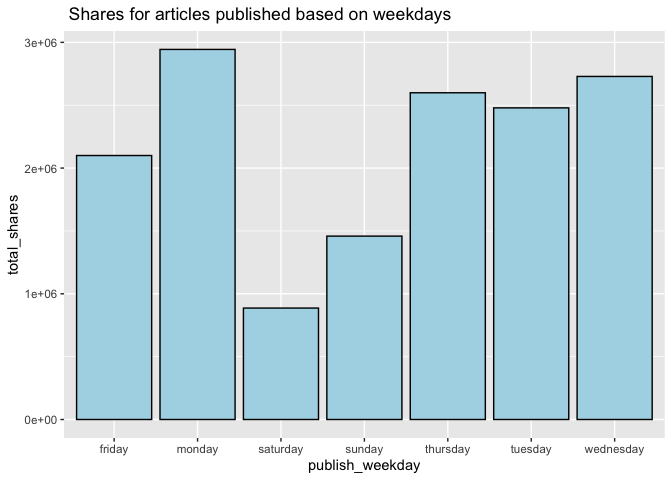
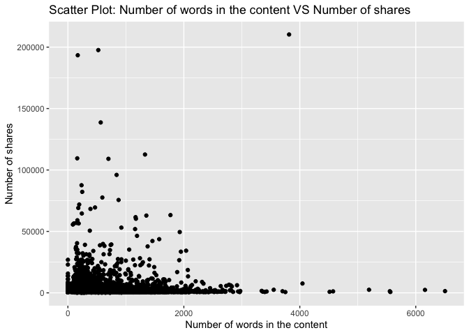
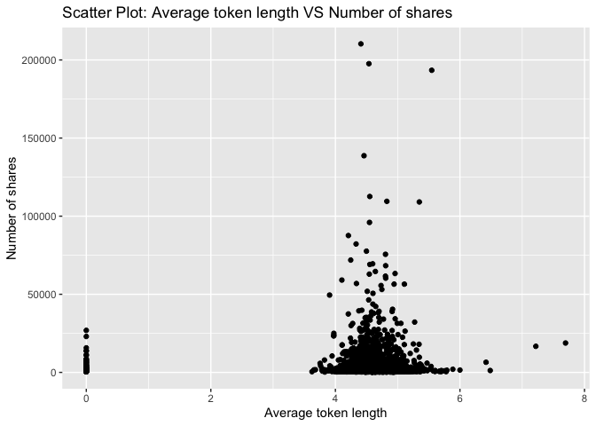

Project 3
================
Shaoyu Wang, Aniket Walimbe
2022-11-16

# Analysis for entertainment Data Channel

## Introduction

This [online news popularity data
set](https://archive.ics.uci.edu/ml/datasets/Online+News+Popularity)
summarizes a heterogeneous set of features about articles published by
Mashable in a period of two years. There are 61 attributes, including 58
predictive attributes, 2 non-predictive, 1 goal field. The number of
shares is our target variable, and we select predictive variables from
the remaining variables based on the exploratory data analysis. The
purpose of our analysis is to predict the the number of shares. During
this project, we read and subset the data set at first, and split data
into training set and test set, then we create some basic summary
statistics and plots about the training data, at last we fit linear
regression models and ensemble tree-based models and test the
predictions.

**Variable information**

The target variable is the following:  
- `shares`: Number of shares

The predictive variables are the following:  
- `publish_weekday`: The article published day  
- `n_tokens_title`: Number of words in the title  
- `n_tokens_content`: Number of words in the content  
- `num_self_hrefs`: Number of links to other articles published by
Mashable  
- `num_imgs`: Number of images  
- `num_videos`: Number of videos  
- `average_token_length`: Average length of the words in the content  
- `num_keywords`: Number of keywords in the metadata  
- `kw_avg_avg`: Avg. keyword (avg. shares)  
- `self_reference_avg_sharess`: Avg. shares of referenced articles in
Mashable  
- `LDA_04`: Closeness to LDA topic 4  
- `global_subjectivity`: Text subjectivity  
- `global_sentiment_polarity`: Text sentiment polarity  
- `avg_positive_polarity`: Avg. polarity of positive words  
- `avg_negative_polarity`: Avg. polarity of negative words

**Required packages**

We need to load the required packages:

``` r
# Load libraries
library(readr)
library(tidyverse)
library(caret)
library(leaps)
library(ggplot2)
library(corrplot)
library(randomForest)
library(rmarkdown)
```

## Data

Read in the data and subset the data to work on the data channel of
interest. We find that there are seven similar columns for weekdays from
Monday to Sunday, so we merge these columns and name the new variable as
`publish_weekday` and convert it to factor. For this step, we also
remove the non-predictive variables.

``` r
#Read in the data file
newsData <- read_csv("OnlineNewsPopularity.csv")
#Select the data channel of interest
selectChannel <- paste0("data_channel_is_", params[[1]])
news <- newsData %>% 
  filter(get(selectChannel) == 1) %>% 
  select(url, starts_with("weekday_is_")) %>% 
  pivot_longer(-url) %>% 
  filter(value != 0) %>% 
  mutate(publish_weekday = substr(name, 12, 20)) %>% 
  left_join(newsData, by = "url") %>% 
#Remove non predictive variables
  select(-c(url, name, value, timedelta, starts_with("data_channel_is_"), starts_with("weekday_is_")))
#convert publish_weekday to factor
news$publish_weekday <- as.factor(news$publish_weekday)
news
```

    ## # A tibble: 7,057 × 47
    ##    publish_…¹ n_tok…² n_tok…³ n_uni…⁴ n_non…⁵ n_non…⁶ num_h…⁷ num_s…⁸ num_i…⁹
    ##    <fct>        <dbl>   <dbl>   <dbl>   <dbl>   <dbl>   <dbl>   <dbl>   <dbl>
    ##  1 monday          12     219   0.664    1.00   0.815       4       2       1
    ##  2 monday           9     531   0.504    1.00   0.666       9       0       1
    ##  3 monday          14     194   0.765    1.00   0.840       4       4       0
    ##  4 monday          12     161   0.669    1.00   0.752       5       4       0
    ##  5 monday          11     454   0.566    1.00   0.755       5       3       1
    ##  6 monday          12     177   0.741    1.00   0.823       4       3       1
    ##  7 monday           5     356   0.618    1.00   0.766       3       3      12
    ##  8 tuesday         11     281   0.611    1.00   0.766       5       4       1
    ##  9 tuesday         10     909   0.450    1.00   0.670       3       2       1
    ## 10 wednesday       10     413   0.606    1.00   0.729       6       1      13
    ## # … with 7,047 more rows, 38 more variables: num_videos <dbl>,
    ## #   average_token_length <dbl>, num_keywords <dbl>, kw_min_min <dbl>,
    ## #   kw_max_min <dbl>, kw_avg_min <dbl>, kw_min_max <dbl>, kw_max_max <dbl>,
    ## #   kw_avg_max <dbl>, kw_min_avg <dbl>, kw_max_avg <dbl>, kw_avg_avg <dbl>,
    ## #   self_reference_min_shares <dbl>, self_reference_max_shares <dbl>,
    ## #   self_reference_avg_sharess <dbl>, is_weekend <dbl>, LDA_00 <dbl>,
    ## #   LDA_01 <dbl>, LDA_02 <dbl>, LDA_03 <dbl>, LDA_04 <dbl>, …

Split the data into a training set and a test set.

``` r
set.seed(111)
trainIndex <- createDataPartition(news$shares, p = 0.7, list = FALSE)
newsTrain <- news[trainIndex,]
newsTest <- news[-trainIndex,]
#newsTrain
```

## Summarizations

For this part, we produce some basic summary statistics and plots about
the training data.

**Tables**

Firstly, here is a quick summary of all variables as shown below, so
that we can know the variables roughly.

``` r
summary(newsTrain)
```

    ##   publish_weekday n_tokens_title  n_tokens_content n_unique_tokens 
    ##  friday   :668    Min.   : 3.00   Min.   :   0.0   Min.   :0.0000  
    ##  monday   :948    1st Qu.:10.00   1st Qu.: 253.0   1st Qu.:0.4709  
    ##  saturday :266    Median :11.00   Median : 428.0   Median :0.5430  
    ##  sunday   :372    Mean   :10.99   Mean   : 610.2   Mean   :0.5340  
    ##  thursday :862    3rd Qu.:12.00   3rd Qu.: 810.0   3rd Qu.:0.6181  
    ##  tuesday  :906    Max.   :18.00   Max.   :6505.0   Max.   :0.9355  
    ##  wednesday:919                                                     
    ##  n_non_stop_words n_non_stop_unique_tokens   num_hrefs      num_self_hrefs  
    ##  Min.   :0.0000   Min.   :0.0000           Min.   :  0.00   Min.   : 0.000  
    ##  1st Qu.:1.0000   1st Qu.:0.6230           1st Qu.:  4.00   1st Qu.: 1.000  
    ##  Median :1.0000   Median :0.6919           Median :  7.00   Median : 3.000  
    ##  Mean   :0.9735   Mean   :0.6727           Mean   : 10.72   Mean   : 3.517  
    ##  3rd Qu.:1.0000   3rd Qu.:0.7614           3rd Qu.: 13.00   3rd Qu.: 5.000  
    ##  Max.   :1.0000   Max.   :1.0000           Max.   :304.00   Max.   :40.000  
    ##                                                                             
    ##     num_imgs        num_videos     average_token_length  num_keywords   
    ##  Min.   :  0.00   Min.   : 0.000   Min.   :0.000        Min.   : 3.000  
    ##  1st Qu.:  1.00   1st Qu.: 0.000   1st Qu.:4.427        1st Qu.: 5.000  
    ##  Median :  1.00   Median : 1.000   Median :4.585        Median : 7.000  
    ##  Mean   :  6.29   Mean   : 2.624   Mean   :4.486        Mean   : 6.933  
    ##  3rd Qu.:  8.00   3rd Qu.: 1.000   3rd Qu.:4.750        3rd Qu.: 8.000  
    ##  Max.   :128.00   Max.   :74.000   Max.   :7.696        Max.   :10.000  
    ##                                                                         
    ##    kw_min_min       kw_max_min       kw_avg_min        kw_min_max    
    ##  Min.   : -1.00   Min.   :     0   Min.   :   -1.0   Min.   :     0  
    ##  1st Qu.: -1.00   1st Qu.:   417   1st Qu.:  124.0   1st Qu.:     0  
    ##  Median : -1.00   Median :   600   Median :  210.8   Median :  1400  
    ##  Mean   : 21.45   Mean   :  1069   Mean   :  289.3   Mean   : 13203  
    ##  3rd Qu.:  4.00   3rd Qu.:   926   3rd Qu.:  323.1   3rd Qu.: 11400  
    ##  Max.   :294.00   Max.   :138700   Max.   :34855.1   Max.   :210300  
    ##                                                                      
    ##    kw_max_max       kw_avg_max       kw_min_avg     kw_max_avg    
    ##  Min.   :     0   Min.   :     0   Min.   :   0   Min.   :     0  
    ##  1st Qu.:843300   1st Qu.:178600   1st Qu.:   0   1st Qu.:  3682  
    ##  Median :843300   Median :231340   Median :1018   Median :  4448  
    ##  Mean   :766220   Mean   :243588   Mean   :1115   Mean   :  5655  
    ##  3rd Qu.:843300   3rd Qu.:303775   3rd Qu.:2056   3rd Qu.:  6015  
    ##  Max.   :843300   Max.   :670750   Max.   :3285   Max.   :138700  
    ##                                                                   
    ##    kw_avg_avg    self_reference_min_shares self_reference_max_shares
    ##  Min.   :    0   Min.   :     0            Min.   :     0           
    ##  1st Qu.: 2545   1st Qu.:   700            1st Qu.:  1100           
    ##  Median : 2964   Median :  1100            Median :  2700           
    ##  Mean   : 3152   Mean   :  2735            Mean   :  8959           
    ##  3rd Qu.: 3547   3rd Qu.:  2000            3rd Qu.:  9200           
    ##  Max.   :36023   Max.   :210300            Max.   :837700           
    ##                                                                     
    ##  self_reference_avg_sharess   is_weekend         LDA_00       
    ##  Min.   :     0             Min.   :0.0000   Min.   :0.01824  
    ##  1st Qu.:  1040             1st Qu.:0.0000   1st Qu.:0.02508  
    ##  Median :  2050             Median :0.0000   Median :0.03333  
    ##  Mean   :  5064             Mean   :0.1291   Mean   :0.06670  
    ##  3rd Qu.:  4900             3rd Qu.:0.0000   3rd Qu.:0.05000  
    ##  Max.   :281685             Max.   :1.0000   Max.   :0.79368  
    ##                                                               
    ##      LDA_01            LDA_02            LDA_03            LDA_04       
    ##  Min.   :0.01898   Min.   :0.01818   Min.   :0.01818   Min.   :0.01818  
    ##  1st Qu.:0.04128   1st Qu.:0.02502   1st Qu.:0.03365   1st Qu.:0.02500  
    ##  Median :0.44268   Median :0.03333   Median :0.25041   Median :0.03333  
    ##  Mean   :0.42521   Mean   :0.09047   Mean   :0.35499   Mean   :0.06264  
    ##  3rd Qu.:0.73155   3rd Qu.:0.05015   3rd Qu.:0.69831   3rd Qu.:0.04011  
    ##  Max.   :0.92595   Max.   :0.78708   Max.   :0.92554   Max.   :0.71889  
    ##                                                                         
    ##  global_subjectivity global_sentiment_polarity global_rate_positive_words
    ##  Min.   :0.0000      Min.   :-0.37766          Min.   :0.00000           
    ##  1st Qu.:0.4131      1st Qu.: 0.04752          1st Qu.:0.02967           
    ##  Median :0.4651      Median : 0.11381          Median :0.04089           
    ##  Mean   :0.4538      Mean   : 0.11179          Mean   :0.04073           
    ##  3rd Qu.:0.5143      3rd Qu.: 0.17346          3rd Qu.:0.05147           
    ##  Max.   :1.0000      Max.   : 0.72784          Max.   :0.15278           
    ##                                                                          
    ##  global_rate_negative_words rate_positive_words rate_negative_words
    ##  Min.   :0.00000            Min.   :0.0000      Min.   :0.0000     
    ##  1st Qu.:0.01077            1st Qu.:0.5789      1st Qu.:0.2000     
    ##  Median :0.01724            Median :0.6905      Median :0.3000     
    ##  Mean   :0.01919            Mean   :0.6675      Mean   :0.3060     
    ##  3rd Qu.:0.02508            3rd Qu.:0.7857      3rd Qu.:0.4038     
    ##  Max.   :0.09358            Max.   :1.0000      Max.   :1.0000     
    ##                                                                    
    ##  avg_positive_polarity min_positive_polarity max_positive_polarity
    ##  Min.   :0.0000        Min.   :0.00000       Min.   :0.0000       
    ##  1st Qu.:0.3182        1st Qu.:0.05000       1st Qu.:0.6000       
    ##  Median :0.3725        Median :0.10000       Median :0.8500       
    ##  Mean   :0.3663        Mean   :0.09392       Mean   :0.7971       
    ##  3rd Qu.:0.4222        3rd Qu.:0.10000       3rd Qu.:1.0000       
    ##  Max.   :0.8727        Max.   :0.80000       Max.   :1.0000       
    ##                                                                   
    ##  avg_negative_polarity min_negative_polarity max_negative_polarity
    ##  Min.   :-1.0000       Min.   :-1.0000       Min.   :-1.0000      
    ##  1st Qu.:-0.3697       1st Qu.:-0.8000       1st Qu.:-0.1250      
    ##  Median :-0.3000       Median :-0.6000       Median :-0.1000      
    ##  Mean   :-0.2945       Mean   :-0.5884       Mean   :-0.1109      
    ##  3rd Qu.:-0.2208       3rd Qu.:-0.4000       3rd Qu.:-0.0500      
    ##  Max.   : 0.0000       Max.   : 0.0000       Max.   : 0.0000      
    ##                                                                   
    ##  title_subjectivity title_sentiment_polarity abs_title_subjectivity
    ##  Min.   :0.0000     Min.   :-1.00000         Min.   :0.0000        
    ##  1st Qu.:0.0000     1st Qu.: 0.00000         1st Qu.:0.1224        
    ##  Median :0.3000     Median : 0.00000         Median :0.4000        
    ##  Mean   :0.3245     Mean   : 0.06662         Mean   :0.3194        
    ##  3rd Qu.:0.5357     3rd Qu.: 0.18750         3rd Qu.:0.5000        
    ##  Max.   :1.0000     Max.   : 1.00000         Max.   :0.5000        
    ##                                                                    
    ##  abs_title_sentiment_polarity     shares      
    ##  Min.   :0.00000              Min.   :    49  
    ##  1st Qu.:0.00000              1st Qu.:   833  
    ##  Median :0.08333              Median :  1200  
    ##  Mean   :0.17554              Mean   :  3075  
    ##  3rd Qu.:0.30000              3rd Qu.:  2100  
    ##  Max.   :1.00000              Max.   :210300  
    ## 

Then we can check our response variable `shares`. The below table shows
that the mean, standard deviation, median, IQR of `shares`.

``` r
#numerical summary for the variable shares
newsTrain %>% 
  summarise(mean = round(mean(shares), 0), sd = round(sd(shares), 0), 
            median = round(median(shares), 0), IQR = round(IQR(shares), 0))
```

    ## # A tibble: 1 × 4
    ##    mean    sd median   IQR
    ##   <dbl> <dbl>  <dbl> <dbl>
    ## 1  3075  8525   1200  1267

We also obtain the numerical summaries on some subgroups. We choose four
example subgroups: number of images, number of videos, and number of
keywords, since people may concern more on these when they do searching
and sharing.

``` r
#numerical summaries on subgroups
newsTrain %>% 
  group_by(num_imgs) %>% 
  summarise(mean = round(mean(shares), 0), sd = round(sd(shares), 0), 
            median = round(median(shares), 0), IQR = round(IQR(shares), 0))
```

    ## # A tibble: 72 × 5
    ##    num_imgs  mean    sd median   IQR
    ##       <dbl> <dbl> <dbl>  <dbl> <dbl>
    ##  1        0  3545  7599   1200  1754
    ##  2        1  2377  6461   1100   997
    ##  3        2  3020  8868   1100   871
    ##  4        3  2115  3315   1100  1071
    ##  5        4  2843  4001   1250  1733
    ##  6        5  2345  5493   1200   702
    ##  7        6  2965  4041   1450  1980
    ##  8        7  1811  1609   1200  1115
    ##  9        8  4581  9330   1200  2384
    ## 10        9  2557  3058   1400  1706
    ## # … with 62 more rows

``` r
newsTrain %>% 
  group_by(num_videos) %>% 
  summarise(mean = round(mean(shares), 0), sd = round(sd(shares), 0), 
            median = round(median(shares), 0), IQR = round(IQR(shares), 0))
```

    ## # A tibble: 45 × 5
    ##    num_videos  mean    sd median   IQR
    ##         <dbl> <dbl> <dbl>  <dbl> <dbl>
    ##  1          0  2563  7003   1100   998
    ##  2          1  3632 10534   1200  1644
    ##  3          2  3418  8800   1200  1540
    ##  4          3  3240  8094   1200  1510
    ##  5          4  3477  7971   1300  1200
    ##  6          5  3220  6596   1500  1949
    ##  7          6  8195 24034   1300  1339
    ##  8          7  3406  5219   1300  2298
    ##  9          8  1839  1770   1100   961
    ## 10          9  1649  1418   1250   895
    ## # … with 35 more rows

``` r
newsTrain %>% 
  group_by(num_keywords) %>% 
  summarise(mean = round(mean(shares), 0), sd = round(sd(shares), 0), 
            median = round(median(shares), 0), IQR = round(IQR(shares), 0))
```

    ## # A tibble: 8 × 5
    ##   num_keywords  mean    sd median   IQR
    ##          <dbl> <dbl> <dbl>  <dbl> <dbl>
    ## 1            3  2206  3418   1100   819
    ## 2            4  2487  6350   1000   741
    ## 3            5  2519  6039   1100  1002
    ## 4            6  2857  8596   1100  1189
    ## 5            7  3592  9568   1200  1339
    ## 6            8  3075  7141   1200  1459
    ## 7            9  3918 11169   1300  2094
    ## 8           10  3171  9822   1300  1646

Moreover, we divide the title subjectivity into 3 categories:  
1. High: greater than 0.8  
2. Medium: 0.4 to less than 0.8  
3. Low: less than 0.4  
The contingency table is then shown below.

``` r
newsTrain$subject_activity_type <- ifelse(newsTrain$title_subjectivity >= 0.8, "High", 
                                          ifelse(newsTrain$title_subjectivity >= 0.4, "Medium",
                                                 ifelse(airquality$Wind >= 0, "Low")))
table(newsTrain$subject_activity_type)
```

    ## 
    ##   High    Low Medium 
    ##    550   2741   1650

**Plots**

At the beginning, let’s plot the correlation between the numeric
variables.

``` r
newsTrainsub <- newsTrain %>% select(-c(publish_weekday, subject_activity_type))
correlation <- cor(newsTrainsub, method = "spearman")
corrplot(correlation, tl.col = "black", tl.cex = 0.5)
```

<!-- -->

From the correlation graph above, we can see that the following
variables seem to be moderately correlated:  
- `n_tokens_contents`, `n_unique_tokens`, `n_non_stop_words`,
`n_non_stop_unique_tokens`, `num_hrefs`, `num_imgs`  
- `kw_min_min`, `kw_max_min`, `kw_avg_min`, `kw_min_max`, `kw_max_max`,
`kw_avg_max`, `kw_min_avg`, `kw_max_avg`, `kw_avg_avg`  
- `self_reference_min_shares`, `self_reference_max_shares`,
`self_reference_avg_sharess`  
- `LDA_00`, `LDA_01`, `LDA_02`, `LDA_03`  
- `global_sentiment_polarity`, `global_rate_positive_words`,
`global_rate_negative_words`, `rate_positive_words`,
`rate_negative_words`  
- `avg_positive_polarity`, `min_positive_polarity`,
`max_positive_polarity`  
- `avg_negative_polarity`, `min_negative_polarity`,
`max_negative_polarity`  
- `title_subjectivity`, `title_sentiment_polarity`,
`abs_title_subjectivity`, `abs_title_sentiment_polarity`

For further EDA, we are going to plot graphs to see trends between
different variables with respect to the number of shares.

A plot between number of shares and article published day: This plot
shows the number of shares an article has based on the day that has been
published.

``` r
newsTrainday <- newsTrain %>%
  select(publish_weekday, shares) %>%
  group_by(publish_weekday) %>% 
  summarise(total_shares=sum(shares))

g <- ggplot(data = newsTrainday, aes(x=publish_weekday, y=total_shares))
g + geom_col(fill = "lightblue", color = "black") +
  labs(title = " Shares for articles published based on weekdays")
```

<!-- -->

Let’s select some variables as example to plot scatter plots.

A scatter plot with the number of shares on the y-axis and the number of
words in the title on the x-axis is created:

``` r
g <- ggplot(data = newsTrain, aes(x = n_tokens_title, y = shares))
g + geom_point() +
  labs(x = "Number of words in the title", y = "Number of shares", 
       title = "Scatter Plot: Number of words in the title VS Number of shares")
```

<!-- -->

We can inspect the trend of shares as a function of the number of words
in the title. Therefore, we can see that the number of words in title
has an effect on the number of shares.

A scatter plot with the number of shares on the y-axis and the number of
words in the content on the x-axis is created:

``` r
g <- ggplot(data = newsTrain, aes(x = n_tokens_content, y = shares))
g + geom_point() +
  labs(x = "Number of words in the content", y = "Number of shares", 
       title = "Scatter Plot: Number of words in the content VS Number of shares") 
```

<!-- -->

From the plot above, we can easily see that the number of shares is
decreasing while the the number of words in the content is increasing.
So it can be illustrated that the number of words in the content will
affect the number of shares.

A scatter plot with the number of shares on the y-axis and the number of
links to other articles published by Mashable on the x-axis is created:

``` r
g <- ggplot(data = newsTrain, aes(x = num_self_hrefs, y = shares))
g + geom_point() +
  labs(x = "Number of links to other articles published by Mashable", y = "Number of shares", 
       title = "Scatter Plot: Number of links to other articles published by Mashable VS Number of shares")
```

<!-- -->

The plot above shows that as the number of links to other articles
increasing, the number of shares is decreasing. So the the number of
links to other articles has an infulence on the number of shares.

A scatter plot with the number of shares on the y-axis and the number of
images on the x-axis is created:

``` r
g <- ggplot(data = newsTrain, aes(x = num_imgs, y = shares))
g + geom_point() +
  labs(x = "Number of images", y = "Number of shares", 
       title = "Scatter Plot: Number of images VS Number of shares")
```

<!-- -->

The plot above shows that the number of shares decreases as the number
of images increasing. Therefore, the number of images will affect the
number of shares as well.

A scatter plot with the number of shares on the y-axis and the number of
videos on the x-axis is created:

``` r
g <- ggplot(data = newsTrain, aes(x = num_videos, y = shares))
g + geom_point() +
  labs(x = "Number of videos", y = "Number of shares", 
       title = "Scatter Plot: Number of videos VS Number of shares") 
```

<!-- -->

A scatter plot with the number of shares on the y-axis and the average
length of words in content on the x-axis is created:

``` r
g <- ggplot(newsTrain, aes(x = average_token_length, y = shares))
g + geom_point() + 
  labs(x = "Average token length", y = "Number of shares", 
       title = "Scatter Plot: Average token length VS Number of shares")
```

<!-- -->

Through the plot above, we can see that the most of shares are between 4
and 6 words. The average token length will also affect the number of
shares.

A scatter plot with the number of shares on the y-axis and the number of
keywords in the metadata on the x-axis is created:

``` r
g <- ggplot(newsTrain, aes(x = num_keywords, y = shares))
g + geom_point() + 
  labs(x = "Number of keywords in the metadata", y = "Number of shares", 
       title = "Scatter Plot: Number of keywords in the metadata VS Number of shares")
```

<!-- -->

According to the plot above, we can find that as the number of keywords
increasing, the number of shares is increasing. So the number of
keywords in the metadata will influence the number of shares.

A scatter plot with the number of shares on the y-axis and the text
subjectivity on the x-axis is created:

``` r
g <- ggplot(data = newsTrain, aes(x = global_subjectivity, y = shares))
g + geom_point() + 
  labs(x = "Text subjectivity", y = "Number of shares", 
       title = "Scatter Plot: Text subjectivity VS Number of shares")
```

<!-- -->

From the plot above, it presents that the most of shares are between
0.25 and 0.75 text subjectivity. So the text subjectivity will influence
the number of shares as well.

A scatter plot with the number of shares on the y-axis and the title
subjectivity on the x-axis is created:

``` r
g <- ggplot(data = newsTrain, aes(x = title_subjectivity, y = shares))
g + geom_point() + 
  labs(x = "Title subjectivity", y = "Number of shares", 
       title = "Scatter Plot: Title subjectivity VS Number of shares")
```

<!-- -->

The plot above shows that the title subjectivity has less effect on the
number of shares.

**Select variables**

Through the analysis above, we will select predictors as follows:  
- `publish_weekday`: The article published day  
- `n_tokens_title`: Number of words in the title  
- `n_tokens_content`: Number of words in the content  
- `num_self_hrefs`: Number of links to other articles published by
Mashable  
- `num_imgs`: Number of images  
- `num_videos`: Number of videos  
- `average_token_length`: Average length of the words in the content  
- `num_keywords`: Number of keywords in the metadata  
- `kw_avg_avg`: Avg. keyword (avg. shares)  
- `self_reference_avg_sharess`: Avg. shares of referenced articles in
Mashable  
- `LDA_04`: Closeness to LDA topic 4  
- `global_subjectivity`: Text subjectivity  
- `global_sentiment_polarity`: Text sentiment polarity  
- `avg_positive_polarity`: Avg. polarity of positive words  
- `avg_negative_polarity`: Avg. polarity of negative words

The target variable is `shares`.

Let’s do selection for training set and test set.

``` r
#select variables for training set and test set
set.seed(111)
Train <- newsTrain %>% 
  select(publish_weekday, n_tokens_title, n_tokens_content, num_self_hrefs, num_imgs, num_videos, average_token_length, num_keywords, kw_avg_avg, self_reference_avg_sharess, LDA_04, global_subjectivity, global_sentiment_polarity, avg_positive_polarity, avg_negative_polarity, shares)
Test <- newsTest %>% 
  select(publish_weekday, n_tokens_title, n_tokens_content, num_self_hrefs, num_imgs, num_videos, average_token_length, num_keywords, kw_avg_avg, self_reference_avg_sharess, LDA_04, global_subjectivity, global_sentiment_polarity, avg_positive_polarity, avg_negative_polarity, shares)
```

## Model

**Linear Regression Model**

First, we fit a forward stepwise linear regression model for the
training dataset. The data is centered and scaled and number of shares
is the response variable.

``` r
#forward stepwise
set.seed(111)
fwFit <- train(shares ~ ., data = Train,
               method = "leapForward",
               preProcess = c("center", "scale"),
               trControl = trainControl(method = "cv", number = 5))
#summary(fwFit)
fwFit
```

    ## Linear Regression with Forward Selection 
    ## 
    ## 4941 samples
    ##   15 predictor
    ## 
    ## Pre-processing: centered (20), scaled (20) 
    ## Resampling: Cross-Validated (5 fold) 
    ## Summary of sample sizes: 3952, 3954, 3951, 3954, 3953 
    ## Resampling results across tuning parameters:
    ## 
    ##   nvmax  RMSE      Rsquared    MAE     
    ##   2      8190.592  0.03410279  3075.283
    ##   3      8209.241  0.03057667  3102.339
    ##   4      8214.338  0.02945544  3096.999
    ## 
    ## RMSE was used to select the optimal model using the smallest value.
    ## The final value used for the model was nvmax = 2.

We also fit a backward stepwise linear regression model for the training
dataset. The data is centered and scaled and number of shares is the
response variable.

``` r
#backward stepwise
set.seed(111)
bwFit <- train(shares ~ ., data = Train,
               method = "leapBackward",
               preProcess = c("center", "scale"),
               trControl = trainControl(method = "cv", number = 5))
#summary(bwFit)
bwFit
```

    ## Linear Regression with Backwards Selection 
    ## 
    ## 4941 samples
    ##   15 predictor
    ## 
    ## Pre-processing: centered (20), scaled (20) 
    ## Resampling: Cross-Validated (5 fold) 
    ## Summary of sample sizes: 3952, 3954, 3951, 3954, 3953 
    ## Resampling results across tuning parameters:
    ## 
    ##   nvmax  RMSE      Rsquared    MAE     
    ##   2      8190.592  0.03410279  3075.283
    ##   3      8210.101  0.03051835  3102.714
    ##   4      8208.925  0.03030603  3093.193
    ## 
    ## RMSE was used to select the optimal model using the smallest value.
    ## The final value used for the model was nvmax = 2.

Then we fit a linear regression model with all predictors.

``` r
#with all predictors
set.seed(111)
lrFit <- train(shares ~ ., data = Train,
               method = "lm",
               trControl = trainControl(method = "cv", number = 5))
lrFit
```

    ## Linear Regression 
    ## 
    ## 4941 samples
    ##   15 predictor
    ## 
    ## No pre-processing
    ## Resampling: Cross-Validated (5 fold) 
    ## Summary of sample sizes: 3952, 3954, 3951, 3954, 3953 
    ## Resampling results:
    ## 
    ##   RMSE      Rsquared    MAE     
    ##   8218.052  0.02670598  3101.905
    ## 
    ## Tuning parameter 'intercept' was held constant at a value of TRUE

**Random Forest Model**

Next, we fit a random forest model which is an example of an ensemble
based-tree model. Instead of traditional decision trees, a random forest
tree will take a random subset of the predictors for each tree fit and
calculate the average of results.

``` r
set.seed(111)
randomFit <- train(shares ~ ., 
                   data = Train, 
                   method = "rf",
                   preProcess = c("center","scale"),
                   trControl = trainControl(method = "cv", number = 5),
                   tuneGrid = data.frame(mtry = ncol(Train)/3))
randomFit
```

    ## Random Forest 
    ## 
    ## 4941 samples
    ##   15 predictor
    ## 
    ## Pre-processing: centered (20), scaled (20) 
    ## Resampling: Cross-Validated (5 fold) 
    ## Summary of sample sizes: 3952, 3954, 3951, 3954, 3953 
    ## Resampling results:
    ## 
    ##   RMSE      Rsquared    MAE     
    ##   8264.988  0.02918621  3187.129
    ## 
    ## Tuning parameter 'mtry' was held constant at a value of 5.333333

**Boosted Tree Model**

Moreover, we fit a boosted tree model which is another ensemble
based-tree model. Boosted tree models are combination of two techniques:
decision tree algorithms and boosting methods. It repeatedly fits many
decision trees to improve the accuracy of the model.

``` r
set.seed(111)
boostedFit <- train(shares ~ ., 
                    data = Train, 
                    method = "gbm", 
                    preProcess = c("center", "scale"),
                    trControl = trainControl(method = "cv", number = 5),
                    tuneGrid = expand.grid(n.trees = c(25,50,100,150,200), 
                                           interaction.depth = c(1,2,3,4), 
                                           shrinkage = 0.1, 
                                           n.minobsinnode = 10),
                    verbose = FALSE)
boostedFit
```

    ## Stochastic Gradient Boosting 
    ## 
    ## 4941 samples
    ##   15 predictor
    ## 
    ## Pre-processing: centered (20), scaled (20) 
    ## Resampling: Cross-Validated (5 fold) 
    ## Summary of sample sizes: 3952, 3954, 3951, 3954, 3953 
    ## Resampling results across tuning parameters:
    ## 
    ##   interaction.depth  n.trees  RMSE      Rsquared    MAE     
    ##   1                   25      8232.290  0.01190099  3092.240
    ##   1                   50      8238.040  0.01397793  3073.013
    ##   1                  100      8282.896  0.01200359  3076.191
    ##   1                  150      8278.297  0.01353414  3087.667
    ##   1                  200      8283.376  0.01377967  3077.659
    ##   2                   25      8219.809  0.01884333  3057.083
    ##   2                   50      8225.660  0.01858964  3066.447
    ##   2                  100      8266.682  0.01691932  3068.898
    ##   2                  150      8255.534  0.01910960  3086.522
    ##   2                  200      8233.718  0.02049194  3058.417
    ##   3                   25      8212.911  0.01944981  3062.769
    ##   3                   50      8276.240  0.01740588  3078.334
    ##   3                  100      8258.083  0.01924647  3058.585
    ##   3                  150      8325.781  0.01717675  3074.808
    ##   3                  200      8374.294  0.01467412  3114.175
    ##   4                   25      8297.228  0.01803704  3067.442
    ##   4                   50      8315.515  0.01962965  3065.197
    ##   4                  100      8333.954  0.02179281  3073.872
    ##   4                  150      8404.231  0.01959180  3105.272
    ##   4                  200      8411.721  0.01827075  3133.068
    ## 
    ## Tuning parameter 'shrinkage' was held constant at a value of 0.1
    ## 
    ## Tuning parameter 'n.minobsinnode' was held constant at a value of 10
    ## RMSE was used to select the optimal model using the smallest value.
    ## The final values used for the model were n.trees = 25, interaction.depth
    ##  = 3, shrinkage = 0.1 and n.minobsinnode = 10.

## Comparison

All the models are compared by RMSE on the test set.

``` r
#fit a linear regression model
fw_mod <- postResample(predict(fwFit, newdata = Test), obs = Test$shares)
bw_mod <- postResample(predict(bwFit, newdata = Test), obs = Test$shares)
lr_mod <- postResample(predict(lrFit, newdata = Test), obs = Test$shares)
#random forest
random_mod <- postResample(predict(randomFit, newdata = Test), obs = Test$shares)
#boosted tree
boosted_mod <- postResample(predict(boostedFit, newdata = Test), obs = Test$shares)
#compare all models
result_table <- tibble(model = c("Forward",
                                 "Backward",
                                 "LR with all predictors",
                                 "Random Forest",
                                 "Boosted Tree"), 
                       RMSE = c(fw_mod[1],
                                bw_mod[1],
                                lr_mod[1],
                                random_mod[1],
                                boosted_mod[1]))
result_table
```

    ## # A tibble: 5 × 2
    ##   model                   RMSE
    ##   <chr>                  <dbl>
    ## 1 Forward                5961.
    ## 2 Backward               5961.
    ## 3 LR with all predictors 5965.
    ## 4 Random Forest          6119.
    ## 5 Boosted Tree           6046.

``` r
min_value <- min(result_table$RMSE)
best_model <- result_table[result_table$RMSE == min_value, "model"]

print(paste0("The best model based on the lowest RMSE value is ",as.character(best_model[1,1])," with an RMSE value of ",as.character(round(min_value,2))))
```

    ## [1] "The best model based on the lowest RMSE value is Forward with an RMSE value of 5961.05"

## Automation

For this automation part, we want to produce the similar reports for
each news channels. We firstly create a set of parameters, which match
with 6 channels. Then read the parameter and subset the data with the
specified channel. After everything is ready, run the below chunk of
code in the console, we will automatically get the reports for each news
channel.

``` r
#create channel names
channelID <- data.frame("lifestyle", "entertainment", "bus", "socmed", "tech", "world")
#create filenames
output_file <- paste0(channelID,".md")
#create a list for each channel with the channel name parameter
params = lapply(channelID, FUN = function(x){list(channelID = x)})
#put into a data frame
reports <- tibble(output_file, params)
#render code
apply(reports, MARGIN = 1,
      FUN = function(x){
        rmarkdown::render(input = "project3.Rmd",
                          output_format = "github_document",
                          output_file = x[[1]],
                          params = x[[2]])
        })
```
