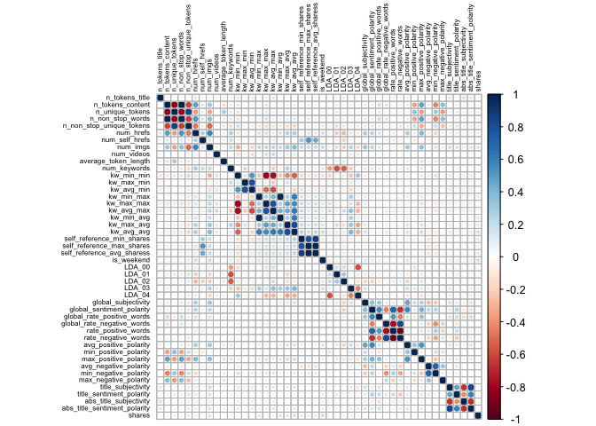

Project 3
================
Shaoyu Wang, Aniket Walimbe
2022-11-16

# Analysis for lifestyle Data Channel

## Introduction

This [online news popularity data
set](https://archive.ics.uci.edu/ml/datasets/Online+News+Popularity)
summarizes a heterogeneous set of features about articles published by
Mashable in a period of two years. There are 61 attributes, including 58
predictive attributes, 2 non-predictive, 1 goal field. The number of
shares is our target variable, and we select predictive variables from
the remaining variables based on the exploratory data analysis. The
purpose of our analysis is to predict the the number of shares. During
this project, we read and subset the data set at first, and split data
into training set and test set, then we create some basic summary
statistics and plots about the training data, at last we fit linear
regression models and ensemble tree-based models and test the
predictions.

**Variable information**

The target variable is the following:  
- `shares`: Number of shares

The predictive variables are the following:  
- `publish_weekday`: The article published day  
- `n_tokens_title`: Number of words in the title  
- `n_tokens_content`: Number of words in the content  
- `num_self_hrefs`: Number of links to other articles published by
Mashable  
- `num_imgs`: Number of images  
- `num_videos`: Number of videos  
- `average_token_length`: Average length of the words in the content  
- `num_keywords`: Number of keywords in the metadata  
- `kw_avg_avg`: Avg. keyword (avg. shares)  
- `self_reference_avg_sharess`: Avg. shares of referenced articles in
Mashable  
- `LDA_04`: Closeness to LDA topic 4  
- `global_subjectivity`: Text subjectivity  
- `global_sentiment_polarity`: Text sentiment polarity  
- `avg_positive_polarity`: Avg. polarity of positive words  
- `avg_negative_polarity`: Avg. polarity of negative words

**Required packages**

We need to load the required packages:

``` r
# Load libraries
library(readr)
library(tidyverse)
library(caret)
library(leaps)
library(ggplot2)
library(corrplot)
library(randomForest)
library(rmarkdown)
```

## Data

Read in the data and subset the data to work on the data channel of
interest. We find that there are seven similar columns for weekdays from
Monday to Sunday, so we merge these columns and name the new variable as
`publish_weekday` and convert it to factor. For this step, we also
remove the non-predictive variables.

``` r
#Read in the data file
newsData <- read_csv("OnlineNewsPopularity.csv")
#Select the data channel of interest
selectChannel <- paste0("data_channel_is_", params[[1]])
news <- newsData %>% 
  filter(get(selectChannel) == 1) %>% 
  select(url, starts_with("weekday_is_")) %>% 
  pivot_longer(-url) %>% 
  filter(value != 0) %>% 
  mutate(publish_weekday = substr(name, 12, 20)) %>% 
  left_join(newsData, by = "url") %>% 
#Remove non predictive variables
  select(-c(url, name, value, timedelta, starts_with("data_channel_is_"), starts_with("weekday_is_")))
#convert publish_weekday to factor
news$publish_weekday <- as.factor(news$publish_weekday)
news
```

    ## # A tibble: 2,099 × 47
    ##    publish_…¹ n_tok…² n_tok…³ n_uni…⁴ n_non…⁵ n_non…⁶ num_h…⁷ num_s…⁸ num_i…⁹
    ##    <fct>        <dbl>   <dbl>   <dbl>   <dbl>   <dbl>   <dbl>   <dbl>   <dbl>
    ##  1 monday           8     960   0.418    1.00   0.550      21      20      20
    ##  2 monday          10     187   0.667    1.00   0.800       7       0       1
    ##  3 monday          11     103   0.689    1.00   0.806       3       1       1
    ##  4 monday          10     243   0.619    1.00   0.824       1       1       0
    ##  5 monday           8     204   0.586    1.00   0.698       7       2       1
    ##  6 monday          11     315   0.551    1.00   0.702       4       4       1
    ##  7 monday          10    1190   0.409    1.00   0.561      25      24      20
    ##  8 monday           6     374   0.641    1.00   0.828       7       0       1
    ##  9 tuesday         12     499   0.513    1.00   0.662      14       1       1
    ## 10 wednesday       11     223   0.662    1.00   0.826       5       3       0
    ## # … with 2,089 more rows, 38 more variables: num_videos <dbl>,
    ## #   average_token_length <dbl>, num_keywords <dbl>, kw_min_min <dbl>,
    ## #   kw_max_min <dbl>, kw_avg_min <dbl>, kw_min_max <dbl>, kw_max_max <dbl>,
    ## #   kw_avg_max <dbl>, kw_min_avg <dbl>, kw_max_avg <dbl>, kw_avg_avg <dbl>,
    ## #   self_reference_min_shares <dbl>, self_reference_max_shares <dbl>,
    ## #   self_reference_avg_sharess <dbl>, is_weekend <dbl>, LDA_00 <dbl>,
    ## #   LDA_01 <dbl>, LDA_02 <dbl>, LDA_03 <dbl>, LDA_04 <dbl>, …

Split the data into a training set and a test set.

``` r
set.seed(111)
trainIndex <- createDataPartition(news$shares, p = 0.7, list = FALSE)
newsTrain <- news[trainIndex,]
newsTest <- news[-trainIndex,]
#newsTrain
```

## Summarizations

For this part, we produce some basic summary statistics and plots about
the training data.

**Tables**

Firstly, here is a quick summary of all variables as shown below, so
that we can know the variables roughly.

``` r
summary(newsTrain)
```

    ##   publish_weekday n_tokens_title   n_tokens_content n_unique_tokens 
    ##  friday   :208    Min.   : 3.000   Min.   :   0.0   Min.   :0.0000  
    ##  monday   :221    1st Qu.: 8.000   1st Qu.: 305.0   1st Qu.:0.4636  
    ##  saturday :133    Median :10.000   Median : 497.5   Median :0.5208  
    ##  sunday   :135    Mean   : 9.764   Mean   : 607.3   Mean   :0.5241  
    ##  thursday :254    3rd Qu.:11.000   3rd Qu.: 793.0   3rd Qu.:0.5899  
    ##  tuesday  :240    Max.   :17.000   Max.   :7413.0   Max.   :0.8248  
    ##  wednesday:281                                                      
    ##  n_non_stop_words n_non_stop_unique_tokens   num_hrefs      num_self_hrefs  
    ##  Min.   :0.0000   Min.   :0.0000           Min.   :  0.00   Min.   : 0.000  
    ##  1st Qu.:1.0000   1st Qu.:0.6292           1st Qu.:  6.00   1st Qu.: 1.000  
    ##  Median :1.0000   Median :0.6840           Median : 10.00   Median : 2.000  
    ##  Mean   :0.9891   Mean   :0.6837           Mean   : 13.21   Mean   : 2.518  
    ##  3rd Qu.:1.0000   3rd Qu.:0.7521           3rd Qu.: 18.00   3rd Qu.: 3.000  
    ##  Max.   :1.0000   Max.   :1.0000           Max.   :118.00   Max.   :27.000  
    ##                                                                             
    ##     num_imgs         num_videos      average_token_length  num_keywords   
    ##  Min.   :  0.000   Min.   : 0.0000   Min.   :0.000        Min.   : 3.000  
    ##  1st Qu.:  1.000   1st Qu.: 0.0000   1st Qu.:4.457        1st Qu.: 7.000  
    ##  Median :  1.000   Median : 0.0000   Median :4.621        Median : 9.000  
    ##  Mean   :  4.888   Mean   : 0.4572   Mean   :4.586        Mean   : 8.233  
    ##  3rd Qu.:  8.000   3rd Qu.: 0.0000   3rd Qu.:4.793        3rd Qu.:10.000  
    ##  Max.   :111.000   Max.   :50.0000   Max.   :5.749        Max.   :10.000  
    ##                                                                           
    ##    kw_min_min       kw_max_min      kw_avg_min        kw_min_max    
    ##  Min.   : -1.00   Min.   :    0   Min.   :   -1.0   Min.   :     0  
    ##  1st Qu.: -1.00   1st Qu.:  488   1st Qu.:  184.2   1st Qu.:     0  
    ##  Median :  4.00   Median :  813   Median :  301.1   Median :     0  
    ##  Mean   : 41.45   Mean   : 1664   Mean   :  418.1   Mean   :  7217  
    ##  3rd Qu.:  4.00   3rd Qu.: 1300   3rd Qu.:  439.1   3rd Qu.:  6200  
    ##  Max.   :377.00   Max.   :98700   Max.   :14187.8   Max.   :208300  
    ##                                                                     
    ##    kw_max_max       kw_avg_max       kw_min_avg     kw_max_avg   
    ##  Min.   :     0   Min.   :     0   Min.   :   0   Min.   :    0  
    ##  1st Qu.:690400   1st Qu.:118659   1st Qu.:   0   1st Qu.: 4042  
    ##  Median :843300   Median :181881   Median :   0   Median : 5036  
    ##  Mean   :702035   Mean   :183400   Mean   :1054   Mean   : 6625  
    ##  3rd Qu.:843300   3rd Qu.:248982   3rd Qu.:2274   3rd Qu.: 7166  
    ##  Max.   :843300   Max.   :491771   Max.   :3610   Max.   :98700  
    ##                                                                  
    ##    kw_avg_avg    self_reference_min_shares self_reference_max_shares
    ##  Min.   :    0   Min.   :     0            Min.   :     0.0         
    ##  1st Qu.: 2642   1st Qu.:   624            1st Qu.:   965.2         
    ##  Median : 3221   Median :  1700            Median :  2850.0         
    ##  Mean   : 3404   Mean   :  4741            Mean   :  8053.0         
    ##  3rd Qu.: 3926   3rd Qu.:  3800            3rd Qu.:  7225.0         
    ##  Max.   :20378   Max.   :144900            Max.   :690400.0         
    ##                                                                     
    ##  self_reference_avg_sharess   is_weekend         LDA_00       
    ##  Min.   :     0.0           Min.   :0.0000   Min.   :0.01818  
    ##  1st Qu.:   942.5           1st Qu.:0.0000   1st Qu.:0.02251  
    ##  Median :  2500.0           Median :0.0000   Median :0.02914  
    ##  Mean   :  6168.2           Mean   :0.1821   Mean   :0.17903  
    ##  3rd Qu.:  5625.0           3rd Qu.:0.0000   3rd Qu.:0.25518  
    ##  Max.   :401450.0           Max.   :1.0000   Max.   :0.91980  
    ##                                                               
    ##      LDA_01            LDA_02            LDA_03            LDA_04       
    ##  Min.   :0.01819   Min.   :0.01819   Min.   :0.01820   Min.   :0.02014  
    ##  1st Qu.:0.02222   1st Qu.:0.02223   1st Qu.:0.02249   1st Qu.:0.31664  
    ##  Median :0.02507   Median :0.02792   Median :0.03043   Median :0.57032  
    ##  Mean   :0.06506   Mean   :0.08074   Mean   :0.14444   Mean   :0.53073  
    ##  3rd Qu.:0.04001   3rd Qu.:0.11889   3rd Qu.:0.21061   3rd Qu.:0.79919  
    ##  Max.   :0.62253   Max.   :0.67623   Max.   :0.91837   Max.   :0.91995  
    ##                                                                         
    ##  global_subjectivity global_sentiment_polarity global_rate_positive_words
    ##  Min.   :0.0000      Min.   :-0.37271          Min.   :0.00000           
    ##  1st Qu.:0.4263      1st Qu.: 0.09868          1st Qu.:0.03464           
    ##  Median :0.4762      Median : 0.14874          Median :0.04348           
    ##  Mean   :0.4736      Mean   : 0.15064          Mean   :0.04419           
    ##  3rd Qu.:0.5248      3rd Qu.: 0.20520          3rd Qu.:0.05296           
    ##  Max.   :0.8667      Max.   : 0.51389          Max.   :0.12139           
    ##                                                                          
    ##  global_rate_negative_words rate_positive_words rate_negative_words
    ##  Min.   :0.00000            Min.   :0.0000      Min.   :0.0000     
    ##  1st Qu.:0.01050            1st Qu.:0.6632      1st Qu.:0.1852     
    ##  Median :0.01532            Median :0.7377      Median :0.2586     
    ##  Mean   :0.01626            Mean   :0.7214      Mean   :0.2677     
    ##  3rd Qu.:0.02085            3rd Qu.:0.8112      3rd Qu.:0.3333     
    ##  Max.   :0.06180            Max.   :1.0000      Max.   :1.0000     
    ##                                                                    
    ##  avg_positive_polarity min_positive_polarity max_positive_polarity
    ##  Min.   :0.0000        Min.   :0.00000       Min.   :0.00         
    ##  1st Qu.:0.3359        1st Qu.:0.05000       1st Qu.:0.70         
    ##  Median :0.3832        Median :0.10000       Median :0.90         
    ##  Mean   :0.3828        Mean   :0.09355       Mean   :0.83         
    ##  3rd Qu.:0.4343        3rd Qu.:0.10000       3rd Qu.:1.00         
    ##  Max.   :0.7553        Max.   :0.50000       Max.   :1.00         
    ##                                                                   
    ##  avg_negative_polarity min_negative_polarity max_negative_polarity
    ##  Min.   :-1.0000       Min.   :-1.0000       Min.   :-1.000       
    ##  1st Qu.:-0.3232       1st Qu.:-0.7143       1st Qu.:-0.125       
    ##  Median :-0.2612       Median :-0.5000       Median :-0.100       
    ##  Mean   :-0.2671       Mean   :-0.5566       Mean   :-0.105       
    ##  3rd Qu.:-0.2033       3rd Qu.:-0.4000       3rd Qu.:-0.050       
    ##  Max.   : 0.0000       Max.   : 0.0000       Max.   : 0.000       
    ##                                                                   
    ##  title_subjectivity title_sentiment_polarity abs_title_subjectivity
    ##  Min.   :0.0000     Min.   :-1.0000          Min.   :0.0000        
    ##  1st Qu.:0.0000     1st Qu.: 0.0000          1st Qu.:0.2000        
    ##  Median :0.1000     Median : 0.0000          Median :0.5000        
    ##  Mean   :0.2827     Mean   : 0.1052          Mean   :0.3531        
    ##  3rd Qu.:0.5000     3rd Qu.: 0.2000          3rd Qu.:0.5000        
    ##  Max.   :1.0000     Max.   : 1.0000          Max.   :0.5000        
    ##                                                                    
    ##  abs_title_sentiment_polarity     shares      
    ##  Min.   :0.0000               Min.   :    28  
    ##  1st Qu.:0.0000               1st Qu.:  1100  
    ##  Median :0.0000               Median :  1700  
    ##  Mean   :0.1688               Mean   :  3847  
    ##  3rd Qu.:0.2927               3rd Qu.:  3225  
    ##  Max.   :1.0000               Max.   :208300  
    ## 

Then we can check our response variable `shares`. The below table shows
that the mean, standard deviation, median, IQR of `shares`.

``` r
#numerical summary for the variable shares
newsTrain %>% 
  summarise(mean = round(mean(shares), 0), sd = round(sd(shares), 0), 
            median = round(median(shares), 0), IQR = round(IQR(shares), 0))
```

    ## # A tibble: 1 × 4
    ##    mean    sd median   IQR
    ##   <dbl> <dbl>  <dbl> <dbl>
    ## 1  3847 10112   1700  2125

We also obtain the numerical summaries on some subgroups. We choose four
example subgroups: number of images, number of videos, and number of
keywords, since people may concern more on these when they do searching
and sharing.

``` r
#numerical summaries on subgroups
newsTrain %>% 
  group_by(num_imgs) %>% 
  summarise(mean = round(mean(shares), 0), sd = round(sd(shares), 0), 
            median = round(median(shares), 0), IQR = round(IQR(shares), 0))
```

    ## # A tibble: 40 × 5
    ##    num_imgs  mean    sd median   IQR
    ##       <dbl> <dbl> <dbl>  <dbl> <dbl>
    ##  1        0  3334  5212   1600  2100
    ##  2        1  3634 11015   1500  1802
    ##  3        2  3834  9951   1500  1500
    ##  4        3  3306  3317   1850  3406
    ##  5        4  2992  5033   1500  1800
    ##  6        5  5740 10228   2000  2700
    ##  7        6  3409  5423   1650  1775
    ##  8        7  3094  2800   2100  2200
    ##  9        8  2975  3825   1600  1400
    ## 10        9  3565  4174   2100  1950
    ## # … with 30 more rows

``` r
newsTrain %>% 
  group_by(num_videos) %>% 
  summarise(mean = round(mean(shares), 0), sd = round(sd(shares), 0), 
            median = round(median(shares), 0), IQR = round(IQR(shares), 0))
```

    ## # A tibble: 16 × 5
    ##    num_videos   mean    sd median   IQR
    ##         <dbl>  <dbl> <dbl>  <dbl> <dbl>
    ##  1          0   3712  9474   1700  2000
    ##  2          1   3574  5398   1700  2200
    ##  3          2   3056  3332   1750  2425
    ##  4          3   4251  7577   1500  3274
    ##  5          4   5265  7251   2100  3985
    ##  6          5   8280 13514   1700  3500
    ##  7          6  18000 15839  18000 11200
    ##  8          7  11677 10348  13000 10284
    ##  9          8   1050    71   1050    50
    ## 10          9   3950  4031   3950  2850
    ## 11         10   2261  1567   1650  1450
    ## 12         11   3100    NA   3100     0
    ## 13         12   4400  2828   4400  2000
    ## 14         15 196700    NA 196700     0
    ## 15         28    660    NA    660     0
    ## 16         50    932    NA    932     0

``` r
newsTrain %>% 
  group_by(num_keywords) %>% 
  summarise(mean = round(mean(shares), 0), sd = round(sd(shares), 0), 
            median = round(median(shares), 0), IQR = round(IQR(shares), 0))
```

    ## # A tibble: 8 × 5
    ##   num_keywords  mean    sd median   IQR
    ##          <dbl> <dbl> <dbl>  <dbl> <dbl>
    ## 1            3  4660  7406   1900  1650
    ## 2            4  3309  5487   1400  1300
    ## 3            5  3357  4104   1700  2900
    ## 4            6  3124  5146   1400  1760
    ## 5            7  3182  5986   1700  1600
    ## 6            8  4656 14512   1800  2500
    ## 7            9  3857  5590   1900  2900
    ## 8           10  4026 12375   1600  2100

Moreover, we divide the title subjectivity into 3 categories:  
1. High: greater than 0.8  
2. Medium: 0.4 to less than 0.8  
3. Low: less than 0.4  
The contingency table is then shown below.

``` r
newsTrain$subject_activity_type <- ifelse(newsTrain$title_subjectivity >= 0.8, "High", 
                                          ifelse(newsTrain$title_subjectivity >= 0.4, "Medium",
                                                 ifelse(airquality$Wind >= 0, "Low")))
table(newsTrain$subject_activity_type)
```

    ## 
    ##   High    Low Medium 
    ##    161    930    381

**Plots**

At the beginning, let’s plot the correlation between the numeric
variables.

``` r
newsTrainsub <- newsTrain %>% select(-c(publish_weekday, subject_activity_type))
correlation <- cor(newsTrainsub, method = "spearman")
corrplot(correlation, tl.col = "black", tl.cex = 0.5)
```

<!-- -->

From the correlation graph above, we can see that the following
variables seem to be moderately correlated:  
- `n_tokens_contents`, `n_unique_tokens`, `n_non_stop_words`,
`n_non_stop_unique_tokens`, `num_hrefs`, `num_imgs`  
- `kw_min_min`, `kw_max_min`, `kw_avg_min`, `kw_min_max`, `kw_max_max`,
`kw_avg_max`, `kw_min_avg`, `kw_max_avg`, `kw_avg_avg`  
- `self_reference_min_shares`, `self_reference_max_shares`,
`self_reference_avg_sharess`  
- `LDA_00`, `LDA_01`, `LDA_02`, `LDA_03`  
- `global_sentiment_polarity`, `global_rate_positive_words`,
`global_rate_negative_words`, `rate_positive_words`,
`rate_negative_words`  
- `avg_positive_polarity`, `min_positive_polarity`,
`max_positive_polarity`  
- `avg_negative_polarity`, `min_negative_polarity`,
`max_negative_polarity`  
- `title_subjectivity`, `title_sentiment_polarity`,
`abs_title_subjectivity`, `abs_title_sentiment_polarity`

For further EDA, we are going to plot graphs to see trends between
different variables with respect to the number of shares.

A plot between number of shares and article published day: This plot
shows the number of shares an article has based on the day that has been
published.

``` r
newsTrainday <- newsTrain %>%
  select(publish_weekday, shares) %>%
  group_by(publish_weekday) %>% 
  summarise(total_shares=sum(shares))

g <- ggplot(data = newsTrainday, aes(x=publish_weekday, y=total_shares))
g + geom_col(fill = "lightblue", color = "black") +
  labs(title = " Shares for articles published based on weekdays")
```

<!-- -->

Let’s select some variables as example to plot scatter plots.

A scatter plot with the number of shares on the y-axis and the number of
words in the title on the x-axis is created:

``` r
g <- ggplot(data = newsTrain, aes(x = n_tokens_title, y = shares))
g + geom_point() +
  labs(x = "Number of words in the title", y = "Number of shares", 
       title = "Scatter Plot: Number of words in the title VS Number of shares")
```

<!-- -->

We can inspect the trend of shares as a function of the number of words
in the title. Therefore, we can see that the number of words in title
has an effect on the number of shares.

A scatter plot with the number of shares on the y-axis and the number of
words in the content on the x-axis is created:

``` r
g <- ggplot(data = newsTrain, aes(x = n_tokens_content, y = shares))
g + geom_point() +
  labs(x = "Number of words in the content", y = "Number of shares", 
       title = "Scatter Plot: Number of words in the content VS Number of shares") 
```

<!-- -->

From the plot above, we can easily see that the number of shares is
decreasing while the the number of words in the content is increasing.
So it can be illustrated that the number of words in the content will
affect the number of shares.

A scatter plot with the number of shares on the y-axis and the number of
links to other articles published by Mashable on the x-axis is created:

``` r
g <- ggplot(data = newsTrain, aes(x = num_self_hrefs, y = shares))
g + geom_point() +
  labs(x = "Number of links to other articles published by Mashable", y = "Number of shares", 
       title = "Scatter Plot: Number of links to other articles published by Mashable VS Number of shares")
```

<!-- -->

The plot above shows that as the number of links to other articles
increasing, the number of shares is decreasing. So the the number of
links to other articles has an infulence on the number of shares.

A scatter plot with the number of shares on the y-axis and the number of
images on the x-axis is created:

``` r
g <- ggplot(data = newsTrain, aes(x = num_imgs, y = shares))
g + geom_point() +
  labs(x = "Number of images", y = "Number of shares", 
       title = "Scatter Plot: Number of images VS Number of shares")
```

<!-- -->

The plot above shows that the number of shares decreases as the number
of images increasing. Therefore, the number of images will affect the
number of shares as well.

A scatter plot with the number of shares on the y-axis and the number of
videos on the x-axis is created:

``` r
g <- ggplot(data = newsTrain, aes(x = num_videos, y = shares))
g + geom_point() +
  labs(x = "Number of videos", y = "Number of shares", 
       title = "Scatter Plot: Number of videos VS Number of shares") 
```

<!-- -->

A scatter plot with the number of shares on the y-axis and the average
length of words in content on the x-axis is created:

``` r
g <- ggplot(newsTrain, aes(x = average_token_length, y = shares))
g + geom_point() + 
  labs(x = "Average token length", y = "Number of shares", 
       title = "Scatter Plot: Average token length VS Number of shares")
```

<!-- -->

Through the plot above, we can see that the most of shares are between 4
and 6 words. The average token length will also affect the number of
shares.

A scatter plot with the number of shares on the y-axis and the number of
keywords in the metadata on the x-axis is created:

``` r
g <- ggplot(newsTrain, aes(x = num_keywords, y = shares))
g + geom_point() + 
  labs(x = "Number of keywords in the metadata", y = "Number of shares", 
       title = "Scatter Plot: Number of keywords in the metadata VS Number of shares")
```

<!-- -->

According to the plot above, we can find that as the number of keywords
increasing, the number of shares is increasing. So the number of
keywords in the metadata will influence the number of shares.

A scatter plot with the number of shares on the y-axis and the text
subjectivity on the x-axis is created:

``` r
g <- ggplot(data = newsTrain, aes(x = global_subjectivity, y = shares))
g + geom_point() + 
  labs(x = "Text subjectivity", y = "Number of shares", 
       title = "Scatter Plot: Text subjectivity VS Number of shares")
```

<!-- -->

From the plot above, it presents that the most of shares are between
0.25 and 0.75 text subjectivity. So the text subjectivity will influence
the number of shares as well.

A scatter plot with the number of shares on the y-axis and the title
subjectivity on the x-axis is created:

``` r
g <- ggplot(data = newsTrain, aes(x = title_subjectivity, y = shares))
g + geom_point() + 
  labs(x = "Title subjectivity", y = "Number of shares", 
       title = "Scatter Plot: Title subjectivity VS Number of shares")
```

<!-- -->

The plot above shows that the title subjectivity has less effect on the
number of shares.

**Select variables**

Through the analysis above, we will select predictors as follows:  
- `publish_weekday`: The article published day  
- `n_tokens_title`: Number of words in the title  
- `n_tokens_content`: Number of words in the content  
- `num_self_hrefs`: Number of links to other articles published by
Mashable  
- `num_imgs`: Number of images  
- `num_videos`: Number of videos  
- `average_token_length`: Average length of the words in the content  
- `num_keywords`: Number of keywords in the metadata  
- `kw_avg_avg`: Avg. keyword (avg. shares)  
- `self_reference_avg_sharess`: Avg. shares of referenced articles in
Mashable  
- `LDA_04`: Closeness to LDA topic 4  
- `global_subjectivity`: Text subjectivity  
- `global_sentiment_polarity`: Text sentiment polarity  
- `avg_positive_polarity`: Avg. polarity of positive words  
- `avg_negative_polarity`: Avg. polarity of negative words

The target variable is `shares`.

Let’s do selection for training set and test set.

``` r
#select variables for training set and test set
set.seed(111)
Train <- newsTrain %>% 
  select(publish_weekday, n_tokens_title, n_tokens_content, num_self_hrefs, num_imgs, num_videos, average_token_length, num_keywords, kw_avg_avg, self_reference_avg_sharess, LDA_04, global_subjectivity, global_sentiment_polarity, avg_positive_polarity, avg_negative_polarity, shares)
Test <- newsTest %>% 
  select(publish_weekday, n_tokens_title, n_tokens_content, num_self_hrefs, num_imgs, num_videos, average_token_length, num_keywords, kw_avg_avg, self_reference_avg_sharess, LDA_04, global_subjectivity, global_sentiment_polarity, avg_positive_polarity, avg_negative_polarity, shares)
```

## Model

**Linear Regression Model**

First, we fit a forward stepwise linear regression model for the
training dataset. The data is centered and scaled and number of shares
is the response variable.

``` r
#forward stepwise
set.seed(111)
fwFit <- train(shares ~ ., data = Train,
               method = "leapForward",
               preProcess = c("center", "scale"),
               trControl = trainControl(method = "cv", number = 5))
#summary(fwFit)
fwFit
```

    ## Linear Regression with Forward Selection 
    ## 
    ## 1472 samples
    ##   15 predictor
    ## 
    ## Pre-processing: centered (20), scaled (20) 
    ## Resampling: Cross-Validated (5 fold) 
    ## Summary of sample sizes: 1176, 1178, 1178, 1178, 1178 
    ## Resampling results across tuning parameters:
    ## 
    ##   nvmax  RMSE      Rsquared     MAE     
    ##   2      8936.405  0.007010645  3566.950
    ##   3      8922.556  0.009613257  3553.279
    ##   4      8937.825  0.008357905  3559.836
    ## 
    ## RMSE was used to select the optimal model using the smallest value.
    ## The final value used for the model was nvmax = 3.

We also fit a backward stepwise linear regression model for the training
dataset. The data is centered and scaled and number of shares is the
response variable.

``` r
#backward stepwise
set.seed(111)
bwFit <- train(shares ~ ., data = Train,
               method = "leapBackward",
               preProcess = c("center", "scale"),
               trControl = trainControl(method = "cv", number = 5))
#summary(bwFit)
bwFit
```

    ## Linear Regression with Backwards Selection 
    ## 
    ## 1472 samples
    ##   15 predictor
    ## 
    ## Pre-processing: centered (20), scaled (20) 
    ## Resampling: Cross-Validated (5 fold) 
    ## Summary of sample sizes: 1176, 1178, 1178, 1178, 1178 
    ## Resampling results across tuning parameters:
    ## 
    ##   nvmax  RMSE      Rsquared     MAE     
    ##   2      8942.405  0.003838792  3578.035
    ##   3      8922.556  0.009613257  3553.279
    ##   4      8948.032  0.006784268  3565.545
    ## 
    ## RMSE was used to select the optimal model using the smallest value.
    ## The final value used for the model was nvmax = 3.

Then we fit a linear regression model with all predictors.

``` r
#with all predictors
set.seed(111)
lrFit <- train(shares ~ ., data = Train,
               method = "lm",
               trControl = trainControl(method = "cv", number = 5))
lrFit
```

    ## Linear Regression 
    ## 
    ## 1472 samples
    ##   15 predictor
    ## 
    ## No pre-processing
    ## Resampling: Cross-Validated (5 fold) 
    ## Summary of sample sizes: 1176, 1178, 1178, 1178, 1178 
    ## Resampling results:
    ## 
    ##   RMSE      Rsquared     MAE    
    ##   8988.258  0.005722325  3646.68
    ## 
    ## Tuning parameter 'intercept' was held constant at a value of TRUE

**Random Forest Model**

Next, we fit a random forest model which is an example of an ensemble
based-tree model. Instead of traditional decision trees, a random forest
tree will take a random subset of the predictors for each tree fit and
calculate the average of results.

``` r
set.seed(111)
randomFit <- train(shares ~ ., 
                   data = Train, 
                   method = "rf",
                   preProcess = c("center","scale"),
                   trControl = trainControl(method = "cv", number = 5),
                   tuneGrid = data.frame(mtry = ncol(Train)/3))
randomFit
```

    ## Random Forest 
    ## 
    ## 1472 samples
    ##   15 predictor
    ## 
    ## Pre-processing: centered (20), scaled (20) 
    ## Resampling: Cross-Validated (5 fold) 
    ## Summary of sample sizes: 1176, 1178, 1178, 1178, 1178 
    ## Resampling results:
    ## 
    ##   RMSE      Rsquared    MAE   
    ##   9115.357  0.01349964  3780.3
    ## 
    ## Tuning parameter 'mtry' was held constant at a value of 5.333333

**Boosted Tree Model**

Moreover, we fit a boosted tree model which is another ensemble
based-tree model. Boosted tree models are combination of two techniques:
decision tree algorithms and boosting methods. It repeatedly fits many
decision trees to improve the accuracy of the model.

``` r
set.seed(111)
boostedFit <- train(shares ~ ., 
                    data = Train, 
                    method = "gbm", 
                    preProcess = c("center", "scale"),
                    trControl = trainControl(method = "cv", number = 5),
                    tuneGrid = expand.grid(n.trees = c(25,50,100,150,200), 
                                           interaction.depth = c(1,2,3,4), 
                                           shrinkage = 0.1, 
                                           n.minobsinnode = 10),
                    verbose = FALSE)
boostedFit
```

    ## Stochastic Gradient Boosting 
    ## 
    ## 1472 samples
    ##   15 predictor
    ## 
    ## Pre-processing: centered (20), scaled (20) 
    ## Resampling: Cross-Validated (5 fold) 
    ## Summary of sample sizes: 1176, 1178, 1178, 1178, 1178 
    ## Resampling results across tuning parameters:
    ## 
    ##   interaction.depth  n.trees  RMSE      Rsquared     MAE     
    ##   1                   25      8995.960  0.003774617  3585.314
    ##   1                   50      9034.606  0.005083773  3593.280
    ##   1                  100      9073.458  0.005429124  3599.658
    ##   1                  150      9155.535  0.005817416  3641.084
    ##   1                  200      9175.506  0.004024536  3665.518
    ##   2                   25      9077.295  0.004924311  3620.646
    ##   2                   50      9174.961  0.006614410  3671.884
    ##   2                  100      9273.046  0.006044017  3778.624
    ##   2                  150      9319.711  0.006403743  3798.421
    ##   2                  200      9386.835  0.009301048  3856.783
    ##   3                   25      9096.839  0.007953789  3647.894
    ##   3                   50      9213.110  0.008197227  3708.845
    ##   3                  100      9366.736  0.010336261  3843.707
    ##   3                  150      9368.423  0.012143219  3889.817
    ##   3                  200      9396.693  0.012818471  3924.872
    ##   4                   25      9089.313  0.010528036  3618.082
    ##   4                   50      9120.178  0.016334623  3660.944
    ##   4                  100      9251.464  0.018178769  3779.965
    ##   4                  150      9299.776  0.019009071  3817.132
    ##   4                  200      9389.695  0.020166334  3881.671
    ## 
    ## Tuning parameter 'shrinkage' was held constant at a value of 0.1
    ## 
    ## Tuning parameter 'n.minobsinnode' was held constant at a value of 10
    ## RMSE was used to select the optimal model using the smallest value.
    ## The final values used for the model were n.trees = 25, interaction.depth
    ##  = 1, shrinkage = 0.1 and n.minobsinnode = 10.

## Comparison

All the models are compared by RMSE on the test set.

``` r
#fit a linear regression model
fw_mod <- postResample(predict(fwFit, newdata = Test), obs = Test$shares)
bw_mod <- postResample(predict(bwFit, newdata = Test), obs = Test$shares)
lr_mod <- postResample(predict(lrFit, newdata = Test), obs = Test$shares)
#random forest
random_mod <- postResample(predict(randomFit, newdata = Test), obs = Test$shares)
#boosted tree
boosted_mod <- postResample(predict(boostedFit, newdata = Test), obs = Test$shares)
#compare all models
result_table <- tibble(model = c("Forward",
                                 "Backward",
                                 "LR with all predictors",
                                 "Random Forest",
                                 "Boosted Tree"), 
                       RMSE = c(fw_mod[1],
                                bw_mod[1],
                                lr_mod[1],
                                random_mod[1],
                                boosted_mod[1]))
result_table
```

    ## # A tibble: 5 × 2
    ##   model                   RMSE
    ##   <chr>                  <dbl>
    ## 1 Forward                5069.
    ## 2 Backward               5069.
    ## 3 LR with all predictors 5123.
    ## 4 Random Forest          5482.
    ## 5 Boosted Tree           5317.

``` r
min_value <- min(result_table$RMSE)
best_model <- result_table[result_table$RMSE == min_value, "model"]

print(paste0("The best model based on the lowest RMSE value is ",as.character(best_model[1,1])," with an RMSE value of ",as.character(round(min_value,2))))
```

    ## [1] "The best model based on the lowest RMSE value is Forward with an RMSE value of 5068.91"

## Automation

For this automation part, we want to produce the similar reports for
each news channels. We firstly create a set of parameters, which match
with 6 channels. Then read the parameter and subset the data with the
specified channel. After everything is ready, run the below chunk of
code in the console, we will automatically get the reports for each news
channel.

``` r
#create channel names
channelID <- data.frame("lifestyle", "entertainment", "bus", "socmed", "tech", "world")
#create filenames
output_file <- paste0(channelID,".md")
#create a list for each channel with the channel name parameter
params = lapply(channelID, FUN = function(x){list(channelID = x)})
#put into a data frame
reports <- tibble(output_file, params)
#render code
apply(reports, MARGIN = 1,
      FUN = function(x){
        rmarkdown::render(input = "project3.Rmd",
                          output_format = "github_document",
                          output_file = x[[1]],
                          params = x[[2]])
        })
```
