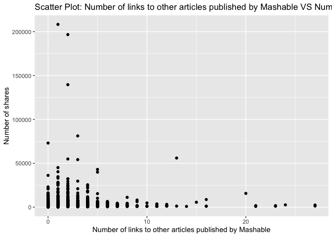
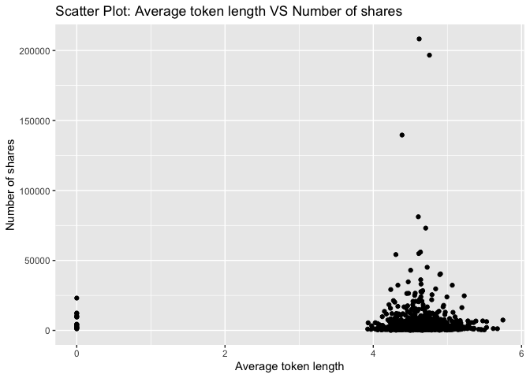
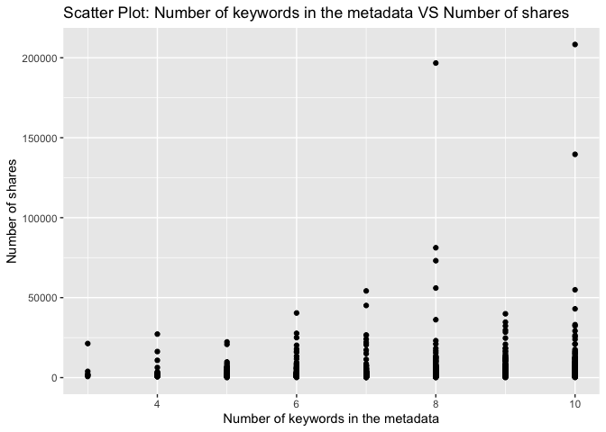
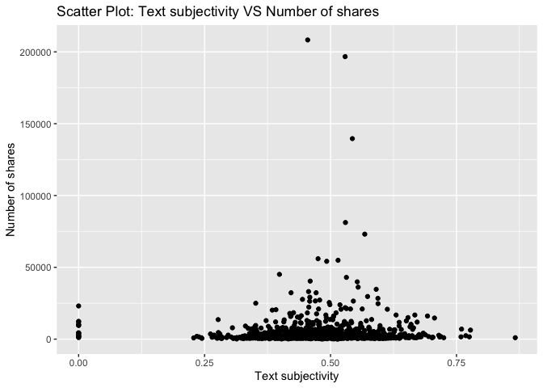

Project 3
================
Shaoyu Wang, Aniket Walimbe
2022-11-14

# Introduction

This [online news popularity data
set](https://archive.ics.uci.edu/ml/datasets/Online+News+Popularity)
summarizes a heterogeneous set of features about articles published by
Mashable in a period of two years.

# Required Packages

First, we will load the required packages:

``` r
# Load libraries
library(readr)
library(tidyverse)
library(dplyr)
library(caret)
library(leaps)
library(ggplot2)
library(corrplot)
library(GGally)
library(randomForest)
```

# Data

Read in the data and subset the data to work on the data channel of
interest. We found that there are seven similar columns for weekday from
Monday to Sunday, so we merged these columns and named the new variable
as `publish_weekday`. For this step, we also removed the non-predictive
variables.

``` r
#Read in the data file
newsData <- read_csv("OnlineNewsPopularity.csv",show_col_types = FALSE)
#Choose the data channel of interest
if (params$channel != "") {
  paramChannelName <- params$channel
} else {
  paramChannelName <- "lifestyle"
}
channel <- paste("data_channel_is_", paramChannelName, sep = "")
#Merge the weekday columns as one single column.
news <- newsData %>% 
  filter(.data[[channel]] == 1) %>% 
  select(url, starts_with("weekday_is_")) %>% 
  pivot_longer(-url) %>% 
  filter(value != 0) %>% 
  mutate(publish_weekday = substr(name, 12, 20)) %>% 
  left_join(newsData, by = "url") %>% 
#Remove non predictive variables
  select(-c(url, name, value, timedelta, starts_with("data_channel_is_"), starts_with("weekday_is_")))
news$publish_weekday <- as.factor(news$publish_weekday)
news
```

    ## # A tibble: 2,099 × 47
    ##    publish_wee…¹ n_tok…² n_tok…³ n_uni…⁴ n_non…⁵ n_non…⁶ num_h…⁷ num_s…⁸ num_i…⁹
    ##    <fct>           <dbl>   <dbl>   <dbl>   <dbl>   <dbl>   <dbl>   <dbl>   <dbl>
    ##  1 monday              8     960   0.418    1.00   0.550      21      20      20
    ##  2 monday             10     187   0.667    1.00   0.800       7       0       1
    ##  3 monday             11     103   0.689    1.00   0.806       3       1       1
    ##  4 monday             10     243   0.619    1.00   0.824       1       1       0
    ##  5 monday              8     204   0.586    1.00   0.698       7       2       1
    ##  6 monday             11     315   0.551    1.00   0.702       4       4       1
    ##  7 monday             10    1190   0.409    1.00   0.561      25      24      20
    ##  8 monday              6     374   0.641    1.00   0.828       7       0       1
    ##  9 tuesday            12     499   0.513    1.00   0.662      14       1       1
    ## 10 wednesday          11     223   0.662    1.00   0.826       5       3       0
    ## # … with 2,089 more rows, 38 more variables: num_videos <dbl>,
    ## #   average_token_length <dbl>, num_keywords <dbl>, kw_min_min <dbl>,
    ## #   kw_max_min <dbl>, kw_avg_min <dbl>, kw_min_max <dbl>, kw_max_max <dbl>,
    ## #   kw_avg_max <dbl>, kw_min_avg <dbl>, kw_max_avg <dbl>, kw_avg_avg <dbl>,
    ## #   self_reference_min_shares <dbl>, self_reference_max_shares <dbl>,
    ## #   self_reference_avg_sharess <dbl>, is_weekend <dbl>, LDA_00 <dbl>,
    ## #   LDA_01 <dbl>, LDA_02 <dbl>, LDA_03 <dbl>, LDA_04 <dbl>, …

Split the data into a training set and a test set.

``` r
set.seed(111)
trainIndex <- createDataPartition(news$shares, p = 0.7, list = FALSE)
newsTrain <- news[trainIndex,]
newsTest <- news[-trainIndex,]
#newsTrain
```

# Summarizations

For this part, we created some basic summary statistics and plots about
the training data.

## Tables

Firstly, let’s look at some tables. We summarized the training data, so
that we can know all of the variables roughly. For example, this table
shows each count for published on weekdays, we can see which has the
most count and which has the least count. It also shows the minimum, 1st
quantile, median, mean, 3rd quantile and maximum of other variables.

``` r
summary(newsTrain)
```

    ##   publish_weekday n_tokens_title   n_tokens_content n_unique_tokens 
    ##  friday   :208    Min.   : 3.000   Min.   :   0.0   Min.   :0.0000  
    ##  monday   :221    1st Qu.: 8.000   1st Qu.: 305.0   1st Qu.:0.4636  
    ##  saturday :133    Median :10.000   Median : 497.5   Median :0.5208  
    ##  sunday   :135    Mean   : 9.764   Mean   : 607.3   Mean   :0.5241  
    ##  thursday :254    3rd Qu.:11.000   3rd Qu.: 793.0   3rd Qu.:0.5899  
    ##  tuesday  :240    Max.   :17.000   Max.   :7413.0   Max.   :0.8248  
    ##  wednesday:281                                                      
    ##  n_non_stop_words n_non_stop_unique_tokens   num_hrefs      num_self_hrefs  
    ##  Min.   :0.0000   Min.   :0.0000           Min.   :  0.00   Min.   : 0.000  
    ##  1st Qu.:1.0000   1st Qu.:0.6292           1st Qu.:  6.00   1st Qu.: 1.000  
    ##  Median :1.0000   Median :0.6840           Median : 10.00   Median : 2.000  
    ##  Mean   :0.9891   Mean   :0.6837           Mean   : 13.21   Mean   : 2.518  
    ##  3rd Qu.:1.0000   3rd Qu.:0.7521           3rd Qu.: 18.00   3rd Qu.: 3.000  
    ##  Max.   :1.0000   Max.   :1.0000           Max.   :118.00   Max.   :27.000  
    ##                                                                             
    ##     num_imgs         num_videos      average_token_length  num_keywords   
    ##  Min.   :  0.000   Min.   : 0.0000   Min.   :0.000        Min.   : 3.000  
    ##  1st Qu.:  1.000   1st Qu.: 0.0000   1st Qu.:4.457        1st Qu.: 7.000  
    ##  Median :  1.000   Median : 0.0000   Median :4.621        Median : 9.000  
    ##  Mean   :  4.888   Mean   : 0.4572   Mean   :4.586        Mean   : 8.233  
    ##  3rd Qu.:  8.000   3rd Qu.: 0.0000   3rd Qu.:4.793        3rd Qu.:10.000  
    ##  Max.   :111.000   Max.   :50.0000   Max.   :5.749        Max.   :10.000  
    ##                                                                           
    ##    kw_min_min       kw_max_min      kw_avg_min        kw_min_max    
    ##  Min.   : -1.00   Min.   :    0   Min.   :   -1.0   Min.   :     0  
    ##  1st Qu.: -1.00   1st Qu.:  488   1st Qu.:  184.2   1st Qu.:     0  
    ##  Median :  4.00   Median :  813   Median :  301.1   Median :     0  
    ##  Mean   : 41.45   Mean   : 1664   Mean   :  418.1   Mean   :  7217  
    ##  3rd Qu.:  4.00   3rd Qu.: 1300   3rd Qu.:  439.1   3rd Qu.:  6200  
    ##  Max.   :377.00   Max.   :98700   Max.   :14187.8   Max.   :208300  
    ##                                                                     
    ##    kw_max_max       kw_avg_max       kw_min_avg     kw_max_avg   
    ##  Min.   :     0   Min.   :     0   Min.   :   0   Min.   :    0  
    ##  1st Qu.:690400   1st Qu.:118659   1st Qu.:   0   1st Qu.: 4042  
    ##  Median :843300   Median :181881   Median :   0   Median : 5036  
    ##  Mean   :702035   Mean   :183400   Mean   :1054   Mean   : 6625  
    ##  3rd Qu.:843300   3rd Qu.:248982   3rd Qu.:2274   3rd Qu.: 7166  
    ##  Max.   :843300   Max.   :491771   Max.   :3610   Max.   :98700  
    ##                                                                  
    ##    kw_avg_avg    self_reference_min_shares self_reference_max_shares
    ##  Min.   :    0   Min.   :     0            Min.   :     0.0         
    ##  1st Qu.: 2642   1st Qu.:   624            1st Qu.:   965.2         
    ##  Median : 3221   Median :  1700            Median :  2850.0         
    ##  Mean   : 3404   Mean   :  4741            Mean   :  8053.0         
    ##  3rd Qu.: 3926   3rd Qu.:  3800            3rd Qu.:  7225.0         
    ##  Max.   :20378   Max.   :144900            Max.   :690400.0         
    ##                                                                     
    ##  self_reference_avg_sharess   is_weekend         LDA_00       
    ##  Min.   :     0.0           Min.   :0.0000   Min.   :0.01818  
    ##  1st Qu.:   942.5           1st Qu.:0.0000   1st Qu.:0.02251  
    ##  Median :  2500.0           Median :0.0000   Median :0.02914  
    ##  Mean   :  6168.2           Mean   :0.1821   Mean   :0.17903  
    ##  3rd Qu.:  5625.0           3rd Qu.:0.0000   3rd Qu.:0.25518  
    ##  Max.   :401450.0           Max.   :1.0000   Max.   :0.91980  
    ##                                                               
    ##      LDA_01            LDA_02            LDA_03            LDA_04       
    ##  Min.   :0.01819   Min.   :0.01819   Min.   :0.01820   Min.   :0.02014  
    ##  1st Qu.:0.02222   1st Qu.:0.02223   1st Qu.:0.02249   1st Qu.:0.31664  
    ##  Median :0.02507   Median :0.02792   Median :0.03043   Median :0.57032  
    ##  Mean   :0.06506   Mean   :0.08074   Mean   :0.14444   Mean   :0.53073  
    ##  3rd Qu.:0.04001   3rd Qu.:0.11889   3rd Qu.:0.21061   3rd Qu.:0.79919  
    ##  Max.   :0.62253   Max.   :0.67623   Max.   :0.91837   Max.   :0.91995  
    ##                                                                         
    ##  global_subjectivity global_sentiment_polarity global_rate_positive_words
    ##  Min.   :0.0000      Min.   :-0.37271          Min.   :0.00000           
    ##  1st Qu.:0.4263      1st Qu.: 0.09868          1st Qu.:0.03464           
    ##  Median :0.4762      Median : 0.14874          Median :0.04348           
    ##  Mean   :0.4736      Mean   : 0.15064          Mean   :0.04419           
    ##  3rd Qu.:0.5248      3rd Qu.: 0.20520          3rd Qu.:0.05296           
    ##  Max.   :0.8667      Max.   : 0.51389          Max.   :0.12139           
    ##                                                                          
    ##  global_rate_negative_words rate_positive_words rate_negative_words
    ##  Min.   :0.00000            Min.   :0.0000      Min.   :0.0000     
    ##  1st Qu.:0.01050            1st Qu.:0.6632      1st Qu.:0.1852     
    ##  Median :0.01532            Median :0.7377      Median :0.2586     
    ##  Mean   :0.01626            Mean   :0.7214      Mean   :0.2677     
    ##  3rd Qu.:0.02085            3rd Qu.:0.8112      3rd Qu.:0.3333     
    ##  Max.   :0.06180            Max.   :1.0000      Max.   :1.0000     
    ##                                                                    
    ##  avg_positive_polarity min_positive_polarity max_positive_polarity
    ##  Min.   :0.0000        Min.   :0.00000       Min.   :0.00         
    ##  1st Qu.:0.3359        1st Qu.:0.05000       1st Qu.:0.70         
    ##  Median :0.3832        Median :0.10000       Median :0.90         
    ##  Mean   :0.3828        Mean   :0.09355       Mean   :0.83         
    ##  3rd Qu.:0.4343        3rd Qu.:0.10000       3rd Qu.:1.00         
    ##  Max.   :0.7553        Max.   :0.50000       Max.   :1.00         
    ##                                                                   
    ##  avg_negative_polarity min_negative_polarity max_negative_polarity
    ##  Min.   :-1.0000       Min.   :-1.0000       Min.   :-1.000       
    ##  1st Qu.:-0.3232       1st Qu.:-0.7143       1st Qu.:-0.125       
    ##  Median :-0.2612       Median :-0.5000       Median :-0.100       
    ##  Mean   :-0.2671       Mean   :-0.5566       Mean   :-0.105       
    ##  3rd Qu.:-0.2033       3rd Qu.:-0.4000       3rd Qu.:-0.050       
    ##  Max.   : 0.0000       Max.   : 0.0000       Max.   : 0.000       
    ##                                                                   
    ##  title_subjectivity title_sentiment_polarity abs_title_subjectivity
    ##  Min.   :0.0000     Min.   :-1.0000          Min.   :0.0000        
    ##  1st Qu.:0.0000     1st Qu.: 0.0000          1st Qu.:0.2000        
    ##  Median :0.1000     Median : 0.0000          Median :0.5000        
    ##  Mean   :0.2827     Mean   : 0.1052          Mean   :0.3531        
    ##  3rd Qu.:0.5000     3rd Qu.: 0.2000          3rd Qu.:0.5000        
    ##  Max.   :1.0000     Max.   : 1.0000          Max.   :0.5000        
    ##                                                                    
    ##  abs_title_sentiment_polarity     shares      
    ##  Min.   :0.0000               Min.   :    28  
    ##  1st Qu.:0.0000               1st Qu.:  1100  
    ##  Median :0.0000               Median :  1700  
    ##  Mean   :0.1688               Mean   :  3847  
    ##  3rd Qu.:0.2927               3rd Qu.:  3225  
    ##  Max.   :1.0000               Max.   :208300  
    ## 

Then we can check our response variable `shares`. It shows that the
mean, standard deviation, median, IQR of `shares` as follows.

``` r
#numerical summary for the variable shares
newsTrain %>% 
  summarise(mean = round(mean(shares), 0), sd = round(sd(shares), 0), 
            median = round(median(shares), 0), IQR = round(IQR(shares), 0))
```

    ## # A tibble: 1 × 4
    ##    mean    sd median   IQR
    ##   <dbl> <dbl>  <dbl> <dbl>
    ## 1  3847 10112   1700  2125

We also obtain the numerical summaries on some subgroups.

``` r
#numerical summaries on subgroups
newsTrain %>% 
  group_by(publish_weekday) %>% 
  summarise(mean = round(mean(shares), 0), sd = round(sd(shares), 0), 
            median = round(median(shares), 0), IQR = round(IQR(shares), 0))
```

    ## # A tibble: 7 × 5
    ##   publish_weekday  mean    sd median   IQR
    ##   <fct>           <dbl> <dbl>  <dbl> <dbl>
    ## 1 friday           3017  4775   1500  1800
    ## 2 monday           4711 16469   1700  2400
    ## 3 saturday         4320  5935   2100  2400
    ## 4 sunday           3889  4920   2100  2450
    ## 5 thursday         3683  6470   1500  2375
    ## 6 tuesday          4345 15434   1500  1833
    ## 7 wednesday        3263  6006   1600  1815

``` r
newsTrain %>% 
  group_by(num_imgs) %>% 
  summarise(mean = round(mean(shares), 0), sd = round(sd(shares), 0), 
            median = round(median(shares), 0), IQR = round(IQR(shares), 0))
```

    ## # A tibble: 40 × 5
    ##    num_imgs  mean    sd median   IQR
    ##       <dbl> <dbl> <dbl>  <dbl> <dbl>
    ##  1        0  3334  5212   1600  2100
    ##  2        1  3634 11015   1500  1802
    ##  3        2  3834  9951   1500  1500
    ##  4        3  3306  3317   1850  3406
    ##  5        4  2992  5033   1500  1800
    ##  6        5  5740 10228   2000  2700
    ##  7        6  3409  5423   1650  1775
    ##  8        7  3094  2800   2100  2200
    ##  9        8  2975  3825   1600  1400
    ## 10        9  3565  4174   2100  1950
    ## # … with 30 more rows

``` r
newsTrain %>% 
  group_by(num_keywords) %>% 
  summarise(mean = round(mean(shares), 0), sd = round(sd(shares), 0), 
            median = round(median(shares), 0), IQR = round(IQR(shares), 0))
```

    ## # A tibble: 8 × 5
    ##   num_keywords  mean    sd median   IQR
    ##          <dbl> <dbl> <dbl>  <dbl> <dbl>
    ## 1            3  4660  7406   1900  1650
    ## 2            4  3309  5487   1400  1300
    ## 3            5  3357  4104   1700  2900
    ## 4            6  3124  5146   1400  1760
    ## 5            7  3182  5986   1700  1600
    ## 6            8  4656 14512   1800  2500
    ## 7            9  3857  5590   1900  2900
    ## 8           10  4026 12375   1600  2100

Moreover, we divide the title subjectivity into 3 categories:  
1. High: greater than 0.8  
2. Medium: 0.4 to less than 0.8  
3. Low: less than 0.4  
The contingency table is then shown below.

``` r
newsTrain$subject_activity_type <- ifelse(newsTrain$title_subjectivity >= 0.8, "High", 
                                          ifelse(newsTrain$title_subjectivity >= 0.4, "Medium",
                                                 ifelse(airquality$Wind >= 0, "Low")))
table(newsTrain$subject_activity_type)
```

    ## 
    ##   High    Low Medium 
    ##    161    930    381

## Plots

Plotting the correlation between numeric variables.

``` r
newsTrainsub <- newsTrain %>% select(-c(publish_weekday, subject_activity_type))
correlation <- cor(newsTrainsub, method = "spearman")
corrplot(correlation, type = "upper", tl.pos = "lt", tl.col = "black", tl.cex = 0.5, mar = c(2, 0, 1, 0)) 
corrplot(correlation, type = "lower", add = TRUE, diag = FALSE, tl.pos = "n", number.cex = 0.5)
```

<!-- --> From the
correlation graph above, we can see that some variables are strongly
correlated.

For further EDA, we are plotting several graphs to see trends between
different variables with respect to the number of shares.

A plot between number of shares and article published day: This plot
shows the number of shares an article has based on the day it has been
published.

``` r
newsTrainday <- newsTrain %>%
  select(publish_weekday, shares) %>%
  group_by(publish_weekday) %>% 
  summarise(total_shares=sum(shares))

g <- ggplot(data = newsTrainday, aes(x=publish_weekday, y=total_shares))
g + geom_col(fill = "lightblue")+
  labs(title = " Shares for articles published based on weekdays")
```

<!-- -->

Here, we have plotted the histogram for number of words in a title for
the data. It can be seen that the graph shows the variable following
normal distribution.

``` r
g <- ggplot(newsTrain, aes(x = n_tokens_title))
g + geom_histogram(fill = "lightblue", binwidth = 1) + 
  labs(x = "Number of words in the title",
       title = "Histogram: Number of words in the title")
```

<!-- -->

Then we have plotted the histogram for number of words in content for
the data.

``` r
g <- ggplot(newsTrain, aes(x = n_tokens_content))
g + geom_histogram(fill = "lightblue") + 
  labs(x = "Number of words in the content", 
       title = "Histogram: Number of words in the content")
```

<!-- -->

A histogram for text subjectivity.

``` r
g <- ggplot(newsTrain, aes(x = global_subjectivity))
g + geom_histogram(fill = "lightblue") + 
  labs(x = "Text subjectivity", 
       title = "Histogram: Text subjectivity")
```

<!-- -->

A histogram for text sentiment polarity.

``` r
g <- ggplot(newsTrain, aes(x = global_sentiment_polarity))
g + geom_histogram(fill = "lightblue") + 
  labs(x = "Text sentiment polarity", 
       title = "Histogram: Text sentiment polarity")
```

<!-- -->

A plot between number of images and number of shares.

``` r
g <- ggplot(data = newsTrain, aes(x = num_imgs, y = shares))
g + geom_point() +
  labs(x = "Number of images" , y = "Number of shares", 
       title = "Scatter Plot: Number of images VS Number of shares") 
```

<!-- -->

A plot between average length of words in content and number of shares:
We can inspect the trend of the shares as a function of average length
of words in content.

``` r
g <- ggplot(newsTrain, aes(x = average_token_length, y = shares))
g + geom_point() + 
  labs(x = "Average token length" , y = "Number of shares", 
       title = "Scatter Plot: Average token length VS Number of shares")
```

<!-- -->

A plot between title subjectivity and number of shares: We can inspect
the trend of the shares as a function of title subjectivity.

``` r
g <- ggplot(data = newsTrain, aes(x = title_subjectivity, y = shares))
g + geom_point() + 
  labs(x = "Title subjectivity" , y = "Number of shares", 
       title = "Scatter Plot: Title subjectivity VS Number of shares") 
```

<!-- -->

Select predictors: publish_weekday, n_tokens_title, n_tokens_content,
num_self_hrefs, num_imgs, average_token_length, num_keywords,
kw_avg_avg, self_reference_avg_sharess, LDA_04, global_subjectivity,
global_sentiment_polarity, avg_positive_polarity, avg_negative_polarity,
title_subjectivity, shares.

``` r
set.seed(111)
Train <- newsTrain %>% 
  select(publish_weekday, n_tokens_title, n_tokens_content, num_self_hrefs, num_imgs, average_token_length, num_keywords, kw_avg_avg, self_reference_avg_sharess, LDA_04, global_subjectivity, global_sentiment_polarity, avg_positive_polarity, avg_negative_polarity, title_subjectivity, shares)
Test <- newsTest %>% 
  select(publish_weekday, n_tokens_title, n_tokens_content, num_self_hrefs, num_imgs, average_token_length, num_keywords, kw_avg_avg, self_reference_avg_sharess, LDA_04, global_subjectivity, global_sentiment_polarity, avg_positive_polarity, avg_negative_polarity, title_subjectivity, shares)
Train
```

    ## # A tibble: 1,472 × 16
    ##    publish_wee…¹ n_tok…² n_tok…³ num_s…⁴ num_i…⁵ avera…⁶ num_k…⁷ kw_av…⁸ self_…⁹
    ##    <fct>           <dbl>   <dbl>   <dbl>   <dbl>   <dbl>   <dbl>   <dbl>   <dbl>
    ##  1 monday             10     187       0       1    4.66       7      0       0 
    ##  2 monday             11     103       1       1    4.84       6      0    5000 
    ##  3 monday             11     315       4       1    4.38      10      0    6200 
    ##  4 monday              6     374       0       1    4.91       8      0       0 
    ##  5 tuesday            12     499       1       1    5.08      10    885.   1300 
    ##  6 wednesday          11     223       3       0    4.55       6   1207.  11700 
    ##  7 wednesday           7    1007      23      20    4.79      10   1488.   3096.
    ##  8 wednesday           9     455       5       1    4.69       9   1367.   3500 
    ##  9 wednesday          14     318       0       1    4.43       7    816.      0 
    ## 10 wednesday           7     144       6       1    4.83      10   1269.   2760 
    ## # … with 1,462 more rows, 7 more variables: LDA_04 <dbl>,
    ## #   global_subjectivity <dbl>, global_sentiment_polarity <dbl>,
    ## #   avg_positive_polarity <dbl>, avg_negative_polarity <dbl>,
    ## #   title_subjectivity <dbl>, shares <dbl>, and abbreviated variable names
    ## #   ¹​publish_weekday, ²​n_tokens_title, ³​n_tokens_content, ⁴​num_self_hrefs,
    ## #   ⁵​num_imgs, ⁶​average_token_length, ⁷​num_keywords, ⁸​kw_avg_avg,
    ## #   ⁹​self_reference_avg_sharess

# Model

## Linear Regression Model

Here, we have fitted a forward stepwise linear regression model for the
training dataset having 15 variables. The data is centered and scaled
and number of shares is the response variable.

``` r
#forward stepwise
set.seed(111)
fwFit <- train(shares ~ ., data = Train,
               method = "leapForward",
               preProcess = c("center", "scale"))
fwFit
```

    ## Linear Regression with Forward Selection 
    ## 
    ## 1472 samples
    ##   15 predictor
    ## 
    ## Pre-processing: centered (20), scaled (20) 
    ## Resampling: Bootstrapped (25 reps) 
    ## Summary of sample sizes: 1472, 1472, 1472, 1472, 1472, 1472, ... 
    ## Resampling results across tuning parameters:
    ## 
    ##   nvmax  RMSE      Rsquared     MAE     
    ##   2      9269.454  0.008389984  3542.761
    ##   3      9265.297  0.009834649  3553.835
    ##   4      9269.232  0.010382643  3572.915
    ## 
    ## RMSE was used to select the optimal model using the smallest value.
    ## The final value used for the model was nvmax = 3.

``` r
#summary(fwFit)
```

Here, we have fitted a backward stepwise linear regression model for the
training dataset having 15 variables. The data is centered and scaled
and number of shares is the response variable.

``` r
#backward stepwise
set.seed(111)
bwFit <- train(shares ~ ., data = Train,
               method = "leapBackward",
               preProcess = c("center", "scale"))
bwFit
```

    ## Linear Regression with Backwards Selection 
    ## 
    ## 1472 samples
    ##   15 predictor
    ## 
    ## Pre-processing: centered (20), scaled (20) 
    ## Resampling: Bootstrapped (25 reps) 
    ## Summary of sample sizes: 1472, 1472, 1472, 1472, 1472, 1472, ... 
    ## Resampling results across tuning parameters:
    ## 
    ##   nvmax  RMSE      Rsquared     MAE     
    ##   2      9272.979  0.008193020  3547.341
    ##   3      9278.025  0.009162072  3563.281
    ##   4      9282.440  0.009927219  3583.800
    ## 
    ## RMSE was used to select the optimal model using the smallest value.
    ## The final value used for the model was nvmax = 2.

``` r
#summary(bwFit)
```

``` r
#fit a linear regression model with all predictors
set.seed(111)
lrFit <- train(shares ~ ., data = Train,
               method = "lm",
               trControl = trainControl(method = "cv", number = 5))
lrFit
```

    ## Linear Regression 
    ## 
    ## 1472 samples
    ##   15 predictor
    ## 
    ## No pre-processing
    ## Resampling: Cross-Validated (5 fold) 
    ## Summary of sample sizes: 1176, 1178, 1178, 1178, 1178 
    ## Resampling results:
    ## 
    ##   RMSE      Rsquared     MAE     
    ##   8970.843  0.007650198  3659.286
    ## 
    ## Tuning parameter 'intercept' was held constant at a value of TRUE

## Random Forest Model

Here, we have fitted a random forest model which is chosen using the
cross validation method. The RMSE value for the model is as shown below.
The tuning parameter is given as number of columns in the training data
divided by 3.

``` r
set.seed(111)
randomFit <- train(shares ~ ., 
                   data = Train, 
                   method = "rf",
                   preProcess = c("center","scale"),
                   trControl = trainControl(method = "cv", number = 5),
                   tuneGrid = data.frame(mtry = ncol(Train)/3))
randomFit
```

    ## Random Forest 
    ## 
    ## 1472 samples
    ##   15 predictor
    ## 
    ## Pre-processing: centered (20), scaled (20) 
    ## Resampling: Cross-Validated (5 fold) 
    ## Summary of sample sizes: 1176, 1178, 1178, 1178, 1178 
    ## Resampling results:
    ## 
    ##   RMSE      Rsquared   MAE     
    ##   9079.444  0.0153692  3845.417
    ## 
    ## Tuning parameter 'mtry' was held constant at a value of 5.333333

## Boosted Tree Model

Here, we have fitted a random forest model which is chosen using the
cross validation method. The RMSE value for the model is as shown below.
Tuning parameters are n.trees, interaction.depth, shrinkage and
n.minobsinnode.

``` r
set.seed(111)
boostedFit <- train(shares ~ ., 
                    data = Train, 
                    method = "gbm", 
                    preProcess = c("center", "scale"),
                    trControl = trainControl(method = "cv", number = 5),
                    tuneGrid = expand.grid(n.trees = c(25,50,100,150,200), 
                                           interaction.depth = c(1,2,3,4), 
                                           shrinkage = 0.1, 
                                           n.minobsinnode = 10),
                    verbose = FALSE)
boostedFit
```

    ## Stochastic Gradient Boosting 
    ## 
    ## 1472 samples
    ##   15 predictor
    ## 
    ## Pre-processing: centered (20), scaled (20) 
    ## Resampling: Cross-Validated (5 fold) 
    ## Summary of sample sizes: 1176, 1178, 1178, 1178, 1178 
    ## Resampling results across tuning parameters:
    ## 
    ##   interaction.depth  n.trees  RMSE      Rsquared     MAE     
    ##   1                   25      8953.702  0.003159165  3584.289
    ##   1                   50      8997.896  0.003871570  3607.446
    ##   1                  100      9077.728  0.003616975  3631.280
    ##   1                  150      9108.727  0.004490847  3680.712
    ##   1                  200      9113.660  0.005411222  3697.026
    ##   2                   25      9063.631  0.006090211  3661.979
    ##   2                   50      9128.621  0.010047483  3709.188
    ##   2                  100      9285.114  0.007828839  3858.148
    ##   2                  150      9370.030  0.006998956  3885.016
    ##   2                  200      9490.299  0.007632278  3963.874
    ##   3                   25      9081.643  0.012031111  3687.102
    ##   3                   50      9260.288  0.012390275  3759.051
    ##   3                  100      9460.182  0.015109663  3910.637
    ##   3                  150      9547.100  0.016150718  4007.855
    ##   3                  200      9581.516  0.019369816  4075.979
    ##   4                   25      9087.544  0.007436712  3659.481
    ##   4                   50      9225.559  0.011798961  3773.351
    ##   4                  100      9368.988  0.012649098  3936.641
    ##   4                  150      9431.875  0.016751636  4031.131
    ##   4                  200      9582.474  0.015408466  4150.048
    ## 
    ## Tuning parameter 'shrinkage' was held constant at a value of 0.1
    ## 
    ## Tuning parameter 'n.minobsinnode' was held constant at a value of 10
    ## RMSE was used to select the optimal model using the smallest value.
    ## The final values used for the model were n.trees = 25, interaction.depth =
    ##  1, shrinkage = 0.1 and n.minobsinnode = 10.

# Comparison

All the models are compared by RMSE on the test set.

``` r
#fit a linear regression model
fw_mod <- postResample(predict(fwFit, newdata = Test), obs = Test$shares)
bw_mod <- postResample(predict(bwFit, newdata = Test), obs = Test$shares)
lr_mod <- postResample(predict(lrFit, newdata = Test), obs = Test$shares)
#random forest
random_mod <- postResample(predict(randomFit, newdata = Test), obs = Test$shares)
#boosted tree
boosted_mod <- postResample(predict(boostedFit, newdata = Test), obs = Test$shares)
#compare all models
tibble(model = c("Forward",
                 "Backward",
                 "LR with all predictors",
                 "Random Forest",
                 "Boosted Tree"), 
       RMSE = c(fw_mod[1],
                bw_mod[1],
                lr_mod[1],
                random_mod[1],
                boosted_mod[1]))
```

    ## # A tibble: 5 × 2
    ##   model                   RMSE
    ##   <chr>                  <dbl>
    ## 1 Forward                5035.
    ## 2 Backward               5029.
    ## 3 LR with all predictors 5113.
    ## 4 Random Forest          5387.
    ## 5 Boosted Tree           5198.

# Automation

``` r
#create channel names
channelIDs <- data.frame("lifestyle","entertainment","bus","socmed","tech","world")
#create filenames
output_file <- paste0(channelIDs,".md")
#create a list for each channel with the channel name parameter
params = lapply(channelIDs, FUN = function(x){list(channel = x)})
#put into a data frame
reports <- tibble(output_file, params)
#render code
apply(reports, MARGIN = 1,
          FUN = function(x){
             rmarkdown::render(input = "project3.Rmd",
             output_format = "github_document",
             output_file = x[[1]],
             params = x[[2]],
             output_options = list(toc=TRUE, toc_depth=1, toc_float=TRUE))
             })
```
