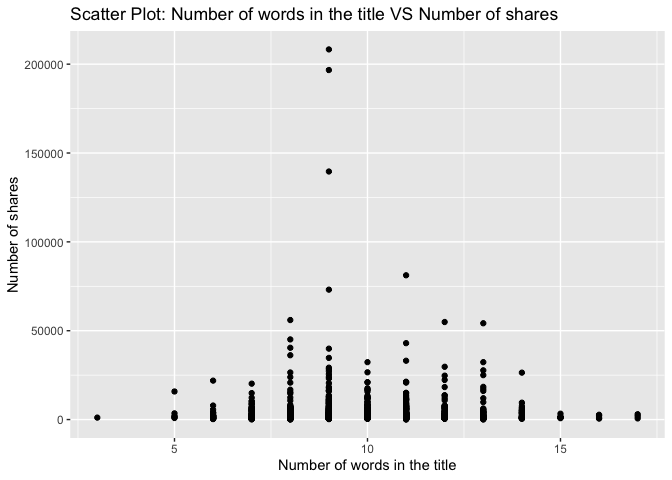
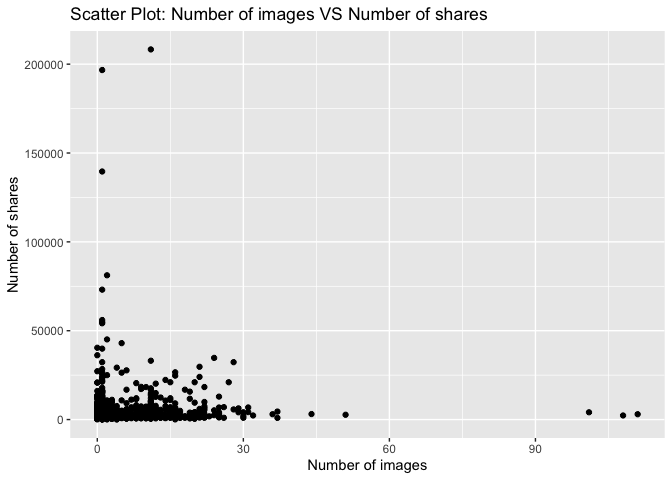
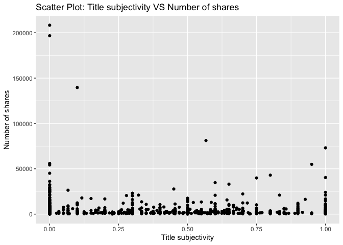

Project 3
================
Shaoyu Wang, Aniket Walimbe
2022-11-14

# Introduction

This [online News Popularity Data
Set](https://archive.ics.uci.edu/ml/datasets/Online+News+Popularity)
summarizes a heterogeneous set of features about articles published by
Mashable in a period of two years.

# Required Packages

First, we will load the required packages:

``` r
# Load libraries
library(readr)
library(tidyverse)
library(dplyr)
library(caret)
library(ggplot2)
library(corrplot)
library(GGally)
library(randomForest)
```

# Data

Use a relative path to import the data and subset the data to work on
the data channel of interest.

``` r
#Read in the data file
newsData <- read_csv("OnlineNewsPopularity.csv",show_col_types = FALSE)
#Choose the data channel of interest
if (params$channel != "") {
  paramChannelName <- params$channel
} else {
  paramChannelName <- "lifestyle"
}
channel <- paste("data_channel_is_", paramChannelName, sep = "")
#Merge the weekdays columns channels as one single column.
news <- newsData %>% 
  filter(.data[[channel]] == 1) %>% 
  select(url, starts_with("weekday_is_")) %>% 
  pivot_longer(-url) %>% 
  filter(value != 0) %>% 
  mutate(publish_weekday = substr(name, 12, 20)) %>% 
  left_join(newsData, by = "url") %>% 
#Remove non predictive variables
  select(-c(url, name, value, timedelta, starts_with("data_channel_is_"), starts_with("weekday_is_")))
news$publish_weekday <- as.factor(news$publish_weekday)
news
```

    ## # A tibble: 2,099 × 47
    ##    publish_wee…¹ n_tok…² n_tok…³ n_uni…⁴ n_non…⁵ n_non…⁶ num_h…⁷ num_s…⁸ num_i…⁹
    ##    <fct>           <dbl>   <dbl>   <dbl>   <dbl>   <dbl>   <dbl>   <dbl>   <dbl>
    ##  1 monday              8     960   0.418    1.00   0.550      21      20      20
    ##  2 monday             10     187   0.667    1.00   0.800       7       0       1
    ##  3 monday             11     103   0.689    1.00   0.806       3       1       1
    ##  4 monday             10     243   0.619    1.00   0.824       1       1       0
    ##  5 monday              8     204   0.586    1.00   0.698       7       2       1
    ##  6 monday             11     315   0.551    1.00   0.702       4       4       1
    ##  7 monday             10    1190   0.409    1.00   0.561      25      24      20
    ##  8 monday              6     374   0.641    1.00   0.828       7       0       1
    ##  9 tuesday            12     499   0.513    1.00   0.662      14       1       1
    ## 10 wednesday          11     223   0.662    1.00   0.826       5       3       0
    ## # … with 2,089 more rows, 38 more variables: num_videos <dbl>,
    ## #   average_token_length <dbl>, num_keywords <dbl>, kw_min_min <dbl>,
    ## #   kw_max_min <dbl>, kw_avg_min <dbl>, kw_min_max <dbl>, kw_max_max <dbl>,
    ## #   kw_avg_max <dbl>, kw_min_avg <dbl>, kw_max_avg <dbl>, kw_avg_avg <dbl>,
    ## #   self_reference_min_shares <dbl>, self_reference_max_shares <dbl>,
    ## #   self_reference_avg_sharess <dbl>, is_weekend <dbl>, LDA_00 <dbl>,
    ## #   LDA_01 <dbl>, LDA_02 <dbl>, LDA_03 <dbl>, LDA_04 <dbl>, …

Split the data into a training set and a test set.

``` r
set.seed(111)
trainIndex <- createDataPartition(news$shares, p = 0.7, list = FALSE)
newsTrain <- news[trainIndex,]
newsTest <- news[-trainIndex,]
newsTrain
```

    ## # A tibble: 1,472 × 47
    ##    publish_wee…¹ n_tok…² n_tok…³ n_uni…⁴ n_non…⁵ n_non…⁶ num_h…⁷ num_s…⁸ num_i…⁹
    ##    <fct>           <dbl>   <dbl>   <dbl>   <dbl>   <dbl>   <dbl>   <dbl>   <dbl>
    ##  1 monday             10     187   0.667    1.00   0.800       7       0       1
    ##  2 monday             11     103   0.689    1.00   0.806       3       1       1
    ##  3 monday             11     315   0.551    1.00   0.702       4       4       1
    ##  4 monday              6     374   0.641    1.00   0.828       7       0       1
    ##  5 tuesday            12     499   0.513    1.00   0.662      14       1       1
    ##  6 wednesday          11     223   0.662    1.00   0.826       5       3       0
    ##  7 wednesday           7    1007   0.438    1.00   0.565      24      23      20
    ##  8 wednesday           9     455   0.496    1.00   0.659      10       5       1
    ##  9 wednesday          14     318   0.633    1.00   0.838       7       0       1
    ## 10 wednesday           7     144   0.723    1.00   0.857       9       6       1
    ## # … with 1,462 more rows, 38 more variables: num_videos <dbl>,
    ## #   average_token_length <dbl>, num_keywords <dbl>, kw_min_min <dbl>,
    ## #   kw_max_min <dbl>, kw_avg_min <dbl>, kw_min_max <dbl>, kw_max_max <dbl>,
    ## #   kw_avg_max <dbl>, kw_min_avg <dbl>, kw_max_avg <dbl>, kw_avg_avg <dbl>,
    ## #   self_reference_min_shares <dbl>, self_reference_max_shares <dbl>,
    ## #   self_reference_avg_sharess <dbl>, is_weekend <dbl>, LDA_00 <dbl>,
    ## #   LDA_01 <dbl>, LDA_02 <dbl>, LDA_03 <dbl>, LDA_04 <dbl>, …

# Summarizations

Some basic summary statistics and plots about the training data.

``` r
summary(newsTrain)
```

    ##   publish_weekday n_tokens_title   n_tokens_content n_unique_tokens 
    ##  friday   :208    Min.   : 3.000   Min.   :   0.0   Min.   :0.0000  
    ##  monday   :221    1st Qu.: 8.000   1st Qu.: 305.0   1st Qu.:0.4636  
    ##  saturday :133    Median :10.000   Median : 497.5   Median :0.5208  
    ##  sunday   :135    Mean   : 9.764   Mean   : 607.3   Mean   :0.5241  
    ##  thursday :254    3rd Qu.:11.000   3rd Qu.: 793.0   3rd Qu.:0.5899  
    ##  tuesday  :240    Max.   :17.000   Max.   :7413.0   Max.   :0.8248  
    ##  wednesday:281                                                      
    ##  n_non_stop_words n_non_stop_unique_tokens   num_hrefs      num_self_hrefs  
    ##  Min.   :0.0000   Min.   :0.0000           Min.   :  0.00   Min.   : 0.000  
    ##  1st Qu.:1.0000   1st Qu.:0.6292           1st Qu.:  6.00   1st Qu.: 1.000  
    ##  Median :1.0000   Median :0.6840           Median : 10.00   Median : 2.000  
    ##  Mean   :0.9891   Mean   :0.6837           Mean   : 13.21   Mean   : 2.518  
    ##  3rd Qu.:1.0000   3rd Qu.:0.7521           3rd Qu.: 18.00   3rd Qu.: 3.000  
    ##  Max.   :1.0000   Max.   :1.0000           Max.   :118.00   Max.   :27.000  
    ##                                                                             
    ##     num_imgs         num_videos      average_token_length  num_keywords   
    ##  Min.   :  0.000   Min.   : 0.0000   Min.   :0.000        Min.   : 3.000  
    ##  1st Qu.:  1.000   1st Qu.: 0.0000   1st Qu.:4.457        1st Qu.: 7.000  
    ##  Median :  1.000   Median : 0.0000   Median :4.621        Median : 9.000  
    ##  Mean   :  4.888   Mean   : 0.4572   Mean   :4.586        Mean   : 8.233  
    ##  3rd Qu.:  8.000   3rd Qu.: 0.0000   3rd Qu.:4.793        3rd Qu.:10.000  
    ##  Max.   :111.000   Max.   :50.0000   Max.   :5.749        Max.   :10.000  
    ##                                                                           
    ##    kw_min_min       kw_max_min      kw_avg_min        kw_min_max    
    ##  Min.   : -1.00   Min.   :    0   Min.   :   -1.0   Min.   :     0  
    ##  1st Qu.: -1.00   1st Qu.:  488   1st Qu.:  184.2   1st Qu.:     0  
    ##  Median :  4.00   Median :  813   Median :  301.1   Median :     0  
    ##  Mean   : 41.45   Mean   : 1664   Mean   :  418.1   Mean   :  7217  
    ##  3rd Qu.:  4.00   3rd Qu.: 1300   3rd Qu.:  439.1   3rd Qu.:  6200  
    ##  Max.   :377.00   Max.   :98700   Max.   :14187.8   Max.   :208300  
    ##                                                                     
    ##    kw_max_max       kw_avg_max       kw_min_avg     kw_max_avg   
    ##  Min.   :     0   Min.   :     0   Min.   :   0   Min.   :    0  
    ##  1st Qu.:690400   1st Qu.:118659   1st Qu.:   0   1st Qu.: 4042  
    ##  Median :843300   Median :181881   Median :   0   Median : 5036  
    ##  Mean   :702035   Mean   :183400   Mean   :1054   Mean   : 6625  
    ##  3rd Qu.:843300   3rd Qu.:248982   3rd Qu.:2274   3rd Qu.: 7166  
    ##  Max.   :843300   Max.   :491771   Max.   :3610   Max.   :98700  
    ##                                                                  
    ##    kw_avg_avg    self_reference_min_shares self_reference_max_shares
    ##  Min.   :    0   Min.   :     0            Min.   :     0.0         
    ##  1st Qu.: 2642   1st Qu.:   624            1st Qu.:   965.2         
    ##  Median : 3221   Median :  1700            Median :  2850.0         
    ##  Mean   : 3404   Mean   :  4741            Mean   :  8053.0         
    ##  3rd Qu.: 3926   3rd Qu.:  3800            3rd Qu.:  7225.0         
    ##  Max.   :20378   Max.   :144900            Max.   :690400.0         
    ##                                                                     
    ##  self_reference_avg_sharess   is_weekend         LDA_00       
    ##  Min.   :     0.0           Min.   :0.0000   Min.   :0.01818  
    ##  1st Qu.:   942.5           1st Qu.:0.0000   1st Qu.:0.02251  
    ##  Median :  2500.0           Median :0.0000   Median :0.02914  
    ##  Mean   :  6168.2           Mean   :0.1821   Mean   :0.17903  
    ##  3rd Qu.:  5625.0           3rd Qu.:0.0000   3rd Qu.:0.25518  
    ##  Max.   :401450.0           Max.   :1.0000   Max.   :0.91980  
    ##                                                               
    ##      LDA_01            LDA_02            LDA_03            LDA_04       
    ##  Min.   :0.01819   Min.   :0.01819   Min.   :0.01820   Min.   :0.02014  
    ##  1st Qu.:0.02222   1st Qu.:0.02223   1st Qu.:0.02249   1st Qu.:0.31664  
    ##  Median :0.02507   Median :0.02792   Median :0.03043   Median :0.57032  
    ##  Mean   :0.06506   Mean   :0.08074   Mean   :0.14444   Mean   :0.53073  
    ##  3rd Qu.:0.04001   3rd Qu.:0.11889   3rd Qu.:0.21061   3rd Qu.:0.79919  
    ##  Max.   :0.62253   Max.   :0.67623   Max.   :0.91837   Max.   :0.91995  
    ##                                                                         
    ##  global_subjectivity global_sentiment_polarity global_rate_positive_words
    ##  Min.   :0.0000      Min.   :-0.37271          Min.   :0.00000           
    ##  1st Qu.:0.4263      1st Qu.: 0.09868          1st Qu.:0.03464           
    ##  Median :0.4762      Median : 0.14874          Median :0.04348           
    ##  Mean   :0.4736      Mean   : 0.15064          Mean   :0.04419           
    ##  3rd Qu.:0.5248      3rd Qu.: 0.20520          3rd Qu.:0.05296           
    ##  Max.   :0.8667      Max.   : 0.51389          Max.   :0.12139           
    ##                                                                          
    ##  global_rate_negative_words rate_positive_words rate_negative_words
    ##  Min.   :0.00000            Min.   :0.0000      Min.   :0.0000     
    ##  1st Qu.:0.01050            1st Qu.:0.6632      1st Qu.:0.1852     
    ##  Median :0.01532            Median :0.7377      Median :0.2586     
    ##  Mean   :0.01626            Mean   :0.7214      Mean   :0.2677     
    ##  3rd Qu.:0.02085            3rd Qu.:0.8112      3rd Qu.:0.3333     
    ##  Max.   :0.06180            Max.   :1.0000      Max.   :1.0000     
    ##                                                                    
    ##  avg_positive_polarity min_positive_polarity max_positive_polarity
    ##  Min.   :0.0000        Min.   :0.00000       Min.   :0.00         
    ##  1st Qu.:0.3359        1st Qu.:0.05000       1st Qu.:0.70         
    ##  Median :0.3832        Median :0.10000       Median :0.90         
    ##  Mean   :0.3828        Mean   :0.09355       Mean   :0.83         
    ##  3rd Qu.:0.4343        3rd Qu.:0.10000       3rd Qu.:1.00         
    ##  Max.   :0.7553        Max.   :0.50000       Max.   :1.00         
    ##                                                                   
    ##  avg_negative_polarity min_negative_polarity max_negative_polarity
    ##  Min.   :-1.0000       Min.   :-1.0000       Min.   :-1.000       
    ##  1st Qu.:-0.3232       1st Qu.:-0.7143       1st Qu.:-0.125       
    ##  Median :-0.2612       Median :-0.5000       Median :-0.100       
    ##  Mean   :-0.2671       Mean   :-0.5566       Mean   :-0.105       
    ##  3rd Qu.:-0.2033       3rd Qu.:-0.4000       3rd Qu.:-0.050       
    ##  Max.   : 0.0000       Max.   : 0.0000       Max.   : 0.000       
    ##                                                                   
    ##  title_subjectivity title_sentiment_polarity abs_title_subjectivity
    ##  Min.   :0.0000     Min.   :-1.0000          Min.   :0.0000        
    ##  1st Qu.:0.0000     1st Qu.: 0.0000          1st Qu.:0.2000        
    ##  Median :0.1000     Median : 0.0000          Median :0.5000        
    ##  Mean   :0.2827     Mean   : 0.1052          Mean   :0.3531        
    ##  3rd Qu.:0.5000     3rd Qu.: 0.2000          3rd Qu.:0.5000        
    ##  Max.   :1.0000     Max.   : 1.0000          Max.   :0.5000        
    ##                                                                    
    ##  abs_title_sentiment_polarity     shares      
    ##  Min.   :0.0000               Min.   :    28  
    ##  1st Qu.:0.0000               1st Qu.:  1100  
    ##  Median :0.0000               Median :  1700  
    ##  Mean   :0.1688               Mean   :  3847  
    ##  3rd Qu.:0.2927               3rd Qu.:  3225  
    ##  Max.   :1.0000               Max.   :208300  
    ## 

``` r
#numerical summary for our Y variable shares
summary(newsTrain$shares)
```

    ##    Min. 1st Qu.  Median    Mean 3rd Qu.    Max. 
    ##      28    1100    1700    3847    3225  208300

``` r
#Numerical summaries
newsTrain %>% 
  summarise(mean = round(mean(shares), 0), sd = round(sd(shares), 0), median = round(median(shares), 0), IQR = round(IQR(shares), 0))
```

    ## # A tibble: 1 × 4
    ##    mean    sd median   IQR
    ##   <dbl> <dbl>  <dbl> <dbl>
    ## 1  3847 10112   1700  2125

``` r
newsTrain %>% 
  group_by(publish_weekday) %>% 
  summarise(mean = round(mean(shares), 0), sd = round(sd(shares), 0), median = round(median(shares), 0), IQR = round(IQR(shares), 0))
```

    ## # A tibble: 7 × 5
    ##   publish_weekday  mean    sd median   IQR
    ##   <fct>           <dbl> <dbl>  <dbl> <dbl>
    ## 1 friday           3017  4775   1500  1800
    ## 2 monday           4711 16469   1700  2400
    ## 3 saturday         4320  5935   2100  2400
    ## 4 sunday           3889  4920   2100  2450
    ## 5 thursday         3683  6470   1500  2375
    ## 6 tuesday          4345 15434   1500  1833
    ## 7 wednesday        3263  6006   1600  1815

``` r
newsTrain %>% 
  group_by(num_imgs) %>% 
  summarise(mean = round(mean(shares), 0), sd = round(sd(shares), 0), median = round(median(shares), 0), IQR = round(IQR(shares), 0))
```

    ## # A tibble: 40 × 5
    ##    num_imgs  mean    sd median   IQR
    ##       <dbl> <dbl> <dbl>  <dbl> <dbl>
    ##  1        0  3334  5212   1600  2100
    ##  2        1  3634 11015   1500  1802
    ##  3        2  3834  9951   1500  1500
    ##  4        3  3306  3317   1850  3406
    ##  5        4  2992  5033   1500  1800
    ##  6        5  5740 10228   2000  2700
    ##  7        6  3409  5423   1650  1775
    ##  8        7  3094  2800   2100  2200
    ##  9        8  2975  3825   1600  1400
    ## 10        9  3565  4174   2100  1950
    ## # … with 30 more rows

``` r
newsTrain %>% 
  group_by(num_videos) %>% 
  summarise(mean = round(mean(shares), 0), sd = round(sd(shares), 0), median = round(median(shares), 0), IQR = round(IQR(shares), 0))
```

    ## # A tibble: 16 × 5
    ##    num_videos   mean    sd median   IQR
    ##         <dbl>  <dbl> <dbl>  <dbl> <dbl>
    ##  1          0   3712  9474   1700  2000
    ##  2          1   3574  5398   1700  2200
    ##  3          2   3056  3332   1750  2425
    ##  4          3   4251  7577   1500  3274
    ##  5          4   5265  7251   2100  3985
    ##  6          5   8280 13514   1700  3500
    ##  7          6  18000 15839  18000 11200
    ##  8          7  11677 10348  13000 10284
    ##  9          8   1050    71   1050    50
    ## 10          9   3950  4031   3950  2850
    ## 11         10   2261  1567   1650  1450
    ## 12         11   3100    NA   3100     0
    ## 13         12   4400  2828   4400  2000
    ## 14         15 196700    NA 196700     0
    ## 15         28    660    NA    660     0
    ## 16         50    932    NA    932     0

``` r
newsTrain %>% 
  group_by(num_keywords) %>% 
  summarise(mean = round(mean(shares), 0), sd = round(sd(shares), 0), median = round(median(shares), 0), IQR = round(IQR(shares), 0))
```

    ## # A tibble: 8 × 5
    ##   num_keywords  mean    sd median   IQR
    ##          <dbl> <dbl> <dbl>  <dbl> <dbl>
    ## 1            3  4660  7406   1900  1650
    ## 2            4  3309  5487   1400  1300
    ## 3            5  3357  4104   1700  2900
    ## 4            6  3124  5146   1400  1760
    ## 5            7  3182  5986   1700  1600
    ## 6            8  4656 14512   1800  2500
    ## 7            9  3857  5590   1900  2900
    ## 8           10  4026 12375   1600  2100

# Contingency tables

Contingency tables : Here, the title subjectivity is divided into 3
categories : high, medium and low based on the values. If the value is
greater than 0.8, it is high, greater than 0.4 and less than 0.8 is
medium and remaining is low. The contingency table is then shown below.

``` r
newsTrain$subject_activity_type <- ifelse(newsTrain$title_subjectivity >= 0.8, "High", 
                                          ifelse(newsTrain$title_subjectivity >= 0.4, "Medium",
                                                 ifelse(airquality$Wind >= 0, "Low", "None")))
table(newsTrain$subject_activity_type)
```

    ## 
    ##   High    Low Medium 
    ##    161    930    381

``` r
table(newsTrain$publish_weekday)
```

    ## 
    ##    friday    monday  saturday    sunday  thursday   tuesday wednesday 
    ##       208       221       133       135       254       240       281

``` r
g <- ggplot(newsTrain, aes(x = n_tokens_title))
g + geom_histogram(fill = "lightblue", binwidth = 1) + 
  labs()
```

<!-- -->

``` r
g <- ggplot(newsTrain, aes(x = n_tokens_content))
g + geom_histogram(fill = "lightblue") + 
  labs()
```

<!-- -->

``` r
g <- ggplot(newsTrain, aes(x = global_subjectivity))
g + geom_histogram(fill = "lightblue") + 
  labs()
```

<!-- -->

``` r
g <- ggplot(newsTrain, aes(x = global_sentiment_polarity))
g + geom_histogram(fill = "lightblue") + 
  labs()
```

<!-- -->

``` r
g <- ggplot(newsTrain, aes(x = rate_positive_words, y = shares))
g + geom_point() + 
  labs()
```

<!-- -->

``` r
g <- ggplot(newsTrain, aes(x = average_token_length, y = shares))
g + geom_point() + 
  labs()
```

<!-- -->

Plot between title subjectivity and number of shares: We can inspect the
trend of the shares as a function of title subjectivity.

``` r
g <- ggplot(data = newsTrain, aes(x = title_subjectivity, y = shares))
g + geom_point() + 
  labs(x = "Title subjectivity" , y = "Number of shares", title = "Scatter Plot : Title Subjectivity Vs Number of Shares") 
```

<!-- -->

Plot between number of shares and article published day: This plot shows
the number of shares an article has based on the day it has been
published.

``` r
newsTrainday <- newsTrain %>%
  select(publish_weekday, shares) %>%
  group_by(publish_weekday) %>% 
  summarise(total_shares=sum(shares))


g <- ggplot(data = newsTrainday, aes(x=publish_weekday, y=total_shares))
g + geom_col(fill = "lightblue")+
  labs(title = " Shares for articles published based on days")
```

<!-- -->

Plot between number of images and number of shares:

``` r
g <- ggplot(data = newsTrain, aes(x = num_imgs, y = shares))
g + geom_point() +
  labs(x = "Number of Images" , y = "Number of shares", title = "Scatter Plot : Number of Images Vs Number of Shares") 
```

<!-- -->

Plotting the correlation between numeric variables.

``` r
correlation <- cor(newsTrain %>% select(-c(publish_weekday, subject_activity_type)), method = "spearman")
corrplot(correlation, type = "upper", tl.pos = "lt", tl.col = "black", tl.cex = 0.5, mar = c(2, 0, 1, 0)) 
corrplot(correlation, type = "lower", add = TRUE, diag = FALSE, tl.pos = "n", number.cex = 0.5)
```

<!-- -->

Select predictors: publish_weekday, n_tokens_title, n_tokens_content,
num_self_hrefs, num_videos, average_token_length, num_keywords,
kw_avg_avg, self_reference_avg_sharess, LDA_04, global_subjectivity,
global_sentiment_polarity, avg_positive_polarity, avg_negative_polarity,
title_subjectivity, shares

``` r
set.seed(111)
Train <- newsTrain %>% 
  select(publish_weekday, n_tokens_title, n_tokens_content, num_self_hrefs, num_videos, average_token_length, num_keywords, kw_avg_avg, self_reference_avg_sharess, LDA_04, global_subjectivity, global_sentiment_polarity, avg_positive_polarity, avg_negative_polarity, title_subjectivity, shares)
Test <- newsTest %>% 
  select(publish_weekday, n_tokens_title, n_tokens_content, num_self_hrefs, num_videos, average_token_length, num_keywords, kw_avg_avg, self_reference_avg_sharess, LDA_04, global_subjectivity, global_sentiment_polarity, avg_positive_polarity, avg_negative_polarity, title_subjectivity, shares)
```

# Model

## Linear Regression Model

``` r
set.seed(111)
lrFit <- train(shares ~ ., data = Train,
               method = "lm",
               trControl = trainControl(method = "cv", number = 5))
#lrFit
predict_lrFit <- predict(lrFit, newdata = Test)
postResample(predict_lrFit, obs = Test$shares)
```

    ##         RMSE     Rsquared          MAE 
    ## 5.106040e+03 1.214021e-02 3.087424e+03

## Random Forest Model

``` r
set.seed(111)
rfFit <- train(shares ~ ., 
                         data = Train, 
                         method = "rf",
                         preProcess = c("center","scale"),
                         trControl = trainControl(method = "cv", number = 5),
                         tuneGrid = data.frame(mtry = ncol(Train)/3))
#rfFit
predict_rfFit <- predict(rfFit, newdata = Test)
postResample(predict_rfFit, obs = Test$shares)
```

    ##         RMSE     Rsquared          MAE 
    ## 5.566293e+03 1.396684e-02 3.261871e+03

## Boosted Tree Model

``` r
#Boosted Tree Model
set.seed(111)
boostedFit <- train(shares ~ ., 
                    data = Train, 
                    method = "gbm", 
                    preProcess = c("center", "scale"),
                    trControl = trainControl(method = "cv", number = 5),
                    tuneGrid = expand.grid(n.trees = c(25,50,100,150,200), 
                                           interaction.depth = c(1,2,3,4), 
                                           shrinkage = 0.1, 
                                           n.minobsinnode = 10))
```

    ## Iter   TrainDeviance   ValidDeviance   StepSize   Improve
    ##      1 122471465.4868             nan     0.1000 153656.3671
    ##      2 122121605.8391             nan     0.1000 52638.0551
    ##      3 121671870.0353             nan     0.1000 -83235.5377
    ##      4 120964220.5113             nan     0.1000 -247424.1096
    ##      5 120646062.9834             nan     0.1000 -118094.1319
    ##      6 120210360.2411             nan     0.1000 -95899.2170
    ##      7 119858515.9031             nan     0.1000 -720209.5300
    ##      8 119706531.5596             nan     0.1000 -288027.1819
    ##      9 119611317.3956             nan     0.1000 -384869.0786
    ##     10 119565699.5159             nan     0.1000 -610128.2639
    ##     20 117908775.2821             nan     0.1000 -20435.7598
    ##     40 116453309.8821             nan     0.1000 -363098.3187
    ##     60 115063367.0845             nan     0.1000 161438.2724
    ##     80 113737157.5528             nan     0.1000 -222328.5104
    ##    100 111693512.9950             nan     0.1000 -386936.1281
    ##    120 110879170.3629             nan     0.1000 -669507.7197
    ##    140 109289467.4357             nan     0.1000 -380163.8266
    ##    160 107638821.4012             nan     0.1000 -206812.6453
    ##    180 107002231.5044             nan     0.1000 -315624.3510
    ##    200 106691861.6458             nan     0.1000 -328980.6138
    ## 
    ## Iter   TrainDeviance   ValidDeviance   StepSize   Improve
    ##      1 122214806.3708             nan     0.1000 34786.5804
    ##      2 121173118.5144             nan     0.1000 399316.6140
    ##      3 120028823.3540             nan     0.1000 -272644.9201
    ##      4 119762046.9843             nan     0.1000 -222332.7085
    ##      5 119160715.1958             nan     0.1000 -299973.2627
    ##      6 118633389.8073             nan     0.1000 -329750.8776
    ##      7 117302661.2858             nan     0.1000 185900.6861
    ##      8 116685791.7027             nan     0.1000 -405661.2583
    ##      9 116667005.0733             nan     0.1000 -424819.8130
    ##     10 116693907.8257             nan     0.1000 -364057.6527
    ##     20 114601438.5222             nan     0.1000 -410914.3729
    ##     40 110612935.6111             nan     0.1000 -498231.3138
    ##     60 106596477.5934             nan     0.1000 -543133.4906
    ##     80 103975439.5798             nan     0.1000 210023.1306
    ##    100 100440206.3616             nan     0.1000 -570260.8047
    ##    120 98559694.9813             nan     0.1000 -287866.2254
    ##    140 95328162.4928             nan     0.1000 -438076.3367
    ##    160 94099350.1424             nan     0.1000 -226308.4382
    ##    180 92308882.9084             nan     0.1000 -432147.3394
    ##    200 90133523.9449             nan     0.1000 -889551.1806
    ## 
    ## Iter   TrainDeviance   ValidDeviance   StepSize   Improve
    ##      1 122120981.1444             nan     0.1000 106437.9305
    ##      2 120870846.6190             nan     0.1000 361634.7620
    ##      3 118712149.7621             nan     0.1000 -215588.0989
    ##      4 118258873.4103             nan     0.1000 -117227.8699
    ##      5 117413497.0557             nan     0.1000 -148068.3704
    ##      6 116948806.6638             nan     0.1000 -182252.3268
    ##      7 116211728.3548             nan     0.1000 -430080.1547
    ##      8 115136447.7369             nan     0.1000 -528879.7116
    ##      9 115074343.1261             nan     0.1000 -562123.4055
    ##     10 114996711.3678             nan     0.1000 -272887.0966
    ##     20 111383217.8272             nan     0.1000 -171045.5396
    ##     40 103969219.2737             nan     0.1000 -326182.5396
    ##     60 99620899.1382             nan     0.1000 -560020.7309
    ##     80 96548471.8622             nan     0.1000 -758788.8807
    ##    100 92246327.9310             nan     0.1000 -221038.4730
    ##    120 88723989.5497             nan     0.1000 -591891.3078
    ##    140 87435534.4026             nan     0.1000 -234539.6793
    ##    160 82386191.8694             nan     0.1000 -433030.6808
    ##    180 78294239.5234             nan     0.1000 -331966.4351
    ##    200 75494943.1142             nan     0.1000 -574974.9323
    ## 
    ## Iter   TrainDeviance   ValidDeviance   StepSize   Improve
    ##      1 122129635.3338             nan     0.1000 256713.5361
    ##      2 120969215.9938             nan     0.1000 -17842.2715
    ##      3 119845930.9817             nan     0.1000 -218005.5224
    ##      4 119298387.7700             nan     0.1000 -192454.6519
    ##      5 118604589.6459             nan     0.1000 -366157.6389
    ##      6 117518136.8411             nan     0.1000 -644425.6179
    ##      7 116798717.3829             nan     0.1000 -588492.8809
    ##      8 115626362.5489             nan     0.1000 -292892.1899
    ##      9 114813560.2504             nan     0.1000 -759376.9537
    ##     10 114438058.5670             nan     0.1000 -655408.8567
    ##     20 107687527.5594             nan     0.1000 -1296887.2042
    ##     40 98197691.8858             nan     0.1000 -802440.5524
    ##     60 88469124.2209             nan     0.1000 -550729.7011
    ##     80 83586572.3517             nan     0.1000 -384369.2998
    ##    100 79863311.6403             nan     0.1000 -1179154.9774
    ##    120 75490973.1182             nan     0.1000 -511432.1236
    ##    140 71448795.9251             nan     0.1000 -431324.5762
    ##    160 67165823.3227             nan     0.1000 -255114.5663
    ##    180 64216066.2657             nan     0.1000 -204760.3030
    ##    200 60640972.1321             nan     0.1000 -484462.5894
    ## 
    ## Iter   TrainDeviance   ValidDeviance   StepSize   Improve
    ##      1 115841765.6677             nan     0.1000 288158.8161
    ##      2 115196758.3797             nan     0.1000 66218.9672
    ##      3 115032549.9926             nan     0.1000 -86242.1907
    ##      4 114336630.1268             nan     0.1000 -195811.6719
    ##      5 113840493.1941             nan     0.1000 -66926.3355
    ##      6 113414074.5016             nan     0.1000 -368796.8108
    ##      7 113345545.6506             nan     0.1000 -81246.5795
    ##      8 113284290.4703             nan     0.1000 -26261.3425
    ##      9 112951363.6578             nan     0.1000 54606.1155
    ##     10 112843747.1759             nan     0.1000 117652.7014
    ##     20 111097005.5755             nan     0.1000 -405864.3442
    ##     40 108221046.0690             nan     0.1000 178188.8013
    ##     60 107746213.1045             nan     0.1000 -292211.7558
    ##     80 107030772.0342             nan     0.1000 -562646.6468
    ##    100 106220650.7548             nan     0.1000 -390035.9038
    ##    120 105207125.8071             nan     0.1000 -126536.7769
    ##    140 104256829.3558             nan     0.1000 -655523.1227
    ##    160 102485622.5763             nan     0.1000 -184423.0745
    ##    180 101676334.1478             nan     0.1000 -412285.9023
    ##    200 101073269.0726             nan     0.1000 -676644.4759
    ## 
    ## Iter   TrainDeviance   ValidDeviance   StepSize   Improve
    ##      1 115837855.9689             nan     0.1000 187733.7069
    ##      2 115557746.0507             nan     0.1000 318760.6024
    ##      3 114108891.3196             nan     0.1000 315856.6840
    ##      4 113495087.1881             nan     0.1000 -94480.8085
    ##      5 112895006.3763             nan     0.1000 -463156.9123
    ##      6 112739325.6672             nan     0.1000 -202750.9186
    ##      7 112100853.0891             nan     0.1000 -333279.8458
    ##      8 111374312.5338             nan     0.1000 -510380.9580
    ##      9 110969544.2638             nan     0.1000 -493544.1603
    ##     10 109988631.7270             nan     0.1000 -239189.1417
    ##     20 106244617.2714             nan     0.1000 -8520.2455
    ##     40 101530562.6987             nan     0.1000 -353108.4373
    ##     60 98864179.4540             nan     0.1000 -674431.0786
    ##     80 96655933.6587             nan     0.1000 -468117.5318
    ##    100 92983281.5271             nan     0.1000 -396079.7137
    ##    120 92005506.0550             nan     0.1000 -697458.5511
    ##    140 90485600.4442             nan     0.1000 -637910.4970
    ##    160 88934639.9237             nan     0.1000 -954147.6643
    ##    180 87131922.9865             nan     0.1000 -159182.0522
    ##    200 86167440.5845             nan     0.1000 -396218.1912
    ## 
    ## Iter   TrainDeviance   ValidDeviance   StepSize   Improve
    ##      1 115590536.8355             nan     0.1000 566713.9651
    ##      2 114185049.7499             nan     0.1000 33845.4626
    ##      3 113721409.5996             nan     0.1000 -71178.2309
    ##      4 113541368.2327             nan     0.1000 -34831.9891
    ##      5 112290520.7736             nan     0.1000 -714721.5375
    ##      6 111598241.8017             nan     0.1000 -173677.7908
    ##      7 110056484.3945             nan     0.1000 -393491.8937
    ##      8 109795316.6584             nan     0.1000 -180819.9045
    ##      9 109820171.4281             nan     0.1000 -626218.2346
    ##     10 108662858.0922             nan     0.1000 -356282.7088
    ##     20 102787180.0277             nan     0.1000 -633572.9780
    ##     40 96623329.6598             nan     0.1000 -627227.6404
    ##     60 93158537.8261             nan     0.1000 -762304.9734
    ##     80 90177354.5915             nan     0.1000 -471905.4529
    ##    100 86075110.5195             nan     0.1000 -277601.7588
    ##    120 82988664.8751             nan     0.1000 -651291.2352
    ##    140 80102496.8327             nan     0.1000 -342037.5006
    ##    160 78858660.0232             nan     0.1000 -524961.0176
    ##    180 77134640.3554             nan     0.1000 -819369.5190
    ##    200 74648182.0181             nan     0.1000 -418371.3907
    ## 
    ## Iter   TrainDeviance   ValidDeviance   StepSize   Improve
    ##      1 115347617.5033             nan     0.1000 157749.3882
    ##      2 115079181.4091             nan     0.1000 -148745.8681
    ##      3 114319927.4585             nan     0.1000 3361.3640
    ##      4 113317450.4623             nan     0.1000 -265873.5654
    ##      5 113350881.4605             nan     0.1000 -387059.2971
    ##      6 112728732.6219             nan     0.1000 -360081.1073
    ##      7 112139418.5844             nan     0.1000 -695892.3367
    ##      8 111271853.5072             nan     0.1000 -476913.6381
    ##      9 110533664.7231             nan     0.1000 -427221.1733
    ##     10 109420902.4519             nan     0.1000 -356469.3168
    ##     20 106258006.7494             nan     0.1000 -94388.6536
    ##     40 99156611.5262             nan     0.1000 -842736.6112
    ##     60 93924726.6090             nan     0.1000 -468807.4276
    ##     80 89269994.9251             nan     0.1000 -640516.0799
    ##    100 85369131.8428             nan     0.1000 -656686.6999
    ##    120 82035362.3561             nan     0.1000 -278335.4984
    ##    140 78139989.6097             nan     0.1000 -548857.7231
    ##    160 75057292.5469             nan     0.1000 -664679.5582
    ##    180 73384554.3975             nan     0.1000 -477969.2942
    ##    200 70744831.5457             nan     0.1000 -526901.4940
    ## 
    ## Iter   TrainDeviance   ValidDeviance   StepSize   Improve
    ##      1 119361178.3559             nan     0.1000 230641.4844
    ##      2 118742166.5975             nan     0.1000 -246439.8676
    ##      3 118272920.5070             nan     0.1000 48649.9145
    ##      4 118066991.5872             nan     0.1000 -127479.5197
    ##      5 117936466.4643             nan     0.1000 -219320.1752
    ##      6 117448622.1042             nan     0.1000 -218740.3413
    ##      7 117172431.4102             nan     0.1000 56696.0190
    ##      8 116888449.2346             nan     0.1000 -13892.6132
    ##      9 116759711.4251             nan     0.1000 51774.1949
    ##     10 116371623.8717             nan     0.1000 -85025.1948
    ##     20 114493191.9768             nan     0.1000 -420705.5479
    ##     40 111601730.9122             nan     0.1000 -210530.9349
    ##     60 109819286.6687             nan     0.1000 -381783.2684
    ##     80 108762884.7883             nan     0.1000 233537.4031
    ##    100 107601922.0615             nan     0.1000 -716872.7320
    ##    120 107250480.1479             nan     0.1000 -680852.6921
    ##    140 106328746.8951             nan     0.1000 -207418.7426
    ##    160 106050066.6668             nan     0.1000 -250098.6376
    ##    180 105006414.0205             nan     0.1000 -430464.8052
    ##    200 104019163.9492             nan     0.1000 -459490.3016
    ## 
    ## Iter   TrainDeviance   ValidDeviance   StepSize   Improve
    ##      1 118618271.5143             nan     0.1000 -182092.5403
    ##      2 117815575.3974             nan     0.1000 -319888.1363
    ##      3 117177353.2297             nan     0.1000 -428075.9685
    ##      4 116472307.2813             nan     0.1000 125871.1760
    ##      5 115736320.8090             nan     0.1000 -558040.0281
    ##      6 115262564.4831             nan     0.1000 -186277.6643
    ##      7 114056868.1968             nan     0.1000 -177596.1275
    ##      8 113783525.3734             nan     0.1000 -141605.8231
    ##      9 113460117.2322             nan     0.1000 -284172.1553
    ##     10 113253042.4241             nan     0.1000 -631061.8156
    ##     20 109530749.2494             nan     0.1000 -278219.7146
    ##     40 103049019.7775             nan     0.1000 -422945.7140
    ##     60 100516076.2752             nan     0.1000 -949950.2473
    ##     80 97103781.5397             nan     0.1000 -248705.4330
    ##    100 94332423.2863             nan     0.1000 -361370.4541
    ##    120 89977756.9929             nan     0.1000 -377284.8869
    ##    140 88653769.6800             nan     0.1000 -546147.7492
    ##    160 85719241.5827             nan     0.1000 -465186.6410
    ##    180 84726298.5849             nan     0.1000 -287420.8360
    ##    200 83545372.7942             nan     0.1000 -92850.0373
    ## 
    ## Iter   TrainDeviance   ValidDeviance   StepSize   Improve
    ##      1 118900287.5305             nan     0.1000 -77222.3785
    ##      2 118194650.7658             nan     0.1000 -14808.5766
    ##      3 116933245.5919             nan     0.1000 19078.8834
    ##      4 116186559.7384             nan     0.1000 -327059.7290
    ##      5 115343162.3524             nan     0.1000 -341334.2752
    ##      6 113446178.0073             nan     0.1000 -678631.6906
    ##      7 113047497.8344             nan     0.1000 -529836.0160
    ##      8 112730366.4221             nan     0.1000 -487034.6151
    ##      9 111272288.3236             nan     0.1000 -1345271.1957
    ##     10 110363827.7388             nan     0.1000 -199621.3431
    ##     20 104216627.4412             nan     0.1000 -71913.7236
    ##     40 100951344.5771             nan     0.1000 -593252.0081
    ##     60 95712352.6913             nan     0.1000 -552974.9228
    ##     80 91676080.4122             nan     0.1000 -890317.3936
    ##    100 88794832.6140             nan     0.1000 -351315.8561
    ##    120 84484572.9902             nan     0.1000 -311403.0972
    ##    140 83324333.8300             nan     0.1000 -452615.4138
    ##    160 80924590.5279             nan     0.1000 -605966.5691
    ##    180 79047979.6703             nan     0.1000 -602086.8587
    ##    200 75675584.4213             nan     0.1000 -298766.3786
    ## 
    ## Iter   TrainDeviance   ValidDeviance   StepSize   Improve
    ##      1 119175040.6649             nan     0.1000 45372.9861
    ##      2 117366939.5724             nan     0.1000 421579.4098
    ##      3 116669672.9415             nan     0.1000 -280865.9706
    ##      4 115817386.8778             nan     0.1000 -458063.2427
    ##      5 115315059.8787             nan     0.1000 -630614.0349
    ##      6 115081821.0268             nan     0.1000 -524576.2083
    ##      7 114745289.5982             nan     0.1000 -319688.5980
    ##      8 114700775.5510             nan     0.1000 -516724.5023
    ##      9 114411997.4020             nan     0.1000 -373094.2481
    ##     10 113783744.6652             nan     0.1000 -224592.8140
    ##     20 106877393.9669             nan     0.1000 -553750.1288
    ##     40 102599983.1262             nan     0.1000 -118492.2832
    ##     60 92586551.7444             nan     0.1000 -376468.2478
    ##     80 89033045.9459             nan     0.1000 -525277.3341
    ##    100 85099347.9199             nan     0.1000 -662886.8276
    ##    120 80873230.5173             nan     0.1000 -746447.6177
    ##    140 77338116.2852             nan     0.1000 -587060.6690
    ##    160 74465434.5913             nan     0.1000 -265429.1809
    ##    180 72003037.8935             nan     0.1000 -584545.8489
    ##    200 66339013.8075             nan     0.1000 -402948.3824
    ## 
    ## Iter   TrainDeviance   ValidDeviance   StepSize   Improve
    ##      1 46359847.9081             nan     0.1000 -85518.6485
    ##      2 46195482.9040             nan     0.1000 -106854.0077
    ##      3 46095786.2505             nan     0.1000 45884.9983
    ##      4 45994646.5969             nan     0.1000 -146252.5156
    ##      5 45869183.7544             nan     0.1000 117832.5324
    ##      6 45734150.3607             nan     0.1000 -55485.6952
    ##      7 45593167.9164             nan     0.1000 102134.4249
    ##      8 45479372.3099             nan     0.1000 -82195.9938
    ##      9 45274284.7104             nan     0.1000 11118.9887
    ##     10 45124782.4350             nan     0.1000 -136057.5222
    ##     20 44475290.0606             nan     0.1000 -14702.7020
    ##     40 43983603.8696             nan     0.1000 -197328.0713
    ##     60 43501364.9923             nan     0.1000 -180704.5615
    ##     80 43232309.9033             nan     0.1000 -118687.2081
    ##    100 43072177.1851             nan     0.1000 -322624.7569
    ##    120 42915620.9540             nan     0.1000 -154742.1076
    ##    140 42723239.8672             nan     0.1000 -140523.5514
    ##    160 42508676.9468             nan     0.1000 -208353.0245
    ##    180 42401445.5164             nan     0.1000 -62106.1055
    ##    200 42217773.5833             nan     0.1000 -196214.3112
    ## 
    ## Iter   TrainDeviance   ValidDeviance   StepSize   Improve
    ##      1 46348603.8495             nan     0.1000 95717.4025
    ##      2 45524029.5525             nan     0.1000 23801.1020
    ##      3 45322141.7257             nan     0.1000 57574.0982
    ##      4 45248950.7566             nan     0.1000 -79836.7503
    ##      5 44991161.6826             nan     0.1000 -52089.7571
    ##      6 44746106.4637             nan     0.1000 -56389.6488
    ##      7 44398115.6469             nan     0.1000 296466.6553
    ##      8 44014193.6150             nan     0.1000 -84029.8942
    ##      9 43899632.5343             nan     0.1000 -17705.0971
    ##     10 43767820.8433             nan     0.1000 -37410.9489
    ##     20 42723420.4098             nan     0.1000 -302351.5963
    ##     40 42160509.5564             nan     0.1000 -234503.5335
    ##     60 41377868.1682             nan     0.1000 -27220.0523
    ##     80 40855528.7441             nan     0.1000 -286969.9161
    ##    100 39156211.2488             nan     0.1000 -23488.8595
    ##    120 38363776.2908             nan     0.1000 -134499.4065
    ##    140 37945323.9891             nan     0.1000 -123145.3940
    ##    160 37179077.7655             nan     0.1000 -169407.0098
    ##    180 36748871.4181             nan     0.1000 -233309.0000
    ##    200 36334588.2781             nan     0.1000 -160129.0870
    ## 
    ## Iter   TrainDeviance   ValidDeviance   StepSize   Improve
    ##      1 46191387.2714             nan     0.1000 -55913.1855
    ##      2 45797464.0530             nan     0.1000 -93466.8728
    ##      3 45389891.6351             nan     0.1000 41330.1847
    ##      4 45178468.6794             nan     0.1000 -130229.3797
    ##      5 44903481.3984             nan     0.1000 -111962.2238
    ##      6 44616691.6699             nan     0.1000 -123211.6711
    ##      7 44143783.3730             nan     0.1000 -148843.9420
    ##      8 44101939.8100             nan     0.1000 -103934.6494
    ##      9 43969996.9848             nan     0.1000 -29867.5115
    ##     10 43798401.4115             nan     0.1000 3046.6915
    ##     20 41784778.8523             nan     0.1000 -305694.7464
    ##     40 39741187.4540             nan     0.1000 -167105.6512
    ##     60 37870611.1807             nan     0.1000 -102167.2423
    ##     80 36294895.3483             nan     0.1000 -133287.9940
    ##    100 35154902.6063             nan     0.1000 -19293.3372
    ##    120 34387614.0533             nan     0.1000 -165526.3052
    ##    140 33617464.9039             nan     0.1000 -229598.5954
    ##    160 32806141.3355             nan     0.1000 -113501.2385
    ##    180 32052429.7290             nan     0.1000 -285275.6553
    ##    200 31137803.2702             nan     0.1000 -152594.9275
    ## 
    ## Iter   TrainDeviance   ValidDeviance   StepSize   Improve
    ##      1 46293151.3248             nan     0.1000 199613.8691
    ##      2 46044775.1129             nan     0.1000 70694.0032
    ##      3 45544528.9997             nan     0.1000 63351.5826
    ##      4 45021823.1574             nan     0.1000 92896.2210
    ##      5 44776820.4483             nan     0.1000 -111626.3718
    ##      6 44357096.7554             nan     0.1000 -16904.3407
    ##      7 44041731.4648             nan     0.1000 14772.9069
    ##      8 43721015.2725             nan     0.1000 1371.1145
    ##      9 43639102.9195             nan     0.1000 -206253.1961
    ##     10 43465782.1572             nan     0.1000 -32100.3376
    ##     20 40582063.3895             nan     0.1000 -181684.2769
    ##     40 38281003.4593             nan     0.1000 -151350.8216
    ##     60 36167040.7474             nan     0.1000 -288809.7983
    ##     80 34288735.6149             nan     0.1000 -147215.8280
    ##    100 31632283.0858             nan     0.1000 -258098.9482
    ##    120 29638319.3138             nan     0.1000 -183932.3233
    ##    140 28756307.8567             nan     0.1000 -140074.4874
    ##    160 27695479.1590             nan     0.1000 -228141.5227
    ##    180 26700074.0099             nan     0.1000 -202932.5295
    ##    200 25704578.4764             nan     0.1000 -166451.3348
    ## 
    ## Iter   TrainDeviance   ValidDeviance   StepSize   Improve
    ##      1 103550644.8261             nan     0.1000 -158087.2251
    ##      2 103090215.3924             nan     0.1000 -197498.5734
    ##      3 102432113.3125             nan     0.1000 118376.8998
    ##      4 102024074.0059             nan     0.1000 -330082.9696
    ##      5 101457367.2145             nan     0.1000 -190008.6658
    ##      6 101083926.0677             nan     0.1000 -151086.3817
    ##      7 100745397.1368             nan     0.1000 -229931.5172
    ##      8 100606002.7926             nan     0.1000 44384.2599
    ##      9 100350878.4490             nan     0.1000 100450.6069
    ##     10 100020672.9815             nan     0.1000 17329.6867
    ##     20 98275012.8340             nan     0.1000 -268377.7346
    ##     40 97227175.6853             nan     0.1000 -209598.4119
    ##     60 96917452.9603             nan     0.1000 -913215.5878
    ##     80 96003386.9756             nan     0.1000 -630520.9659
    ##    100 95083786.4075             nan     0.1000 -414837.2127
    ##    120 94827846.5538             nan     0.1000 -329507.5237
    ##    140 93000711.1507             nan     0.1000 -523842.6567
    ##    160 92017337.0092             nan     0.1000 -428611.3392
    ##    180 90390324.8571             nan     0.1000 -347342.8722
    ##    200 89557657.1504             nan     0.1000 -49779.4975
    ## 
    ## Iter   TrainDeviance   ValidDeviance   StepSize   Improve
    ##      1 103233738.9952             nan     0.1000 167023.2462
    ##      2 102376548.0645             nan     0.1000 258159.1210
    ##      3 101348871.4617             nan     0.1000 -80776.8030
    ##      4 100848750.3941             nan     0.1000 -223438.9323
    ##      5 99888767.0941             nan     0.1000 -762567.8661
    ##      6 99326358.4837             nan     0.1000 -904314.0283
    ##      7 97961220.0884             nan     0.1000 593742.4783
    ##      8 97669866.1222             nan     0.1000 -630380.9431
    ##      9 97435391.4196             nan     0.1000 -433207.6210
    ##     10 97213303.4735             nan     0.1000 -281146.1752
    ##     20 94076041.4843             nan     0.1000 -1020105.9422
    ##     40 90875962.4930             nan     0.1000 -238336.7713
    ##     60 89615613.2071             nan     0.1000 -665602.3572
    ##     80 86737027.4483             nan     0.1000 -693256.7376
    ##    100 84870002.0888             nan     0.1000 -816613.7006
    ##    120 82106217.1944             nan     0.1000 -646644.3385
    ##    140 81792884.2925             nan     0.1000 -606925.7567
    ##    160 79584207.8835             nan     0.1000 -401261.6128
    ##    180 78696270.2267             nan     0.1000 -312707.0745
    ##    200 77213107.9743             nan     0.1000 -344150.0393
    ## 
    ## Iter   TrainDeviance   ValidDeviance   StepSize   Improve
    ##      1 103243503.9303             nan     0.1000 524365.9554
    ##      2 102328099.5451             nan     0.1000 -53336.5204
    ##      3 100886059.1430             nan     0.1000 17925.7672
    ##      4 99988301.5710             nan     0.1000 408752.1599
    ##      5 99605263.7054             nan     0.1000 25239.6008
    ##      6 98906201.9389             nan     0.1000 -335773.8543
    ##      7 98638166.6128             nan     0.1000 -559605.6894
    ##      8 98282174.3785             nan     0.1000 -550817.4655
    ##      9 97887098.4601             nan     0.1000 -536948.7745
    ##     10 97727468.4388             nan     0.1000 -217757.9239
    ##     20 96265706.9725             nan     0.1000 -942989.3710
    ##     40 89315727.5403             nan     0.1000 -284280.8624
    ##     60 85536762.8012             nan     0.1000 -340314.7585
    ##     80 82650834.3569             nan     0.1000 35527.0891
    ##    100 79754970.3463             nan     0.1000 -455796.1894
    ##    120 76519658.7716             nan     0.1000 -511095.5694
    ##    140 73700869.7935             nan     0.1000 -638892.5419
    ##    160 71571506.2864             nan     0.1000 -582200.1090
    ##    180 69263243.8348             nan     0.1000 -357037.6210
    ##    200 66271641.7734             nan     0.1000 -389706.2236
    ## 
    ## Iter   TrainDeviance   ValidDeviance   StepSize   Improve
    ##      1 103049792.0474             nan     0.1000 -7328.7992
    ##      2 102129650.2159             nan     0.1000 -23604.3303
    ##      3 101937521.2592             nan     0.1000 -218347.4300
    ##      4 100983548.7041             nan     0.1000 322916.6817
    ##      5 99964714.6524             nan     0.1000 -159572.8068
    ##      6 99437026.0157             nan     0.1000 -347746.6598
    ##      7 98935985.9014             nan     0.1000 -377821.8585
    ##      8 98217545.2427             nan     0.1000 -148626.2727
    ##      9 97399911.9784             nan     0.1000 -1014814.7218
    ##     10 97188408.8591             nan     0.1000 -361151.2141
    ##     20 93814622.9665             nan     0.1000 -208753.0240
    ##     40 87171497.7041             nan     0.1000 -609545.8866
    ##     60 83804560.3575             nan     0.1000 -508122.6671
    ##     80 80707725.3847             nan     0.1000 -637865.0359
    ##    100 73856960.6627             nan     0.1000 -424701.7694
    ##    120 70794771.6990             nan     0.1000 -587782.9239
    ##    140 68751386.7298             nan     0.1000 -664495.3553
    ##    160 66250129.2850             nan     0.1000 -319792.2178
    ##    180 63519849.8815             nan     0.1000 -589676.3269
    ##    200 60149809.4897             nan     0.1000 -621163.9871
    ## 
    ## Iter   TrainDeviance   ValidDeviance   StepSize   Improve
    ##      1 101728856.4694             nan     0.1000 111457.3525
    ##      2 101295060.6299             nan     0.1000 33563.8479
    ##      3 100857064.0464             nan     0.1000 -244558.3599
    ##      4 100603943.9544             nan     0.1000 -156421.4944
    ##      5 100234438.3892             nan     0.1000 3066.8433
    ##      6 99976459.5078             nan     0.1000 -40174.5943
    ##      7 99781694.2069             nan     0.1000 -250760.5358
    ##      8 99564181.0878             nan     0.1000 44064.7729
    ##      9 99208586.7552             nan     0.1000 -181204.6747
    ##     10 99058334.6210             nan     0.1000 -112.9610
    ##     20 97851446.8290             nan     0.1000 -125853.4196
    ##     25 97485443.7225             nan     0.1000 -265165.3833

``` r
predict_boostedFit <- predict(boostedFit, newdata = Test)
postResample(predict_boostedFit, obs = Test$shares)
```

    ##         RMSE     Rsquared          MAE 
    ## 5.316567e+03 2.554050e-03 3.235010e+03
