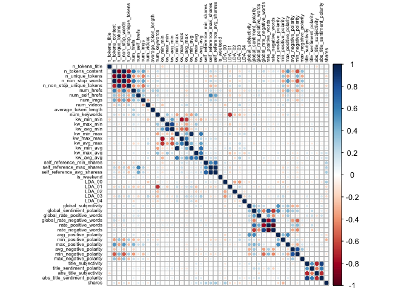
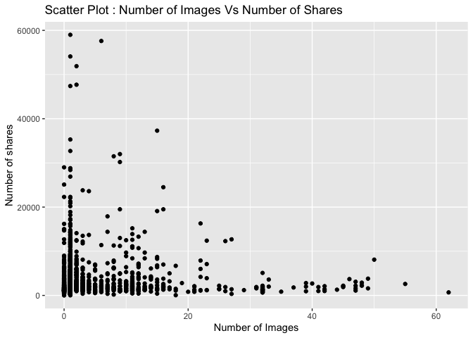

Project 3
================
Shaoyu Wang, Aniket Walimbe
2022-11-16

# Analysis for socmed Data Channel

## Introduction

This [online news popularity data
set](https://archive.ics.uci.edu/ml/datasets/Online+News+Popularity)
summarizes a heterogeneous set of features about articles published by
Mashable in a period of two years. There are 61 attributes, including 58
predictive attributes, 2 non-predictive, 1 goal field. The number of
shares is our target variable, and we select predictive variables from
the remaining variables based on the exploratory data analysis. The
purpose of our analysis is to predict the the number of shares. During
this project, we read and subset the data set at first, and split data
into training set and test set, then we create some basic summary
statistics and plots about the training data, at last we fit linear
regression models and ensemble tree-based models and test the
predictions.

**Variable information**

The target variable is the following:  
- `shares`: Number of shares

The predictive variables are the following:  
- `publish_weekday`: The article published day  
- `n_tokens_title`: Number of words in the title  
- `n_tokens_content`: Number of words in the content  
- `num_self_hrefs`: Number of links to other articles published by
Mashable  
- `num_imgs`: Number of images  
- `num_videos`: Number of videos  
- `average_token_length`: Average length of the words in the content  
- `num_keywords`: Number of keywords in the metadata  
- `kw_avg_avg`: Avg. keyword (avg. shares)  
- `self_reference_avg_sharess`: Avg. shares of referenced articles in
Mashable  
- `LDA_04`: Closeness to LDA topic 4  
- `global_subjectivity`: Text subjectivity  
- `global_sentiment_polarity`: Text sentiment polarity  
- `avg_positive_polarity`: Avg. polarity of positive words  
- `avg_negative_polarity`: Avg. polarity of negative words

**Required packages**

We need to load the required packages:

``` r
# Load libraries
library(readr)
library(tidyverse)
library(caret)
library(leaps)
library(ggplot2)
library(corrplot)
library(randomForest)
library(rmarkdown)
```

## Data

Read in the data and subset the data to work on the data channel of
interest. We find that there are seven similar columns for weekdays from
Monday to Sunday, so we merge these columns and name the new variable as
`publish_weekday` and convert it to factor. For this step, we also
remove the non-predictive variables.

``` r
#Read in the data file
newsData <- read_csv("OnlineNewsPopularity.csv")
#Select the data channel of interest
selectChannel <- paste0("data_channel_is_", params[[1]])
news <- newsData %>% 
  filter(get(selectChannel) == 1) %>% 
  select(url, starts_with("weekday_is_")) %>% 
  pivot_longer(-url) %>% 
  filter(value != 0) %>% 
  mutate(publish_weekday = substr(name, 12, 20)) %>% 
  left_join(newsData, by = "url") %>% 
#Remove non predictive variables
  select(-c(url, name, value, timedelta, starts_with("data_channel_is_"), starts_with("weekday_is_")))
#convert publish_weekday to factor
news$publish_weekday <- as.factor(news$publish_weekday)
news
```

    ## # A tibble: 2,323 × 47
    ##    publish_…¹ n_tok…² n_tok…³ n_uni…⁴ n_non…⁵ n_non…⁶ num_h…⁷ num_s…⁸ num_i…⁹
    ##    <fct>        <dbl>   <dbl>   <dbl>   <dbl>   <dbl>   <dbl>   <dbl>   <dbl>
    ##  1 monday           8     257   0.568    1.00   0.671       9       7       0
    ##  2 monday           8     218   0.663    1.00   0.688      14       3      11
    ##  3 monday           9    1226   0.410    1.00   0.617      10      10       1
    ##  4 monday          10    1121   0.451    1.00   0.629      15      11       1
    ##  5 wednesday        9     168   0.778    1.00   0.865       6       4      11
    ##  6 wednesday        9     100   0.760    1.00   0.803       3       2       1
    ##  7 wednesday       10    1596   0.420    1.00   0.632      19      10       8
    ##  8 thursday         7     518   0.486    1.00   0.654      11       1       1
    ##  9 friday           8     358   0.503    1.00   0.687       4       4       1
    ## 10 friday           6     358   0.622    1.00   0.777      24       6       1
    ## # … with 2,313 more rows, 38 more variables: num_videos <dbl>,
    ## #   average_token_length <dbl>, num_keywords <dbl>, kw_min_min <dbl>,
    ## #   kw_max_min <dbl>, kw_avg_min <dbl>, kw_min_max <dbl>, kw_max_max <dbl>,
    ## #   kw_avg_max <dbl>, kw_min_avg <dbl>, kw_max_avg <dbl>, kw_avg_avg <dbl>,
    ## #   self_reference_min_shares <dbl>, self_reference_max_shares <dbl>,
    ## #   self_reference_avg_sharess <dbl>, is_weekend <dbl>, LDA_00 <dbl>,
    ## #   LDA_01 <dbl>, LDA_02 <dbl>, LDA_03 <dbl>, LDA_04 <dbl>, …

Split the data into a training set and a test set.

``` r
set.seed(111)
trainIndex <- createDataPartition(news$shares, p = 0.7, list = FALSE)
newsTrain <- news[trainIndex,]
newsTest <- news[-trainIndex,]
```

## Summarizations

For this part, we produce some basic summary statistics and plots about
the training data.

**Tables**

Firstly, here is a quick summary of all variables as shown below, so
that we can know the variables roughly.

``` r
summary(newsTrain)
```

    ##   publish_weekday n_tokens_title   n_tokens_content n_unique_tokens 
    ##  friday   :244    Min.   : 4.000   Min.   :   0.0   Min.   :0.0000  
    ##  monday   :252    1st Qu.: 8.000   1st Qu.: 251.0   1st Qu.:0.4644  
    ##  saturday :119    Median : 9.000   Median : 425.0   Median :0.5350  
    ##  sunday   : 89    Mean   : 9.598   Mean   : 604.2   Mean   :0.5359  
    ##  thursday :321    3rd Qu.:11.000   3rd Qu.: 754.0   3rd Qu.:0.6076  
    ##  tuesday  :311    Max.   :18.000   Max.   :4451.0   Max.   :0.9714  
    ##  wednesday:292                                                      
    ##  n_non_stop_words n_non_stop_unique_tokens   num_hrefs      num_self_hrefs  
    ##  Min.   :0.0000   Min.   :0.0000           Min.   :  0.00   Min.   : 0.000  
    ##  1st Qu.:1.0000   1st Qu.:0.6179           1st Qu.:  5.00   1st Qu.: 2.000  
    ##  Median :1.0000   Median :0.6849           Median :  8.00   Median : 3.000  
    ##  Mean   :0.9939   Mean   :0.6834           Mean   : 13.16   Mean   : 4.728  
    ##  3rd Qu.:1.0000   3rd Qu.:0.7576           3rd Qu.: 14.25   3rd Qu.: 5.000  
    ##  Max.   :1.0000   Max.   :1.0000           Max.   :171.00   Max.   :74.000  
    ##                                                                             
    ##     num_imgs        num_videos    average_token_length  num_keywords   
    ##  Min.   : 0.000   Min.   : 0.00   Min.   :0.000        Min.   : 1.000  
    ##  1st Qu.: 1.000   1st Qu.: 0.00   1st Qu.:4.480        1st Qu.: 5.000  
    ##  Median : 1.000   Median : 0.00   Median :4.648        Median : 6.000  
    ##  Mean   : 4.291   Mean   : 1.09   Mean   :4.623        Mean   : 6.507  
    ##  3rd Qu.: 3.000   3rd Qu.: 1.00   3rd Qu.:4.797        3rd Qu.: 8.000  
    ##  Max.   :62.000   Max.   :58.00   Max.   :5.569        Max.   :10.000  
    ##                                                                        
    ##    kw_min_min       kw_max_min        kw_avg_min       kw_min_max    
    ##  Min.   : -1.00   Min.   :    0.0   Min.   :  -1.0   Min.   :     0  
    ##  1st Qu.: -1.00   1st Qu.:  428.0   1st Qu.: 175.2   1st Qu.:     0  
    ##  Median :  4.00   Median :  680.5   Median : 298.2   Median :  2200  
    ##  Mean   : 38.56   Mean   : 1132.0   Mean   : 367.1   Mean   : 26333  
    ##  3rd Qu.:  4.00   3rd Qu.: 1200.0   3rd Qu.: 433.6   3rd Qu.:  9825  
    ##  Max.   :217.00   Max.   :39400.0   Max.   :8461.7   Max.   :843300  
    ##                                                                      
    ##    kw_max_max       kw_avg_max       kw_min_avg     kw_max_avg    
    ##  Min.   :     0   Min.   :     0   Min.   :   0   Min.   :     0  
    ##  1st Qu.:690400   1st Qu.:143373   1st Qu.:   0   1st Qu.:  3858  
    ##  Median :843300   Median :199310   Median :1400   Median :  4375  
    ##  Mean   :714479   Mean   :225829   Mean   :1333   Mean   :  5412  
    ##  3rd Qu.:843300   3rd Qu.:286838   3rd Qu.:2500   3rd Qu.:  5448  
    ##  Max.   :843300   Max.   :843300   Max.   :3607   Max.   :237967  
    ##                                                                   
    ##    kw_avg_avg    self_reference_min_shares self_reference_max_shares
    ##  Min.   :    0   Min.   :     0            Min.   :     0           
    ##  1st Qu.: 2647   1st Qu.:   761            1st Qu.:  1600           
    ##  Median : 3166   Median :  1600            Median :  4200           
    ##  Mean   : 3223   Mean   :  5073            Mean   : 16379           
    ##  3rd Qu.: 3632   3rd Qu.:  3325            3rd Qu.: 12700           
    ##  Max.   :36717   Max.   :158900            Max.   :690400           
    ##                                                                     
    ##  self_reference_avg_sharess   is_weekend         LDA_00       
    ##  Min.   :     0             Min.   :0.0000   Min.   :0.01818  
    ##  1st Qu.:  1500             1st Qu.:0.0000   1st Qu.:0.12561  
    ##  Median :  3300             Median :0.0000   Median :0.37543  
    ##  Mean   :  8717             Mean   :0.1278   Mean   :0.38744  
    ##  3rd Qu.:  7300             3rd Qu.:0.0000   3rd Qu.:0.60170  
    ##  Max.   :349050             Max.   :1.0000   Max.   :0.92699  
    ##                                                               
    ##      LDA_01            LDA_02            LDA_03            LDA_04       
    ##  Min.   :0.01818   Min.   :0.01818   Min.   :0.01843   Min.   :0.01818  
    ##  1st Qu.:0.02521   1st Qu.:0.02951   1st Qu.:0.02880   1st Qu.:0.03333  
    ##  Median :0.03338   Median :0.05084   Median :0.04074   Median :0.05000  
    ##  Mean   :0.07846   Mean   :0.19689   Mean   :0.18081   Mean   :0.15639  
    ##  3rd Qu.:0.05005   3rd Qu.:0.30164   3rd Qu.:0.26893   3rd Qu.:0.23095  
    ##  Max.   :0.91103   Max.   :0.91962   Max.   :0.91904   Max.   :0.91961  
    ##                                                                         
    ##  global_subjectivity global_sentiment_polarity global_rate_positive_words
    ##  Min.   :0.0000      Min.   :-0.37500          Min.   :0.00000           
    ##  1st Qu.:0.4074      1st Qu.: 0.08846          1st Qu.:0.03481           
    ##  Median :0.4604      Median : 0.14261          Median :0.04569           
    ##  Mean   :0.4587      Mean   : 0.14490          Mean   :0.04620           
    ##  3rd Qu.:0.5172      3rd Qu.: 0.19486          3rd Qu.:0.05648           
    ##  Max.   :0.8750      Max.   : 0.65500          Max.   :0.15549           
    ##                                                                          
    ##  global_rate_negative_words rate_positive_words rate_negative_words
    ##  Min.   :0.000000           Min.   :0.0000      Min.   :0.0000     
    ##  1st Qu.:0.009009           1st Qu.:0.6667      1st Qu.:0.1626     
    ##  Median :0.014354           Median :0.7500      Median :0.2432     
    ##  Mean   :0.015522           Mean   :0.7439      Mean   :0.2493     
    ##  3rd Qu.:0.020604           3rd Qu.:0.8333      3rd Qu.:0.3294     
    ##  Max.   :0.101695           Max.   :1.0000      Max.   :1.0000     
    ##                                                                    
    ##  avg_positive_polarity min_positive_polarity max_positive_polarity
    ##  Min.   :0.0000        Min.   :0.00000       Min.   :0.0000       
    ##  1st Qu.:0.3002        1st Qu.:0.03333       1st Qu.:0.6000       
    ##  Median :0.3571        Median :0.05000       Median :0.8000       
    ##  Mean   :0.3572        Mean   :0.07938       Mean   :0.7757       
    ##  3rd Qu.:0.4153        3rd Qu.:0.10000       3rd Qu.:1.0000       
    ##  Max.   :0.8333        Max.   :0.50000       Max.   :1.0000       
    ##                                                                   
    ##  avg_negative_polarity min_negative_polarity max_negative_polarity
    ##  Min.   :-1.0000       Min.   :-1.0000       Min.   :-1.0000      
    ##  1st Qu.:-0.3167       1st Qu.:-0.8000       1st Qu.:-0.1250      
    ##  Median :-0.2482       Median :-0.5000       Median :-0.1000      
    ##  Mean   :-0.2567       Mean   :-0.5183       Mean   :-0.1116      
    ##  3rd Qu.:-0.1812       3rd Qu.:-0.2917       3rd Qu.:-0.0500      
    ##  Max.   : 0.0000       Max.   : 0.0000       Max.   : 0.0000      
    ##                                                                   
    ##  title_subjectivity title_sentiment_polarity abs_title_subjectivity
    ##  Min.   :0.00000    Min.   :-1.0000          Min.   :0.0000        
    ##  1st Qu.:0.00000    1st Qu.: 0.0000          1st Qu.:0.1854        
    ##  Median :0.06667    Median : 0.0000          Median :0.5000        
    ##  Mean   :0.26332    Mean   : 0.1000          Mean   :0.3502        
    ##  3rd Qu.:0.48472    3rd Qu.: 0.1529          3rd Qu.:0.5000        
    ##  Max.   :1.00000    Max.   : 1.0000          Max.   :0.5000        
    ##                                                                    
    ##  abs_title_sentiment_polarity     shares     
    ##  Min.   :0.000000             Min.   :    8  
    ##  1st Qu.:0.000000             1st Qu.: 1400  
    ##  Median :0.007008             Median : 2100  
    ##  Mean   :0.155915             Mean   : 3589  
    ##  3rd Qu.:0.221250             3rd Qu.: 3800  
    ##  Max.   :1.000000             Max.   :59000  
    ## 

Then we can check our response variable `shares`. The below table shows
that the mean, standard deviation, median, IQR of `shares`.

``` r
#numerical summary for the variable shares
newsTrain %>% 
  summarise(mean = round(mean(shares), 0), sd = round(sd(shares), 0), 
            median = round(median(shares), 0), IQR = round(IQR(shares), 0))
```

    ## # A tibble: 1 × 4
    ##    mean    sd median   IQR
    ##   <dbl> <dbl>  <dbl> <dbl>
    ## 1  3589  4962   2100  2400

We also obtain the numerical summaries on some subgroups. We choose four
example subgroups: number of images, number of videos, and number of
keywords, since people may concern more on these when they do searching
and sharing.

``` r
#numerical summaries on subgroups
newsTrain %>% 
  group_by(num_imgs) %>% 
  summarise(mean = round(mean(shares), 0), sd = round(sd(shares), 0), 
            median = round(median(shares), 0), IQR = round(IQR(shares), 0))
```

    ## # A tibble: 46 × 5
    ##    num_imgs  mean    sd median   IQR
    ##       <dbl> <dbl> <dbl>  <dbl> <dbl>
    ##  1        0  3042  3922   1700  2025
    ##  2        1  3476  4700   2200  2400
    ##  3        2  4355  6640   2600  3100
    ##  4        3  3704  3968   2550  2225
    ##  5        4  4033  5180   2400  1650
    ##  6        5  2748  1929   2100  2375
    ##  7        6  5895 13545   2100  1600
    ##  8        7  4563  5080   2400  3300
    ##  9        8  4954  6273   3150  4475
    ## 10        9  6572  9474   2100  3800
    ## # … with 36 more rows

``` r
newsTrain %>% 
  group_by(num_videos) %>% 
  summarise(mean = round(mean(shares), 0), sd = round(sd(shares), 0), 
            median = round(median(shares), 0), IQR = round(IQR(shares), 0))
```

    ## # A tibble: 29 × 5
    ##    num_videos  mean    sd median   IQR
    ##         <dbl> <dbl> <dbl>  <dbl> <dbl>
    ##  1          0  3760  5166   2300  2600
    ##  2          1  3271  4541   2000  2100
    ##  3          2  2583  2848   1700  1400
    ##  4          3  2379  2112   1400  1325
    ##  5          4  2933  3151   1600  1175
    ##  6          5  4060  4402   2100  3300
    ##  7          6  3820  4977   1500   800
    ##  8          7  1700   807   1400   300
    ##  9          8  2839  1736   2300  2300
    ## 10          9  2325  1179   2100   850
    ## # … with 19 more rows

``` r
newsTrain %>% 
  group_by(num_keywords) %>% 
  summarise(mean = round(mean(shares), 0), sd = round(sd(shares), 0), 
            median = round(median(shares), 0), IQR = round(IQR(shares), 0))
```

    ## # A tibble: 10 × 5
    ##    num_keywords  mean    sd median   IQR
    ##           <dbl> <dbl> <dbl>  <dbl> <dbl>
    ##  1            1  1860  2504   1150   934
    ##  2            2  1615  1579    930  1051
    ##  3            3  3353  4193   1700  2450
    ##  4            4  3099  4389   2000  2100
    ##  5            5  3714  5235   2100  2625
    ##  6            6  4246  6518   2200  2800
    ##  7            7  3541  4547   2200  2300
    ##  8            8  3760  4960   2300  2100
    ##  9            9  2977  2181   2200  2300
    ## 10           10  3816  5179   2300  2600

Moreover, we divide the title subjectivity into 3 categories:  
1. High: greater than 0.8  
2. Medium: 0.4 to less than 0.8  
3. Low: less than 0.4  
The contingency table is then shown below.

``` r
newsTrain$subject_activity_type <- ifelse(newsTrain$title_subjectivity >= 0.8, "High", 
                                          ifelse(newsTrain$title_subjectivity >= 0.4, "Medium",
                                                 ifelse(airquality$Wind >= 0, "Low")))
table(newsTrain$subject_activity_type)
```

    ## 
    ##   High    Low Medium 
    ##    164   1075    389

**Plots**

At the beginning, let’s plot the correlation between the numeric
variables.

``` r
newsTrainsub <- newsTrain %>% select(-c(publish_weekday, subject_activity_type))
correlation <- cor(newsTrainsub, method = "spearman")
corrplot(correlation, tl.col = "black", tl.cex = 0.5)
```

<!-- -->

From the correlation graph above, we can see that the following
variables seem to be moderately correlated:  
- `n_tokens_contents`, `n_unique_tokens`, `n_non_stop_words`,
`n_non_stop_unique_tokens`, `num_hrefs`, `num_imgs`  
- `kw_min_min`, `kw_max_min`, `kw_avg_min`, `kw_min_max`, `kw_max_max`,
`kw_avg_max`, `kw_min_avg`, `kw_max_avg`, `kw_avg_avg`  
- `self_reference_min_shares`, `self_reference_max_shares`,
`self_reference_avg_sharess`  
- `LDA_00`, `LDA_01`, `LDA_02`, `LDA_03`  
- `global_sentiment_polarity`, `global_rate_positive_words`,
`global_rate_negative_words`, `rate_positive_words`,
`rate_negative_words`  
- `avg_positive_polarity`, `min_positive_polarity`,
`max_positive_polarity`  
- `avg_negative_polarity`, `min_negative_polarity`,
`max_negative_polarity`  
- `title_subjectivity`, `title_sentiment_polarity`,
`abs_title_subjectivity`, `abs_title_sentiment_polarity`

For further EDA, we are going to plot graphs to see trends between
different variables with respect to the number of shares.

A plot between number of shares and article published day: This plot
shows the number of shares an article has based on the day that has been
published.

``` r
newsTrainday <- newsTrain %>%
  select(publish_weekday, shares) %>%
  group_by(publish_weekday) %>% 
  summarise(total_shares=sum(shares))

g <- ggplot(data = newsTrainday, aes(x=publish_weekday, y=total_shares))
g + geom_col(fill = "lightblue", color = "black") +
  labs(title = " Shares for articles published based on weekdays")
```

<!-- -->

Let’s select some variables as example to plot scatter plots.

A scatter plot with the number of shares on the y-axis and the number of
words in the title on the x-axis is created:

``` r
g <- ggplot(data = newsTrain, aes(x = n_tokens_title, y = shares))
g + geom_point() +
  labs(x = "Number of words in the title", y = "Number of shares", 
       title = "Scatter Plot: Number of words in the title VS Number of shares")
```

<!-- -->

We can inspect the trend of shares as a function of the number of words
in the title. Therefore, we can see that the number of words in title
has an effect on the number of shares.

A scatter plot with the number of shares on the y-axis and the number of
words in the content on the x-axis is created:

``` r
g <- ggplot(data = newsTrain, aes(x = n_tokens_content, y = shares))
g + geom_point() +
  labs(x = "Number of words in the content", y = "Number of shares", 
       title = "Scatter Plot: Number of words in the content VS Number of shares") 
```

<!-- -->

From the plot above, we can easily see that the number of shares is
decreasing while the the number of words in the content is increasing.
So it can be illustrated that the number of words in the content will
affect the number of shares.

A scatter plot with the number of shares on the y-axis and the number of
links to other articles published by Mashable on the x-axis is created:

``` r
g <- ggplot(data = newsTrain, aes(x = num_self_hrefs, y = shares))
g + geom_point() +
  labs(x = "Number of links to other articles published by Mashable", y = "Number of shares", 
       title = "Scatter Plot: Number of links to other articles published by Mashable VS Number of shares")
```

<!-- -->

The plot above shows that as the number of links to other articles
increasing, the number of shares is decreasing. So the the number of
links to other articles has an infulence on the number of shares.

A scatter plot with the number of shares on the y-axis and the number of
images on the x-axis is created:

``` r
g <- ggplot(data = newsTrain, aes(x = num_imgs, y = shares))
g + geom_point() +
  labs(x = "Number of images", y = "Number of shares", 
       title = "Scatter Plot: Number of images VS Number of shares")
```

<!-- -->

The plot above shows that the number of shares decreases as the number
of images increasing. Therefore, the number of images will affect the
number of shares as well.

A scatter plot with the number of shares on the y-axis and the number of
videos on the x-axis is created:

``` r
g <- ggplot(data = newsTrain, aes(x = num_videos, y = shares))
g + geom_point() +
  labs(x = "Number of videos", y = "Number of shares", 
       title = "Scatter Plot: Number of videos VS Number of shares") 
```

<!-- -->

A scatter plot with the number of shares on the y-axis and the average
length of words in content on the x-axis is created:

``` r
g <- ggplot(newsTrain, aes(x = average_token_length, y = shares))
g + geom_point() + 
  labs(x = "Average token length", y = "Number of shares", 
       title = "Scatter Plot: Average token length VS Number of shares")
```

<!-- -->

Through the plot above, we can see that the most of shares are between 4
and 6 words. The average token length will also affect the number of
shares.

A scatter plot with the number of shares on the y-axis and the number of
keywords in the metadata on the x-axis is created:

``` r
g <- ggplot(newsTrain, aes(x = num_keywords, y = shares))
g + geom_point() + 
  labs(x = "Number of keywords in the metadata", y = "Number of shares", 
       title = "Scatter Plot: Number of keywords in the metadata VS Number of shares")
```

<!-- -->

According to the plot above, we can find that as the number of keywords
increasing, the number of shares is increasing. So the number of
keywords in the metadata will influence the number of shares.

A scatter plot with the number of shares on the y-axis and the text
subjectivity on the x-axis is created:

``` r
g <- ggplot(data = newsTrain, aes(x = global_subjectivity, y = shares))
g + geom_point() + 
  labs(x = "Text subjectivity", y = "Number of shares", 
       title = "Scatter Plot: Text subjectivity VS Number of shares")
```

<!-- -->

From the plot above, it presents that the most of shares are between
0.25 and 0.75 text subjectivity. So the text subjectivity will influence
the number of shares as well.

A scatter plot with the number of shares on the y-axis and the title
subjectivity on the x-axis is created:

``` r
g <- ggplot(data = newsTrain, aes(x = title_subjectivity, y = shares))
g + geom_point() + 
  labs(x = "Title subjectivity", y = "Number of shares", 
       title = "Scatter Plot: Title subjectivity VS Number of shares")
```

<!-- -->

The plot above shows that the title subjectivity has less effect on the
number of shares.

**Select variables**

Through the analysis above, we will select predictors as follows:  
- `publish_weekday`: The article published day  
- `n_tokens_title`: Number of words in the title  
- `n_tokens_content`: Number of words in the content  
- `num_self_hrefs`: Number of links to other articles published by
Mashable  
- `num_imgs`: Number of images  
- `num_videos`: Number of videos  
- `average_token_length`: Average length of the words in the content  
- `num_keywords`: Number of keywords in the metadata  
- `kw_avg_avg`: Avg. keyword (avg. shares)  
- `self_reference_avg_sharess`: Avg. shares of referenced articles in
Mashable  
- `LDA_04`: Closeness to LDA topic 4  
- `global_subjectivity`: Text subjectivity  
- `global_sentiment_polarity`: Text sentiment polarity  
- `avg_positive_polarity`: Avg. polarity of positive words  
- `avg_negative_polarity`: Avg. polarity of negative words

The target variable is `shares`.

Let’s do selection for training set and test set.

``` r
#select variables for training set and test set
set.seed(111)
Train <- newsTrain %>% 
  select(publish_weekday, n_tokens_title, n_tokens_content, num_self_hrefs, num_imgs, num_videos, average_token_length, num_keywords, kw_avg_avg, self_reference_avg_sharess, LDA_04, global_subjectivity, global_sentiment_polarity, avg_positive_polarity, avg_negative_polarity, shares)
Test <- newsTest %>% 
  select(publish_weekday, n_tokens_title, n_tokens_content, num_self_hrefs, num_imgs, num_videos, average_token_length, num_keywords, kw_avg_avg, self_reference_avg_sharess, LDA_04, global_subjectivity, global_sentiment_polarity, avg_positive_polarity, avg_negative_polarity, shares)
```

## Model

**Linear Regression Model**

First, we fit a forward stepwise linear regression model for the
training dataset. The data is centered and scaled and number of shares
is the response variable.

``` r
#forward stepwise
set.seed(111)
fwFit <- train(shares ~ ., data = Train,
               method = "leapForward",
               preProcess = c("center", "scale"),
               trControl = trainControl(method = "cv", number = 5))
fwFit
```

    ## Linear Regression with Forward Selection 
    ## 
    ## 1628 samples
    ##   15 predictor
    ## 
    ## Pre-processing: centered (20), scaled (20) 
    ## Resampling: Cross-Validated (5 fold) 
    ## Summary of sample sizes: 1303, 1303, 1302, 1302, 1302 
    ## Resampling results across tuning parameters:
    ## 
    ##   nvmax  RMSE      Rsquared    MAE     
    ##   2      4799.978  0.04318748  2554.640
    ##   3      4798.447  0.04419606  2549.033
    ##   4      4803.791  0.04178388  2543.860
    ## 
    ## RMSE was used to select the optimal model using the smallest value.
    ## The final value used for the model was nvmax = 3.

We also fit a backward stepwise linear regression model for the training
dataset. The data is centered and scaled and number of shares is the
response variable.

``` r
#backward stepwise
set.seed(111)
bwFit <- train(shares ~ ., data = Train,
               method = "leapBackward",
               preProcess = c("center", "scale"),
               trControl = trainControl(method = "cv", number = 5))
bwFit
```

    ## Linear Regression with Backwards Selection 
    ## 
    ## 1628 samples
    ##   15 predictor
    ## 
    ## Pre-processing: centered (20), scaled (20) 
    ## Resampling: Cross-Validated (5 fold) 
    ## Summary of sample sizes: 1303, 1303, 1302, 1302, 1302 
    ## Resampling results across tuning parameters:
    ## 
    ##   nvmax  RMSE      Rsquared    MAE     
    ##   2      4802.218  0.04223286  2551.447
    ##   3      4813.276  0.03566166  2548.638
    ##   4      4798.599  0.04180255  2538.755
    ## 
    ## RMSE was used to select the optimal model using the smallest value.
    ## The final value used for the model was nvmax = 4.

Then we fit a linear regression model with all predictors.

``` r
#with all predictors
set.seed(111)
lrFit <- train(shares ~ ., data = Train,
               method = "lm",
               trControl = trainControl(method = "cv", number = 5))
lrFit
```

    ## Linear Regression 
    ## 
    ## 1628 samples
    ##   15 predictor
    ## 
    ## No pre-processing
    ## Resampling: Cross-Validated (5 fold) 
    ## Summary of sample sizes: 1303, 1303, 1302, 1302, 1302 
    ## Resampling results:
    ## 
    ##   RMSE      Rsquared    MAE     
    ##   4785.618  0.04409314  2529.257
    ## 
    ## Tuning parameter 'intercept' was held constant at a value of TRUE

**Random Forest Model**

Next, we fit a random forest model which is an example of an ensemble
based-tree model. Instead of traditional decision trees, a random forest
tree will take a random subset of the predictors for each tree fit and
calculate the average of results.

``` r
set.seed(111)
randomFit <- train(shares ~ ., 
                   data = Train, 
                   method = "rf",
                   preProcess = c("center","scale"),
                   trControl = trainControl(method = "cv", number = 5),
                   tuneGrid = data.frame(mtry = ncol(Train)/3))
randomFit
```

    ## Random Forest 
    ## 
    ## 1628 samples
    ##   15 predictor
    ## 
    ## Pre-processing: centered (20), scaled (20) 
    ## Resampling: Cross-Validated (5 fold) 
    ## Summary of sample sizes: 1303, 1303, 1302, 1302, 1302 
    ## Resampling results:
    ## 
    ##   RMSE      Rsquared    MAE     
    ##   4772.843  0.05754902  2590.001
    ## 
    ## Tuning parameter 'mtry' was held constant at a value of 5.333333

**Boosted Tree Model**

Moreover, we fit a boosted tree model which is another ensemble
based-tree model. Boosted tree models are combination of two techniques:
decision tree algorithms and boosting methods. It repeatedly fits many
decision trees to improve the accuracy of the model.

``` r
set.seed(111)
boostedFit <- train(shares ~ ., 
                    data = Train, 
                    method = "gbm", 
                    preProcess = c("center", "scale"),
                    trControl = trainControl(method = "cv", number = 5),
                    tuneGrid = expand.grid(n.trees = c(25,50,100,150,200), 
                                           interaction.depth = c(1,2,3,4), 
                                           shrinkage = 0.1, 
                                           n.minobsinnode = 10),
                    verbose = FALSE)
boostedFit
```

    ## Stochastic Gradient Boosting 
    ## 
    ## 1628 samples
    ##   15 predictor
    ## 
    ## Pre-processing: centered (20), scaled (20) 
    ## Resampling: Cross-Validated (5 fold) 
    ## Summary of sample sizes: 1303, 1303, 1302, 1302, 1302 
    ## Resampling results across tuning parameters:
    ## 
    ##   interaction.depth  n.trees  RMSE      Rsquared    MAE     
    ##   1                   25      4740.412  0.05853018  2527.404
    ##   1                   50      4751.737  0.05644076  2532.072
    ##   1                  100      4761.281  0.05838371  2535.238
    ##   1                  150      4779.539  0.05939119  2533.870
    ##   1                  200      4783.606  0.05779147  2526.280
    ##   2                   25      4741.830  0.06296449  2509.436
    ##   2                   50      4790.546  0.05442902  2536.051
    ##   2                  100      4819.561  0.05217394  2551.914
    ##   2                  150      4855.468  0.04659649  2573.637
    ##   2                  200      4865.073  0.05121728  2595.918
    ##   3                   25      4733.018  0.07040815  2529.032
    ##   3                   50      4793.483  0.06258144  2557.310
    ##   3                  100      4855.731  0.05732425  2586.303
    ##   3                  150      4910.276  0.05300383  2615.660
    ##   3                  200      4944.613  0.04852119  2643.037
    ##   4                   25      4767.243  0.05746495  2535.899
    ##   4                   50      4816.055  0.05591623  2559.454
    ##   4                  100      4840.232  0.06053321  2584.811
    ##   4                  150      4903.819  0.05797349  2641.160
    ##   4                  200      4954.978  0.04890264  2687.609
    ## 
    ## Tuning parameter 'shrinkage' was held constant at a value of 0.1
    ## 
    ## Tuning parameter 'n.minobsinnode' was held constant at a value of 10
    ## RMSE was used to select the optimal model using the smallest value.
    ## The final values used for the model were n.trees = 25, interaction.depth
    ##  = 3, shrinkage = 0.1 and n.minobsinnode = 10.

## Comparison

All the models are compared by RMSE on the test set.

``` r
#fit a linear regression model
fw_mod <- postResample(predict(fwFit, newdata = Test), obs = Test$shares)
bw_mod <- postResample(predict(bwFit, newdata = Test), obs = Test$shares)
lr_mod <- postResample(predict(lrFit, newdata = Test), obs = Test$shares)
#random forest
random_mod <- postResample(predict(randomFit, newdata = Test), obs = Test$shares)
#boosted tree
boosted_mod <- postResample(predict(boostedFit, newdata = Test), obs = Test$shares)
#compare all models
result_table <- tibble(model = c("Forward",
                                 "Backward",
                                 "LR with all predictors",
                                 "Random Forest",
                                 "Boosted Tree"), 
                       RMSE = c(fw_mod[1],
                                bw_mod[1],
                                lr_mod[1],
                                random_mod[1],
                                boosted_mod[1]))
result_table
```

    ## # A tibble: 5 × 2
    ##   model                   RMSE
    ##   <chr>                  <dbl>
    ## 1 Forward                6650.
    ## 2 Backward               6629.
    ## 3 LR with all predictors 6635.
    ## 4 Random Forest          6589.
    ## 5 Boosted Tree           6619.

``` r
min_value <- min(result_table$RMSE)
best_model <- result_table[result_table$RMSE == min_value, "model"]

print(paste0("The best model based on the lowest RMSE value is ",as.character(best_model[1,1])," with an RMSE value of ",as.character(round(min_value,2))))
```

    ## [1] "The best model based on the lowest RMSE value is Random Forest with an RMSE value of 6588.85"

## Automation

For this automation part, we want to produce the similar reports for
each news channels. We firstly create a set of parameters, which match
with 6 channels. Then read the parameter and subset the data with the
specified channel. After everything is ready, run the below chunk of
code in the console, we will automatically get the reports for each news
channel.

``` r
#create channel names
channelID <- data.frame("lifestyle", "entertainment", "bus", "socmed", "tech", "world")
#create filenames
output_file <- paste0(channelID,".md")
#create a list for each channel with the channel name parameter
params = lapply(channelID, FUN = function(x){list(channelID = x)})
#put into a data frame
reports <- tibble(output_file, params)
#render code
apply(reports, MARGIN = 1,
      FUN = function(x){
        rmarkdown::render(input = "project3.Rmd",
                          output_format = "github_document",
                          output_file = x[[1]],
                          params = x[[2]])
        })
```
