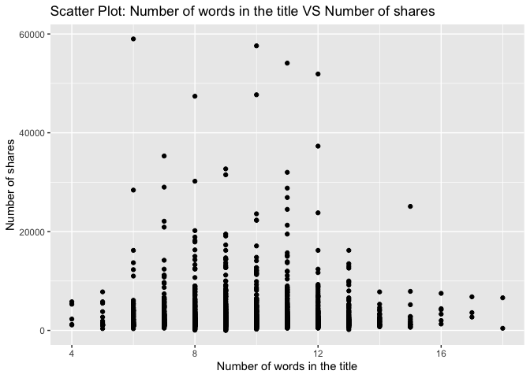
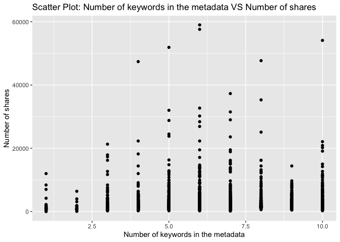
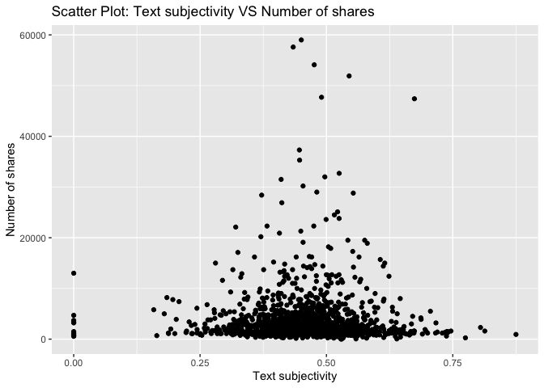

Project 3
================
Shaoyu Wang, Aniket Walimbe
2022-11-14

- <a href="#introduction" id="toc-introduction">Introduction</a>
- <a href="#required-packages" id="toc-required-packages">Required
  Packages</a>
- <a href="#data" id="toc-data">Data</a>
- <a href="#summarizations" id="toc-summarizations">Summarizations</a>
- <a href="#model" id="toc-model">Model</a>
- <a href="#comparison" id="toc-comparison">Comparison</a>
- <a href="#automation" id="toc-automation">Automation</a>

# Introduction

This [online news popularity data
set](https://archive.ics.uci.edu/ml/datasets/Online+News+Popularity)
summarizes a heterogeneous set of features about articles published by
Mashable in a period of two years.

# Required Packages

First, we need to load the required packages:

``` r
# Load libraries
library(readr)
library(tidyverse)
library(dplyr)
library(caret)
library(leaps)
library(ggplot2)
library(corrplot)
library(GGally)
library(randomForest)
```

# Data

Read in the data and subset the data to work on the data channel of
interest. We found that there are seven similar columns for weekday from
Monday to Sunday, so we merged these columns and named the new variable
as `publish_weekday`. For this step, we also removed the non-predictive
variables.

``` r
#Read in the data file
newsData <- read_csv("OnlineNewsPopularity.csv", show_col_types = FALSE)
#Choose the data channel of interest
if (params$channelID != "") {
  paramChannelName <- params$channelID
} else {
  paramChannelName <- "lifestyle"
}
channelID <- paste("data_channel_is_", paramChannelName, sep = "")
#Merge the weekday columns as one single column.
news <- newsData %>% 
  filter(.data[[channelID]] == 1) %>% 
  select(url, starts_with("weekday_is_")) %>% 
  pivot_longer(-url) %>% 
  filter(value != 0) %>% 
  mutate(publish_weekday = substr(name, 12, 20)) %>% 
  left_join(newsData, by = "url") %>% 
#Remove non predictive variables
  select(-c(url, name, value, timedelta, starts_with("data_channel_is_"), starts_with("weekday_is_")))
news$publish_weekday <- as.factor(news$publish_weekday)
news
```

Split the data into a training set and a test set.

``` r
set.seed(111)
trainIndex <- createDataPartition(news$shares, p = 0.7, list = FALSE)
newsTrain <- news[trainIndex,]
newsTest <- news[-trainIndex,]
#newsTrain
```

# Summarizations

For this part, we created some basic summary statistics and plots about
the training data.

- Tables

Firstly, let’s look at some tables. We summarized the training data, so
that we can know all of the variables roughly. For example, this table
shows each count for published on weekdays, we can see which has the
most count and which has the least count. It also shows the minimum, 1st
quantile, median, mean, 3rd quantile and maximum of other variables.

``` r
summary(newsTrain)
```

    ##   publish_weekday n_tokens_title   n_tokens_content n_unique_tokens  n_non_stop_words n_non_stop_unique_tokens
    ##  friday   :244    Min.   : 4.000   Min.   :   0.0   Min.   :0.0000   Min.   :0.0000   Min.   :0.0000          
    ##  monday   :252    1st Qu.: 8.000   1st Qu.: 251.0   1st Qu.:0.4644   1st Qu.:1.0000   1st Qu.:0.6179          
    ##  saturday :119    Median : 9.000   Median : 425.0   Median :0.5350   Median :1.0000   Median :0.6849          
    ##  sunday   : 89    Mean   : 9.598   Mean   : 604.2   Mean   :0.5359   Mean   :0.9939   Mean   :0.6834          
    ##  thursday :321    3rd Qu.:11.000   3rd Qu.: 754.0   3rd Qu.:0.6076   3rd Qu.:1.0000   3rd Qu.:0.7576          
    ##  tuesday  :311    Max.   :18.000   Max.   :4451.0   Max.   :0.9714   Max.   :1.0000   Max.   :1.0000          
    ##  wednesday:292                                                                                                
    ##    num_hrefs      num_self_hrefs      num_imgs        num_videos    average_token_length  num_keywords   
    ##  Min.   :  0.00   Min.   : 0.000   Min.   : 0.000   Min.   : 0.00   Min.   :0.000        Min.   : 1.000  
    ##  1st Qu.:  5.00   1st Qu.: 2.000   1st Qu.: 1.000   1st Qu.: 0.00   1st Qu.:4.480        1st Qu.: 5.000  
    ##  Median :  8.00   Median : 3.000   Median : 1.000   Median : 0.00   Median :4.648        Median : 6.000  
    ##  Mean   : 13.16   Mean   : 4.728   Mean   : 4.291   Mean   : 1.09   Mean   :4.623        Mean   : 6.507  
    ##  3rd Qu.: 14.25   3rd Qu.: 5.000   3rd Qu.: 3.000   3rd Qu.: 1.00   3rd Qu.:4.797        3rd Qu.: 8.000  
    ##  Max.   :171.00   Max.   :74.000   Max.   :62.000   Max.   :58.00   Max.   :5.569        Max.   :10.000  
    ##                                                                                                          
    ##    kw_min_min       kw_max_min        kw_avg_min       kw_min_max       kw_max_max       kw_avg_max    
    ##  Min.   : -1.00   Min.   :    0.0   Min.   :  -1.0   Min.   :     0   Min.   :     0   Min.   :     0  
    ##  1st Qu.: -1.00   1st Qu.:  428.0   1st Qu.: 175.2   1st Qu.:     0   1st Qu.:690400   1st Qu.:143373  
    ##  Median :  4.00   Median :  680.5   Median : 298.2   Median :  2200   Median :843300   Median :199310  
    ##  Mean   : 38.56   Mean   : 1132.0   Mean   : 367.1   Mean   : 26333   Mean   :714479   Mean   :225829  
    ##  3rd Qu.:  4.00   3rd Qu.: 1200.0   3rd Qu.: 433.6   3rd Qu.:  9825   3rd Qu.:843300   3rd Qu.:286838  
    ##  Max.   :217.00   Max.   :39400.0   Max.   :8461.7   Max.   :843300   Max.   :843300   Max.   :843300  
    ##                                                                                                        
    ##    kw_min_avg     kw_max_avg       kw_avg_avg    self_reference_min_shares self_reference_max_shares
    ##  Min.   :   0   Min.   :     0   Min.   :    0   Min.   :     0            Min.   :     0           
    ##  1st Qu.:   0   1st Qu.:  3858   1st Qu.: 2647   1st Qu.:   761            1st Qu.:  1600           
    ##  Median :1400   Median :  4375   Median : 3166   Median :  1600            Median :  4200           
    ##  Mean   :1333   Mean   :  5412   Mean   : 3223   Mean   :  5073            Mean   : 16379           
    ##  3rd Qu.:2500   3rd Qu.:  5448   3rd Qu.: 3632   3rd Qu.:  3325            3rd Qu.: 12700           
    ##  Max.   :3607   Max.   :237967   Max.   :36717   Max.   :158900            Max.   :690400           
    ##                                                                                                     
    ##  self_reference_avg_sharess   is_weekend         LDA_00            LDA_01            LDA_02            LDA_03       
    ##  Min.   :     0             Min.   :0.0000   Min.   :0.01818   Min.   :0.01818   Min.   :0.01818   Min.   :0.01843  
    ##  1st Qu.:  1500             1st Qu.:0.0000   1st Qu.:0.12561   1st Qu.:0.02521   1st Qu.:0.02951   1st Qu.:0.02880  
    ##  Median :  3300             Median :0.0000   Median :0.37543   Median :0.03338   Median :0.05084   Median :0.04074  
    ##  Mean   :  8717             Mean   :0.1278   Mean   :0.38744   Mean   :0.07846   Mean   :0.19689   Mean   :0.18081  
    ##  3rd Qu.:  7300             3rd Qu.:0.0000   3rd Qu.:0.60170   3rd Qu.:0.05005   3rd Qu.:0.30164   3rd Qu.:0.26893  
    ##  Max.   :349050             Max.   :1.0000   Max.   :0.92699   Max.   :0.91103   Max.   :0.91962   Max.   :0.91904  
    ##                                                                                                                     
    ##      LDA_04        global_subjectivity global_sentiment_polarity global_rate_positive_words
    ##  Min.   :0.01818   Min.   :0.0000      Min.   :-0.37500          Min.   :0.00000           
    ##  1st Qu.:0.03333   1st Qu.:0.4074      1st Qu.: 0.08846          1st Qu.:0.03481           
    ##  Median :0.05000   Median :0.4604      Median : 0.14261          Median :0.04569           
    ##  Mean   :0.15639   Mean   :0.4587      Mean   : 0.14490          Mean   :0.04620           
    ##  3rd Qu.:0.23095   3rd Qu.:0.5172      3rd Qu.: 0.19486          3rd Qu.:0.05648           
    ##  Max.   :0.91961   Max.   :0.8750      Max.   : 0.65500          Max.   :0.15549           
    ##                                                                                            
    ##  global_rate_negative_words rate_positive_words rate_negative_words avg_positive_polarity min_positive_polarity
    ##  Min.   :0.000000           Min.   :0.0000      Min.   :0.0000      Min.   :0.0000        Min.   :0.00000      
    ##  1st Qu.:0.009009           1st Qu.:0.6667      1st Qu.:0.1626      1st Qu.:0.3002        1st Qu.:0.03333      
    ##  Median :0.014354           Median :0.7500      Median :0.2432      Median :0.3571        Median :0.05000      
    ##  Mean   :0.015522           Mean   :0.7439      Mean   :0.2493      Mean   :0.3572        Mean   :0.07938      
    ##  3rd Qu.:0.020604           3rd Qu.:0.8333      3rd Qu.:0.3294      3rd Qu.:0.4153        3rd Qu.:0.10000      
    ##  Max.   :0.101695           Max.   :1.0000      Max.   :1.0000      Max.   :0.8333        Max.   :0.50000      
    ##                                                                                                                
    ##  max_positive_polarity avg_negative_polarity min_negative_polarity max_negative_polarity title_subjectivity
    ##  Min.   :0.0000        Min.   :-1.0000       Min.   :-1.0000       Min.   :-1.0000       Min.   :0.00000   
    ##  1st Qu.:0.6000        1st Qu.:-0.3167       1st Qu.:-0.8000       1st Qu.:-0.1250       1st Qu.:0.00000   
    ##  Median :0.8000        Median :-0.2482       Median :-0.5000       Median :-0.1000       Median :0.06667   
    ##  Mean   :0.7757        Mean   :-0.2567       Mean   :-0.5183       Mean   :-0.1116       Mean   :0.26332   
    ##  3rd Qu.:1.0000        3rd Qu.:-0.1812       3rd Qu.:-0.2917       3rd Qu.:-0.0500       3rd Qu.:0.48472   
    ##  Max.   :1.0000        Max.   : 0.0000       Max.   : 0.0000       Max.   : 0.0000       Max.   :1.00000   
    ##                                                                                                            
    ##  title_sentiment_polarity abs_title_subjectivity abs_title_sentiment_polarity     shares     
    ##  Min.   :-1.0000          Min.   :0.0000         Min.   :0.000000             Min.   :    8  
    ##  1st Qu.: 0.0000          1st Qu.:0.1854         1st Qu.:0.000000             1st Qu.: 1400  
    ##  Median : 0.0000          Median :0.5000         Median :0.007008             Median : 2100  
    ##  Mean   : 0.1000          Mean   :0.3502         Mean   :0.155915             Mean   : 3589  
    ##  3rd Qu.: 0.1529          3rd Qu.:0.5000         3rd Qu.:0.221250             3rd Qu.: 3800  
    ##  Max.   : 1.0000          Max.   :0.5000         Max.   :1.000000             Max.   :59000  
    ## 

Then we can check our response variable `shares`. It shows that the
mean, standard deviation, median, IQR of `shares` as follows.

``` r
#numerical summary for the variable shares
newsTrain %>% 
  summarise(mean = round(mean(shares), 0), sd = round(sd(shares), 0), 
            median = round(median(shares), 0), IQR = round(IQR(shares), 0))
```

We also obtain the numerical summaries on some subgroups.

``` r
#numerical summaries on subgroups
newsTrain %>% 
  group_by(publish_weekday) %>% 
  summarise(mean = round(mean(shares), 0), sd = round(sd(shares), 0), 
            median = round(median(shares), 0), IQR = round(IQR(shares), 0))
newsTrain %>% 
  group_by(num_imgs) %>% 
  summarise(mean = round(mean(shares), 0), sd = round(sd(shares), 0), 
            median = round(median(shares), 0), IQR = round(IQR(shares), 0))
newsTrain %>% 
  group_by(num_keywords) %>% 
  summarise(mean = round(mean(shares), 0), sd = round(sd(shares), 0), 
            median = round(median(shares), 0), IQR = round(IQR(shares), 0))
```

Moreover, we divide the title subjectivity into 3 categories:  
1. High: greater than 0.8  
2. Medium: 0.4 to less than 0.8  
3. Low: less than 0.4  
The contingency table is then shown below.

``` r
newsTrain$subject_activity_type <- ifelse(newsTrain$title_subjectivity >= 0.8, "High", 
                                          ifelse(newsTrain$title_subjectivity >= 0.4, "Medium",
                                                 ifelse(airquality$Wind >= 0, "Low")))
table(newsTrain$subject_activity_type)
```

    ## 
    ##   High    Low Medium 
    ##    164   1075    389

- Plots

Plotting the correlation between numeric variables.

``` r
newsTrainsub <- newsTrain %>% select(-c(publish_weekday, subject_activity_type))
correlation <- cor(newsTrainsub, method = "spearman")
corrplot(correlation, tl.col = "black", tl.cex = 0.5)
```

<!-- --> From the
correlation graph above, we can see that some variables are strongly
correlated.

For further EDA, we are plotting several graphs to see trends between
different variables with respect to the number of shares.

A plot between number of shares and article published day: This plot
shows the number of shares an article has based on the day it has been
published.

``` r
newsTrainday <- newsTrain %>%
  select(publish_weekday, shares) %>%
  group_by(publish_weekday) %>% 
  summarise(total_shares=sum(shares))

g <- ggplot(data = newsTrainday, aes(x=publish_weekday, y=total_shares))
g + geom_col(fill = "lightblue")+
  labs(title = " Shares for articles published based on weekdays")
```

<!-- -->

Here, we have plotted the histogram for number of words in a title for
the data. It can be seen that the graph shows the variable following
normal distribution.

``` r
g <- ggplot(newsTrain, aes(x = n_tokens_title))
g + geom_histogram(fill = "lightblue", binwidth = 1) + 
  labs(x = "Number of words in the title",
       title = "Histogram: Number of words in the title")
```

<!-- -->

Then we have plotted the histogram for number of words in content for
the data.

``` r
g <- ggplot(newsTrain, aes(x = n_tokens_content))
g + geom_histogram(fill = "lightblue") + 
  labs(x = "Number of words in the content", 
       title = "Histogram: Number of words in the content")
```

<!-- -->

A histogram for text subjectivity.

``` r
g <- ggplot(newsTrain, aes(x = global_subjectivity))
g + geom_histogram(fill = "lightblue") + 
  labs(x = "Text subjectivity", 
       title = "Histogram: Text subjectivity")
```

<!-- -->

A histogram for text sentiment polarity.

``` r
g <- ggplot(newsTrain, aes(x = global_sentiment_polarity))
g + geom_histogram(fill = "lightblue") + 
  labs(x = "Text sentiment polarity", 
       title = "Histogram: Text sentiment polarity")
```

<!-- -->

A plot between number of images and number of shares.

``` r
g <- ggplot(data = newsTrain, aes(x = num_imgs, y = shares))
g + geom_point() +
  labs(x = "Number of images" , y = "Number of shares", 
       title = "Scatter Plot: Number of images VS Number of shares") 
```

<!-- -->

A plot between average length of words in content and number of shares:
We can inspect the trend of the shares as a function of average length
of words in content.

``` r
g <- ggplot(newsTrain, aes(x = average_token_length, y = shares))
g + geom_point() + 
  labs(x = "Average token length" , y = "Number of shares", 
       title = "Scatter Plot: Average token length VS Number of shares")
```

<!-- -->

A plot between title subjectivity and number of shares: We can inspect
the trend of the shares as a function of title subjectivity.

``` r
g <- ggplot(data = newsTrain, aes(x = title_subjectivity, y = shares))
g + geom_point() + 
  labs(x = "Title subjectivity" , y = "Number of shares", 
       title = "Scatter Plot: Title subjectivity VS Number of shares") 
```

<!-- -->

Select predictors: publish_weekday, n_tokens_title, n_tokens_content,
num_self_hrefs, num_imgs, average_token_length, num_keywords,
kw_avg_avg, self_reference_avg_sharess, LDA_04, global_subjectivity,
global_sentiment_polarity, avg_positive_polarity, avg_negative_polarity,
title_subjectivity, shares.

``` r
set.seed(111)
Train <- newsTrain %>% 
  select(publish_weekday, n_tokens_title, n_tokens_content, num_self_hrefs, num_imgs, average_token_length, num_keywords, kw_avg_avg, self_reference_avg_sharess, LDA_04, global_subjectivity, global_sentiment_polarity, avg_positive_polarity, avg_negative_polarity, title_subjectivity, shares)
Test <- newsTest %>% 
  select(publish_weekday, n_tokens_title, n_tokens_content, num_self_hrefs, num_imgs, average_token_length, num_keywords, kw_avg_avg, self_reference_avg_sharess, LDA_04, global_subjectivity, global_sentiment_polarity, avg_positive_polarity, avg_negative_polarity, title_subjectivity, shares)
#Train
```

# Model

- Linear Regression Model

Here, we have fitted a forward stepwise linear regression model for the
training dataset having 15 variables. The data is centered and scaled
and number of shares is the response variable.

``` r
#forward stepwise
set.seed(111)
fwFit <- train(shares ~ ., data = Train,
               method = "leapForward",
               preProcess = c("center", "scale"))
#summary(fwFit)
fwFit
```

    ## Linear Regression with Forward Selection 
    ## 
    ## 1628 samples
    ##   15 predictor
    ## 
    ## Pre-processing: centered (20), scaled (20) 
    ## Resampling: Bootstrapped (25 reps) 
    ## Summary of sample sizes: 1628, 1628, 1628, 1628, 1628, 1628, ... 
    ## Resampling results across tuning parameters:
    ## 
    ##   nvmax  RMSE      Rsquared    MAE     
    ##   2      4892.750  0.01874478  2581.009
    ##   3      4891.167  0.02064502  2571.821
    ##   4      4889.889  0.02220812  2568.841
    ## 
    ## RMSE was used to select the optimal model using the smallest value.
    ## The final value used for the model was nvmax = 4.

Here, we have fitted a backward stepwise linear regression model for the
training dataset having 15 variables. The data is centered and scaled
and number of shares is the response variable.

``` r
#backward stepwise
set.seed(111)
bwFit <- train(shares ~ ., data = Train,
               method = "leapBackward",
               preProcess = c("center", "scale"))
#summary(bwFit)
bwFit
```

    ## Linear Regression with Backwards Selection 
    ## 
    ## 1628 samples
    ##   15 predictor
    ## 
    ## Pre-processing: centered (20), scaled (20) 
    ## Resampling: Bootstrapped (25 reps) 
    ## Summary of sample sizes: 1628, 1628, 1628, 1628, 1628, 1628, ... 
    ## Resampling results across tuning parameters:
    ## 
    ##   nvmax  RMSE      Rsquared    MAE     
    ##   2      4892.888  0.01880810  2580.747
    ##   3      4893.382  0.01976688  2567.257
    ##   4      4892.298  0.02209367  2563.145
    ## 
    ## RMSE was used to select the optimal model using the smallest value.
    ## The final value used for the model was nvmax = 4.

``` r
#fit a linear regression model with all predictors
set.seed(111)
lrFit <- train(shares ~ ., data = Train,
               method = "lm",
               trControl = trainControl(method = "cv", number = 5))
lrFit
```

    ## Linear Regression 
    ## 
    ## 1628 samples
    ##   15 predictor
    ## 
    ## No pre-processing
    ## Resampling: Cross-Validated (5 fold) 
    ## Summary of sample sizes: 1303, 1303, 1302, 1302, 1302 
    ## Resampling results:
    ## 
    ##   RMSE      Rsquared    MAE     
    ##   4783.083  0.04552466  2537.591
    ## 
    ## Tuning parameter 'intercept' was held constant at a value of TRUE

- Random Forest Model

Here, we have fitted a random forest model which is chosen using the
cross validation method. The RMSE value for the model is as shown below.
The tuning parameter is given as number of columns in the training data
divided by 3.

``` r
set.seed(111)
randomFit <- train(shares ~ ., 
                   data = Train, 
                   method = "rf",
                   preProcess = c("center","scale"),
                   trControl = trainControl(method = "cv", number = 5),
                   tuneGrid = data.frame(mtry = ncol(Train)/3))
randomFit
```

    ## Random Forest 
    ## 
    ## 1628 samples
    ##   15 predictor
    ## 
    ## Pre-processing: centered (20), scaled (20) 
    ## Resampling: Cross-Validated (5 fold) 
    ## Summary of sample sizes: 1303, 1303, 1302, 1302, 1302 
    ## Resampling results:
    ## 
    ##   RMSE      Rsquared    MAE     
    ##   4759.569  0.06167113  2588.768
    ## 
    ## Tuning parameter 'mtry' was held constant at a value of 5.333333

- Boosted Tree Model

Here, we have fitted a random forest model which is chosen using the
cross validation method. The RMSE value for the model is as shown below.
Tuning parameters are n.trees, interaction.depth, shrinkage and
n.minobsinnode.

``` r
set.seed(111)
boostedFit <- train(shares ~ ., 
                    data = Train, 
                    method = "gbm", 
                    preProcess = c("center", "scale"),
                    trControl = trainControl(method = "cv", number = 5),
                    tuneGrid = expand.grid(n.trees = c(25,50,100,150,200), 
                                           interaction.depth = c(1,2,3,4), 
                                           shrinkage = 0.1, 
                                           n.minobsinnode = 10),
                    verbose = FALSE)
boostedFit
```

    ## Stochastic Gradient Boosting 
    ## 
    ## 1628 samples
    ##   15 predictor
    ## 
    ## Pre-processing: centered (20), scaled (20) 
    ## Resampling: Cross-Validated (5 fold) 
    ## Summary of sample sizes: 1303, 1303, 1302, 1302, 1302 
    ## Resampling results across tuning parameters:
    ## 
    ##   interaction.depth  n.trees  RMSE      Rsquared    MAE     
    ##   1                   25      4741.131  0.05823997  2534.630
    ##   1                   50      4744.490  0.05925337  2533.048
    ##   1                  100      4749.966  0.06056469  2529.897
    ##   1                  150      4763.388  0.06290918  2527.118
    ##   1                  200      4769.132  0.06093999  2522.313
    ##   2                   25      4742.178  0.06278215  2521.818
    ##   2                   50      4800.087  0.05361366  2552.341
    ##   2                  100      4826.579  0.05191358  2543.646
    ##   2                  150      4858.653  0.04674066  2575.331
    ##   2                  200      4885.128  0.04728002  2604.395
    ##   3                   25      4755.308  0.06160296  2548.110
    ##   3                   50      4797.850  0.06187844  2548.833
    ##   3                  100      4888.660  0.04566121  2595.853
    ##   3                  150      4951.491  0.03962053  2652.244
    ##   3                  200      4996.497  0.03547700  2685.983
    ##   4                   25      4795.248  0.05146932  2545.585
    ##   4                   50      4852.117  0.05112121  2572.936
    ##   4                  100      4916.303  0.04824609  2636.378
    ##   4                  150      4988.077  0.04087558  2666.143
    ##   4                  200      5045.623  0.03639005  2722.158
    ## 
    ## Tuning parameter 'shrinkage' was held constant at a value of 0.1
    ## Tuning parameter 'n.minobsinnode' was held
    ##  constant at a value of 10
    ## RMSE was used to select the optimal model using the smallest value.
    ## The final values used for the model were n.trees = 25, interaction.depth = 1, shrinkage = 0.1 and n.minobsinnode = 10.

# Comparison

All the models are compared by RMSE on the test set.

``` r
#fit a linear regression model
fw_mod <- postResample(predict(fwFit, newdata = Test), obs = Test$shares)
bw_mod <- postResample(predict(bwFit, newdata = Test), obs = Test$shares)
lr_mod <- postResample(predict(lrFit, newdata = Test), obs = Test$shares)
#random forest
random_mod <- postResample(predict(randomFit, newdata = Test), obs = Test$shares)
#boosted tree
boosted_mod <- postResample(predict(boostedFit, newdata = Test), obs = Test$shares)
#compare all models
tibble(model = c("Forward",
                 "Backward",
                 "LR with all predictors",
                 "Random Forest",
                 "Boosted Tree"), 
       RMSE = c(fw_mod[1],
                bw_mod[1],
                lr_mod[1],
                random_mod[1],
                boosted_mod[1]))
```

# Automation

``` r
#create channel names
channelID <- data.frame("lifestyle", "entertainment", "bus", "socmed", "tech", "world")
#create filenames
output_file <- paste0(channelID,".md")
#create a list for each channel with the channel name parameter
params = lapply(channelID, FUN = function(x){list(channelID = x)})
#put into a data frame
reports <- tibble(output_file, params)
#render code
apply(reports, MARGIN = 1,
          FUN = function(x){
             rmarkdown::render(input = "project3.Rmd",
             output_format = "github_document",
             output_file = x[[1]],
             params = x[[2]],
             output_options = list(toc=TRUE, toc_depth=1, toc_float=TRUE))
             })
```
