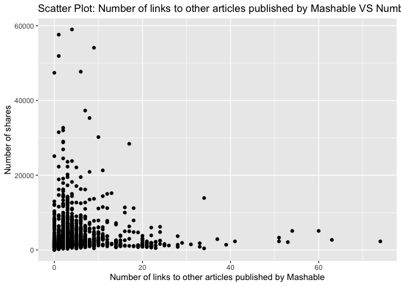
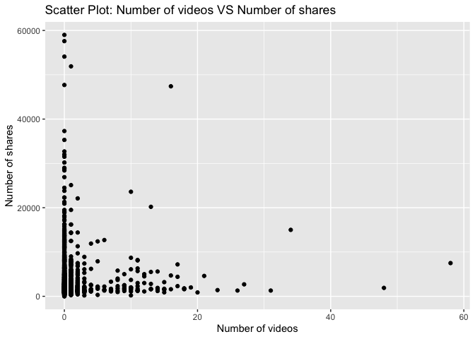

Project 3
================
Shaoyu Wang, Aniket Walimbe
2022-11-14

-   <a href="#introduction" id="toc-introduction">Introduction</a>
-   <a href="#required-packages" id="toc-required-packages">Required
    Packages</a>
-   <a href="#data" id="toc-data">Data</a>
-   <a href="#summarizations" id="toc-summarizations">Summarizations</a>
-   <a href="#model" id="toc-model">Model</a>
-   <a href="#comparison" id="toc-comparison">Comparison</a>
-   <a href="#automation" id="toc-automation">Automation</a>

# Introduction

This [online News Popularity Data
Set](https://archive.ics.uci.edu/ml/datasets/Online+News+Popularity)
summarizes a heterogeneous set of features about articles published by
Mashable in a period of two years.

# Required Packages

First, we will load the required packages:

``` r
# Load libraries
library(readr)
library(tidyverse)
library(dplyr)
library(caret)
library(leaps)
library(ggplot2)
library(corrplot)
library(GGally)
library(randomForest)
```

# Data

Read in the data and subset the data to work on the data channel of
interest. We found that there are seven similar columns for weekday from
Monday to Sunday, so we merged these columns and named the new variable
as `publush_weekday`. For this step, we also removed the non-predictive
variables.

``` r
#Read in the data file
newsData <- read_csv("OnlineNewsPopularity.csv",show_col_types = FALSE)
#Choose the data channel of interest
if (params$channel != "") {
  paramChannelName <- params$channel
} else {
  paramChannelName <- "lifestyle"
}
channel <- paste("data_channel_is_", paramChannelName, sep = "")
#Merge the weekdays columns as one single column.
news <- newsData %>% 
  filter(.data[[channel]] == 1) %>% 
  select(url, starts_with("weekday_is_")) %>% 
  pivot_longer(-url) %>% 
  filter(value != 0) %>% 
  mutate(publish_weekday = substr(name, 12, 20)) %>% 
  left_join(newsData, by = "url") %>% 
#Remove non predictive variables
  select(-c(url, name, value, timedelta, starts_with("data_channel_is_"), starts_with("weekday_is_")))
news$publish_weekday <- as.factor(news$publish_weekday)
news
```

    ## # A tibble: 2,323 × 47
    ##    publish_…¹ n_tok…² n_tok…³ n_uni…⁴ n_non…⁵ n_non…⁶ num_h…⁷ num_s…⁸ num_i…⁹
    ##    <fct>        <dbl>   <dbl>   <dbl>   <dbl>   <dbl>   <dbl>   <dbl>   <dbl>
    ##  1 monday           8     257   0.568    1.00   0.671       9       7       0
    ##  2 monday           8     218   0.663    1.00   0.688      14       3      11
    ##  3 monday           9    1226   0.410    1.00   0.617      10      10       1
    ##  4 monday          10    1121   0.451    1.00   0.629      15      11       1
    ##  5 wednesday        9     168   0.778    1.00   0.865       6       4      11
    ##  6 wednesday        9     100   0.760    1.00   0.803       3       2       1
    ##  7 wednesday       10    1596   0.420    1.00   0.632      19      10       8
    ##  8 thursday         7     518   0.486    1.00   0.654      11       1       1
    ##  9 friday           8     358   0.503    1.00   0.687       4       4       1
    ## 10 friday           6     358   0.622    1.00   0.777      24       6       1
    ## # … with 2,313 more rows, 38 more variables: num_videos <dbl>,
    ## #   average_token_length <dbl>, num_keywords <dbl>, kw_min_min <dbl>,
    ## #   kw_max_min <dbl>, kw_avg_min <dbl>, kw_min_max <dbl>, kw_max_max <dbl>,
    ## #   kw_avg_max <dbl>, kw_min_avg <dbl>, kw_max_avg <dbl>, kw_avg_avg <dbl>,
    ## #   self_reference_min_shares <dbl>, self_reference_max_shares <dbl>,
    ## #   self_reference_avg_sharess <dbl>, is_weekend <dbl>, LDA_00 <dbl>,
    ## #   LDA_01 <dbl>, LDA_02 <dbl>, LDA_03 <dbl>, LDA_04 <dbl>, …

Split the data into a training set and a test set.

``` r
set.seed(111)
trainIndex <- createDataPartition(news$shares, p = 0.7, list = FALSE)
newsTrain <- news[trainIndex,]
newsTest <- news[-trainIndex,]
#newsTrain
```

# Summarizations

Some basic summary statistics and plots about the training data.

## Tables

Firstly, we summarized the training data.

``` r
summary(newsTrain)
```

    ##   publish_weekday n_tokens_title   n_tokens_content n_unique_tokens 
    ##  friday   :244    Min.   : 4.000   Min.   :   0.0   Min.   :0.0000  
    ##  monday   :252    1st Qu.: 8.000   1st Qu.: 251.0   1st Qu.:0.4644  
    ##  saturday :119    Median : 9.000   Median : 425.0   Median :0.5350  
    ##  sunday   : 89    Mean   : 9.598   Mean   : 604.2   Mean   :0.5359  
    ##  thursday :321    3rd Qu.:11.000   3rd Qu.: 754.0   3rd Qu.:0.6076  
    ##  tuesday  :311    Max.   :18.000   Max.   :4451.0   Max.   :0.9714  
    ##  wednesday:292                                                      
    ##  n_non_stop_words n_non_stop_unique_tokens   num_hrefs      num_self_hrefs  
    ##  Min.   :0.0000   Min.   :0.0000           Min.   :  0.00   Min.   : 0.000  
    ##  1st Qu.:1.0000   1st Qu.:0.6179           1st Qu.:  5.00   1st Qu.: 2.000  
    ##  Median :1.0000   Median :0.6849           Median :  8.00   Median : 3.000  
    ##  Mean   :0.9939   Mean   :0.6834           Mean   : 13.16   Mean   : 4.728  
    ##  3rd Qu.:1.0000   3rd Qu.:0.7576           3rd Qu.: 14.25   3rd Qu.: 5.000  
    ##  Max.   :1.0000   Max.   :1.0000           Max.   :171.00   Max.   :74.000  
    ##                                                                             
    ##     num_imgs        num_videos    average_token_length  num_keywords   
    ##  Min.   : 0.000   Min.   : 0.00   Min.   :0.000        Min.   : 1.000  
    ##  1st Qu.: 1.000   1st Qu.: 0.00   1st Qu.:4.480        1st Qu.: 5.000  
    ##  Median : 1.000   Median : 0.00   Median :4.648        Median : 6.000  
    ##  Mean   : 4.291   Mean   : 1.09   Mean   :4.623        Mean   : 6.507  
    ##  3rd Qu.: 3.000   3rd Qu.: 1.00   3rd Qu.:4.797        3rd Qu.: 8.000  
    ##  Max.   :62.000   Max.   :58.00   Max.   :5.569        Max.   :10.000  
    ##                                                                        
    ##    kw_min_min       kw_max_min        kw_avg_min       kw_min_max    
    ##  Min.   : -1.00   Min.   :    0.0   Min.   :  -1.0   Min.   :     0  
    ##  1st Qu.: -1.00   1st Qu.:  428.0   1st Qu.: 175.2   1st Qu.:     0  
    ##  Median :  4.00   Median :  680.5   Median : 298.2   Median :  2200  
    ##  Mean   : 38.56   Mean   : 1132.0   Mean   : 367.1   Mean   : 26333  
    ##  3rd Qu.:  4.00   3rd Qu.: 1200.0   3rd Qu.: 433.6   3rd Qu.:  9825  
    ##  Max.   :217.00   Max.   :39400.0   Max.   :8461.7   Max.   :843300  
    ##                                                                      
    ##    kw_max_max       kw_avg_max       kw_min_avg     kw_max_avg    
    ##  Min.   :     0   Min.   :     0   Min.   :   0   Min.   :     0  
    ##  1st Qu.:690400   1st Qu.:143373   1st Qu.:   0   1st Qu.:  3858  
    ##  Median :843300   Median :199310   Median :1400   Median :  4375  
    ##  Mean   :714479   Mean   :225829   Mean   :1333   Mean   :  5412  
    ##  3rd Qu.:843300   3rd Qu.:286838   3rd Qu.:2500   3rd Qu.:  5448  
    ##  Max.   :843300   Max.   :843300   Max.   :3607   Max.   :237967  
    ##                                                                   
    ##    kw_avg_avg    self_reference_min_shares self_reference_max_shares
    ##  Min.   :    0   Min.   :     0            Min.   :     0           
    ##  1st Qu.: 2647   1st Qu.:   761            1st Qu.:  1600           
    ##  Median : 3166   Median :  1600            Median :  4200           
    ##  Mean   : 3223   Mean   :  5073            Mean   : 16379           
    ##  3rd Qu.: 3632   3rd Qu.:  3325            3rd Qu.: 12700           
    ##  Max.   :36717   Max.   :158900            Max.   :690400           
    ##                                                                     
    ##  self_reference_avg_sharess   is_weekend         LDA_00       
    ##  Min.   :     0             Min.   :0.0000   Min.   :0.01818  
    ##  1st Qu.:  1500             1st Qu.:0.0000   1st Qu.:0.12561  
    ##  Median :  3300             Median :0.0000   Median :0.37543  
    ##  Mean   :  8717             Mean   :0.1278   Mean   :0.38744  
    ##  3rd Qu.:  7300             3rd Qu.:0.0000   3rd Qu.:0.60170  
    ##  Max.   :349050             Max.   :1.0000   Max.   :0.92699  
    ##                                                               
    ##      LDA_01            LDA_02            LDA_03            LDA_04       
    ##  Min.   :0.01818   Min.   :0.01818   Min.   :0.01843   Min.   :0.01818  
    ##  1st Qu.:0.02521   1st Qu.:0.02951   1st Qu.:0.02880   1st Qu.:0.03333  
    ##  Median :0.03338   Median :0.05084   Median :0.04074   Median :0.05000  
    ##  Mean   :0.07846   Mean   :0.19689   Mean   :0.18081   Mean   :0.15639  
    ##  3rd Qu.:0.05005   3rd Qu.:0.30164   3rd Qu.:0.26893   3rd Qu.:0.23095  
    ##  Max.   :0.91103   Max.   :0.91962   Max.   :0.91904   Max.   :0.91961  
    ##                                                                         
    ##  global_subjectivity global_sentiment_polarity global_rate_positive_words
    ##  Min.   :0.0000      Min.   :-0.37500          Min.   :0.00000           
    ##  1st Qu.:0.4074      1st Qu.: 0.08846          1st Qu.:0.03481           
    ##  Median :0.4604      Median : 0.14261          Median :0.04569           
    ##  Mean   :0.4587      Mean   : 0.14490          Mean   :0.04620           
    ##  3rd Qu.:0.5172      3rd Qu.: 0.19486          3rd Qu.:0.05648           
    ##  Max.   :0.8750      Max.   : 0.65500          Max.   :0.15549           
    ##                                                                          
    ##  global_rate_negative_words rate_positive_words rate_negative_words
    ##  Min.   :0.000000           Min.   :0.0000      Min.   :0.0000     
    ##  1st Qu.:0.009009           1st Qu.:0.6667      1st Qu.:0.1626     
    ##  Median :0.014354           Median :0.7500      Median :0.2432     
    ##  Mean   :0.015522           Mean   :0.7439      Mean   :0.2493     
    ##  3rd Qu.:0.020604           3rd Qu.:0.8333      3rd Qu.:0.3294     
    ##  Max.   :0.101695           Max.   :1.0000      Max.   :1.0000     
    ##                                                                    
    ##  avg_positive_polarity min_positive_polarity max_positive_polarity
    ##  Min.   :0.0000        Min.   :0.00000       Min.   :0.0000       
    ##  1st Qu.:0.3002        1st Qu.:0.03333       1st Qu.:0.6000       
    ##  Median :0.3571        Median :0.05000       Median :0.8000       
    ##  Mean   :0.3572        Mean   :0.07938       Mean   :0.7757       
    ##  3rd Qu.:0.4153        3rd Qu.:0.10000       3rd Qu.:1.0000       
    ##  Max.   :0.8333        Max.   :0.50000       Max.   :1.0000       
    ##                                                                   
    ##  avg_negative_polarity min_negative_polarity max_negative_polarity
    ##  Min.   :-1.0000       Min.   :-1.0000       Min.   :-1.0000      
    ##  1st Qu.:-0.3167       1st Qu.:-0.8000       1st Qu.:-0.1250      
    ##  Median :-0.2482       Median :-0.5000       Median :-0.1000      
    ##  Mean   :-0.2567       Mean   :-0.5183       Mean   :-0.1116      
    ##  3rd Qu.:-0.1812       3rd Qu.:-0.2917       3rd Qu.:-0.0500      
    ##  Max.   : 0.0000       Max.   : 0.0000       Max.   : 0.0000      
    ##                                                                   
    ##  title_subjectivity title_sentiment_polarity abs_title_subjectivity
    ##  Min.   :0.00000    Min.   :-1.0000          Min.   :0.0000        
    ##  1st Qu.:0.00000    1st Qu.: 0.0000          1st Qu.:0.1854        
    ##  Median :0.06667    Median : 0.0000          Median :0.5000        
    ##  Mean   :0.26332    Mean   : 0.1000          Mean   :0.3502        
    ##  3rd Qu.:0.48472    3rd Qu.: 0.1529          3rd Qu.:0.5000        
    ##  Max.   :1.00000    Max.   : 1.0000          Max.   :0.5000        
    ##                                                                    
    ##  abs_title_sentiment_polarity     shares     
    ##  Min.   :0.000000             Min.   :    8  
    ##  1st Qu.:0.000000             1st Qu.: 1400  
    ##  Median :0.007008             Median : 2100  
    ##  Mean   :0.155915             Mean   : 3589  
    ##  3rd Qu.:0.221250             3rd Qu.: 3800  
    ##  Max.   :1.000000             Max.   :59000  
    ## 

Then let’s check our response variable `shares`. It shows that the mean
of `shares` is 3847, standard deviation is 10112, median is 1700, IQR is
2125.

``` r
#numerical summary for the variable shares
newsTrain %>% 
  summarise(mean = round(mean(shares), 0), sd = round(sd(shares), 0), 
            median = round(median(shares), 0), IQR = round(IQR(shares), 0))
```

    ## # A tibble: 1 × 4
    ##    mean    sd median   IQR
    ##   <dbl> <dbl>  <dbl> <dbl>
    ## 1  3589  4962   2100  2400

``` r
#numerical summaries on subgroups
newsTrain %>% 
  group_by(publish_weekday) %>% 
  summarise(mean = round(mean(shares), 0), sd = round(sd(shares), 0), 
            median = round(median(shares), 0), IQR = round(IQR(shares), 0))
```

    ## # A tibble: 7 × 5
    ##   publish_weekday  mean    sd median   IQR
    ##   <fct>           <dbl> <dbl>  <dbl> <dbl>
    ## 1 friday           4019  5433   2200  2825
    ## 2 monday           4093  6371   2200  2825
    ## 3 saturday         3426  3817   2300  2150
    ## 4 sunday           4487  6363   2300  3300
    ## 5 thursday         3182  3315   2100  2300
    ## 6 tuesday          3070  3865   1900  2100
    ## 7 wednesday        3587  5547   2100  2500

``` r
newsTrain %>% 
  group_by(num_imgs) %>% 
  summarise(mean = round(mean(shares), 0), sd = round(sd(shares), 0), 
            median = round(median(shares), 0), IQR = round(IQR(shares), 0))
```

    ## # A tibble: 46 × 5
    ##    num_imgs  mean    sd median   IQR
    ##       <dbl> <dbl> <dbl>  <dbl> <dbl>
    ##  1        0  3042  3922   1700  2025
    ##  2        1  3476  4700   2200  2400
    ##  3        2  4355  6640   2600  3100
    ##  4        3  3704  3968   2550  2225
    ##  5        4  4033  5180   2400  1650
    ##  6        5  2748  1929   2100  2375
    ##  7        6  5895 13545   2100  1600
    ##  8        7  4563  5080   2400  3300
    ##  9        8  4954  6273   3150  4475
    ## 10        9  6572  9474   2100  3800
    ## # … with 36 more rows

``` r
newsTrain %>% 
  group_by(num_videos) %>% 
  summarise(mean = round(mean(shares), 0), sd = round(sd(shares), 0), 
            median = round(median(shares), 0), IQR = round(IQR(shares), 0))
```

    ## # A tibble: 29 × 5
    ##    num_videos  mean    sd median   IQR
    ##         <dbl> <dbl> <dbl>  <dbl> <dbl>
    ##  1          0  3760  5166   2300  2600
    ##  2          1  3271  4541   2000  2100
    ##  3          2  2583  2848   1700  1400
    ##  4          3  2379  2112   1400  1325
    ##  5          4  2933  3151   1600  1175
    ##  6          5  4060  4402   2100  3300
    ##  7          6  3820  4977   1500   800
    ##  8          7  1700   807   1400   300
    ##  9          8  2839  1736   2300  2300
    ## 10          9  2325  1179   2100   850
    ## # … with 19 more rows

``` r
newsTrain %>% 
  group_by(num_keywords) %>% 
  summarise(mean = round(mean(shares), 0), sd = round(sd(shares), 0), 
            median = round(median(shares), 0), IQR = round(IQR(shares), 0))
```

    ## # A tibble: 10 × 5
    ##    num_keywords  mean    sd median   IQR
    ##           <dbl> <dbl> <dbl>  <dbl> <dbl>
    ##  1            1  1860  2504   1150   934
    ##  2            2  1615  1579    930  1051
    ##  3            3  3353  4193   1700  2450
    ##  4            4  3099  4389   2000  2100
    ##  5            5  3714  5235   2100  2625
    ##  6            6  4246  6518   2200  2800
    ##  7            7  3541  4547   2200  2300
    ##  8            8  3760  4960   2300  2100
    ##  9            9  2977  2181   2200  2300
    ## 10           10  3816  5179   2300  2600

Contingency tables :  
Here, the title subjectivity is divided into 3 categories : high, medium
and low based on the values. If the value is greater than 0.8, it is
high, greater than 0.4 and less than 0.8 is medium and remaining is low.
The contingency table is then shown below.

``` r
newsTrain$subject_activity_type <- ifelse(newsTrain$title_subjectivity >= 0.8, "High", 
                                          ifelse(newsTrain$title_subjectivity >= 0.4, "Medium",
                                                 ifelse(airquality$Wind >= 0, "Low", "None")))
table(newsTrain$subject_activity_type)
```

    ## 
    ##   High    Low Medium 
    ##    164   1075    389

The contingency table below shows the counts for each published weekday.
From this table, we can find that the highest count is Wednesday, the
lowest count is Saturday.

``` r
table(newsTrain$publish_weekday)
```

    ## 
    ##    friday    monday  saturday    sunday  thursday   tuesday wednesday 
    ##       244       252       119        89       321       311       292

## Plots

``` r
g <- ggplot(newsTrain, aes(x = n_tokens_title))
g + geom_histogram(fill = "lightblue", binwidth = 1) + 
  labs()
```

<!-- -->

``` r
g <- ggplot(newsTrain, aes(x = n_tokens_content))
g + geom_histogram(fill = "lightblue") + 
  labs()
```

<!-- -->

``` r
g <- ggplot(newsTrain, aes(x = global_subjectivity))
g + geom_histogram(fill = "lightblue") + 
  labs()
```

<!-- -->

``` r
g <- ggplot(newsTrain, aes(x = global_sentiment_polarity))
g + geom_histogram(fill = "lightblue") + 
  labs()
```

<!-- -->

``` r
g <- ggplot(newsTrain, aes(x = rate_positive_words, y = shares))
g + geom_point() + 
  labs()
```

<!-- -->

``` r
g <- ggplot(newsTrain, aes(x = average_token_length, y = shares))
g + geom_point() + 
  labs()
```

<!-- -->

Plot between title subjectivity and number of shares: We can inspect the
trend of the shares as a function of title subjectivity.

``` r
g <- ggplot(data = newsTrain, aes(x = title_subjectivity, y = shares))
g + geom_point() + 
  labs(x = "Title subjectivity" , y = "Number of shares", title = "Scatter Plot : Title Subjectivity Vs Number of Shares") 
```

<!-- -->

Plot between number of shares and article published day: This plot shows
the number of shares an article has based on the day it has been
published.

``` r
newsTrainday <- newsTrain %>%
  select(publish_weekday, shares) %>%
  group_by(publish_weekday) %>% 
  summarise(total_shares=sum(shares))

g <- ggplot(data = newsTrainday, aes(x=publish_weekday, y=total_shares))
g + geom_col(fill = "lightblue")+
  labs(title = " Shares for articles published based on weekdays")
```

<!-- -->

Plot between number of images and number of shares:

``` r
g <- ggplot(data = newsTrain, aes(x = num_imgs, y = shares))
g + geom_point() +
  labs(x = "Number of Images" , y = "Number of shares", title = "Scatter Plot : Number of Images Vs Number of Shares") 
```

<!-- -->

Plotting the correlation between numeric variables.

``` r
correlation <- cor(newsTrain %>% select(-c(publish_weekday, subject_activity_type)), method = "spearman")
corrplot(correlation, type = "upper", tl.pos = "lt", tl.col = "black", tl.cex = 0.5, mar = c(2, 0, 1, 0)) 
corrplot(correlation, type = "lower", add = TRUE, diag = FALSE, tl.pos = "n", number.cex = 0.5)
```

<!-- -->

Select predictors: publish_weekday, n_tokens_title, n_tokens_content,
num_self_hrefs, num_videos, average_token_length, num_keywords,
kw_avg_avg, self_reference_avg_sharess, LDA_04, global_subjectivity,
global_sentiment_polarity, avg_positive_polarity, avg_negative_polarity,
title_subjectivity, shares.

``` r
set.seed(111)
Train <- newsTrain %>% 
  select(publish_weekday, n_tokens_title, n_tokens_content, num_self_hrefs, num_videos, average_token_length, num_keywords, kw_avg_avg, self_reference_avg_sharess, LDA_04, global_subjectivity, global_sentiment_polarity, avg_positive_polarity, avg_negative_polarity, title_subjectivity, shares)
Test <- newsTest %>% 
  select(publish_weekday, n_tokens_title, n_tokens_content, num_self_hrefs, num_videos, average_token_length, num_keywords, kw_avg_avg, self_reference_avg_sharess, LDA_04, global_subjectivity, global_sentiment_polarity, avg_positive_polarity, avg_negative_polarity, title_subjectivity, shares)
Train
```

    ## # A tibble: 1,628 × 16
    ##    publish_…¹ n_tok…² n_tok…³ num_s…⁴ num_v…⁵ avera…⁶ num_k…⁷ kw_av…⁸ self_…⁹
    ##    <fct>        <dbl>   <dbl>   <dbl>   <dbl>   <dbl>   <dbl>   <dbl>   <dbl>
    ##  1 monday           8     257       7       1    4.64       9      0    1775 
    ##  2 monday           9    1226      10       1    4.39       7      0    2858.
    ##  3 wednesday        9     100       2       0    4.45       6   1072.   1800 
    ##  4 wednesday       10    1596      10       0    4.63       6   1564.   2300 
    ##  5 thursday         7     518       1       0    4.79       7   1862.   3500 
    ##  6 friday           8     358       4       0    4.25       4   2210.  10400 
    ##  7 friday           6     358       6       0    5.39       8   1398.   1600 
    ##  8 friday          11     151       1       0    4.40       9   1385.   1500 
    ##  9 saturday        13     293       5       0    4.67       8   2187.   1700 
    ## 10 monday          10     205       1       0    4.37       5   1455.      0 
    ## # … with 1,618 more rows, 7 more variables: LDA_04 <dbl>,
    ## #   global_subjectivity <dbl>, global_sentiment_polarity <dbl>,
    ## #   avg_positive_polarity <dbl>, avg_negative_polarity <dbl>,
    ## #   title_subjectivity <dbl>, shares <dbl>, and abbreviated variable names
    ## #   ¹​publish_weekday, ²​n_tokens_title, ³​n_tokens_content, ⁴​num_self_hrefs,
    ## #   ⁵​num_videos, ⁶​average_token_length, ⁷​num_keywords, ⁸​kw_avg_avg,
    ## #   ⁹​self_reference_avg_sharess

# Model

## Linear Regression Model

``` r
#forward stepwise
set.seed(111)
fwFit <- train(shares ~ ., data = Train,
                   method = "leapForward",
                   preProcess = c("center", "scale"))
fwFit
```

    ## Linear Regression with Forward Selection 
    ## 
    ## 1628 samples
    ##   15 predictor
    ## 
    ## Pre-processing: centered (20), scaled (20) 
    ## Resampling: Bootstrapped (25 reps) 
    ## Summary of sample sizes: 1628, 1628, 1628, 1628, 1628, 1628, ... 
    ## Resampling results across tuning parameters:
    ## 
    ##   nvmax  RMSE      Rsquared    MAE     
    ##   2      4892.750  0.01874478  2581.009
    ##   3      4890.748  0.02082934  2573.204
    ##   4      4892.585  0.02156586  2570.375
    ## 
    ## RMSE was used to select the optimal model using the smallest value.
    ## The final value used for the model was nvmax = 3.

``` r
#summary(fwFit)
```

``` r
#backward stepwise
set.seed(111)
bwFit <- train(shares ~ ., data = Train,
                   method = "leapBackward",
                   preProcess = c("center", "scale"))
bwFit
```

    ## Linear Regression with Backwards Selection 
    ## 
    ## 1628 samples
    ##   15 predictor
    ## 
    ## Pre-processing: centered (20), scaled (20) 
    ## Resampling: Bootstrapped (25 reps) 
    ## Summary of sample sizes: 1628, 1628, 1628, 1628, 1628, 1628, ... 
    ## Resampling results across tuning parameters:
    ## 
    ##   nvmax  RMSE      Rsquared    MAE     
    ##   2      4891.753  0.01896189  2579.631
    ##   3      4892.902  0.01982310  2567.045
    ##   4      4894.598  0.02133280  2565.020
    ## 
    ## RMSE was used to select the optimal model using the smallest value.
    ## The final value used for the model was nvmax = 2.

``` r
#summary(bwFit)
```

``` r
#fit a linear regression model with all predictors
set.seed(111)
lrFit <- train(shares ~ ., data = Train,
               method = "lm",
               trControl = trainControl(method = "cv", number = 5))
lrFit
```

    ## Linear Regression 
    ## 
    ## 1628 samples
    ##   15 predictor
    ## 
    ## No pre-processing
    ## Resampling: Cross-Validated (5 fold) 
    ## Summary of sample sizes: 1303, 1303, 1302, 1302, 1302 
    ## Resampling results:
    ## 
    ##   RMSE      Rsquared    MAE     
    ##   4792.348  0.04227766  2551.006
    ## 
    ## Tuning parameter 'intercept' was held constant at a value of TRUE

## Random Forest Model

``` r
set.seed(111)
randomFit <- train(shares ~ ., 
                   data = Train, 
                   method = "rf",
                   preProcess = c("center","scale"),
                   trControl = trainControl(method = "cv", number = 5),
                   tuneGrid = data.frame(mtry = ncol(Train)/3))
randomFit
```

    ## Random Forest 
    ## 
    ## 1628 samples
    ##   15 predictor
    ## 
    ## Pre-processing: centered (20), scaled (20) 
    ## Resampling: Cross-Validated (5 fold) 
    ## Summary of sample sizes: 1303, 1303, 1302, 1302, 1302 
    ## Resampling results:
    ## 
    ##   RMSE      Rsquared    MAE    
    ##   4765.116  0.06013863  2590.52
    ## 
    ## Tuning parameter 'mtry' was held constant at a value of 5.333333

## Boosted Tree Model

``` r
set.seed(111)
boostedFit <- train(shares ~ ., 
                    data = Train, 
                    method = "gbm", 
                    preProcess = c("center", "scale"),
                    trControl = trainControl(method = "cv", number = 5),
                    tuneGrid = expand.grid(n.trees = c(25,50,100,150,200), 
                                           interaction.depth = c(1,2,3,4), 
                                           shrinkage = 0.1, 
                                           n.minobsinnode = 10),
                    verbose = FALSE)
boostedFit
```

    ## Stochastic Gradient Boosting 
    ## 
    ## 1628 samples
    ##   15 predictor
    ## 
    ## Pre-processing: centered (20), scaled (20) 
    ## Resampling: Cross-Validated (5 fold) 
    ## Summary of sample sizes: 1303, 1303, 1302, 1302, 1302 
    ## Resampling results across tuning parameters:
    ## 
    ##   interaction.depth  n.trees  RMSE      Rsquared    MAE     
    ##   1                   25      4740.396  0.05853955  2534.714
    ##   1                   50      4753.117  0.05565214  2539.122
    ##   1                  100      4753.179  0.06069336  2524.995
    ##   1                  150      4775.657  0.06120996  2525.317
    ##   1                  200      4772.043  0.06246229  2510.964
    ##   2                   25      4742.220  0.06298220  2515.913
    ##   2                   50      4794.892  0.05325205  2544.296
    ##   2                  100      4817.810  0.05186201  2539.086
    ##   2                  150      4848.358  0.04877358  2565.698
    ##   2                  200      4871.809  0.04799487  2604.436
    ##   3                   25      4731.222  0.07316271  2535.413
    ##   3                   50      4787.757  0.06771388  2553.995
    ##   3                  100      4862.372  0.05669255  2592.529
    ##   3                  150      4941.351  0.05045356  2646.884
    ##   3                  200      4999.473  0.04353998  2682.385
    ##   4                   25      4778.979  0.05444986  2550.065
    ##   4                   50      4844.636  0.05167401  2575.698
    ##   4                  100      4909.815  0.04995768  2630.143
    ##   4                  150      4987.171  0.04527876  2693.011
    ##   4                  200      5032.560  0.04140074  2714.693
    ## 
    ## Tuning parameter 'shrinkage' was held constant at a value of 0.1
    ## 
    ## Tuning parameter 'n.minobsinnode' was held constant at a value of 10
    ## RMSE was used to select the optimal model using the smallest value.
    ## The final values used for the model were n.trees = 25, interaction.depth
    ##  = 3, shrinkage = 0.1 and n.minobsinnode = 10.

# Comparison

All the models are compared by RMSE on the test set

``` r
#fit a linear regression model
fw_mod <- postResample(predict(fwFit, newdata = Test), obs = Test$shares)
bw_mod <- postResample(predict(bwFit, newdata = Test), obs = Test$shares)
lr_mod <- postResample(predict(lrFit, newdata = Test), obs = Test$shares)
#random forest
random_mod <- postResample(predict(randomFit, newdata = Test), obs = Test$shares)
#boosted tree
boosted_mod <- postResample(predict(boostedFit, newdata = Test), obs = Test$shares)
#compare all models
tibble(model = c("Forward",
                 "Backward",
                 "LR with all predictors",
                 "Random Forest",
                 "Boosted Tree"), 
       RMSE = c(fw_mod[1],
                bw_mod[1],
                lr_mod[1],
                random_mod[1],
                boosted_mod[1]))
```

    ## # A tibble: 5 × 2
    ##   model                   RMSE
    ##   <chr>                  <dbl>
    ## 1 Forward                6650.
    ## 2 Backward               6658.
    ## 3 LR with all predictors 6644.
    ## 4 Random Forest          6583.
    ## 5 Boosted Tree           6601.

# Automation

``` automate
#create channel names
channelIDs <- data.frame("lifestyle","entertainment","bus","socmed","tech","world")
#create filenames
output_file <- paste0(channelIDs,".md")
#create a list for each channel with the channel name parameter
params = lapply(channelIDs, FUN = function(x){list(channel = x)})
#put into a data frame
reports <- tibble(output_file, params)
#render code
apply(reports, MARGIN = 1,
          FUN = function(x){
             rmarkdown::render(input = "project3.Rmd",
             output_format = "github_document",
             output_file = x[[1]],
             params = x[[2]],
             output_options = list(toc=TRUE, toc_depth=1, toc_float=TRUE))
             })
```
