Project 3
================
Shaoyu Wang, Aniket Walimbe
2022-11-16

# Data Channel: tech

## Introduction

This [online news popularity data
set](https://archive.ics.uci.edu/ml/datasets/Online+News+Popularity)
summarizes a heterogeneous set of features about articles published by
Mashable in a period of two years. There are 61 attributes, including 58
predictive attributes, 2 non-predictive, 1 goal field. The number of
shares is our target variable, and we select predictive variables from
the remaining variables based on the exploratory data analysis. The
purpose of our analysis is to predict the the number of shares. During
this project, we read and subset the data set at first, and split data
into training set and test set, then we create some basic summary
statistics and plots about the training data, at last we fit linear
regression models and ensemble tree-based models and test the
predictions.

**Variable information**

The target variable is the following:  
- `shares`: Number of shares

The predictive variables are the following:  
- `publish_weekday`: The article published day  
- `n_tokens_title`: Number of words in the title  
- `n_tokens_content`: Number of words in the content  
- `num_self_hrefs`: Number of links to other articles published by
Mashable  
- `num_imgs`: Number of images  
- `num_videos`: Number of videos  
- `average_token_length`: Average length of the words in the content  
- `num_keywords`: Number of keywords in the metadata  
- `kw_avg_avg`: Avg. keyword (avg. shares)  
- `self_reference_avg_sharess`: Avg. shares of referenced articles in
Mashable  
- `LDA_04`: Closeness to LDA topic 4  
- `global_subjectivity`: Text subjectivity  
- `global_sentiment_polarity`: Text sentiment polarity  
- `avg_positive_polarity`: Avg. polarity of positive words  
- `avg_negative_polarity`: Avg. polarity of negative words

**Required packages**

We need to load the required packages:

``` r
# Load libraries
library(readr)
library(tidyverse)
library(dplyr)
library(caret)
library(leaps)
library(ggplot2)
library(corrplot)
library(GGally)
library(randomForest)
```

## Data

Read in the data and subset the data to work on the data channel of
interest. We find that there are seven similar columns for weekdays from
Monday to Sunday, so we merge these columns and name the new variable as
`publish_weekday` and convert it to factor. For this step, we also
remove the non-predictive variables.

``` r
#Read in the data file
newsData <- read_csv("OnlineNewsPopularity.csv")
#Select the data channel of interest
selectChannel <- paste0("data_channel_is_", params[[1]])
news <- newsData %>% 
  filter(get(selectChannel) == 1) %>% 
  select(url, starts_with("weekday_is_")) %>% 
  pivot_longer(-url) %>% 
  filter(value != 0) %>% 
  mutate(publish_weekday = substr(name, 12, 20)) %>% 
  left_join(newsData, by = "url") %>% 
#Remove non predictive variables
  select(-c(url, name, value, timedelta, starts_with("data_channel_is_"), starts_with("weekday_is_")))
#convert publish_weekday to factor
news$publish_weekday <- as.factor(news$publish_weekday)
news
```

    ## # A tibble: 7,346 × 47
    ##    publish_…¹ n_tok…² n_tok…³ n_uni…⁴ n_non…⁵ n_non…⁶ num_h…⁷ num_s…⁸ num_i…⁹
    ##    <fct>        <dbl>   <dbl>   <dbl>   <dbl>   <dbl>   <dbl>   <dbl>   <dbl>
    ##  1 monday          13    1072   0.416    1.00   0.541      19      19      20
    ##  2 monday          10     370   0.560    1.00   0.698       2       2       0
    ##  3 monday          12     989   0.434    1.00   0.572      20      20      20
    ##  4 monday          11      97   0.670    1.00   0.837       2       0       0
    ##  5 monday           8    1207   0.411    1.00   0.549      24      24      42
    ##  6 monday          13    1248   0.391    1.00   0.523      21      19      20
    ##  7 monday          11    1154   0.427    1.00   0.573      20      20      20
    ##  8 monday           8     266   0.573    1.00   0.721       5       2       1
    ##  9 monday           8     331   0.563    1.00   0.724       5       3       1
    ## 10 monday          12    1225   0.385    1.00   0.509      22      22      28
    ## # … with 7,336 more rows, 38 more variables: num_videos <dbl>,
    ## #   average_token_length <dbl>, num_keywords <dbl>, kw_min_min <dbl>,
    ## #   kw_max_min <dbl>, kw_avg_min <dbl>, kw_min_max <dbl>, kw_max_max <dbl>,
    ## #   kw_avg_max <dbl>, kw_min_avg <dbl>, kw_max_avg <dbl>, kw_avg_avg <dbl>,
    ## #   self_reference_min_shares <dbl>, self_reference_max_shares <dbl>,
    ## #   self_reference_avg_sharess <dbl>, is_weekend <dbl>, LDA_00 <dbl>,
    ## #   LDA_01 <dbl>, LDA_02 <dbl>, LDA_03 <dbl>, LDA_04 <dbl>, …

Split the data into a training set and a test set.

``` r
set.seed(111)
trainIndex <- createDataPartition(news$shares, p = 0.7, list = FALSE)
newsTrain <- news[trainIndex,]
newsTest <- news[-trainIndex,]
#newsTrain
```

## Summarizations

For this part, we produce some basic summary statistics and plots about
the training data.

**Tables**

Firstly, here is a quick summary of all variables as shown below, so
that we can know the variables roughly.

``` r
summary(newsTrain)
```

    ##   publish_weekday n_tokens_title  n_tokens_content n_unique_tokens 
    ##  friday   : 675   Min.   : 4.00   Min.   :   0.0   Min.   :0.0000  
    ##  monday   : 877   1st Qu.: 9.00   1st Qu.: 257.0   1st Qu.:0.4612  
    ##  saturday : 382   Median :10.00   Median : 404.0   Median :0.5332  
    ##  sunday   : 282   Mean   :10.16   Mean   : 566.3   Mean   :0.5320  
    ##  thursday : 932   3rd Qu.:12.00   3rd Qu.: 718.0   3rd Qu.:0.6019  
    ##  tuesday  : 993   Max.   :18.00   Max.   :5530.0   Max.   :0.9143  
    ##  wednesday:1004                                                    
    ##  n_non_stop_words n_non_stop_unique_tokens   num_hrefs      
    ##  Min.   :0.0000   Min.   :0.0000           Min.   :  0.000  
    ##  1st Qu.:1.0000   1st Qu.:0.6183           1st Qu.:  5.000  
    ##  Median :1.0000   Median :0.6895           Median :  7.000  
    ##  Mean   :0.9979   Mean   :0.6842           Mean   :  9.366  
    ##  3rd Qu.:1.0000   3rd Qu.:0.7572           3rd Qu.: 11.000  
    ##  Max.   :1.0000   Max.   :1.0000           Max.   :120.000  
    ##                                                             
    ##  num_self_hrefs      num_imgs       num_videos      average_token_length
    ##  Min.   : 0.000   Min.   : 0.00   Min.   : 0.0000   Min.   :0.000       
    ##  1st Qu.: 2.000   1st Qu.: 1.00   1st Qu.: 0.0000   1st Qu.:4.423       
    ##  Median : 3.000   Median : 1.00   Median : 0.0000   Median :4.590       
    ##  Mean   : 4.558   Mean   : 4.32   Mean   : 0.4542   Mean   :4.585       
    ##  3rd Qu.: 6.000   3rd Qu.: 5.00   3rd Qu.: 1.0000   3rd Qu.:4.759       
    ##  Max.   :65.000   Max.   :65.00   Max.   :73.0000   Max.   :5.857       
    ##                                                                         
    ##   num_keywords      kw_min_min       kw_max_min       kw_avg_min     
    ##  Min.   : 2.000   Min.   : -1.00   Min.   :     0   Min.   :   -1.0  
    ##  1st Qu.: 7.000   1st Qu.: -1.00   1st Qu.:   480   1st Qu.:  162.7  
    ##  Median : 8.000   Median :  0.00   Median :   725   Median :  255.2  
    ##  Mean   : 7.766   Mean   : 30.66   Mean   :  1164   Mean   :  319.5  
    ##  3rd Qu.: 9.000   3rd Qu.:  4.00   3rd Qu.:  1100   3rd Qu.:  373.2  
    ##  Max.   :10.000   Max.   :217.00   Max.   :104100   Max.   :14716.9  
    ##                                                                      
    ##    kw_min_max       kw_max_max       kw_avg_max       kw_min_avg  
    ##  Min.   :     0   Min.   :     0   Min.   :     0   Min.   :   0  
    ##  1st Qu.:     0   1st Qu.:690400   1st Qu.:139480   1st Qu.:   0  
    ##  Median :   938   Median :843300   Median :186517   Median : 808  
    ##  Mean   :  6866   Mean   :735898   Mean   :213258   Mean   : 993  
    ##  3rd Qu.:  5800   3rd Qu.:843300   3rd Qu.:287811   3rd Qu.:1966  
    ##  Max.   :663600   Max.   :843300   Max.   :753450   Max.   :3330  
    ##                                                                   
    ##    kw_max_avg       kw_avg_avg    self_reference_min_shares
    ##  Min.   :     0   Min.   :    0   Min.   :     0           
    ##  1st Qu.:  3447   1st Qu.: 2338   1st Qu.:   762           
    ##  Median :  3747   Median : 2699   Median :  1400           
    ##  Mean   :  4614   Mean   : 2748   Mean   :  4309           
    ##  3rd Qu.:  4728   3rd Qu.: 3082   3rd Qu.:  2700           
    ##  Max.   :104100   Max.   :19429   Max.   :663600           
    ##                                                            
    ##  self_reference_max_shares self_reference_avg_sharess   is_weekend    
    ##  Min.   :     0            Min.   :     0             Min.   :0.0000  
    ##  1st Qu.:  1700            1st Qu.:  1448             1st Qu.:0.0000  
    ##  Median :  4000            Median :  2750             Median :0.0000  
    ##  Mean   : 11782            Mean   :  7087             Mean   :0.1291  
    ##  3rd Qu.:  8300            3rd Qu.:  5250             3rd Qu.:0.0000  
    ##  Max.   :663600            Max.   :663600             Max.   :1.0000  
    ##                                                                       
    ##      LDA_00            LDA_01            LDA_02            LDA_03       
    ##  Min.   :0.01828   Min.   :0.01819   Min.   :0.01819   Min.   :0.01820  
    ##  1st Qu.:0.02234   1st Qu.:0.02225   1st Qu.:0.02500   1st Qu.:0.02224  
    ##  Median :0.02860   Median :0.02857   Median :0.03333   Median :0.02857  
    ##  Mean   :0.07412   Mean   :0.06526   Mean   :0.10995   Mean   :0.06210  
    ##  3rd Qu.:0.04004   3rd Qu.:0.04000   3rd Qu.:0.15789   3rd Qu.:0.04000  
    ##  Max.   :0.83882   Max.   :0.72201   Max.   :0.82213   Max.   :0.74237  
    ##                                                                         
    ##      LDA_04        global_subjectivity global_sentiment_polarity
    ##  Min.   :0.02002   Min.   :0.0000      Min.   :-0.33912         
    ##  1st Qu.:0.54453   1st Qu.:0.4140      1st Qu.: 0.09679         
    ##  Median :0.73331   Median :0.4595      Median : 0.14266         
    ##  Mean   :0.68857   Mean   :0.4569      Mean   : 0.14503         
    ##  3rd Qu.:0.86658   3rd Qu.:0.5037      3rd Qu.: 0.19020         
    ##  Max.   :0.92712   Max.   :0.7693      Max.   : 0.65000         
    ##                                                                 
    ##  global_rate_positive_words global_rate_negative_words rate_positive_words
    ##  Min.   :0.00000            Min.   :0.000000           Min.   :0.0000     
    ##  1st Qu.:0.03306            1st Qu.:0.008772           1st Qu.:0.6709     
    ##  Median :0.04174            Median :0.013636           Median :0.7500     
    ##  Mean   :0.04286            Mean   :0.014468           Mean   :0.7466     
    ##  3rd Qu.:0.05170            3rd Qu.:0.018987           3rd Qu.:0.8308     
    ##  Max.   :0.15217            Max.   :0.086168           Max.   :1.0000     
    ##                                                                           
    ##  rate_negative_words avg_positive_polarity min_positive_polarity
    ##  Min.   :0.0000      Min.   :0.0000        Min.   :0.00000      
    ##  1st Qu.:0.1667      1st Qu.:0.3138        1st Qu.:0.05000      
    ##  Median :0.2472      Median :0.3560        Median :0.10000      
    ##  Mean   :0.2513      Mean   :0.3569        Mean   :0.09969      
    ##  3rd Qu.:0.3261      3rd Qu.:0.4014        3rd Qu.:0.10000      
    ##  Max.   :1.0000      Max.   :0.9500        Max.   :0.90000      
    ##                                                                 
    ##  max_positive_polarity avg_negative_polarity min_negative_polarity
    ##  Min.   :0.0000        Min.   :-1.0000       Min.   :-1.000       
    ##  1st Qu.:0.6000        1st Qu.:-0.2845       1st Qu.:-0.600       
    ##  Median :0.8000        Median :-0.2222       Median :-0.400       
    ##  Mean   :0.7718        Mean   :-0.2297       Mean   :-0.452       
    ##  3rd Qu.:1.0000        3rd Qu.:-0.1667       3rd Qu.:-0.250       
    ##  Max.   :1.0000        Max.   : 0.0000       Max.   : 0.000       
    ##                                                                   
    ##  max_negative_polarity title_subjectivity title_sentiment_polarity
    ##  Min.   :-1.0000       Min.   :0.00000    Min.   :-1.00000        
    ##  1st Qu.:-0.1250       1st Qu.:0.00000    1st Qu.: 0.00000        
    ##  Median :-0.1000       Median :0.06667    Median : 0.00000        
    ##  Mean   :-0.1033       Mean   :0.25053    Mean   : 0.08435        
    ##  3rd Qu.:-0.0500       3rd Qu.:0.45455    3rd Qu.: 0.13636        
    ##  Max.   : 0.0000       Max.   :1.00000    Max.   : 1.00000        
    ##                                                                   
    ##  abs_title_subjectivity abs_title_sentiment_polarity     shares      
    ##  Min.   :0.0000         Min.   :0.0000               Min.   :    36  
    ##  1st Qu.:0.1551         1st Qu.:0.0000               1st Qu.:  1100  
    ##  Median :0.5000         Median :0.0000               Median :  1700  
    ##  Mean   :0.3447         Mean   :0.1347               Mean   :  3026  
    ##  3rd Qu.:0.5000         3rd Qu.:0.2000               3rd Qu.:  3000  
    ##  Max.   :0.5000         Max.   :1.0000               Max.   :104100  
    ## 

Then we can check our response variable `shares`. The below table shows
that the mean, standard deviation, median, IQR of `shares`.

``` r
#numerical summary for the variable shares
newsTrain %>% 
  summarise(mean = round(mean(shares), 0), sd = round(sd(shares), 0), 
            median = round(median(shares), 0), IQR = round(IQR(shares), 0))
```

    ## # A tibble: 1 × 4
    ##    mean    sd median   IQR
    ##   <dbl> <dbl>  <dbl> <dbl>
    ## 1  3026  5066   1700  1900

We also obtain the numerical summaries on some subgroups. We choose four
example subgroups: number of images, number of videos, and number of
keywords, since people may concern more on these when they do searching
and sharing.

``` r
#numerical summaries on subgroups
newsTrain %>% 
  group_by(num_imgs) %>% 
  summarise(mean = round(mean(shares), 0), sd = round(sd(shares), 0), 
            median = round(median(shares), 0), IQR = round(IQR(shares), 0))
```

    ## # A tibble: 47 × 5
    ##    num_imgs  mean    sd median   IQR
    ##       <dbl> <dbl> <dbl>  <dbl> <dbl>
    ##  1        0  3079  5093   1600  2000
    ##  2        1  2770  4451   1600  1700
    ##  3        2  2690  3855   1700  1550
    ##  4        3  3948  7921   2000  1975
    ##  5        4  3233  4100   1850  2075
    ##  6        5  3720  4359   2200  2400
    ##  7        6  3034  3870   1900  1550
    ##  8        7  3816  5230   2100  2325
    ##  9        8  3043  4757   1950  1500
    ## 10        9  3374  4770   1950  1825
    ## # … with 37 more rows

``` r
newsTrain %>% 
  group_by(num_videos) %>% 
  summarise(mean = round(mean(shares), 0), sd = round(sd(shares), 0), 
            median = round(median(shares), 0), IQR = round(IQR(shares), 0))
```

    ## # A tibble: 17 × 5
    ##    num_videos  mean    sd median   IQR
    ##         <dbl> <dbl> <dbl>  <dbl> <dbl>
    ##  1          0  2778  4303   1600  1800
    ##  2          1  3471  5810   1800  2300
    ##  3          2  3968  8013   2100  2650
    ##  4          3  7634 15946   2600  3100
    ##  5          4  2064  1045   1700  1050
    ##  6          5  2125   866   2150  1025
    ##  7          6  4478  6074   3100  4100
    ##  8          7  2871  1925   2000   800
    ##  9          8 12300    NA  12300     0
    ## 10          9  2982  3682   1400  1350
    ## 11         10  2398  2118   1300  2200
    ## 12         11  4643  7114   1600  2576
    ## 13         14 38900    NA  38900     0
    ## 14         17  8400  8910   8400  6300
    ## 15         25  1400    NA   1400     0
    ## 16         59  1600    NA   1600     0
    ## 17         73   757    NA    757     0

``` r
newsTrain %>% 
  group_by(num_keywords) %>% 
  summarise(mean = round(mean(shares), 0), sd = round(sd(shares), 0), 
            median = round(median(shares), 0), IQR = round(IQR(shares), 0))
```

    ## # A tibble: 9 × 5
    ##   num_keywords  mean    sd median   IQR
    ##          <dbl> <dbl> <dbl>  <dbl> <dbl>
    ## 1            2  2550  1202   2550   850
    ## 2            3  1886  1832   1350  1481
    ## 3            4  3828  5679   1800  2550
    ## 4            5  3028  4810   1700  1800
    ## 5            6  2748  3274   1700  1600
    ## 6            7  2941  4515   1700  1800
    ## 7            8  2943  5203   1600  2000
    ## 8            9  3222  6463   1600  1750
    ## 9           10  3164  5317   1800  2300

Moreover, we divide the title subjectivity into 3 categories:  
1. High: greater than 0.8  
2. Medium: 0.4 to less than 0.8  
3. Low: less than 0.4  
The contingency table is then shown below.

``` r
newsTrain$subject_activity_type <- ifelse(newsTrain$title_subjectivity >= 0.8, "High", 
                                          ifelse(newsTrain$title_subjectivity >= 0.4, "Medium",
                                                 ifelse(airquality$Wind >= 0, "Low")))
table(newsTrain$subject_activity_type)
```

    ## 
    ##   High    Low Medium 
    ##    409   3417   1319

**Plots**

At the beginning, let’s plot the correlation between the numeric
variables.

``` r
newsTrainsub <- newsTrain %>% select(-c(publish_weekday, subject_activity_type))
correlation <- cor(newsTrainsub, method = "spearman")
corrplot(correlation, tl.col = "black", tl.cex = 0.5)
```

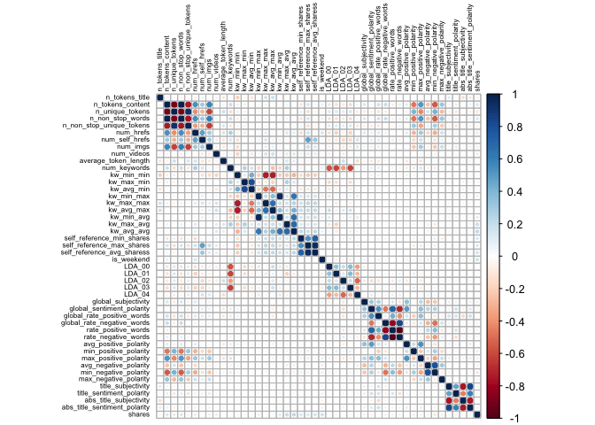<!-- -->

From the correlation graph above, we can see that the following
variables seem to be moderately correlated:  
- `n_tokens_contents`, `n_unique_tokens`, `n_non_stop_words`,
`n_non_stop_unique_tokens`, `num_hrefs`, `num_imgs`  
- `kw_min_min`, `kw_max_min`, `kw_avg_min`, `kw_min_max`, `kw_max_max`,
`kw_avg_max`, `kw_min_avg`, `kw_max_avg`, `kw_avg_avg`  
- `self_reference_min_shares`, `self_reference_max_shares`,
`self_reference_avg_sharess`  
- `LDA_00`, `LDA_01`, `LDA_02`, `LDA_03`  
- `global_sentiment_polarity`, `global_rate_positive_words`,
`global_rate_negative_words`, `rate_positive_words`,
`rate_negative_words`  
- `avg_positive_polarity`, `min_positive_polarity`,
`max_positive_polarity`  
- `avg_negative_polarity`, `min_negative_polarity`,
`max_negative_polarity`  
- `title_subjectivity`, `title_sentiment_polarity`,
`abs_title_subjectivity`, `abs_title_sentiment_polarity`

For further EDA, we are going to plot graphs to see trends between
different variables with respect to the number of shares.

A plot between number of shares and article published day: This plot
shows the number of shares an article has based on the day that has been
published.

``` r
newsTrainday <- newsTrain %>%
  select(publish_weekday, shares) %>%
  group_by(publish_weekday) %>% 
  summarise(total_shares=sum(shares))

g <- ggplot(data = newsTrainday, aes(x=publish_weekday, y=total_shares))
g + geom_col(fill = "lightblue", color = "black") +
  labs(title = " Shares for articles published based on weekdays")
```

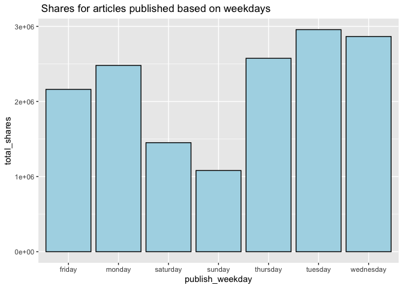<!-- -->

Let’s select some variables as example to plot scatter plots.

A scatter plot with the number of shares on the y-axis and the number of
words in the title on the x-axis is created:

``` r
g <- ggplot(data = newsTrain, aes(x = n_tokens_title, y = shares))
g + geom_point() +
  labs(x = "Number of words in the title", y = "Number of shares", 
       title = "Scatter Plot: Number of words in the title VS Number of shares")
```

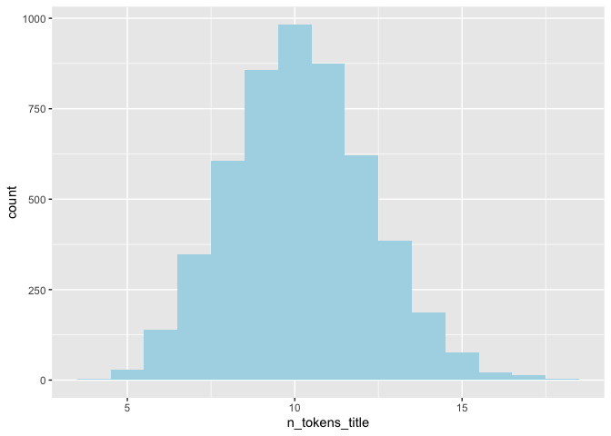<!-- -->

We can inspect the trend of shares as a function of the number of words
in the title. Therefore, we can see that the number of words in title
has an effect on the number of shares.

A scatter plot with the number of shares on the y-axis and the number of
words in the content on the x-axis is created:

``` r
g <- ggplot(data = newsTrain, aes(x = n_tokens_content, y = shares))
g + geom_point() +
  labs(x = "Number of words in the content", y = "Number of shares", 
       title = "Scatter Plot: Number of words in the content VS Number of shares") 
```

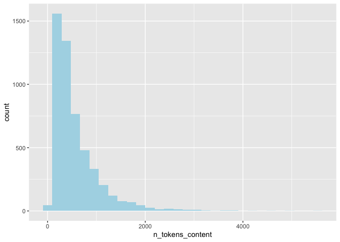<!-- -->

From the plot above, we can easily see that the number of shares is
decreasing while the the number of words in the content is increasing.
So it can be illustrated that the number of words in the content will
affect the number of shares.

A scatter plot with the number of shares on the y-axis and the number of
links to other articles published by Mashable on the x-axis is created:

``` r
g <- ggplot(data = newsTrain, aes(x = num_self_hrefs, y = shares))
g + geom_point() +
  labs(x = "Number of links to other articles published by Mashable", y = "Number of shares", 
       title = "Scatter Plot: Number of links to other articles published by Mashable VS Number of shares")
```

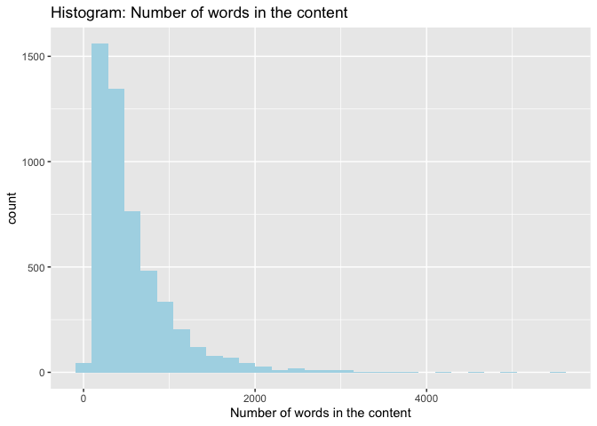<!-- -->

The plot above shows that as the number of links to other articles
increasing, the number of shares is decreasing. So the the number of
links to other articles has an infulence on the number of shares.

A scatter plot with the number of shares on the y-axis and the number of
images on the x-axis is created:

``` r
g <- ggplot(data = newsTrain, aes(x = num_imgs, y = shares))
g + geom_point() +
  labs(x = "Number of images", y = "Number of shares", 
       title = "Scatter Plot: Number of images VS Number of shares")
```

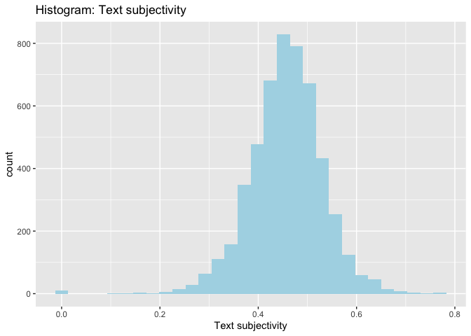<!-- -->

The plot above shows that the number of shares decreases as the number
of images increasing. Therefore, the number of images will affect the
number of shares as well.

A scatter plot with the number of shares on the y-axis and the number of
videos on the x-axis is created:

``` r
g <- ggplot(data = newsTrain, aes(x = num_videos, y = shares))
g + geom_point() +
  labs(x = "Number of videos", y = "Number of shares", 
       title = "Scatter Plot: Number of videos VS Number of shares") 
```

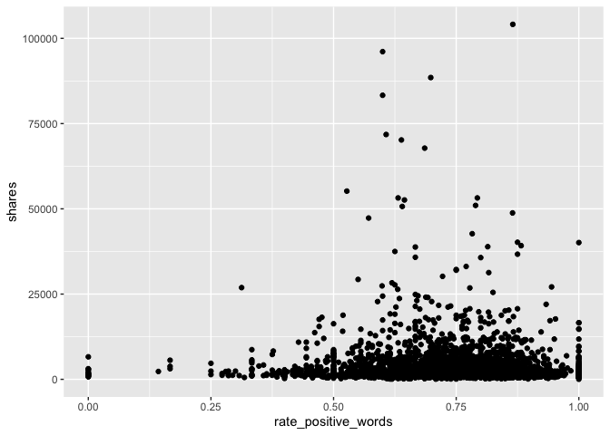<!-- -->

A scatter plot with the number of shares on the y-axis and the average
length of words in content on the x-axis is created:

``` r
g <- ggplot(newsTrain, aes(x = average_token_length, y = shares))
g + geom_point() + 
  labs(x = "Average token length", y = "Number of shares", 
       title = "Scatter Plot: Average token length VS Number of shares")
```

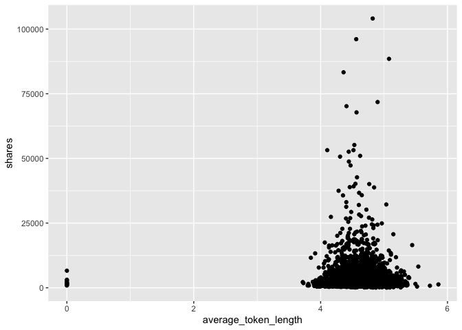<!-- -->

Through the plot above, we can see that the most of shares are between 4
and 6 words. The average token length will also affect the number of
shares.

A scatter plot with the number of shares on the y-axis and the number of
keywords in the metadata on the x-axis is created:

``` r
g <- ggplot(newsTrain, aes(x = num_keywords, y = shares))
g + geom_point() + 
  labs(x = "Number of keywords in the metadata", y = "Number of shares", 
       title = "Scatter Plot: Number of keywords in the metadata VS Number of shares")
```

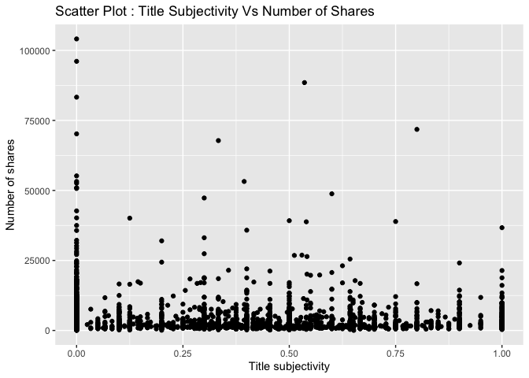<!-- -->

According to the plot above, we can find that as the number of keywords
increasing, the number of shares is increasing. So the number of
keywords in the metadata will influence the number of shares.

A scatter plot with the number of shares on the y-axis and the text
subjectivity on the x-axis is created:

``` r
g <- ggplot(data = newsTrain, aes(x = global_subjectivity, y = shares))
g + geom_point() + 
  labs(x = "Text subjectivity", y = "Number of shares", 
       title = "Scatter Plot: Text subjectivity VS Number of shares")
```

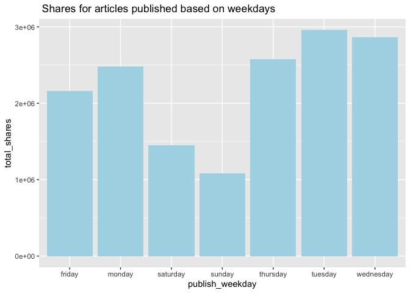<!-- -->

From the plot above, it presents that the most of shares are between
0.25 and 0.75 text subjectivity. So the text subjectivity will influence
the number of shares as well.

A scatter plot with the number of shares on the y-axis and the title
subjectivity on the x-axis is created:

``` r
g <- ggplot(data = newsTrain, aes(x = title_subjectivity, y = shares))
g + geom_point() + 
  labs(x = "Title subjectivity", y = "Number of shares", 
       title = "Scatter Plot: Title subjectivity VS Number of shares")
```

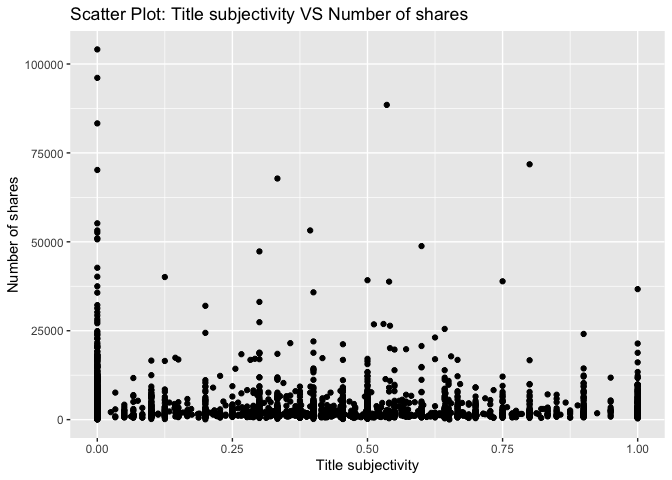<!-- -->

The plot above shows that the title subjectivity has less effect on the
number of shares.

**Select variables**

Through the analysis above, we will select predictors as follows:  
- `publish_weekday`: The article published day  
- `n_tokens_title`: Number of words in the title  
- `n_tokens_content`: Number of words in the content  
- `num_self_hrefs`: Number of links to other articles published by
Mashable  
- `num_imgs`: Number of images  
- `num_videos`: Number of videos  
- `average_token_length`: Average length of the words in the content  
- `num_keywords`: Number of keywords in the metadata  
- `kw_avg_avg`: Avg. keyword (avg. shares)  
- `self_reference_avg_sharess`: Avg. shares of referenced articles in
Mashable  
- `LDA_04`: Closeness to LDA topic 4  
- `global_subjectivity`: Text subjectivity  
- `global_sentiment_polarity`: Text sentiment polarity  
- `avg_positive_polarity`: Avg. polarity of positive words  
- `avg_negative_polarity`: Avg. polarity of negative words

The target variable is `shares`.

``` r
#select variables for training set and test set
set.seed(111)
Train <- newsTrain %>% 
  select(publish_weekday, n_tokens_title, n_tokens_content, num_self_hrefs, num_imgs, num_videos, average_token_length, num_keywords, kw_avg_avg, self_reference_avg_sharess, LDA_04, global_subjectivity, global_sentiment_polarity, avg_positive_polarity, avg_negative_polarity, shares)
Test <- newsTest %>% 
  select(publish_weekday, n_tokens_title, n_tokens_content, num_self_hrefs, num_imgs, num_videos, average_token_length, num_keywords, kw_avg_avg, self_reference_avg_sharess, LDA_04, global_subjectivity, global_sentiment_polarity, avg_positive_polarity, avg_negative_polarity, shares)
#Train
```

## Model

**Linear Regression Model**

First, we fit a forward stepwise linear regression model for the
training dataset. The data is centered and scaled and number of shares
is the response variable.

``` r
#forward stepwise
set.seed(111)
fwFit <- train(shares ~ ., data = Train,
               method = "leapForward",
               preProcess = c("center", "scale"),
               trControl = trainControl(method = "cv", number = 5))
#summary(fwFit)
fwFit
```

    ## Linear Regression with Forward Selection 
    ## 
    ## 5145 samples
    ##   15 predictor
    ## 
    ## Pre-processing: centered (20), scaled (20) 
    ## Resampling: Cross-Validated (5 fold) 
    ## Summary of sample sizes: 4117, 4116, 4117, 4116, 4114 
    ## Resampling results across tuning parameters:
    ## 
    ##   nvmax  RMSE      Rsquared    MAE     
    ##   2      4993.653  0.01214372  2256.484
    ##   3      5000.175  0.01032291  2252.619
    ##   4      5007.001  0.00864101  2254.509
    ## 
    ## RMSE was used to select the optimal model using the smallest value.
    ## The final value used for the model was nvmax = 2.

We also fit a backward stepwise linear regression model for the training
dataset. The data is centered and scaled and number of shares is the
response variable.

``` r
#backward stepwise
set.seed(111)
bwFit <- train(shares ~ ., data = Train,
               method = "leapBackward",
               preProcess = c("center", "scale"),
               trControl = trainControl(method = "cv", number = 5))
#summary(bwFit)
bwFit
```

    ## Linear Regression with Backwards Selection 
    ## 
    ## 5145 samples
    ##   15 predictor
    ## 
    ## Pre-processing: centered (20), scaled (20) 
    ## Resampling: Cross-Validated (5 fold) 
    ## Summary of sample sizes: 4117, 4116, 4117, 4116, 4114 
    ## Resampling results across tuning parameters:
    ## 
    ##   nvmax  RMSE      Rsquared     MAE     
    ##   2      4997.589  0.011013255  2260.430
    ##   3      5008.721  0.007662991  2259.748
    ##   4      5006.969  0.008313107  2255.159
    ## 
    ## RMSE was used to select the optimal model using the smallest value.
    ## The final value used for the model was nvmax = 2.

Then we fit a linear regression model with all predictors.

``` r
#with all predictors
set.seed(111)
lrFit <- train(shares ~ ., data = Train,
               method = "lm",
               trControl = trainControl(method = "cv", number = 5))
lrFit
```

    ## Linear Regression 
    ## 
    ## 5145 samples
    ##   15 predictor
    ## 
    ## No pre-processing
    ## Resampling: Cross-Validated (5 fold) 
    ## Summary of sample sizes: 4117, 4116, 4117, 4116, 4114 
    ## Resampling results:
    ## 
    ##   RMSE      Rsquared    MAE     
    ##   4993.529  0.01423579  2247.158
    ## 
    ## Tuning parameter 'intercept' was held constant at a value of TRUE

**Random Forest Model**

Next, we have fitted a random forest model which is an example of an
ensemble based-tree model. Instead of traditional decision trees, a
random forest tree will take a random subset of the predictors for each
tree fit and calculate the average of results.

``` r
set.seed(111)
randomFit <- train(shares ~ ., 
                   data = Train, 
                   method = "rf",
                   preProcess = c("center","scale"),
                   trControl = trainControl(method = "cv", number = 5),
                   tuneGrid = data.frame(mtry = ncol(Train)/3))
randomFit
```

    ## Random Forest 
    ## 
    ## 5145 samples
    ##   15 predictor
    ## 
    ## Pre-processing: centered (20), scaled (20) 
    ## Resampling: Cross-Validated (5 fold) 
    ## Summary of sample sizes: 4117, 4116, 4117, 4116, 4114 
    ## Resampling results:
    ## 
    ##   RMSE      Rsquared   MAE     
    ##   4999.151  0.0260148  2324.402
    ## 
    ## Tuning parameter 'mtry' was held constant at a value of 5.333333

**Boosted Tree Model**

Moreover, we have fitted a boosted tree model which is another ensemble
based-tree model. Boosted tree models are combination of two techniques:
decision tree algorithms and boosting methods. It repeatedly fits many
decision trees to improve the accuracy of the model.

``` r
set.seed(111)
boostedFit <- train(shares ~ ., 
                    data = Train, 
                    method = "gbm", 
                    preProcess = c("center", "scale"),
                    trControl = trainControl(method = "cv", number = 5),
                    tuneGrid = expand.grid(n.trees = c(25,50,100,150,200), 
                                           interaction.depth = c(1,2,3,4), 
                                           shrinkage = 0.1, 
                                           n.minobsinnode = 10),
                    verbose = FALSE)
boostedFit
```

    ## Stochastic Gradient Boosting 
    ## 
    ## 5145 samples
    ##   15 predictor
    ## 
    ## Pre-processing: centered (20), scaled (20) 
    ## Resampling: Cross-Validated (5 fold) 
    ## Summary of sample sizes: 4117, 4116, 4117, 4116, 4114 
    ## Resampling results across tuning parameters:
    ## 
    ##   interaction.depth  n.trees  RMSE      Rsquared    MAE     
    ##   1                   25      4981.352  0.01810387  2247.636
    ##   1                   50      4977.986  0.01964119  2227.331
    ##   1                  100      4980.009  0.02080128  2226.682
    ##   1                  150      4986.804  0.02092252  2231.625
    ##   1                  200      4984.424  0.02137998  2234.035
    ##   2                   25      4965.085  0.02562785  2230.376
    ##   2                   50      4981.740  0.02440874  2238.331
    ##   2                  100      4994.153  0.02622559  2246.997
    ##   2                  150      5006.617  0.02419671  2250.311
    ##   2                  200      5027.871  0.02158309  2260.211
    ##   3                   25      4996.303  0.01824729  2242.124
    ##   3                   50      5021.654  0.01884191  2256.878
    ##   3                  100      5053.525  0.01763966  2267.460
    ##   3                  150      5091.976  0.01547334  2291.828
    ##   3                  200      5108.804  0.01482233  2314.100
    ##   4                   25      5012.384  0.01651200  2253.946
    ##   4                   50      5054.172  0.01558418  2271.507
    ##   4                  100      5097.798  0.01422117  2293.653
    ##   4                  150      5137.415  0.01332509  2325.218
    ##   4                  200      5155.763  0.01272881  2349.361
    ## 
    ## Tuning parameter 'shrinkage' was held constant at a value of 0.1
    ## 
    ## Tuning parameter 'n.minobsinnode' was held constant at a value of 10
    ## RMSE was used to select the optimal model using the smallest value.
    ## The final values used for the model were n.trees = 25, interaction.depth
    ##  = 2, shrinkage = 0.1 and n.minobsinnode = 10.

## Comparison

All the models are compared by RMSE on the test set.

``` r
#fit a linear regression model
fw_mod <- postResample(predict(fwFit, newdata = Test), obs = Test$shares)
bw_mod <- postResample(predict(bwFit, newdata = Test), obs = Test$shares)
lr_mod <- postResample(predict(lrFit, newdata = Test), obs = Test$shares)
#random forest
random_mod <- postResample(predict(randomFit, newdata = Test), obs = Test$shares)
#boosted tree
boosted_mod <- postResample(predict(boostedFit, newdata = Test), obs = Test$shares)
#compare all models
tibble(model = c("Forward",
                 "Backward",
                 "LR with all predictors",
                 "Random Forest",
                 "Boosted Tree"), 
       RMSE = c(fw_mod[1],
                bw_mod[1],
                lr_mod[1],
                random_mod[1],
                boosted_mod[1]))
```

    ## # A tibble: 5 × 2
    ##   model                    RMSE
    ##   <chr>                   <dbl>
    ## 1 Forward                14517.
    ## 2 Backward               14517.
    ## 3 LR with all predictors 14528.
    ## 4 Random Forest          14499.
    ## 5 Boosted Tree           14508.

From the above table, we can find that forward and backward stepwise
models have the same RMSE value. So we can say that, among these models,
the best model is forward or backward stepwise model since it has the
least RMSE value as compared to the other models.

## Automation

For this automation part, we want to produce the similar reports for
each news channels. We firstly create a set of parameters, which match
with 6 channels. Then read the parameter and subset the data with the
specified channel. After everything is ready, run the below chunk of
code in the console, we will automatically get the reports for each news
channel.

``` r
#create channel names
channelID <- data.frame("lifestyle", "entertainment", "bus", "socmed", "tech", "world")
#create filenames
output_file <- paste0(channelID,".md")
#create a list for each channel with the channel name parameter
params = lapply(channelID, FUN = function(x){list(channelID = x)})
#put into a data frame
reports <- tibble(output_file, params)
#render code
apply(reports, MARGIN = 1,
      FUN = function(x){
        rmarkdown::render(input = "project3.Rmd",
                          output_format = "github_document",
                          output_file = x[[1]],
                          params = x[[2]])
        })
```
