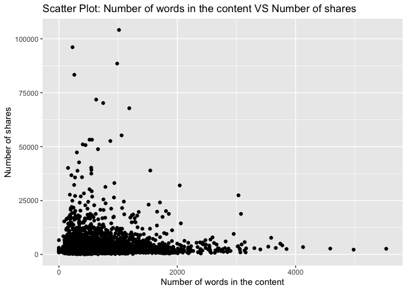
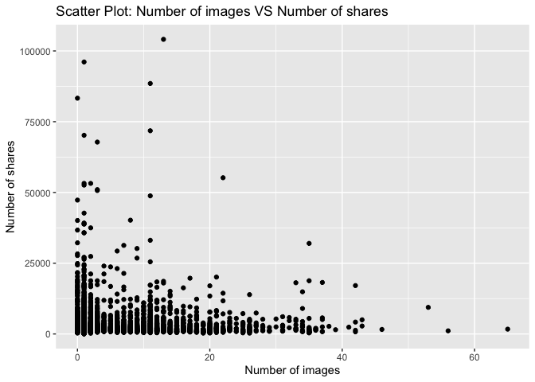
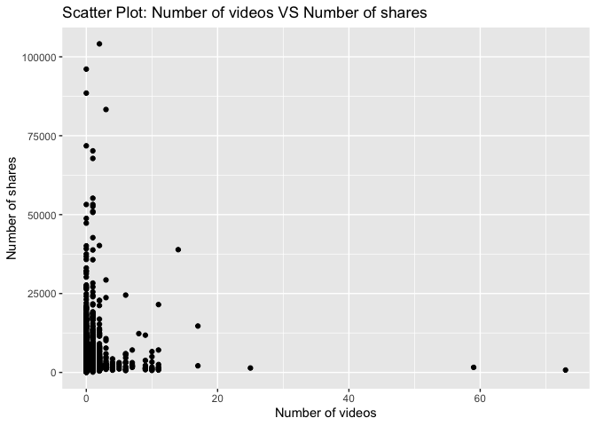
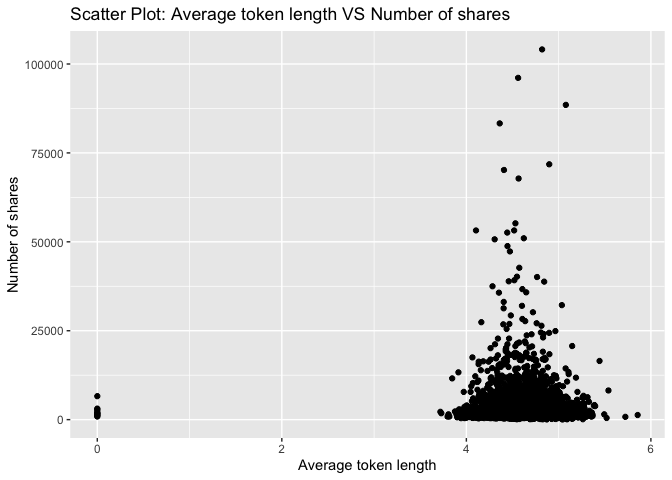
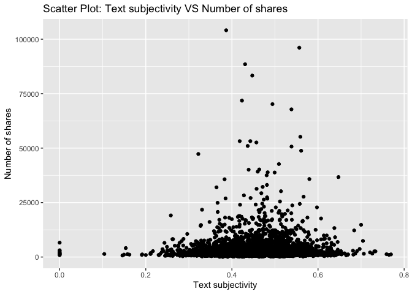

Project 3
================
Shaoyu Wang, Aniket Walimbe
2022-11-14

- <a href="#introduction" id="toc-introduction">Introduction</a>
- <a href="#required-packages" id="toc-required-packages">Required
  Packages</a>
- <a href="#data" id="toc-data">Data</a>
- <a href="#summarizations" id="toc-summarizations">Summarizations</a>
- <a href="#model" id="toc-model">Model</a>
- <a href="#comparison" id="toc-comparison">Comparison</a>
- <a href="#automation" id="toc-automation">Automation</a>

# Introduction

This [online news popularity data
set](https://archive.ics.uci.edu/ml/datasets/Online+News+Popularity)
summarizes a heterogeneous set of features about articles published by
Mashable in a period of two years.

# Required Packages

First, we need to load the required packages:

``` r
# Load libraries
library(readr)
library(tidyverse)
library(dplyr)
library(caret)
library(leaps)
library(ggplot2)
library(corrplot)
library(GGally)
library(randomForest)
```

# Data

Read in the data and subset the data to work on the data channel of
interest. We found that there are seven similar columns for weekday from
Monday to Sunday, so we merged these columns and named the new variable
as `publish_weekday`. For this step, we also removed the non-predictive
variables.

``` r
#Read in the data file
newsData <- read_csv("OnlineNewsPopularity.csv", show_col_types = FALSE)
#Choose the data channel of interest
if (params$channelID != "") {
  paramChannelName <- params$channelID
} else {
  paramChannelName <- "lifestyle"
}
channelID <- paste("data_channel_is_", paramChannelName, sep = "")
#Merge the weekday columns as one single column.
news <- newsData %>% 
  filter(.data[[channelID]] == 1) %>% 
  select(url, starts_with("weekday_is_")) %>% 
  pivot_longer(-url) %>% 
  filter(value != 0) %>% 
  mutate(publish_weekday = substr(name, 12, 20)) %>% 
  left_join(newsData, by = "url") %>% 
#Remove non predictive variables
  select(-c(url, name, value, timedelta, starts_with("data_channel_is_"), starts_with("weekday_is_")))
news$publish_weekday <- as.factor(news$publish_weekday)
news
```

Split the data into a training set and a test set.

``` r
set.seed(111)
trainIndex <- createDataPartition(news$shares, p = 0.7, list = FALSE)
newsTrain <- news[trainIndex,]
newsTest <- news[-trainIndex,]
#newsTrain
```

# Summarizations

For this part, we created some basic summary statistics and plots about
the training data.

- Tables

Firstly, let’s look at some tables. We summarized the training data, so
that we can know all of the variables roughly. For example, this table
shows each count for published on weekdays, we can see which has the
most count and which has the least count. It also shows the minimum, 1st
quantile, median, mean, 3rd quantile and maximum of other variables.

``` r
summary(newsTrain)
```

    ##   publish_weekday n_tokens_title  n_tokens_content n_unique_tokens  n_non_stop_words n_non_stop_unique_tokens
    ##  friday   : 675   Min.   : 4.00   Min.   :   0.0   Min.   :0.0000   Min.   :0.0000   Min.   :0.0000          
    ##  monday   : 877   1st Qu.: 9.00   1st Qu.: 257.0   1st Qu.:0.4612   1st Qu.:1.0000   1st Qu.:0.6183          
    ##  saturday : 382   Median :10.00   Median : 404.0   Median :0.5332   Median :1.0000   Median :0.6895          
    ##  sunday   : 282   Mean   :10.16   Mean   : 566.3   Mean   :0.5320   Mean   :0.9979   Mean   :0.6842          
    ##  thursday : 932   3rd Qu.:12.00   3rd Qu.: 718.0   3rd Qu.:0.6019   3rd Qu.:1.0000   3rd Qu.:0.7572          
    ##  tuesday  : 993   Max.   :18.00   Max.   :5530.0   Max.   :0.9143   Max.   :1.0000   Max.   :1.0000          
    ##  wednesday:1004                                                                                              
    ##    num_hrefs       num_self_hrefs      num_imgs       num_videos      average_token_length  num_keywords   
    ##  Min.   :  0.000   Min.   : 0.000   Min.   : 0.00   Min.   : 0.0000   Min.   :0.000        Min.   : 2.000  
    ##  1st Qu.:  5.000   1st Qu.: 2.000   1st Qu.: 1.00   1st Qu.: 0.0000   1st Qu.:4.423        1st Qu.: 7.000  
    ##  Median :  7.000   Median : 3.000   Median : 1.00   Median : 0.0000   Median :4.590        Median : 8.000  
    ##  Mean   :  9.366   Mean   : 4.558   Mean   : 4.32   Mean   : 0.4542   Mean   :4.585        Mean   : 7.766  
    ##  3rd Qu.: 11.000   3rd Qu.: 6.000   3rd Qu.: 5.00   3rd Qu.: 1.0000   3rd Qu.:4.759        3rd Qu.: 9.000  
    ##  Max.   :120.000   Max.   :65.000   Max.   :65.00   Max.   :73.0000   Max.   :5.857        Max.   :10.000  
    ##                                                                                                            
    ##    kw_min_min       kw_max_min       kw_avg_min        kw_min_max       kw_max_max       kw_avg_max    
    ##  Min.   : -1.00   Min.   :     0   Min.   :   -1.0   Min.   :     0   Min.   :     0   Min.   :     0  
    ##  1st Qu.: -1.00   1st Qu.:   480   1st Qu.:  162.7   1st Qu.:     0   1st Qu.:690400   1st Qu.:139480  
    ##  Median :  0.00   Median :   725   Median :  255.2   Median :   938   Median :843300   Median :186517  
    ##  Mean   : 30.66   Mean   :  1164   Mean   :  319.5   Mean   :  6866   Mean   :735898   Mean   :213258  
    ##  3rd Qu.:  4.00   3rd Qu.:  1100   3rd Qu.:  373.2   3rd Qu.:  5800   3rd Qu.:843300   3rd Qu.:287811  
    ##  Max.   :217.00   Max.   :104100   Max.   :14716.9   Max.   :663600   Max.   :843300   Max.   :753450  
    ##                                                                                                        
    ##    kw_min_avg     kw_max_avg       kw_avg_avg    self_reference_min_shares self_reference_max_shares
    ##  Min.   :   0   Min.   :     0   Min.   :    0   Min.   :     0            Min.   :     0           
    ##  1st Qu.:   0   1st Qu.:  3447   1st Qu.: 2338   1st Qu.:   762            1st Qu.:  1700           
    ##  Median : 808   Median :  3747   Median : 2699   Median :  1400            Median :  4000           
    ##  Mean   : 993   Mean   :  4614   Mean   : 2748   Mean   :  4309            Mean   : 11782           
    ##  3rd Qu.:1966   3rd Qu.:  4728   3rd Qu.: 3082   3rd Qu.:  2700            3rd Qu.:  8300           
    ##  Max.   :3330   Max.   :104100   Max.   :19429   Max.   :663600            Max.   :663600           
    ##                                                                                                     
    ##  self_reference_avg_sharess   is_weekend         LDA_00            LDA_01            LDA_02            LDA_03       
    ##  Min.   :     0             Min.   :0.0000   Min.   :0.01828   Min.   :0.01819   Min.   :0.01819   Min.   :0.01820  
    ##  1st Qu.:  1448             1st Qu.:0.0000   1st Qu.:0.02234   1st Qu.:0.02225   1st Qu.:0.02500   1st Qu.:0.02224  
    ##  Median :  2750             Median :0.0000   Median :0.02860   Median :0.02857   Median :0.03333   Median :0.02857  
    ##  Mean   :  7087             Mean   :0.1291   Mean   :0.07412   Mean   :0.06526   Mean   :0.10995   Mean   :0.06210  
    ##  3rd Qu.:  5250             3rd Qu.:0.0000   3rd Qu.:0.04004   3rd Qu.:0.04000   3rd Qu.:0.15789   3rd Qu.:0.04000  
    ##  Max.   :663600             Max.   :1.0000   Max.   :0.83882   Max.   :0.72201   Max.   :0.82213   Max.   :0.74237  
    ##                                                                                                                     
    ##      LDA_04        global_subjectivity global_sentiment_polarity global_rate_positive_words
    ##  Min.   :0.02002   Min.   :0.0000      Min.   :-0.33912          Min.   :0.00000           
    ##  1st Qu.:0.54453   1st Qu.:0.4140      1st Qu.: 0.09679          1st Qu.:0.03306           
    ##  Median :0.73331   Median :0.4595      Median : 0.14266          Median :0.04174           
    ##  Mean   :0.68857   Mean   :0.4569      Mean   : 0.14503          Mean   :0.04286           
    ##  3rd Qu.:0.86658   3rd Qu.:0.5037      3rd Qu.: 0.19020          3rd Qu.:0.05170           
    ##  Max.   :0.92712   Max.   :0.7693      Max.   : 0.65000          Max.   :0.15217           
    ##                                                                                            
    ##  global_rate_negative_words rate_positive_words rate_negative_words avg_positive_polarity min_positive_polarity
    ##  Min.   :0.000000           Min.   :0.0000      Min.   :0.0000      Min.   :0.0000        Min.   :0.00000      
    ##  1st Qu.:0.008772           1st Qu.:0.6709      1st Qu.:0.1667      1st Qu.:0.3138        1st Qu.:0.05000      
    ##  Median :0.013636           Median :0.7500      Median :0.2472      Median :0.3560        Median :0.10000      
    ##  Mean   :0.014468           Mean   :0.7466      Mean   :0.2513      Mean   :0.3569        Mean   :0.09969      
    ##  3rd Qu.:0.018987           3rd Qu.:0.8308      3rd Qu.:0.3261      3rd Qu.:0.4014        3rd Qu.:0.10000      
    ##  Max.   :0.086168           Max.   :1.0000      Max.   :1.0000      Max.   :0.9500        Max.   :0.90000      
    ##                                                                                                                
    ##  max_positive_polarity avg_negative_polarity min_negative_polarity max_negative_polarity title_subjectivity
    ##  Min.   :0.0000        Min.   :-1.0000       Min.   :-1.000        Min.   :-1.0000       Min.   :0.00000   
    ##  1st Qu.:0.6000        1st Qu.:-0.2845       1st Qu.:-0.600        1st Qu.:-0.1250       1st Qu.:0.00000   
    ##  Median :0.8000        Median :-0.2222       Median :-0.400        Median :-0.1000       Median :0.06667   
    ##  Mean   :0.7718        Mean   :-0.2297       Mean   :-0.452        Mean   :-0.1033       Mean   :0.25053   
    ##  3rd Qu.:1.0000        3rd Qu.:-0.1667       3rd Qu.:-0.250        3rd Qu.:-0.0500       3rd Qu.:0.45455   
    ##  Max.   :1.0000        Max.   : 0.0000       Max.   : 0.000        Max.   : 0.0000       Max.   :1.00000   
    ##                                                                                                            
    ##  title_sentiment_polarity abs_title_subjectivity abs_title_sentiment_polarity     shares      
    ##  Min.   :-1.00000         Min.   :0.0000         Min.   :0.0000               Min.   :    36  
    ##  1st Qu.: 0.00000         1st Qu.:0.1551         1st Qu.:0.0000               1st Qu.:  1100  
    ##  Median : 0.00000         Median :0.5000         Median :0.0000               Median :  1700  
    ##  Mean   : 0.08435         Mean   :0.3447         Mean   :0.1347               Mean   :  3026  
    ##  3rd Qu.: 0.13636         3rd Qu.:0.5000         3rd Qu.:0.2000               3rd Qu.:  3000  
    ##  Max.   : 1.00000         Max.   :0.5000         Max.   :1.0000               Max.   :104100  
    ## 

Then we can check our response variable `shares`. It shows that the
mean, standard deviation, median, IQR of `shares` as follows.

``` r
#numerical summary for the variable shares
newsTrain %>% 
  summarise(mean = round(mean(shares), 0), sd = round(sd(shares), 0), 
            median = round(median(shares), 0), IQR = round(IQR(shares), 0))
```

We also obtain the numerical summaries on some subgroups.

``` r
#numerical summaries on subgroups
newsTrain %>% 
  group_by(publish_weekday) %>% 
  summarise(mean = round(mean(shares), 0), sd = round(sd(shares), 0), 
            median = round(median(shares), 0), IQR = round(IQR(shares), 0))
newsTrain %>% 
  group_by(num_imgs) %>% 
  summarise(mean = round(mean(shares), 0), sd = round(sd(shares), 0), 
            median = round(median(shares), 0), IQR = round(IQR(shares), 0))
newsTrain %>% 
  group_by(num_keywords) %>% 
  summarise(mean = round(mean(shares), 0), sd = round(sd(shares), 0), 
            median = round(median(shares), 0), IQR = round(IQR(shares), 0))
```

Moreover, we divide the title subjectivity into 3 categories:  
1. High: greater than 0.8  
2. Medium: 0.4 to less than 0.8  
3. Low: less than 0.4  
The contingency table is then shown below.

``` r
newsTrain$subject_activity_type <- ifelse(newsTrain$title_subjectivity >= 0.8, "High", 
                                          ifelse(newsTrain$title_subjectivity >= 0.4, "Medium",
                                                 ifelse(airquality$Wind >= 0, "Low")))
table(newsTrain$subject_activity_type)
```

    ## 
    ##   High    Low Medium 
    ##    409   3417   1319

- Plots

Plotting the correlation between numeric variables.

``` r
newsTrainsub <- newsTrain %>% select(-c(publish_weekday, subject_activity_type))
correlation <- cor(newsTrainsub, method = "spearman")
corrplot(correlation, tl.col = "black", tl.cex = 0.5)
```

<!-- --> From the
correlation graph above, we can see that some variables are strongly
correlated.

For further EDA, we are plotting several graphs to see trends between
different variables with respect to the number of shares.

A plot between number of shares and article published day: This plot
shows the number of shares an article has based on the day it has been
published.

``` r
newsTrainday <- newsTrain %>%
  select(publish_weekday, shares) %>%
  group_by(publish_weekday) %>% 
  summarise(total_shares=sum(shares))

g <- ggplot(data = newsTrainday, aes(x=publish_weekday, y=total_shares))
g + geom_col(fill = "lightblue")+
  labs(title = " Shares for articles published based on weekdays")
```

<!-- -->

Here, we have plotted the histogram for number of words in a title for
the data. It can be seen that the graph shows the variable following
normal distribution.

``` r
g <- ggplot(newsTrain, aes(x = n_tokens_title))
g + geom_histogram(fill = "lightblue", binwidth = 1) + 
  labs(x = "Number of words in the title",
       title = "Histogram: Number of words in the title")
```

<!-- -->

Then we have plotted the histogram for number of words in content for
the data.

``` r
g <- ggplot(newsTrain, aes(x = n_tokens_content))
g + geom_histogram(fill = "lightblue") + 
  labs(x = "Number of words in the content", 
       title = "Histogram: Number of words in the content")
```

<!-- -->

A histogram for text subjectivity.

``` r
g <- ggplot(newsTrain, aes(x = global_subjectivity))
g + geom_histogram(fill = "lightblue") + 
  labs(x = "Text subjectivity", 
       title = "Histogram: Text subjectivity")
```

<!-- -->

A histogram for text sentiment polarity.

``` r
g <- ggplot(newsTrain, aes(x = global_sentiment_polarity))
g + geom_histogram(fill = "lightblue") + 
  labs(x = "Text sentiment polarity", 
       title = "Histogram: Text sentiment polarity")
```

<!-- -->

A plot between number of images and number of shares.

``` r
g <- ggplot(data = newsTrain, aes(x = num_imgs, y = shares))
g + geom_point() +
  labs(x = "Number of images" , y = "Number of shares", 
       title = "Scatter Plot: Number of images VS Number of shares") 
```

<!-- -->

A plot between average length of words in content and number of shares:
We can inspect the trend of the shares as a function of average length
of words in content.

``` r
g <- ggplot(newsTrain, aes(x = average_token_length, y = shares))
g + geom_point() + 
  labs(x = "Average token length" , y = "Number of shares", 
       title = "Scatter Plot: Average token length VS Number of shares")
```

<!-- -->

A plot between title subjectivity and number of shares: We can inspect
the trend of the shares as a function of title subjectivity.

``` r
g <- ggplot(data = newsTrain, aes(x = title_subjectivity, y = shares))
g + geom_point() + 
  labs(x = "Title subjectivity" , y = "Number of shares", 
       title = "Scatter Plot: Title subjectivity VS Number of shares") 
```

<!-- -->

Select predictors: publish_weekday, n_tokens_title, n_tokens_content,
num_self_hrefs, num_imgs, average_token_length, num_keywords,
kw_avg_avg, self_reference_avg_sharess, LDA_04, global_subjectivity,
global_sentiment_polarity, avg_positive_polarity, avg_negative_polarity,
title_subjectivity, shares.

``` r
set.seed(111)
Train <- newsTrain %>% 
  select(publish_weekday, n_tokens_title, n_tokens_content, num_self_hrefs, num_imgs, average_token_length, num_keywords, kw_avg_avg, self_reference_avg_sharess, LDA_04, global_subjectivity, global_sentiment_polarity, avg_positive_polarity, avg_negative_polarity, title_subjectivity, shares)
Test <- newsTest %>% 
  select(publish_weekday, n_tokens_title, n_tokens_content, num_self_hrefs, num_imgs, average_token_length, num_keywords, kw_avg_avg, self_reference_avg_sharess, LDA_04, global_subjectivity, global_sentiment_polarity, avg_positive_polarity, avg_negative_polarity, title_subjectivity, shares)
#Train
```

# Model

- Linear Regression Model

Here, we have fitted a forward stepwise linear regression model for the
training dataset having 15 variables. The data is centered and scaled
and number of shares is the response variable.

``` r
#forward stepwise
set.seed(111)
fwFit <- train(shares ~ ., data = Train,
               method = "leapForward",
               preProcess = c("center", "scale"))
#summary(fwFit)
fwFit
```

    ## Linear Regression with Forward Selection 
    ## 
    ## 5145 samples
    ##   15 predictor
    ## 
    ## Pre-processing: centered (20), scaled (20) 
    ## Resampling: Bootstrapped (25 reps) 
    ## Summary of sample sizes: 5145, 5145, 5145, 5145, 5145, 5145, ... 
    ## Resampling results across tuning parameters:
    ## 
    ##   nvmax  RMSE      Rsquared     MAE     
    ##   2      5089.279  0.008852190  2260.210
    ##   3      5090.444  0.008733610  2258.613
    ##   4      5091.303  0.008767263  2259.410
    ## 
    ## RMSE was used to select the optimal model using the smallest value.
    ## The final value used for the model was nvmax = 2.

Here, we have fitted a backward stepwise linear regression model for the
training dataset having 15 variables. The data is centered and scaled
and number of shares is the response variable.

``` r
#backward stepwise
set.seed(111)
bwFit <- train(shares ~ ., data = Train,
               method = "leapBackward",
               preProcess = c("center", "scale"))
#summary(bwFit)
bwFit
```

    ## Linear Regression with Backwards Selection 
    ## 
    ## 5145 samples
    ##   15 predictor
    ## 
    ## Pre-processing: centered (20), scaled (20) 
    ## Resampling: Bootstrapped (25 reps) 
    ## Summary of sample sizes: 5145, 5145, 5145, 5145, 5145, 5145, ... 
    ## Resampling results across tuning parameters:
    ## 
    ##   nvmax  RMSE      Rsquared     MAE     
    ##   2      5093.107  0.007645503  2266.488
    ##   3      5092.828  0.008102409  2267.006
    ##   4      5091.414  0.008729996  2263.931
    ## 
    ## RMSE was used to select the optimal model using the smallest value.
    ## The final value used for the model was nvmax = 4.

``` r
#fit a linear regression model with all predictors
set.seed(111)
lrFit <- train(shares ~ ., data = Train,
               method = "lm",
               trControl = trainControl(method = "cv", number = 5))
lrFit
```

    ## Linear Regression 
    ## 
    ## 5145 samples
    ##   15 predictor
    ## 
    ## No pre-processing
    ## Resampling: Cross-Validated (5 fold) 
    ## Summary of sample sizes: 4117, 4116, 4117, 4116, 4114 
    ## Resampling results:
    ## 
    ##   RMSE    Rsquared    MAE     
    ##   4994.5  0.01278578  2248.801
    ## 
    ## Tuning parameter 'intercept' was held constant at a value of TRUE

- Random Forest Model

Here, we have fitted a random forest model which is chosen using the
cross validation method. The RMSE value for the model is as shown below.
The tuning parameter is given as number of columns in the training data
divided by 3.

``` r
set.seed(111)
randomFit <- train(shares ~ ., 
                   data = Train, 
                   method = "rf",
                   preProcess = c("center","scale"),
                   trControl = trainControl(method = "cv", number = 5),
                   tuneGrid = data.frame(mtry = ncol(Train)/3))
randomFit
```

    ## Random Forest 
    ## 
    ## 5145 samples
    ##   15 predictor
    ## 
    ## Pre-processing: centered (20), scaled (20) 
    ## Resampling: Cross-Validated (5 fold) 
    ## Summary of sample sizes: 4117, 4116, 4117, 4116, 4114 
    ## Resampling results:
    ## 
    ##   RMSE      Rsquared    MAE    
    ##   4999.834  0.02569679  2327.72
    ## 
    ## Tuning parameter 'mtry' was held constant at a value of 5.333333

- Boosted Tree Model

Here, we have fitted a random forest model which is chosen using the
cross validation method. The RMSE value for the model is as shown below.
Tuning parameters are n.trees, interaction.depth, shrinkage and
n.minobsinnode.

``` r
set.seed(111)
boostedFit <- train(shares ~ ., 
                    data = Train, 
                    method = "gbm", 
                    preProcess = c("center", "scale"),
                    trControl = trainControl(method = "cv", number = 5),
                    tuneGrid = expand.grid(n.trees = c(25,50,100,150,200), 
                                           interaction.depth = c(1,2,3,4), 
                                           shrinkage = 0.1, 
                                           n.minobsinnode = 10),
                    verbose = FALSE)
boostedFit
```

    ## Stochastic Gradient Boosting 
    ## 
    ## 5145 samples
    ##   15 predictor
    ## 
    ## Pre-processing: centered (20), scaled (20) 
    ## Resampling: Cross-Validated (5 fold) 
    ## Summary of sample sizes: 4117, 4116, 4117, 4116, 4114 
    ## Resampling results across tuning parameters:
    ## 
    ##   interaction.depth  n.trees  RMSE      Rsquared    MAE     
    ##   1                   25      4984.150  0.01708953  2246.392
    ##   1                   50      4981.791  0.01841727  2227.787
    ##   1                  100      4984.494  0.01903820  2224.633
    ##   1                  150      4994.119  0.01808808  2232.054
    ##   1                  200      4993.337  0.01826795  2235.499
    ##   2                   25      4968.776  0.02470536  2231.771
    ##   2                   50      4980.280  0.02391559  2239.831
    ##   2                  100      5002.478  0.02274460  2255.613
    ##   2                  150      5023.959  0.02000036  2269.837
    ##   2                  200      5036.633  0.01865047  2277.848
    ##   3                   25      4996.556  0.01872929  2241.022
    ##   3                   50      5021.913  0.01939888  2254.602
    ##   3                  100      5063.480  0.01545381  2279.490
    ##   3                  150      5086.634  0.01545233  2306.706
    ##   3                  200      5091.581  0.01655606  2322.797
    ##   4                   25      5021.588  0.01508225  2256.125
    ##   4                   50      5060.084  0.01436906  2274.849
    ##   4                  100      5118.114  0.01347928  2298.503
    ##   4                  150      5151.363  0.01362903  2334.198
    ##   4                  200      5164.210  0.01338288  2364.164
    ## 
    ## Tuning parameter 'shrinkage' was held constant at a value of 0.1
    ## Tuning parameter 'n.minobsinnode' was held
    ##  constant at a value of 10
    ## RMSE was used to select the optimal model using the smallest value.
    ## The final values used for the model were n.trees = 25, interaction.depth = 2, shrinkage = 0.1 and n.minobsinnode = 10.

# Comparison

All the models are compared by RMSE on the test set.

``` r
#fit a linear regression model
fw_mod <- postResample(predict(fwFit, newdata = Test), obs = Test$shares)
bw_mod <- postResample(predict(bwFit, newdata = Test), obs = Test$shares)
lr_mod <- postResample(predict(lrFit, newdata = Test), obs = Test$shares)
#random forest
random_mod <- postResample(predict(randomFit, newdata = Test), obs = Test$shares)
#boosted tree
boosted_mod <- postResample(predict(boostedFit, newdata = Test), obs = Test$shares)
#compare all models
tibble(model = c("Forward",
                 "Backward",
                 "LR with all predictors",
                 "Random Forest",
                 "Boosted Tree"), 
       RMSE = c(fw_mod[1],
                bw_mod[1],
                lr_mod[1],
                random_mod[1],
                boosted_mod[1]))
```

# Automation

``` r
#create channel names
channelID <- data.frame("lifestyle", "entertainment", "bus", "socmed", "tech", "world")
#create filenames
output_file <- paste0(channelID,".md")
#create a list for each channel with the channel name parameter
params = lapply(channelID, FUN = function(x){list(channelID = x)})
#put into a data frame
reports <- tibble(output_file, params)
#render code
apply(reports, MARGIN = 1,
          FUN = function(x){
             rmarkdown::render(input = "project3.Rmd",
             output_format = "github_document",
             output_file = x[[1]],
             params = x[[2]],
             output_options = list(toc=TRUE, toc_depth=1, toc_float=TRUE))
             })
```
