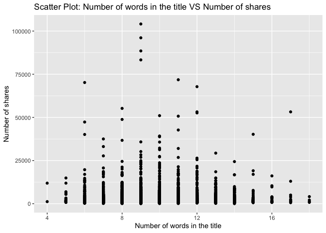
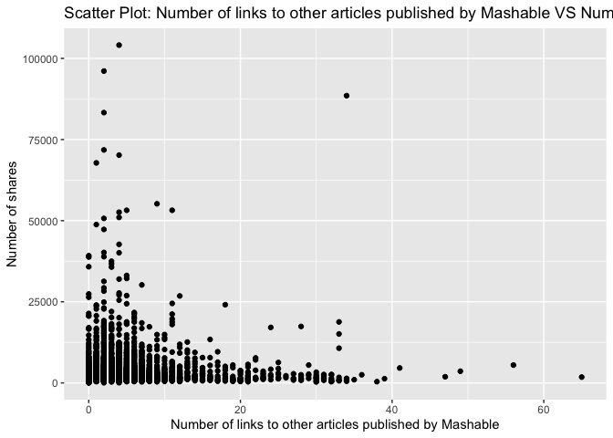
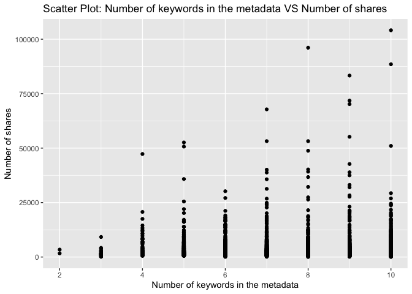

Project 3
================
Shaoyu Wang, Aniket Walimbe
2022-11-14

-   <a href="#introduction" id="toc-introduction">Introduction</a>
-   <a href="#required-packages" id="toc-required-packages">Required
    Packages</a>
-   <a href="#data" id="toc-data">Data</a>
-   <a href="#summarizations" id="toc-summarizations">Summarizations</a>
-   <a href="#model" id="toc-model">Model</a>
-   <a href="#comparison" id="toc-comparison">Comparison</a>
-   <a href="#automation" id="toc-automation">Automation</a>

# Introduction

This [online News Popularity Data
Set](https://archive.ics.uci.edu/ml/datasets/Online+News+Popularity)
summarizes a heterogeneous set of features about articles published by
Mashable in a period of two years.

# Required Packages

First, we will load the required packages:

``` r
# Load libraries
library(readr)
library(tidyverse)
library(dplyr)
library(caret)
library(leaps)
library(ggplot2)
library(corrplot)
library(GGally)
library(randomForest)
```

# Data

Read in the data and subset the data to work on the data channel of
interest. We found that there are seven similar columns for weekday from
Monday to Sunday, so we merged these columns and named the new variable
as `publush_weekday`. For this step, we also removed the non-predictive
variables.

``` r
#Read in the data file
newsData <- read_csv("OnlineNewsPopularity.csv",show_col_types = FALSE)
#Choose the data channel of interest
if (params$channel != "") {
  paramChannelName <- params$channel
} else {
  paramChannelName <- "lifestyle"
}
channel <- paste("data_channel_is_", paramChannelName, sep = "")
#Merge the weekdays columns as one single column.
news <- newsData %>% 
  filter(.data[[channel]] == 1) %>% 
  select(url, starts_with("weekday_is_")) %>% 
  pivot_longer(-url) %>% 
  filter(value != 0) %>% 
  mutate(publish_weekday = substr(name, 12, 20)) %>% 
  left_join(newsData, by = "url") %>% 
#Remove non predictive variables
  select(-c(url, name, value, timedelta, starts_with("data_channel_is_"), starts_with("weekday_is_")))
news$publish_weekday <- as.factor(news$publish_weekday)
news
```

    ## # A tibble: 7,346 × 47
    ##    publish_…¹ n_tok…² n_tok…³ n_uni…⁴ n_non…⁵ n_non…⁶ num_h…⁷ num_s…⁸ num_i…⁹
    ##    <fct>        <dbl>   <dbl>   <dbl>   <dbl>   <dbl>   <dbl>   <dbl>   <dbl>
    ##  1 monday          13    1072   0.416    1.00   0.541      19      19      20
    ##  2 monday          10     370   0.560    1.00   0.698       2       2       0
    ##  3 monday          12     989   0.434    1.00   0.572      20      20      20
    ##  4 monday          11      97   0.670    1.00   0.837       2       0       0
    ##  5 monday           8    1207   0.411    1.00   0.549      24      24      42
    ##  6 monday          13    1248   0.391    1.00   0.523      21      19      20
    ##  7 monday          11    1154   0.427    1.00   0.573      20      20      20
    ##  8 monday           8     266   0.573    1.00   0.721       5       2       1
    ##  9 monday           8     331   0.563    1.00   0.724       5       3       1
    ## 10 monday          12    1225   0.385    1.00   0.509      22      22      28
    ## # … with 7,336 more rows, 38 more variables: num_videos <dbl>,
    ## #   average_token_length <dbl>, num_keywords <dbl>, kw_min_min <dbl>,
    ## #   kw_max_min <dbl>, kw_avg_min <dbl>, kw_min_max <dbl>, kw_max_max <dbl>,
    ## #   kw_avg_max <dbl>, kw_min_avg <dbl>, kw_max_avg <dbl>, kw_avg_avg <dbl>,
    ## #   self_reference_min_shares <dbl>, self_reference_max_shares <dbl>,
    ## #   self_reference_avg_sharess <dbl>, is_weekend <dbl>, LDA_00 <dbl>,
    ## #   LDA_01 <dbl>, LDA_02 <dbl>, LDA_03 <dbl>, LDA_04 <dbl>, …

Split the data into a training set and a test set.

``` r
set.seed(111)
trainIndex <- createDataPartition(news$shares, p = 0.7, list = FALSE)
newsTrain <- news[trainIndex,]
newsTest <- news[-trainIndex,]
#newsTrain
```

# Summarizations

Some basic summary statistics and plots about the training data.

## Tables

Firstly, we summarized the training data.

``` r
summary(newsTrain)
```

    ##   publish_weekday n_tokens_title  n_tokens_content n_unique_tokens 
    ##  friday   : 675   Min.   : 4.00   Min.   :   0.0   Min.   :0.0000  
    ##  monday   : 877   1st Qu.: 9.00   1st Qu.: 257.0   1st Qu.:0.4612  
    ##  saturday : 382   Median :10.00   Median : 404.0   Median :0.5332  
    ##  sunday   : 282   Mean   :10.16   Mean   : 566.3   Mean   :0.5320  
    ##  thursday : 932   3rd Qu.:12.00   3rd Qu.: 718.0   3rd Qu.:0.6019  
    ##  tuesday  : 993   Max.   :18.00   Max.   :5530.0   Max.   :0.9143  
    ##  wednesday:1004                                                    
    ##  n_non_stop_words n_non_stop_unique_tokens   num_hrefs      
    ##  Min.   :0.0000   Min.   :0.0000           Min.   :  0.000  
    ##  1st Qu.:1.0000   1st Qu.:0.6183           1st Qu.:  5.000  
    ##  Median :1.0000   Median :0.6895           Median :  7.000  
    ##  Mean   :0.9979   Mean   :0.6842           Mean   :  9.366  
    ##  3rd Qu.:1.0000   3rd Qu.:0.7572           3rd Qu.: 11.000  
    ##  Max.   :1.0000   Max.   :1.0000           Max.   :120.000  
    ##                                                             
    ##  num_self_hrefs      num_imgs       num_videos      average_token_length
    ##  Min.   : 0.000   Min.   : 0.00   Min.   : 0.0000   Min.   :0.000       
    ##  1st Qu.: 2.000   1st Qu.: 1.00   1st Qu.: 0.0000   1st Qu.:4.423       
    ##  Median : 3.000   Median : 1.00   Median : 0.0000   Median :4.590       
    ##  Mean   : 4.558   Mean   : 4.32   Mean   : 0.4542   Mean   :4.585       
    ##  3rd Qu.: 6.000   3rd Qu.: 5.00   3rd Qu.: 1.0000   3rd Qu.:4.759       
    ##  Max.   :65.000   Max.   :65.00   Max.   :73.0000   Max.   :5.857       
    ##                                                                         
    ##   num_keywords      kw_min_min       kw_max_min       kw_avg_min     
    ##  Min.   : 2.000   Min.   : -1.00   Min.   :     0   Min.   :   -1.0  
    ##  1st Qu.: 7.000   1st Qu.: -1.00   1st Qu.:   480   1st Qu.:  162.7  
    ##  Median : 8.000   Median :  0.00   Median :   725   Median :  255.2  
    ##  Mean   : 7.766   Mean   : 30.66   Mean   :  1164   Mean   :  319.5  
    ##  3rd Qu.: 9.000   3rd Qu.:  4.00   3rd Qu.:  1100   3rd Qu.:  373.2  
    ##  Max.   :10.000   Max.   :217.00   Max.   :104100   Max.   :14716.9  
    ##                                                                      
    ##    kw_min_max       kw_max_max       kw_avg_max       kw_min_avg  
    ##  Min.   :     0   Min.   :     0   Min.   :     0   Min.   :   0  
    ##  1st Qu.:     0   1st Qu.:690400   1st Qu.:139480   1st Qu.:   0  
    ##  Median :   938   Median :843300   Median :186517   Median : 808  
    ##  Mean   :  6866   Mean   :735898   Mean   :213258   Mean   : 993  
    ##  3rd Qu.:  5800   3rd Qu.:843300   3rd Qu.:287811   3rd Qu.:1966  
    ##  Max.   :663600   Max.   :843300   Max.   :753450   Max.   :3330  
    ##                                                                   
    ##    kw_max_avg       kw_avg_avg    self_reference_min_shares
    ##  Min.   :     0   Min.   :    0   Min.   :     0           
    ##  1st Qu.:  3447   1st Qu.: 2338   1st Qu.:   762           
    ##  Median :  3747   Median : 2699   Median :  1400           
    ##  Mean   :  4614   Mean   : 2748   Mean   :  4309           
    ##  3rd Qu.:  4728   3rd Qu.: 3082   3rd Qu.:  2700           
    ##  Max.   :104100   Max.   :19429   Max.   :663600           
    ##                                                            
    ##  self_reference_max_shares self_reference_avg_sharess   is_weekend    
    ##  Min.   :     0            Min.   :     0             Min.   :0.0000  
    ##  1st Qu.:  1700            1st Qu.:  1448             1st Qu.:0.0000  
    ##  Median :  4000            Median :  2750             Median :0.0000  
    ##  Mean   : 11782            Mean   :  7087             Mean   :0.1291  
    ##  3rd Qu.:  8300            3rd Qu.:  5250             3rd Qu.:0.0000  
    ##  Max.   :663600            Max.   :663600             Max.   :1.0000  
    ##                                                                       
    ##      LDA_00            LDA_01            LDA_02            LDA_03       
    ##  Min.   :0.01828   Min.   :0.01819   Min.   :0.01819   Min.   :0.01820  
    ##  1st Qu.:0.02234   1st Qu.:0.02225   1st Qu.:0.02500   1st Qu.:0.02224  
    ##  Median :0.02860   Median :0.02857   Median :0.03333   Median :0.02857  
    ##  Mean   :0.07412   Mean   :0.06526   Mean   :0.10995   Mean   :0.06210  
    ##  3rd Qu.:0.04004   3rd Qu.:0.04000   3rd Qu.:0.15789   3rd Qu.:0.04000  
    ##  Max.   :0.83882   Max.   :0.72201   Max.   :0.82213   Max.   :0.74237  
    ##                                                                         
    ##      LDA_04        global_subjectivity global_sentiment_polarity
    ##  Min.   :0.02002   Min.   :0.0000      Min.   :-0.33912         
    ##  1st Qu.:0.54453   1st Qu.:0.4140      1st Qu.: 0.09679         
    ##  Median :0.73331   Median :0.4595      Median : 0.14266         
    ##  Mean   :0.68857   Mean   :0.4569      Mean   : 0.14503         
    ##  3rd Qu.:0.86658   3rd Qu.:0.5037      3rd Qu.: 0.19020         
    ##  Max.   :0.92712   Max.   :0.7693      Max.   : 0.65000         
    ##                                                                 
    ##  global_rate_positive_words global_rate_negative_words rate_positive_words
    ##  Min.   :0.00000            Min.   :0.000000           Min.   :0.0000     
    ##  1st Qu.:0.03306            1st Qu.:0.008772           1st Qu.:0.6709     
    ##  Median :0.04174            Median :0.013636           Median :0.7500     
    ##  Mean   :0.04286            Mean   :0.014468           Mean   :0.7466     
    ##  3rd Qu.:0.05170            3rd Qu.:0.018987           3rd Qu.:0.8308     
    ##  Max.   :0.15217            Max.   :0.086168           Max.   :1.0000     
    ##                                                                           
    ##  rate_negative_words avg_positive_polarity min_positive_polarity
    ##  Min.   :0.0000      Min.   :0.0000        Min.   :0.00000      
    ##  1st Qu.:0.1667      1st Qu.:0.3138        1st Qu.:0.05000      
    ##  Median :0.2472      Median :0.3560        Median :0.10000      
    ##  Mean   :0.2513      Mean   :0.3569        Mean   :0.09969      
    ##  3rd Qu.:0.3261      3rd Qu.:0.4014        3rd Qu.:0.10000      
    ##  Max.   :1.0000      Max.   :0.9500        Max.   :0.90000      
    ##                                                                 
    ##  max_positive_polarity avg_negative_polarity min_negative_polarity
    ##  Min.   :0.0000        Min.   :-1.0000       Min.   :-1.000       
    ##  1st Qu.:0.6000        1st Qu.:-0.2845       1st Qu.:-0.600       
    ##  Median :0.8000        Median :-0.2222       Median :-0.400       
    ##  Mean   :0.7718        Mean   :-0.2297       Mean   :-0.452       
    ##  3rd Qu.:1.0000        3rd Qu.:-0.1667       3rd Qu.:-0.250       
    ##  Max.   :1.0000        Max.   : 0.0000       Max.   : 0.000       
    ##                                                                   
    ##  max_negative_polarity title_subjectivity title_sentiment_polarity
    ##  Min.   :-1.0000       Min.   :0.00000    Min.   :-1.00000        
    ##  1st Qu.:-0.1250       1st Qu.:0.00000    1st Qu.: 0.00000        
    ##  Median :-0.1000       Median :0.06667    Median : 0.00000        
    ##  Mean   :-0.1033       Mean   :0.25053    Mean   : 0.08435        
    ##  3rd Qu.:-0.0500       3rd Qu.:0.45455    3rd Qu.: 0.13636        
    ##  Max.   : 0.0000       Max.   :1.00000    Max.   : 1.00000        
    ##                                                                   
    ##  abs_title_subjectivity abs_title_sentiment_polarity     shares      
    ##  Min.   :0.0000         Min.   :0.0000               Min.   :    36  
    ##  1st Qu.:0.1551         1st Qu.:0.0000               1st Qu.:  1100  
    ##  Median :0.5000         Median :0.0000               Median :  1700  
    ##  Mean   :0.3447         Mean   :0.1347               Mean   :  3026  
    ##  3rd Qu.:0.5000         3rd Qu.:0.2000               3rd Qu.:  3000  
    ##  Max.   :0.5000         Max.   :1.0000               Max.   :104100  
    ## 

Then let’s check our response variable `shares`. It shows that the mean
of `shares` is 3847, standard deviation is 10112, median is 1700, IQR is
2125.

``` r
#numerical summary for the variable shares
newsTrain %>% 
  summarise(mean = round(mean(shares), 0), sd = round(sd(shares), 0), 
            median = round(median(shares), 0), IQR = round(IQR(shares), 0))
```

    ## # A tibble: 1 × 4
    ##    mean    sd median   IQR
    ##   <dbl> <dbl>  <dbl> <dbl>
    ## 1  3026  5066   1700  1900

``` r
#numerical summaries on subgroups
newsTrain %>% 
  group_by(publish_weekday) %>% 
  summarise(mean = round(mean(shares), 0), sd = round(sd(shares), 0), 
            median = round(median(shares), 0), IQR = round(IQR(shares), 0))
```

    ## # A tibble: 7 × 5
    ##   publish_weekday  mean    sd median   IQR
    ##   <fct>           <dbl> <dbl>  <dbl> <dbl>
    ## 1 friday           3202  6084   1800  1850
    ## 2 monday           2828  4100   1600  1800
    ## 3 saturday         3800  6010   2350  2500
    ## 4 sunday           3834  6128   2300  2275
    ## 5 thursday         2763  4342   1600  1600
    ## 6 tuesday          2977  5313   1600  1800
    ## 7 wednesday        2854  4672   1500  1900

``` r
newsTrain %>% 
  group_by(num_imgs) %>% 
  summarise(mean = round(mean(shares), 0), sd = round(sd(shares), 0), 
            median = round(median(shares), 0), IQR = round(IQR(shares), 0))
```

    ## # A tibble: 47 × 5
    ##    num_imgs  mean    sd median   IQR
    ##       <dbl> <dbl> <dbl>  <dbl> <dbl>
    ##  1        0  3079  5093   1600  2000
    ##  2        1  2770  4451   1600  1700
    ##  3        2  2690  3855   1700  1550
    ##  4        3  3948  7921   2000  1975
    ##  5        4  3233  4100   1850  2075
    ##  6        5  3720  4359   2200  2400
    ##  7        6  3034  3870   1900  1550
    ##  8        7  3816  5230   2100  2325
    ##  9        8  3043  4757   1950  1500
    ## 10        9  3374  4770   1950  1825
    ## # … with 37 more rows

``` r
newsTrain %>% 
  group_by(num_videos) %>% 
  summarise(mean = round(mean(shares), 0), sd = round(sd(shares), 0), 
            median = round(median(shares), 0), IQR = round(IQR(shares), 0))
```

    ## # A tibble: 17 × 5
    ##    num_videos  mean    sd median   IQR
    ##         <dbl> <dbl> <dbl>  <dbl> <dbl>
    ##  1          0  2778  4303   1600  1800
    ##  2          1  3471  5810   1800  2300
    ##  3          2  3968  8013   2100  2650
    ##  4          3  7634 15946   2600  3100
    ##  5          4  2064  1045   1700  1050
    ##  6          5  2125   866   2150  1025
    ##  7          6  4478  6074   3100  4100
    ##  8          7  2871  1925   2000   800
    ##  9          8 12300    NA  12300     0
    ## 10          9  2982  3682   1400  1350
    ## 11         10  2398  2118   1300  2200
    ## 12         11  4643  7114   1600  2576
    ## 13         14 38900    NA  38900     0
    ## 14         17  8400  8910   8400  6300
    ## 15         25  1400    NA   1400     0
    ## 16         59  1600    NA   1600     0
    ## 17         73   757    NA    757     0

``` r
newsTrain %>% 
  group_by(num_keywords) %>% 
  summarise(mean = round(mean(shares), 0), sd = round(sd(shares), 0), 
            median = round(median(shares), 0), IQR = round(IQR(shares), 0))
```

    ## # A tibble: 9 × 5
    ##   num_keywords  mean    sd median   IQR
    ##          <dbl> <dbl> <dbl>  <dbl> <dbl>
    ## 1            2  2550  1202   2550   850
    ## 2            3  1886  1832   1350  1481
    ## 3            4  3828  5679   1800  2550
    ## 4            5  3028  4810   1700  1800
    ## 5            6  2748  3274   1700  1600
    ## 6            7  2941  4515   1700  1800
    ## 7            8  2943  5203   1600  2000
    ## 8            9  3222  6463   1600  1750
    ## 9           10  3164  5317   1800  2300

Contingency tables :  
Here, the title subjectivity is divided into 3 categories : high, medium
and low based on the values. If the value is greater than 0.8, it is
high, greater than 0.4 and less than 0.8 is medium and remaining is low.
The contingency table is then shown below.

``` r
newsTrain$subject_activity_type <- ifelse(newsTrain$title_subjectivity >= 0.8, "High", 
                                          ifelse(newsTrain$title_subjectivity >= 0.4, "Medium",
                                                 ifelse(airquality$Wind >= 0, "Low", "None")))
table(newsTrain$subject_activity_type)
```

    ## 
    ##   High    Low Medium 
    ##    409   3417   1319

The contingency table below shows the counts for each published weekday.
From this table, we can find that the highest count is Wednesday, the
lowest count is Saturday.

``` r
table(newsTrain$publish_weekday)
```

    ## 
    ##    friday    monday  saturday    sunday  thursday   tuesday wednesday 
    ##       675       877       382       282       932       993      1004

## Plots

``` r
g <- ggplot(newsTrain, aes(x = n_tokens_title))
g + geom_histogram(fill = "lightblue", binwidth = 1) + 
  labs()
```

<!-- -->

``` r
g <- ggplot(newsTrain, aes(x = n_tokens_content))
g + geom_histogram(fill = "lightblue") + 
  labs()
```

<!-- -->

``` r
g <- ggplot(newsTrain, aes(x = global_subjectivity))
g + geom_histogram(fill = "lightblue") + 
  labs()
```

<!-- -->

``` r
g <- ggplot(newsTrain, aes(x = global_sentiment_polarity))
g + geom_histogram(fill = "lightblue") + 
  labs()
```

<!-- -->

``` r
g <- ggplot(newsTrain, aes(x = rate_positive_words, y = shares))
g + geom_point() + 
  labs()
```

<!-- -->

``` r
g <- ggplot(newsTrain, aes(x = average_token_length, y = shares))
g + geom_point() + 
  labs()
```

<!-- -->

Plot between title subjectivity and number of shares: We can inspect the
trend of the shares as a function of title subjectivity.

``` r
g <- ggplot(data = newsTrain, aes(x = title_subjectivity, y = shares))
g + geom_point() + 
  labs(x = "Title subjectivity" , y = "Number of shares", title = "Scatter Plot : Title Subjectivity Vs Number of Shares") 
```

<!-- -->

Plot between number of shares and article published day: This plot shows
the number of shares an article has based on the day it has been
published.

``` r
newsTrainday <- newsTrain %>%
  select(publish_weekday, shares) %>%
  group_by(publish_weekday) %>% 
  summarise(total_shares=sum(shares))

g <- ggplot(data = newsTrainday, aes(x=publish_weekday, y=total_shares))
g + geom_col(fill = "lightblue")+
  labs(title = " Shares for articles published based on weekdays")
```

<!-- -->

Plot between number of images and number of shares:

``` r
g <- ggplot(data = newsTrain, aes(x = num_imgs, y = shares))
g + geom_point() +
  labs(x = "Number of Images" , y = "Number of shares", title = "Scatter Plot : Number of Images Vs Number of Shares") 
```

<!-- -->

Plotting the correlation between numeric variables.

``` r
correlation <- cor(newsTrain %>% select(-c(publish_weekday, subject_activity_type)), method = "spearman")
corrplot(correlation, type = "upper", tl.pos = "lt", tl.col = "black", tl.cex = 0.5, mar = c(2, 0, 1, 0)) 
corrplot(correlation, type = "lower", add = TRUE, diag = FALSE, tl.pos = "n", number.cex = 0.5)
```

<!-- -->

Select predictors: publish_weekday, n_tokens_title, n_tokens_content,
num_self_hrefs, num_videos, average_token_length, num_keywords,
kw_avg_avg, self_reference_avg_sharess, LDA_04, global_subjectivity,
global_sentiment_polarity, avg_positive_polarity, avg_negative_polarity,
title_subjectivity, shares.

``` r
set.seed(111)
Train <- newsTrain %>% 
  select(publish_weekday, n_tokens_title, n_tokens_content, num_self_hrefs, num_videos, average_token_length, num_keywords, kw_avg_avg, self_reference_avg_sharess, LDA_04, global_subjectivity, global_sentiment_polarity, avg_positive_polarity, avg_negative_polarity, title_subjectivity, shares)
Test <- newsTest %>% 
  select(publish_weekday, n_tokens_title, n_tokens_content, num_self_hrefs, num_videos, average_token_length, num_keywords, kw_avg_avg, self_reference_avg_sharess, LDA_04, global_subjectivity, global_sentiment_polarity, avg_positive_polarity, avg_negative_polarity, title_subjectivity, shares)
Train
```

    ## # A tibble: 5,145 × 16
    ##    publish_…¹ n_tok…² n_tok…³ num_s…⁴ num_v…⁵ avera…⁶ num_k…⁷ kw_av…⁸ self_…⁹
    ##    <fct>        <dbl>   <dbl>   <dbl>   <dbl>   <dbl>   <dbl>   <dbl>   <dbl>
    ##  1 monday          13    1072      19       0    4.68       7       0   3151.
    ##  2 monday          11      97       0       0    4.86       7       0      0 
    ##  3 monday           8    1207      24       0    4.72       8       0   2830.
    ##  4 monday          11    1154      20       0    4.63       7       0   3151.
    ##  5 monday           8     266       2       0    4.26      10       0    924 
    ##  6 monday           8     331       3       0    4.78       9       0   2500 
    ##  7 monday          10     633       2       0    4.99       7       0      0 
    ##  8 monday          14     290       0       0    4.07       9       0      0 
    ##  9 monday          10    1244      22       0    4.75      10       0   3713.
    ## 10 monday          10    1036      21       0    4.73       9       0   3169.
    ## # … with 5,135 more rows, 7 more variables: LDA_04 <dbl>,
    ## #   global_subjectivity <dbl>, global_sentiment_polarity <dbl>,
    ## #   avg_positive_polarity <dbl>, avg_negative_polarity <dbl>,
    ## #   title_subjectivity <dbl>, shares <dbl>, and abbreviated variable names
    ## #   ¹​publish_weekday, ²​n_tokens_title, ³​n_tokens_content, ⁴​num_self_hrefs,
    ## #   ⁵​num_videos, ⁶​average_token_length, ⁷​num_keywords, ⁸​kw_avg_avg,
    ## #   ⁹​self_reference_avg_sharess

# Model

## Linear Regression Model

``` r
#forward stepwise
set.seed(111)
fwFit <- train(shares ~ ., data = Train,
                   method = "leapForward",
                   preProcess = c("center", "scale"))
fwFit
```

    ## Linear Regression with Forward Selection 
    ## 
    ## 5145 samples
    ##   15 predictor
    ## 
    ## Pre-processing: centered (20), scaled (20) 
    ## Resampling: Bootstrapped (25 reps) 
    ## Summary of sample sizes: 5145, 5145, 5145, 5145, 5145, 5145, ... 
    ## Resampling results across tuning parameters:
    ## 
    ##   nvmax  RMSE      Rsquared     MAE     
    ##   2      5096.887  0.008627464  2262.994
    ##   3      5098.667  0.008190450  2262.693
    ##   4      5099.771  0.008296490  2263.457
    ## 
    ## RMSE was used to select the optimal model using the smallest value.
    ## The final value used for the model was nvmax = 2.

``` r
#summary(fwFit)
```

``` r
#backward stepwise
set.seed(111)
bwFit <- train(shares ~ ., data = Train,
                   method = "leapBackward",
                   preProcess = c("center", "scale"))
bwFit
```

    ## Linear Regression with Backwards Selection 
    ## 
    ## 5145 samples
    ##   15 predictor
    ## 
    ## Pre-processing: centered (20), scaled (20) 
    ## Resampling: Bootstrapped (25 reps) 
    ## Summary of sample sizes: 5145, 5145, 5145, 5145, 5145, 5145, ... 
    ## Resampling results across tuning parameters:
    ## 
    ##   nvmax  RMSE      Rsquared     MAE     
    ##   2      5100.918  0.007314913  2268.904
    ##   3      5100.014  0.007871262  2268.327
    ##   4      5099.192  0.008359648  2266.522
    ## 
    ## RMSE was used to select the optimal model using the smallest value.
    ## The final value used for the model was nvmax = 4.

``` r
#summary(bwFit)
```

``` r
#fit a linear regression model with all predictors
set.seed(111)
lrFit <- train(shares ~ ., data = Train,
               method = "lm",
               trControl = trainControl(method = "cv", number = 5))
lrFit
```

    ## Linear Regression 
    ## 
    ## 5145 samples
    ##   15 predictor
    ## 
    ## No pre-processing
    ## Resampling: Cross-Validated (5 fold) 
    ## Summary of sample sizes: 4117, 4116, 4117, 4116, 4114 
    ## Resampling results:
    ## 
    ##   RMSE     Rsquared    MAE     
    ##   4994.92  0.01348453  2248.251
    ## 
    ## Tuning parameter 'intercept' was held constant at a value of TRUE

## Random Forest Model

``` r
set.seed(111)
randomFit <- train(shares ~ ., 
                   data = Train, 
                   method = "rf",
                   preProcess = c("center","scale"),
                   trControl = trainControl(method = "cv", number = 5),
                   tuneGrid = data.frame(mtry = ncol(Train)/3))
randomFit
```

    ## Random Forest 
    ## 
    ## 5145 samples
    ##   15 predictor
    ## 
    ## Pre-processing: centered (20), scaled (20) 
    ## Resampling: Cross-Validated (5 fold) 
    ## Summary of sample sizes: 4117, 4116, 4117, 4116, 4114 
    ## Resampling results:
    ## 
    ##   RMSE      Rsquared    MAE     
    ##   5009.834  0.02295231  2335.304
    ## 
    ## Tuning parameter 'mtry' was held constant at a value of 5.333333

## Boosted Tree Model

``` r
set.seed(111)
boostedFit <- train(shares ~ ., 
                    data = Train, 
                    method = "gbm", 
                    preProcess = c("center", "scale"),
                    trControl = trainControl(method = "cv", number = 5),
                    tuneGrid = expand.grid(n.trees = c(25,50,100,150,200), 
                                           interaction.depth = c(1,2,3,4), 
                                           shrinkage = 0.1, 
                                           n.minobsinnode = 10),
                    verbose = FALSE)
boostedFit
```

    ## Stochastic Gradient Boosting 
    ## 
    ## 5145 samples
    ##   15 predictor
    ## 
    ## Pre-processing: centered (20), scaled (20) 
    ## Resampling: Cross-Validated (5 fold) 
    ## Summary of sample sizes: 4117, 4116, 4117, 4116, 4114 
    ## Resampling results across tuning parameters:
    ## 
    ##   interaction.depth  n.trees  RMSE      Rsquared    MAE     
    ##   1                   25      4981.352  0.01810387  2247.636
    ##   1                   50      4978.936  0.01927643  2227.936
    ##   1                  100      4980.754  0.02043820  2226.103
    ##   1                  150      4988.553  0.02011673  2233.615
    ##   1                  200      4988.315  0.02029335  2237.379
    ##   2                   25      4964.636  0.02584168  2229.745
    ##   2                   50      4979.804  0.02427691  2238.449
    ##   2                  100      4999.675  0.02293804  2248.879
    ##   2                  150      5015.001  0.02132019  2252.618
    ##   2                  200      5030.088  0.01980382  2264.213
    ##   3                   25      4989.455  0.01916831  2235.549
    ##   3                   50      5013.167  0.01962147  2248.612
    ##   3                  100      5043.465  0.01756488  2266.414
    ##   3                  150      5078.944  0.01566609  2293.964
    ##   3                  200      5095.898  0.01497126  2303.050
    ##   4                   25      5008.712  0.01783875  2261.349
    ##   4                   50      5051.339  0.01587470  2286.318
    ##   4                  100      5086.294  0.01501640  2300.381
    ##   4                  150      5119.532  0.01412120  2333.508
    ##   4                  200      5149.493  0.01296100  2366.202
    ## 
    ## Tuning parameter 'shrinkage' was held constant at a value of 0.1
    ## 
    ## Tuning parameter 'n.minobsinnode' was held constant at a value of 10
    ## RMSE was used to select the optimal model using the smallest value.
    ## The final values used for the model were n.trees = 25, interaction.depth
    ##  = 2, shrinkage = 0.1 and n.minobsinnode = 10.

# Comparison

All the models are compared by RMSE on the test set

``` r
#fit a linear regression model
fw_mod <- postResample(predict(fwFit, newdata = Test), obs = Test$shares)
bw_mod <- postResample(predict(bwFit, newdata = Test), obs = Test$shares)
lr_mod <- postResample(predict(lrFit, newdata = Test), obs = Test$shares)
#random forest
random_mod <- postResample(predict(randomFit, newdata = Test), obs = Test$shares)
#boosted tree
boosted_mod <- postResample(predict(boostedFit, newdata = Test), obs = Test$shares)
#compare all models
tibble(model = c("Forward",
                 "Backward",
                 "LR with all predictors",
                 "Random Forest",
                 "Boosted Tree"), 
       RMSE = c(fw_mod[1],
                bw_mod[1],
                lr_mod[1],
                random_mod[1],
                boosted_mod[1]))
```

    ## # A tibble: 5 × 2
    ##   model                    RMSE
    ##   <chr>                   <dbl>
    ## 1 Forward                14517.
    ## 2 Backward               14520.
    ## 3 LR with all predictors 14522.
    ## 4 Random Forest          14487.
    ## 5 Boosted Tree           14508.

# Automation

``` automate
#create channel names
channelIDs <- data.frame("lifestyle","entertainment","bus","socmed","tech","world")
#create filenames
output_file <- paste0(channelIDs,".md")
#create a list for each channel with the channel name parameter
params = lapply(channelIDs, FUN = function(x){list(channel = x)})
#put into a data frame
reports <- tibble(output_file, params)
#render code
apply(reports, MARGIN = 1,
          FUN = function(x){
             rmarkdown::render(input = "project3.Rmd",
             output_format = "github_document",
             output_file = x[[1]],
             params = x[[2]],
             output_options = list(toc=TRUE, toc_depth=1, toc_float=TRUE))
             })
```
