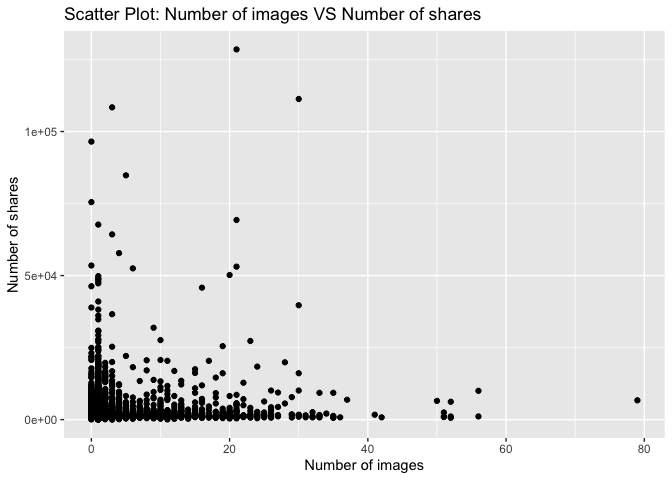
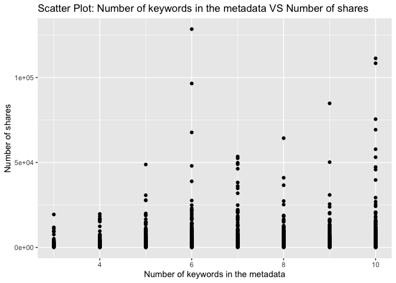

Project 3
================
Shaoyu Wang, Aniket Walimbe
2022-11-14

-   <a href="#introduction" id="toc-introduction">Introduction</a>
-   <a href="#required-packages" id="toc-required-packages">Required
    Packages</a>
-   <a href="#data" id="toc-data">Data</a>
-   <a href="#summarizations" id="toc-summarizations">Summarizations</a>
-   <a href="#model" id="toc-model">Model</a>
-   <a href="#comparison" id="toc-comparison">Comparison</a>
-   <a href="#automation" id="toc-automation">Automation</a>

# Introduction

This [online News Popularity Data
Set](https://archive.ics.uci.edu/ml/datasets/Online+News+Popularity)
summarizes a heterogeneous set of features about articles published by
Mashable in a period of two years.

# Required Packages

First, we will load the required packages:

``` r
# Load libraries
library(readr)
library(tidyverse)
library(dplyr)
library(caret)
library(leaps)
library(ggplot2)
library(corrplot)
library(GGally)
library(randomForest)
```

# Data

Read in the data and subset the data to work on the data channel of
interest. We found that there are seven similar columns for weekday from
Monday to Sunday, so we merged these columns and named the new variable
as `publush_weekday`. For this step, we also removed the non-predictive
variables.

``` r
#Read in the data file
newsData <- read_csv("OnlineNewsPopularity.csv",show_col_types = FALSE)
#Choose the data channel of interest
if (params$channel != "") {
  paramChannelName <- params$channel
} else {
  paramChannelName <- "lifestyle"
}
channel <- paste("data_channel_is_", paramChannelName, sep = "")
#Merge the weekdays columns as one single column.
news <- newsData %>% 
  filter(.data[[channel]] == 1) %>% 
  select(url, starts_with("weekday_is_")) %>% 
  pivot_longer(-url) %>% 
  filter(value != 0) %>% 
  mutate(publish_weekday = substr(name, 12, 20)) %>% 
  left_join(newsData, by = "url") %>% 
#Remove non predictive variables
  select(-c(url, name, value, timedelta, starts_with("data_channel_is_"), starts_with("weekday_is_")))
news$publish_weekday <- as.factor(news$publish_weekday)
news
```

    ## # A tibble: 8,427 × 47
    ##    publish_…¹ n_tok…² n_tok…³ n_uni…⁴ n_non…⁵ n_non…⁶ num_h…⁷ num_s…⁸ num_i…⁹
    ##    <fct>        <dbl>   <dbl>   <dbl>   <dbl>   <dbl>   <dbl>   <dbl>   <dbl>
    ##  1 monday          10     231   0.636    1.00   0.797       4       1       1
    ##  2 monday           9    1248   0.490    1.00   0.732      11       0       1
    ##  3 monday          12     682   0.460    1.00   0.635      10       0       1
    ##  4 monday           9     391   0.510    1.00   0.650       9       2       1
    ##  5 monday          11     125   0.675    1.00   0.797       1       1       1
    ##  6 monday          11     799   0.504    1.00   0.738       8       6       1
    ##  7 monday          11     317   0.611    1.00   0.729       7       6       1
    ##  8 monday          11     399   0.598    1.00   0.806       8       0       1
    ##  9 monday           9     443   0.467    1.00   0.589       3       1       1
    ## 10 tuesday         12     288   0.589    1.00   0.726       5       2       0
    ## # … with 8,417 more rows, 38 more variables: num_videos <dbl>,
    ## #   average_token_length <dbl>, num_keywords <dbl>, kw_min_min <dbl>,
    ## #   kw_max_min <dbl>, kw_avg_min <dbl>, kw_min_max <dbl>, kw_max_max <dbl>,
    ## #   kw_avg_max <dbl>, kw_min_avg <dbl>, kw_max_avg <dbl>, kw_avg_avg <dbl>,
    ## #   self_reference_min_shares <dbl>, self_reference_max_shares <dbl>,
    ## #   self_reference_avg_sharess <dbl>, is_weekend <dbl>, LDA_00 <dbl>,
    ## #   LDA_01 <dbl>, LDA_02 <dbl>, LDA_03 <dbl>, LDA_04 <dbl>, …

Split the data into a training set and a test set.

``` r
set.seed(111)
trainIndex <- createDataPartition(news$shares, p = 0.7, list = FALSE)
newsTrain <- news[trainIndex,]
newsTest <- news[-trainIndex,]
#newsTrain
```

# Summarizations

Some basic summary statistics and plots about the training data.

## Tables

Firstly, we summarized the training data.

``` r
summary(newsTrain)
```

    ##   publish_weekday n_tokens_title  n_tokens_content n_unique_tokens 
    ##  friday   : 915   Min.   : 4.00   Min.   :   0.0   Min.   :0.0000  
    ##  monday   : 947   1st Qu.: 9.00   1st Qu.: 328.0   1st Qu.:0.4654  
    ##  saturday : 369   Median :11.00   Median : 505.5   Median :0.5199  
    ##  sunday   : 407   Mean   :10.58   Mean   : 595.3   Mean   :0.5109  
    ##  thursday :1083   3rd Qu.:12.00   3rd Qu.: 764.0   3rd Qu.:0.5750  
    ##  tuesday  :1087   Max.   :23.00   Max.   :4661.0   Max.   :0.9762  
    ##  wednesday:1092                                                    
    ##  n_non_stop_words n_non_stop_unique_tokens   num_hrefs      num_self_hrefs  
    ##  Min.   :0.0000   Min.   :0.0000           Min.   :  0.00   Min.   : 0.000  
    ##  1st Qu.:1.0000   1st Qu.:0.6285           1st Qu.:  5.00   1st Qu.: 1.000  
    ##  Median :1.0000   Median :0.6839           Median :  8.00   Median : 2.000  
    ##  Mean   :0.9693   Mean   :0.6653           Mean   : 10.15   Mean   : 2.409  
    ##  3rd Qu.:1.0000   3rd Qu.:0.7354           3rd Qu.: 13.00   3rd Qu.: 3.000  
    ##  Max.   :1.0000   Max.   :1.0000           Max.   :120.00   Max.   :38.000  
    ##                                                                             
    ##     num_imgs        num_videos      average_token_length  num_keywords   
    ##  Min.   : 0.000   Min.   : 0.0000   Min.   :0.000        Min.   : 3.000  
    ##  1st Qu.: 1.000   1st Qu.: 0.0000   1st Qu.:4.654        1st Qu.: 6.000  
    ##  Median : 1.000   Median : 0.0000   Median :4.823        Median : 7.000  
    ##  Mean   : 2.837   Mean   : 0.5464   Mean   :4.679        Mean   : 7.277  
    ##  3rd Qu.: 2.000   3rd Qu.: 1.0000   3rd Qu.:4.975        3rd Qu.: 9.000  
    ##  Max.   :79.000   Max.   :51.0000   Max.   :6.124        Max.   :10.000  
    ##                                                                          
    ##    kw_min_min       kw_max_min      kw_avg_min        kw_min_max    
    ##  Min.   : -1.00   Min.   :    0   Min.   :   -1.0   Min.   :     0  
    ##  1st Qu.: -1.00   1st Qu.:  431   1st Qu.:  117.6   1st Qu.:     0  
    ##  Median : -1.00   Median :  630   Median :  206.9   Median :  1100  
    ##  Mean   : 16.46   Mean   : 1012   Mean   :  265.9   Mean   :  6836  
    ##  3rd Qu.:  4.00   3rd Qu.:  946   3rd Qu.:  324.3   3rd Qu.:  5100  
    ##  Max.   :217.00   Max.   :80400   Max.   :10171.4   Max.   :208300  
    ##                                                                     
    ##    kw_max_max       kw_avg_max       kw_min_avg       kw_max_avg    
    ##  Min.   :     0   Min.   :     0   Min.   :  -1.0   Min.   :     0  
    ##  1st Qu.:843300   1st Qu.:178708   1st Qu.:   0.0   1st Qu.:  3451  
    ##  Median :843300   Median :220308   Median : 838.3   Median :  3585  
    ##  Mean   :783618   Mean   :227409   Mean   : 838.7   Mean   :  4694  
    ##  3rd Qu.:843300   3rd Qu.:274600   3rd Qu.:1588.0   3rd Qu.:  4707  
    ##  Max.   :843300   Max.   :640800   Max.   :3009.0   Max.   :112787  
    ##                                                                     
    ##    kw_avg_avg    self_reference_min_shares self_reference_max_shares
    ##  Min.   :    0   Min.   :     0.0          Min.   :     0           
    ##  1st Qu.: 2065   1st Qu.:   465.8          1st Qu.:   691           
    ##  Median : 2401   Median :   978.0          Median :  1700           
    ##  Mean   : 2514   Mean   :  2886.1          Mean   :  6148           
    ##  3rd Qu.: 2784   3rd Qu.:  1800.0          3rd Qu.:  4500           
    ##  Max.   :15722   Max.   :690400.0          Max.   :690400           
    ##                                                                     
    ##  self_reference_avg_sharess   is_weekend         LDA_00       
    ##  Min.   :     0.0           Min.   :0.0000   Min.   :0.01818  
    ##  1st Qu.:   674.2           1st Qu.:0.0000   1st Qu.:0.02500  
    ##  Median :  1427.9           Median :0.0000   Median :0.03066  
    ##  Mean   :  4157.4           Mean   :0.1315   Mean   :0.06679  
    ##  3rd Qu.:  3200.0           3rd Qu.:0.0000   3rd Qu.:0.04001  
    ##  Max.   :690400.0           Max.   :1.0000   Max.   :0.81801  
    ##                                                               
    ##      LDA_01            LDA_02            LDA_03            LDA_04       
    ##  Min.   :0.01818   Min.   :0.02001   Min.   :0.01818   Min.   :0.01819  
    ##  1st Qu.:0.02256   1st Qu.:0.52632   1st Qu.:0.02500   1st Qu.:0.02857  
    ##  Median :0.02858   Median :0.73332   Median :0.02964   Median :0.04000  
    ##  Mean   :0.05474   Mean   :0.67098   Mean   :0.07234   Mean   :0.13515  
    ##  3rd Qu.:0.04000   3rd Qu.:0.86323   3rd Qu.:0.04004   3rd Qu.:0.19995  
    ##  Max.   :0.79489   Max.   :0.92000   Max.   :0.81994   Max.   :0.82312  
    ##                                                                         
    ##  global_subjectivity global_sentiment_polarity global_rate_positive_words
    ##  Min.   :0.0000      Min.   :-0.32273          Min.   :0.00000           
    ##  1st Qu.:0.3572      1st Qu.: 0.02190          1st Qu.:0.02187           
    ##  Median :0.4140      Median : 0.07331          Median :0.03056           
    ##  Mean   :0.4030      Mean   : 0.07672          Mean   :0.03133           
    ##  3rd Qu.:0.4659      3rd Qu.: 0.12641          3rd Qu.:0.03970           
    ##  Max.   :0.9500      Max.   : 0.52000          Max.   :0.11273           
    ##                                                                          
    ##  global_rate_negative_words rate_positive_words rate_negative_words
    ##  Min.   :0.00000            Min.   :0.0000      Min.   :0.0000     
    ##  1st Qu.:0.01088            1st Qu.:0.5333      1st Qu.:0.2444     
    ##  Median :0.01644            Median :0.6429      Median :0.3438     
    ##  Mean   :0.01699            Mean   :0.6234      Mean   :0.3459     
    ##  3rd Qu.:0.02223            3rd Qu.:0.7430      3rd Qu.:0.4500     
    ##  Max.   :0.07143            Max.   :1.0000      Max.   :1.0000     
    ##                                                                    
    ##  avg_positive_polarity min_positive_polarity max_positive_polarity
    ##  Min.   :0.0000        Min.   :0.00000       Min.   :0.0000       
    ##  1st Qu.:0.2819        1st Qu.:0.05000       1st Qu.:0.5000       
    ##  Median :0.3315        Median :0.10000       Median :0.7000       
    ##  Mean   :0.3250        Mean   :0.08907       Mean   :0.6991       
    ##  3rd Qu.:0.3790        3rd Qu.:0.10000       3rd Qu.:0.9000       
    ##  Max.   :0.8667        Max.   :0.80000       Max.   :1.0000       
    ##                                                                   
    ##  avg_negative_polarity min_negative_polarity max_negative_polarity
    ##  Min.   :-1.0000       Min.   :-1.0000       Min.   :-1.00000     
    ##  1st Qu.:-0.3096       1st Qu.:-0.8000       1st Qu.:-0.10000     
    ##  Median :-0.2457       Median :-0.5000       Median :-0.10000     
    ##  Mean   :-0.2523       Mean   :-0.5597       Mean   :-0.09429     
    ##  3rd Qu.:-0.1901       3rd Qu.:-0.4000       3rd Qu.:-0.05000     
    ##  Max.   : 0.0000       Max.   : 0.0000       Max.   : 0.00000     
    ##                                                                   
    ##  title_subjectivity title_sentiment_polarity abs_title_subjectivity
    ##  Min.   :0.0000     Min.   :-1.00000         Min.   :0.0000        
    ##  1st Qu.:0.0000     1st Qu.: 0.00000         1st Qu.:0.2000        
    ##  Median :0.0000     Median : 0.00000         Median :0.5000        
    ##  Mean   :0.2465     Mean   : 0.03457         Mean   :0.3611        
    ##  3rd Qu.:0.4545     3rd Qu.: 0.09370         3rd Qu.:0.5000        
    ##  Max.   :1.0000     Max.   : 1.00000         Max.   :0.5000        
    ##                                                                    
    ##  abs_title_sentiment_polarity     shares      
    ##  Min.   :0.0000               Min.   :    41  
    ##  1st Qu.:0.0000               1st Qu.:   827  
    ##  Median :0.0000               Median :  1100  
    ##  Mean   :0.1288               Mean   :  2272  
    ##  3rd Qu.:0.2000               3rd Qu.:  1900  
    ##  Max.   :1.0000               Max.   :128500  
    ## 

Then let’s check our response variable `shares`. It shows that the mean
of `shares` is 3847, standard deviation is 10112, median is 1700, IQR is
2125.

``` r
#numerical summary for the variable shares
newsTrain %>% 
  summarise(mean = round(mean(shares), 0), sd = round(sd(shares), 0), 
            median = round(median(shares), 0), IQR = round(IQR(shares), 0))
```

    ## # A tibble: 1 × 4
    ##    mean    sd median   IQR
    ##   <dbl> <dbl>  <dbl> <dbl>
    ## 1  2272  5178   1100  1073

``` r
#numerical summaries on subgroups
newsTrain %>% 
  group_by(publish_weekday) %>% 
  summarise(mean = round(mean(shares), 0), sd = round(sd(shares), 0), 
            median = round(median(shares), 0), IQR = round(IQR(shares), 0))
```

    ## # A tibble: 7 × 5
    ##   publish_weekday  mean    sd median   IQR
    ##   <fct>           <dbl> <dbl>  <dbl> <dbl>
    ## 1 friday           2332  6698   1100  1056
    ## 2 monday           2380  6178   1100   876
    ## 3 saturday         2970  5498   1600  1600
    ## 4 sunday           2446  3387   1400  1200
    ## 5 thursday         2150  4463   1100   916
    ## 6 tuesday          2235  5277   1100   928
    ## 7 wednesday        1983  3473   1100   921

``` r
newsTrain %>% 
  group_by(num_imgs) %>% 
  summarise(mean = round(mean(shares), 0), sd = round(sd(shares), 0), 
            median = round(median(shares), 0), IQR = round(IQR(shares), 0))
```

    ## # A tibble: 45 × 5
    ##    num_imgs  mean    sd median   IQR
    ##       <dbl> <dbl> <dbl>  <dbl> <dbl>
    ##  1        0  3013  6613   1300  1836
    ##  2        1  1922  3639   1100   819
    ##  3        2  1874  2448   1100   851
    ##  4        3  2710  7724   1200   984
    ##  5        4  2332  4653   1300  1329
    ##  6        5  2748  8959   1200  1068
    ##  7        6  2606  6731   1200   983
    ##  8        7  2113  2143   1400  1222
    ##  9        8  2798  3922   1500  1675
    ## 10        9  3220  5464   1600  1690
    ## # … with 35 more rows

``` r
newsTrain %>% 
  group_by(num_videos) %>% 
  summarise(mean = round(mean(shares), 0), sd = round(sd(shares), 0), 
            median = round(median(shares), 0), IQR = round(IQR(shares), 0))
```

    ## # A tibble: 23 × 5
    ##    num_videos  mean    sd median   IQR
    ##         <dbl> <dbl> <dbl>  <dbl> <dbl>
    ##  1          0  2093  4316   1100   987
    ##  2          1  2571  6227   1100  1159
    ##  3          2  3125  9236   1200  1319
    ##  4          3  2459  5320   1200  1105
    ##  5          4  2253  2260   1500  1678
    ##  6          5  1991  1471   1300  1404
    ##  7          6  2085  1775   1500   800
    ##  8          7  5497 10739   1350  1612
    ##  9          8  1397   913   1100   717
    ## 10          9  1764   664   1600   550
    ## # … with 13 more rows

``` r
newsTrain %>% 
  group_by(num_keywords) %>% 
  summarise(mean = round(mean(shares), 0), sd = round(sd(shares), 0), 
            median = round(median(shares), 0), IQR = round(IQR(shares), 0))
```

    ## # A tibble: 8 × 5
    ##   num_keywords  mean    sd median   IQR
    ##          <dbl> <dbl> <dbl>  <dbl> <dbl>
    ## 1            3  2110  3032   1000   917
    ## 2            4  1829  2638   1100   771
    ## 3            5  2056  3431   1100   840
    ## 4            6  2267  6250   1100   887
    ## 5            7  2221  4656   1100  1072
    ## 6            8  2109  3808   1100  1095
    ## 7            9  2167  4556   1200   988
    ## 8           10  2845  7217   1200  1360

Contingency tables :  
Here, the title subjectivity is divided into 3 categories : high, medium
and low based on the values. If the value is greater than 0.8, it is
high, greater than 0.4 and less than 0.8 is medium and remaining is low.
The contingency table is then shown below.

``` r
newsTrain$subject_activity_type <- ifelse(newsTrain$title_subjectivity >= 0.8, "High", 
                                          ifelse(newsTrain$title_subjectivity >= 0.4, "Medium",
                                                 ifelse(airquality$Wind >= 0, "Low", "None")))
table(newsTrain$subject_activity_type)
```

    ## 
    ##   High    Low Medium 
    ##    551   4055   1294

The contingency table below shows the counts for each published weekday.
From this table, we can find that the highest count is Wednesday, the
lowest count is Saturday.

``` r
table(newsTrain$publish_weekday)
```

    ## 
    ##    friday    monday  saturday    sunday  thursday   tuesday wednesday 
    ##       915       947       369       407      1083      1087      1092

## Plots

``` r
g <- ggplot(newsTrain, aes(x = n_tokens_title))
g + geom_histogram(fill = "lightblue", binwidth = 1) + 
  labs()
```

<!-- -->

``` r
g <- ggplot(newsTrain, aes(x = n_tokens_content))
g + geom_histogram(fill = "lightblue") + 
  labs()
```

<!-- -->

``` r
g <- ggplot(newsTrain, aes(x = global_subjectivity))
g + geom_histogram(fill = "lightblue") + 
  labs()
```

<!-- -->

``` r
g <- ggplot(newsTrain, aes(x = global_sentiment_polarity))
g + geom_histogram(fill = "lightblue") + 
  labs()
```

<!-- -->

``` r
g <- ggplot(newsTrain, aes(x = rate_positive_words, y = shares))
g + geom_point() + 
  labs()
```

<!-- -->

``` r
g <- ggplot(newsTrain, aes(x = average_token_length, y = shares))
g + geom_point() + 
  labs()
```

<!-- -->

Plot between title subjectivity and number of shares: We can inspect the
trend of the shares as a function of title subjectivity.

``` r
g <- ggplot(data = newsTrain, aes(x = title_subjectivity, y = shares))
g + geom_point() + 
  labs(x = "Title subjectivity" , y = "Number of shares", title = "Scatter Plot : Title Subjectivity Vs Number of Shares") 
```

<!-- -->

Plot between number of shares and article published day: This plot shows
the number of shares an article has based on the day it has been
published.

``` r
newsTrainday <- newsTrain %>%
  select(publish_weekday, shares) %>%
  group_by(publish_weekday) %>% 
  summarise(total_shares=sum(shares))

g <- ggplot(data = newsTrainday, aes(x=publish_weekday, y=total_shares))
g + geom_col(fill = "lightblue")+
  labs(title = " Shares for articles published based on weekdays")
```

<!-- -->

Plot between number of images and number of shares:

``` r
g <- ggplot(data = newsTrain, aes(x = num_imgs, y = shares))
g + geom_point() +
  labs(x = "Number of Images" , y = "Number of shares", title = "Scatter Plot : Number of Images Vs Number of Shares") 
```

<!-- -->

Plotting the correlation between numeric variables.

``` r
correlation <- cor(newsTrain %>% select(-c(publish_weekday, subject_activity_type)), method = "spearman")
corrplot(correlation, type = "upper", tl.pos = "lt", tl.col = "black", tl.cex = 0.5, mar = c(2, 0, 1, 0)) 
corrplot(correlation, type = "lower", add = TRUE, diag = FALSE, tl.pos = "n", number.cex = 0.5)
```

<!-- -->

Select predictors: publish_weekday, n_tokens_title, n_tokens_content,
num_self_hrefs, num_videos, average_token_length, num_keywords,
kw_avg_avg, self_reference_avg_sharess, LDA_04, global_subjectivity,
global_sentiment_polarity, avg_positive_polarity, avg_negative_polarity,
title_subjectivity, shares.

``` r
set.seed(111)
Train <- newsTrain %>% 
  select(publish_weekday, n_tokens_title, n_tokens_content, num_self_hrefs, num_videos, average_token_length, num_keywords, kw_avg_avg, self_reference_avg_sharess, LDA_04, global_subjectivity, global_sentiment_polarity, avg_positive_polarity, avg_negative_polarity, title_subjectivity, shares)
Test <- newsTest %>% 
  select(publish_weekday, n_tokens_title, n_tokens_content, num_self_hrefs, num_videos, average_token_length, num_keywords, kw_avg_avg, self_reference_avg_sharess, LDA_04, global_subjectivity, global_sentiment_polarity, avg_positive_polarity, avg_negative_polarity, title_subjectivity, shares)
Train
```

    ## # A tibble: 5,900 × 16
    ##    publish_…¹ n_tok…² n_tok…³ num_s…⁴ num_v…⁵ avera…⁶ num_k…⁷ kw_av…⁸ self_…⁹
    ##    <fct>        <dbl>   <dbl>   <dbl>   <dbl>   <dbl>   <dbl>   <dbl>   <dbl>
    ##  1 monday          10     231       1       1    5.09       5      0       0 
    ##  2 monday           9    1248       0       0    4.62       8      0       0 
    ##  3 monday          11     125       1       0    4.82       6      0   16100 
    ##  4 monday          11     317       6       0    5.24       5      0    1560.
    ##  5 monday          11     399       0       0    4.58       7      0       0 
    ##  6 monday           9     443       1       0    5.01       6      0       0 
    ##  7 tuesday         12     288       2       0    4.38       6    804.   3100 
    ##  8 tuesday         10     414       0       0    4.98       6    728.      0 
    ##  9 wednesday       12     540       1       0    4.15      10   1047.      0 
    ## 10 wednesday        6     389       5       1    4.32       7    542.   1300 
    ## # … with 5,890 more rows, 7 more variables: LDA_04 <dbl>,
    ## #   global_subjectivity <dbl>, global_sentiment_polarity <dbl>,
    ## #   avg_positive_polarity <dbl>, avg_negative_polarity <dbl>,
    ## #   title_subjectivity <dbl>, shares <dbl>, and abbreviated variable names
    ## #   ¹​publish_weekday, ²​n_tokens_title, ³​n_tokens_content, ⁴​num_self_hrefs,
    ## #   ⁵​num_videos, ⁶​average_token_length, ⁷​num_keywords, ⁸​kw_avg_avg,
    ## #   ⁹​self_reference_avg_sharess

# Model

## Linear Regression Model

``` r
#forward stepwise
set.seed(111)
fwFit <- train(shares ~ ., data = Train,
                   method = "leapForward",
                   preProcess = c("center", "scale"))
fwFit
```

    ## Linear Regression with Forward Selection 
    ## 
    ## 5900 samples
    ##   15 predictor
    ## 
    ## Pre-processing: centered (20), scaled (20) 
    ## Resampling: Bootstrapped (25 reps) 
    ## Summary of sample sizes: 5900, 5900, 5900, 5900, 5900, 5900, ... 
    ## Resampling results across tuning parameters:
    ## 
    ##   nvmax  RMSE      Rsquared     MAE     
    ##   2      5279.206  0.008920562  1907.124
    ##   3      5266.447  0.013371578  1899.757
    ##   4      5260.960  0.015195288  1897.385
    ## 
    ## RMSE was used to select the optimal model using the smallest value.
    ## The final value used for the model was nvmax = 4.

``` r
#summary(fwFit)
```

``` r
#backward stepwise
set.seed(111)
bwFit <- train(shares ~ ., data = Train,
                   method = "leapBackward",
                   preProcess = c("center", "scale"))
bwFit
```

    ## Linear Regression with Backwards Selection 
    ## 
    ## 5900 samples
    ##   15 predictor
    ## 
    ## Pre-processing: centered (20), scaled (20) 
    ## Resampling: Bootstrapped (25 reps) 
    ## Summary of sample sizes: 5900, 5900, 5900, 5900, 5900, 5900, ... 
    ## Resampling results across tuning parameters:
    ## 
    ##   nvmax  RMSE      Rsquared    MAE     
    ##   2      5273.509  0.01027128  1907.092
    ##   3      5254.033  0.01727434  1894.377
    ##   4      5257.709  0.01632241  1895.427
    ## 
    ## RMSE was used to select the optimal model using the smallest value.
    ## The final value used for the model was nvmax = 3.

``` r
#summary(bwFit)
```

``` r
#fit a linear regression model with all predictors
set.seed(111)
lrFit <- train(shares ~ ., data = Train,
               method = "lm",
               trControl = trainControl(method = "cv", number = 5))
lrFit
```

    ## Linear Regression 
    ## 
    ## 5900 samples
    ##   15 predictor
    ## 
    ## No pre-processing
    ## Resampling: Cross-Validated (5 fold) 
    ## Summary of sample sizes: 4720, 4719, 4720, 4721, 4720 
    ## Resampling results:
    ## 
    ##   RMSE      Rsquared   MAE     
    ##   4921.527  0.0271714  1877.126
    ## 
    ## Tuning parameter 'intercept' was held constant at a value of TRUE

## Random Forest Model

``` r
set.seed(111)
randomFit <- train(shares ~ ., 
                   data = Train, 
                   method = "rf",
                   preProcess = c("center","scale"),
                   trControl = trainControl(method = "cv", number = 5),
                   tuneGrid = data.frame(mtry = ncol(Train)/3))
randomFit
```

    ## Random Forest 
    ## 
    ## 5900 samples
    ##   15 predictor
    ## 
    ## Pre-processing: centered (20), scaled (20) 
    ## Resampling: Cross-Validated (5 fold) 
    ## Summary of sample sizes: 4720, 4719, 4720, 4721, 4720 
    ## Resampling results:
    ## 
    ##   RMSE      Rsquared    MAE     
    ##   4973.146  0.02981532  1958.524
    ## 
    ## Tuning parameter 'mtry' was held constant at a value of 5.333333

## Boosted Tree Model

``` r
set.seed(111)
boostedFit <- train(shares ~ ., 
                    data = Train, 
                    method = "gbm", 
                    preProcess = c("center", "scale"),
                    trControl = trainControl(method = "cv", number = 5),
                    tuneGrid = expand.grid(n.trees = c(25,50,100,150,200), 
                                           interaction.depth = c(1,2,3,4), 
                                           shrinkage = 0.1, 
                                           n.minobsinnode = 10),
                    verbose = FALSE)
boostedFit
```

    ## Stochastic Gradient Boosting 
    ## 
    ## 5900 samples
    ##   15 predictor
    ## 
    ## Pre-processing: centered (20), scaled (20) 
    ## Resampling: Cross-Validated (5 fold) 
    ## Summary of sample sizes: 4720, 4719, 4720, 4721, 4720 
    ## Resampling results across tuning parameters:
    ## 
    ##   interaction.depth  n.trees  RMSE      Rsquared    MAE     
    ##   1                   25      4916.004  0.03187525  1859.920
    ##   1                   50      4904.802  0.03454065  1845.859
    ##   1                  100      4913.012  0.03396203  1859.938
    ##   1                  150      4913.872  0.03400176  1865.580
    ##   1                  200      4917.698  0.03297813  1856.860
    ##   2                   25      4910.227  0.03400539  1850.806
    ##   2                   50      4917.666  0.03479009  1854.953
    ##   2                  100      4936.841  0.03278568  1863.311
    ##   2                  150      4963.946  0.02798958  1881.893
    ##   2                  200      4994.509  0.02490203  1907.916
    ##   3                   25      4918.568  0.02985551  1868.050
    ##   3                   50      4949.979  0.02833547  1871.374
    ##   3                  100      4992.833  0.02411788  1882.458
    ##   3                  150      5043.816  0.02047385  1923.002
    ##   3                  200      5067.668  0.01666443  1943.872
    ##   4                   25      4932.368  0.02926694  1868.268
    ##   4                   50      4975.715  0.02960835  1883.674
    ##   4                  100      5038.752  0.02337662  1932.182
    ##   4                  150      5089.536  0.01915961  1964.593
    ##   4                  200      5123.553  0.01722704  1987.109
    ## 
    ## Tuning parameter 'shrinkage' was held constant at a value of 0.1
    ## 
    ## Tuning parameter 'n.minobsinnode' was held constant at a value of 10
    ## RMSE was used to select the optimal model using the smallest value.
    ## The final values used for the model were n.trees = 50, interaction.depth
    ##  = 1, shrinkage = 0.1 and n.minobsinnode = 10.

# Comparison

All the models are compared by RMSE on the test set

``` r
#fit a linear regression model
fw_mod <- postResample(predict(fwFit, newdata = Test), obs = Test$shares)
bw_mod <- postResample(predict(bwFit, newdata = Test), obs = Test$shares)
lr_mod <- postResample(predict(lrFit, newdata = Test), obs = Test$shares)
#random forest
random_mod <- postResample(predict(randomFit, newdata = Test), obs = Test$shares)
#boosted tree
boosted_mod <- postResample(predict(boostedFit, newdata = Test), obs = Test$shares)
#compare all models
tibble(model = c("Forward",
                 "Backward",
                 "LR with all predictors",
                 "Random Forest",
                 "Boosted Tree"), 
       RMSE = c(fw_mod[1],
                bw_mod[1],
                lr_mod[1],
                random_mod[1],
                boosted_mod[1]))
```

    ## # A tibble: 5 × 2
    ##   model                   RMSE
    ##   <chr>                  <dbl>
    ## 1 Forward                7789.
    ## 2 Backward               7787.
    ## 3 LR with all predictors 7771.
    ## 4 Random Forest          7684.
    ## 5 Boosted Tree           7744.

# Automation

``` automate
#create channel names
channelIDs <- data.frame("lifestyle","entertainment","bus","socmed","tech","world")
#create filenames
output_file <- paste0(channelIDs,".md")
#create a list for each channel with the channel name parameter
params = lapply(channelIDs, FUN = function(x){list(channel = x)})
#put into a data frame
reports <- tibble(output_file, params)
#render code
apply(reports, MARGIN = 1,
          FUN = function(x){
             rmarkdown::render(input = "project3.Rmd",
             output_format = "github_document",
             output_file = x[[1]],
             params = x[[2]],
             output_options = list(toc=TRUE, toc_depth=1, toc_float=TRUE))
             })
```
