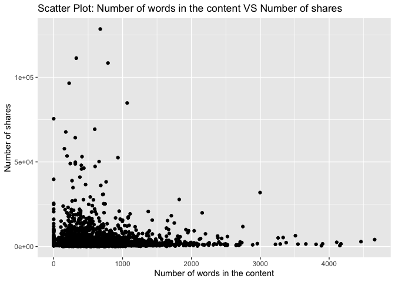
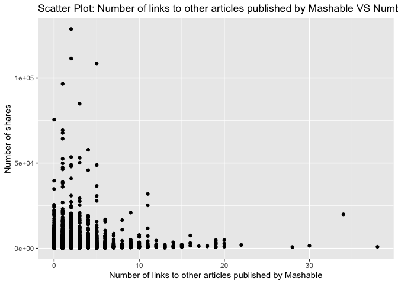

Project 3
================
Shaoyu Wang, Aniket Walimbe
2022-11-16

# The Analysis for world Data Channel

## Introduction

This [online news popularity data
set](https://archive.ics.uci.edu/ml/datasets/Online+News+Popularity)
summarizes a heterogeneous set of features about articles published by
Mashable in a period of two years. There are 61 attributes, including 58
predictive attributes, 2 non-predictive, 1 goal field. The number of
shares is our target variable, and we select predictive variables from
the remaining variables based on the exploratory data analysis. The
purpose of our analysis is to predict the the number of shares. During
this project, we read and subset the data set at first, and split data
into training set and test set, then we create some basic summary
statistics and plots about the training data, at last we fit linear
regression models and ensemble tree-based models and test the
predictions.

**Variable information**

The target variable is the following:  
- `shares`: Number of shares

The predictive variables are the following:  
- `publish_weekday`: The article published day  
- `n_tokens_title`: Number of words in the title  
- `n_tokens_content`: Number of words in the content  
- `num_self_hrefs`: Number of links to other articles published by
Mashable  
- `num_imgs`: Number of images  
- `num_videos`: Number of videos  
- `average_token_length`: Average length of the words in the content  
- `num_keywords`: Number of keywords in the metadata  
- `kw_avg_avg`: Avg. keyword (avg. shares)  
- `self_reference_avg_sharess`: Avg. shares of referenced articles in
Mashable  
- `LDA_04`: Closeness to LDA topic 4  
- `global_subjectivity`: Text subjectivity  
- `global_sentiment_polarity`: Text sentiment polarity  
- `avg_positive_polarity`: Avg. polarity of positive words  
- `avg_negative_polarity`: Avg. polarity of negative words

**Required packages**

We need to load the required packages:

``` r
# Load libraries
library(readr)
library(tidyverse)
library(dplyr)
library(caret)
library(leaps)
library(ggplot2)
library(corrplot)
library(randomForest)
library(rmarkdown)
```

## Data

Read in the data and subset the data to work on the data channel of
interest. We find that there are seven similar columns for weekdays from
Monday to Sunday, so we merge these columns and name the new variable as
`publish_weekday` and convert it to factor. For this step, we also
remove the non-predictive variables.

``` r
#Read in the data file
newsData <- read_csv("OnlineNewsPopularity.csv")
#Select the data channel of interest
selectChannel <- paste0("data_channel_is_", params[[1]])
news <- newsData %>% 
  filter(get(selectChannel) == 1) %>% 
  select(url, starts_with("weekday_is_")) %>% 
  pivot_longer(-url) %>% 
  filter(value != 0) %>% 
  mutate(publish_weekday = substr(name, 12, 20)) %>% 
  left_join(newsData, by = "url") %>% 
#Remove non predictive variables
  select(-c(url, name, value, timedelta, starts_with("data_channel_is_"), starts_with("weekday_is_")))
#convert publish_weekday to factor
news$publish_weekday <- as.factor(news$publish_weekday)
news
```

    ## # A tibble: 8,427 × 47
    ##    publish_…¹ n_tok…² n_tok…³ n_uni…⁴ n_non…⁵ n_non…⁶ num_h…⁷ num_s…⁸ num_i…⁹
    ##    <fct>        <dbl>   <dbl>   <dbl>   <dbl>   <dbl>   <dbl>   <dbl>   <dbl>
    ##  1 monday          10     231   0.636    1.00   0.797       4       1       1
    ##  2 monday           9    1248   0.490    1.00   0.732      11       0       1
    ##  3 monday          12     682   0.460    1.00   0.635      10       0       1
    ##  4 monday           9     391   0.510    1.00   0.650       9       2       1
    ##  5 monday          11     125   0.675    1.00   0.797       1       1       1
    ##  6 monday          11     799   0.504    1.00   0.738       8       6       1
    ##  7 monday          11     317   0.611    1.00   0.729       7       6       1
    ##  8 monday          11     399   0.598    1.00   0.806       8       0       1
    ##  9 monday           9     443   0.467    1.00   0.589       3       1       1
    ## 10 tuesday         12     288   0.589    1.00   0.726       5       2       0
    ## # … with 8,417 more rows, 38 more variables: num_videos <dbl>,
    ## #   average_token_length <dbl>, num_keywords <dbl>, kw_min_min <dbl>,
    ## #   kw_max_min <dbl>, kw_avg_min <dbl>, kw_min_max <dbl>, kw_max_max <dbl>,
    ## #   kw_avg_max <dbl>, kw_min_avg <dbl>, kw_max_avg <dbl>, kw_avg_avg <dbl>,
    ## #   self_reference_min_shares <dbl>, self_reference_max_shares <dbl>,
    ## #   self_reference_avg_sharess <dbl>, is_weekend <dbl>, LDA_00 <dbl>,
    ## #   LDA_01 <dbl>, LDA_02 <dbl>, LDA_03 <dbl>, LDA_04 <dbl>, …

Split the data into a training set and a test set.

``` r
set.seed(111)
trainIndex <- createDataPartition(news$shares, p = 0.7, list = FALSE)
newsTrain <- news[trainIndex,]
newsTest <- news[-trainIndex,]
#newsTrain
```

## Summarizations

For this part, we produce some basic summary statistics and plots about
the training data.

**Tables**

Firstly, here is a quick summary of all variables as shown below, so
that we can know the variables roughly.

``` r
summary(newsTrain)
```

    ##   publish_weekday n_tokens_title  n_tokens_content n_unique_tokens 
    ##  friday   : 915   Min.   : 4.00   Min.   :   0.0   Min.   :0.0000  
    ##  monday   : 947   1st Qu.: 9.00   1st Qu.: 328.0   1st Qu.:0.4654  
    ##  saturday : 369   Median :11.00   Median : 505.5   Median :0.5199  
    ##  sunday   : 407   Mean   :10.58   Mean   : 595.3   Mean   :0.5109  
    ##  thursday :1083   3rd Qu.:12.00   3rd Qu.: 764.0   3rd Qu.:0.5750  
    ##  tuesday  :1087   Max.   :23.00   Max.   :4661.0   Max.   :0.9762  
    ##  wednesday:1092                                                    
    ##  n_non_stop_words n_non_stop_unique_tokens   num_hrefs      num_self_hrefs  
    ##  Min.   :0.0000   Min.   :0.0000           Min.   :  0.00   Min.   : 0.000  
    ##  1st Qu.:1.0000   1st Qu.:0.6285           1st Qu.:  5.00   1st Qu.: 1.000  
    ##  Median :1.0000   Median :0.6839           Median :  8.00   Median : 2.000  
    ##  Mean   :0.9693   Mean   :0.6653           Mean   : 10.15   Mean   : 2.409  
    ##  3rd Qu.:1.0000   3rd Qu.:0.7354           3rd Qu.: 13.00   3rd Qu.: 3.000  
    ##  Max.   :1.0000   Max.   :1.0000           Max.   :120.00   Max.   :38.000  
    ##                                                                             
    ##     num_imgs        num_videos      average_token_length  num_keywords   
    ##  Min.   : 0.000   Min.   : 0.0000   Min.   :0.000        Min.   : 3.000  
    ##  1st Qu.: 1.000   1st Qu.: 0.0000   1st Qu.:4.654        1st Qu.: 6.000  
    ##  Median : 1.000   Median : 0.0000   Median :4.823        Median : 7.000  
    ##  Mean   : 2.837   Mean   : 0.5464   Mean   :4.679        Mean   : 7.277  
    ##  3rd Qu.: 2.000   3rd Qu.: 1.0000   3rd Qu.:4.975        3rd Qu.: 9.000  
    ##  Max.   :79.000   Max.   :51.0000   Max.   :6.124        Max.   :10.000  
    ##                                                                          
    ##    kw_min_min       kw_max_min      kw_avg_min        kw_min_max    
    ##  Min.   : -1.00   Min.   :    0   Min.   :   -1.0   Min.   :     0  
    ##  1st Qu.: -1.00   1st Qu.:  431   1st Qu.:  117.6   1st Qu.:     0  
    ##  Median : -1.00   Median :  630   Median :  206.9   Median :  1100  
    ##  Mean   : 16.46   Mean   : 1012   Mean   :  265.9   Mean   :  6836  
    ##  3rd Qu.:  4.00   3rd Qu.:  946   3rd Qu.:  324.3   3rd Qu.:  5100  
    ##  Max.   :217.00   Max.   :80400   Max.   :10171.4   Max.   :208300  
    ##                                                                     
    ##    kw_max_max       kw_avg_max       kw_min_avg       kw_max_avg    
    ##  Min.   :     0   Min.   :     0   Min.   :  -1.0   Min.   :     0  
    ##  1st Qu.:843300   1st Qu.:178708   1st Qu.:   0.0   1st Qu.:  3451  
    ##  Median :843300   Median :220308   Median : 838.3   Median :  3585  
    ##  Mean   :783618   Mean   :227409   Mean   : 838.7   Mean   :  4694  
    ##  3rd Qu.:843300   3rd Qu.:274600   3rd Qu.:1588.0   3rd Qu.:  4707  
    ##  Max.   :843300   Max.   :640800   Max.   :3009.0   Max.   :112787  
    ##                                                                     
    ##    kw_avg_avg    self_reference_min_shares self_reference_max_shares
    ##  Min.   :    0   Min.   :     0.0          Min.   :     0           
    ##  1st Qu.: 2065   1st Qu.:   465.8          1st Qu.:   691           
    ##  Median : 2401   Median :   978.0          Median :  1700           
    ##  Mean   : 2514   Mean   :  2886.1          Mean   :  6148           
    ##  3rd Qu.: 2784   3rd Qu.:  1800.0          3rd Qu.:  4500           
    ##  Max.   :15722   Max.   :690400.0          Max.   :690400           
    ##                                                                     
    ##  self_reference_avg_sharess   is_weekend         LDA_00       
    ##  Min.   :     0.0           Min.   :0.0000   Min.   :0.01818  
    ##  1st Qu.:   674.2           1st Qu.:0.0000   1st Qu.:0.02500  
    ##  Median :  1427.9           Median :0.0000   Median :0.03066  
    ##  Mean   :  4157.4           Mean   :0.1315   Mean   :0.06679  
    ##  3rd Qu.:  3200.0           3rd Qu.:0.0000   3rd Qu.:0.04001  
    ##  Max.   :690400.0           Max.   :1.0000   Max.   :0.81801  
    ##                                                               
    ##      LDA_01            LDA_02            LDA_03            LDA_04       
    ##  Min.   :0.01818   Min.   :0.02001   Min.   :0.01818   Min.   :0.01819  
    ##  1st Qu.:0.02256   1st Qu.:0.52632   1st Qu.:0.02500   1st Qu.:0.02857  
    ##  Median :0.02858   Median :0.73332   Median :0.02964   Median :0.04000  
    ##  Mean   :0.05474   Mean   :0.67098   Mean   :0.07234   Mean   :0.13515  
    ##  3rd Qu.:0.04000   3rd Qu.:0.86323   3rd Qu.:0.04004   3rd Qu.:0.19995  
    ##  Max.   :0.79489   Max.   :0.92000   Max.   :0.81994   Max.   :0.82312  
    ##                                                                         
    ##  global_subjectivity global_sentiment_polarity global_rate_positive_words
    ##  Min.   :0.0000      Min.   :-0.32273          Min.   :0.00000           
    ##  1st Qu.:0.3572      1st Qu.: 0.02190          1st Qu.:0.02187           
    ##  Median :0.4140      Median : 0.07331          Median :0.03056           
    ##  Mean   :0.4030      Mean   : 0.07672          Mean   :0.03133           
    ##  3rd Qu.:0.4659      3rd Qu.: 0.12641          3rd Qu.:0.03970           
    ##  Max.   :0.9500      Max.   : 0.52000          Max.   :0.11273           
    ##                                                                          
    ##  global_rate_negative_words rate_positive_words rate_negative_words
    ##  Min.   :0.00000            Min.   :0.0000      Min.   :0.0000     
    ##  1st Qu.:0.01088            1st Qu.:0.5333      1st Qu.:0.2444     
    ##  Median :0.01644            Median :0.6429      Median :0.3438     
    ##  Mean   :0.01699            Mean   :0.6234      Mean   :0.3459     
    ##  3rd Qu.:0.02223            3rd Qu.:0.7430      3rd Qu.:0.4500     
    ##  Max.   :0.07143            Max.   :1.0000      Max.   :1.0000     
    ##                                                                    
    ##  avg_positive_polarity min_positive_polarity max_positive_polarity
    ##  Min.   :0.0000        Min.   :0.00000       Min.   :0.0000       
    ##  1st Qu.:0.2819        1st Qu.:0.05000       1st Qu.:0.5000       
    ##  Median :0.3315        Median :0.10000       Median :0.7000       
    ##  Mean   :0.3250        Mean   :0.08907       Mean   :0.6991       
    ##  3rd Qu.:0.3790        3rd Qu.:0.10000       3rd Qu.:0.9000       
    ##  Max.   :0.8667        Max.   :0.80000       Max.   :1.0000       
    ##                                                                   
    ##  avg_negative_polarity min_negative_polarity max_negative_polarity
    ##  Min.   :-1.0000       Min.   :-1.0000       Min.   :-1.00000     
    ##  1st Qu.:-0.3096       1st Qu.:-0.8000       1st Qu.:-0.10000     
    ##  Median :-0.2457       Median :-0.5000       Median :-0.10000     
    ##  Mean   :-0.2523       Mean   :-0.5597       Mean   :-0.09429     
    ##  3rd Qu.:-0.1901       3rd Qu.:-0.4000       3rd Qu.:-0.05000     
    ##  Max.   : 0.0000       Max.   : 0.0000       Max.   : 0.00000     
    ##                                                                   
    ##  title_subjectivity title_sentiment_polarity abs_title_subjectivity
    ##  Min.   :0.0000     Min.   :-1.00000         Min.   :0.0000        
    ##  1st Qu.:0.0000     1st Qu.: 0.00000         1st Qu.:0.2000        
    ##  Median :0.0000     Median : 0.00000         Median :0.5000        
    ##  Mean   :0.2465     Mean   : 0.03457         Mean   :0.3611        
    ##  3rd Qu.:0.4545     3rd Qu.: 0.09370         3rd Qu.:0.5000        
    ##  Max.   :1.0000     Max.   : 1.00000         Max.   :0.5000        
    ##                                                                    
    ##  abs_title_sentiment_polarity     shares      
    ##  Min.   :0.0000               Min.   :    41  
    ##  1st Qu.:0.0000               1st Qu.:   827  
    ##  Median :0.0000               Median :  1100  
    ##  Mean   :0.1288               Mean   :  2272  
    ##  3rd Qu.:0.2000               3rd Qu.:  1900  
    ##  Max.   :1.0000               Max.   :128500  
    ## 

Then we can check our response variable `shares`. The below table shows
that the mean, standard deviation, median, IQR of `shares`.

``` r
#numerical summary for the variable shares
newsTrain %>% 
  summarise(mean = round(mean(shares), 0), sd = round(sd(shares), 0), 
            median = round(median(shares), 0), IQR = round(IQR(shares), 0))
```

    ## # A tibble: 1 × 4
    ##    mean    sd median   IQR
    ##   <dbl> <dbl>  <dbl> <dbl>
    ## 1  2272  5178   1100  1073

We also obtain the numerical summaries on some subgroups. We choose four
example subgroups: number of images, number of videos, and number of
keywords, since people may concern more on these when they do searching
and sharing.

``` r
#numerical summaries on subgroups
newsTrain %>% 
  group_by(num_imgs) %>% 
  summarise(mean = round(mean(shares), 0), sd = round(sd(shares), 0), 
            median = round(median(shares), 0), IQR = round(IQR(shares), 0))
```

    ## # A tibble: 45 × 5
    ##    num_imgs  mean    sd median   IQR
    ##       <dbl> <dbl> <dbl>  <dbl> <dbl>
    ##  1        0  3013  6613   1300  1836
    ##  2        1  1922  3639   1100   819
    ##  3        2  1874  2448   1100   851
    ##  4        3  2710  7724   1200   984
    ##  5        4  2332  4653   1300  1329
    ##  6        5  2748  8959   1200  1068
    ##  7        6  2606  6731   1200   983
    ##  8        7  2113  2143   1400  1222
    ##  9        8  2798  3922   1500  1675
    ## 10        9  3220  5464   1600  1690
    ## # … with 35 more rows

``` r
newsTrain %>% 
  group_by(num_videos) %>% 
  summarise(mean = round(mean(shares), 0), sd = round(sd(shares), 0), 
            median = round(median(shares), 0), IQR = round(IQR(shares), 0))
```

    ## # A tibble: 23 × 5
    ##    num_videos  mean    sd median   IQR
    ##         <dbl> <dbl> <dbl>  <dbl> <dbl>
    ##  1          0  2093  4316   1100   987
    ##  2          1  2571  6227   1100  1159
    ##  3          2  3125  9236   1200  1319
    ##  4          3  2459  5320   1200  1105
    ##  5          4  2253  2260   1500  1678
    ##  6          5  1991  1471   1300  1404
    ##  7          6  2085  1775   1500   800
    ##  8          7  5497 10739   1350  1612
    ##  9          8  1397   913   1100   717
    ## 10          9  1764   664   1600   550
    ## # … with 13 more rows

``` r
newsTrain %>% 
  group_by(num_keywords) %>% 
  summarise(mean = round(mean(shares), 0), sd = round(sd(shares), 0), 
            median = round(median(shares), 0), IQR = round(IQR(shares), 0))
```

    ## # A tibble: 8 × 5
    ##   num_keywords  mean    sd median   IQR
    ##          <dbl> <dbl> <dbl>  <dbl> <dbl>
    ## 1            3  2110  3032   1000   917
    ## 2            4  1829  2638   1100   771
    ## 3            5  2056  3431   1100   840
    ## 4            6  2267  6250   1100   887
    ## 5            7  2221  4656   1100  1072
    ## 6            8  2109  3808   1100  1095
    ## 7            9  2167  4556   1200   988
    ## 8           10  2845  7217   1200  1360

Moreover, we divide the title subjectivity into 3 categories:  
1. High: greater than 0.8  
2. Medium: 0.4 to less than 0.8  
3. Low: less than 0.4  
The contingency table is then shown below.

``` r
newsTrain$subject_activity_type <- ifelse(newsTrain$title_subjectivity >= 0.8, "High", 
                                          ifelse(newsTrain$title_subjectivity >= 0.4, "Medium",
                                                 ifelse(airquality$Wind >= 0, "Low")))
table(newsTrain$subject_activity_type)
```

    ## 
    ##   High    Low Medium 
    ##    551   4055   1294

**Plots**

At the beginning, let’s plot the correlation between the numeric
variables.

``` r
newsTrainsub <- newsTrain %>% select(-c(publish_weekday, subject_activity_type))
correlation <- cor(newsTrainsub, method = "spearman")
corrplot(correlation, tl.col = "black", tl.cex = 0.5)
```

<!-- -->

From the correlation graph above, we can see that the following
variables seem to be moderately correlated:  
- `n_tokens_contents`, `n_unique_tokens`, `n_non_stop_words`,
`n_non_stop_unique_tokens`, `num_hrefs`, `num_imgs`  
- `kw_min_min`, `kw_max_min`, `kw_avg_min`, `kw_min_max`, `kw_max_max`,
`kw_avg_max`, `kw_min_avg`, `kw_max_avg`, `kw_avg_avg`  
- `self_reference_min_shares`, `self_reference_max_shares`,
`self_reference_avg_sharess`  
- `LDA_00`, `LDA_01`, `LDA_02`, `LDA_03`  
- `global_sentiment_polarity`, `global_rate_positive_words`,
`global_rate_negative_words`, `rate_positive_words`,
`rate_negative_words`  
- `avg_positive_polarity`, `min_positive_polarity`,
`max_positive_polarity`  
- `avg_negative_polarity`, `min_negative_polarity`,
`max_negative_polarity`  
- `title_subjectivity`, `title_sentiment_polarity`,
`abs_title_subjectivity`, `abs_title_sentiment_polarity`

For further EDA, we are going to plot graphs to see trends between
different variables with respect to the number of shares.

A plot between number of shares and article published day: This plot
shows the number of shares an article has based on the day that has been
published.

``` r
newsTrainday <- newsTrain %>%
  select(publish_weekday, shares) %>%
  group_by(publish_weekday) %>% 
  summarise(total_shares=sum(shares))

g <- ggplot(data = newsTrainday, aes(x=publish_weekday, y=total_shares))
g + geom_col(fill = "lightblue", color = "black") +
  labs(title = " Shares for articles published based on weekdays")
```

<!-- -->

Let’s select some variables as example to plot scatter plots.

A scatter plot with the number of shares on the y-axis and the number of
words in the title on the x-axis is created:

``` r
g <- ggplot(data = newsTrain, aes(x = n_tokens_title, y = shares))
g + geom_point() +
  labs(x = "Number of words in the title", y = "Number of shares", 
       title = "Scatter Plot: Number of words in the title VS Number of shares")
```

<!-- -->

We can inspect the trend of shares as a function of the number of words
in the title. Therefore, we can see that the number of words in title
has an effect on the number of shares.

A scatter plot with the number of shares on the y-axis and the number of
words in the content on the x-axis is created:

``` r
g <- ggplot(data = newsTrain, aes(x = n_tokens_content, y = shares))
g + geom_point() +
  labs(x = "Number of words in the content", y = "Number of shares", 
       title = "Scatter Plot: Number of words in the content VS Number of shares") 
```

<!-- -->

From the plot above, we can easily see that the number of shares is
decreasing while the the number of words in the content is increasing.
So it can be illustrated that the number of words in the content will
affect the number of shares.

A scatter plot with the number of shares on the y-axis and the number of
links to other articles published by Mashable on the x-axis is created:

``` r
g <- ggplot(data = newsTrain, aes(x = num_self_hrefs, y = shares))
g + geom_point() +
  labs(x = "Number of links to other articles published by Mashable", y = "Number of shares", 
       title = "Scatter Plot: Number of links to other articles published by Mashable VS Number of shares")
```

<!-- -->

The plot above shows that as the number of links to other articles
increasing, the number of shares is decreasing. So the the number of
links to other articles has an infulence on the number of shares.

A scatter plot with the number of shares on the y-axis and the number of
images on the x-axis is created:

``` r
g <- ggplot(data = newsTrain, aes(x = num_imgs, y = shares))
g + geom_point() +
  labs(x = "Number of images", y = "Number of shares", 
       title = "Scatter Plot: Number of images VS Number of shares")
```

<!-- -->

The plot above shows that the number of shares decreases as the number
of images increasing. Therefore, the number of images will affect the
number of shares as well.

A scatter plot with the number of shares on the y-axis and the number of
videos on the x-axis is created:

``` r
g <- ggplot(data = newsTrain, aes(x = num_videos, y = shares))
g + geom_point() +
  labs(x = "Number of videos", y = "Number of shares", 
       title = "Scatter Plot: Number of videos VS Number of shares") 
```

<!-- -->

A scatter plot with the number of shares on the y-axis and the average
length of words in content on the x-axis is created:

``` r
g <- ggplot(newsTrain, aes(x = average_token_length, y = shares))
g + geom_point() + 
  labs(x = "Average token length", y = "Number of shares", 
       title = "Scatter Plot: Average token length VS Number of shares")
```

<!-- -->

Through the plot above, we can see that the most of shares are between 4
and 6 words. The average token length will also affect the number of
shares.

A scatter plot with the number of shares on the y-axis and the number of
keywords in the metadata on the x-axis is created:

``` r
g <- ggplot(newsTrain, aes(x = num_keywords, y = shares))
g + geom_point() + 
  labs(x = "Number of keywords in the metadata", y = "Number of shares", 
       title = "Scatter Plot: Number of keywords in the metadata VS Number of shares")
```

<!-- -->

According to the plot above, we can find that as the number of keywords
increasing, the number of shares is increasing. So the number of
keywords in the metadata will influence the number of shares.

A scatter plot with the number of shares on the y-axis and the text
subjectivity on the x-axis is created:

``` r
g <- ggplot(data = newsTrain, aes(x = global_subjectivity, y = shares))
g + geom_point() + 
  labs(x = "Text subjectivity", y = "Number of shares", 
       title = "Scatter Plot: Text subjectivity VS Number of shares")
```

<!-- -->

From the plot above, it presents that the most of shares are between
0.25 and 0.75 text subjectivity. So the text subjectivity will influence
the number of shares as well.

A scatter plot with the number of shares on the y-axis and the title
subjectivity on the x-axis is created:

``` r
g <- ggplot(data = newsTrain, aes(x = title_subjectivity, y = shares))
g + geom_point() + 
  labs(x = "Title subjectivity", y = "Number of shares", 
       title = "Scatter Plot: Title subjectivity VS Number of shares")
```

<!-- -->

The plot above shows that the title subjectivity has less effect on the
number of shares.

**Select variables**

Through the analysis above, we will select predictors as follows:  
- `publish_weekday`: The article published day  
- `n_tokens_title`: Number of words in the title  
- `n_tokens_content`: Number of words in the content  
- `num_self_hrefs`: Number of links to other articles published by
Mashable  
- `num_imgs`: Number of images  
- `num_videos`: Number of videos  
- `average_token_length`: Average length of the words in the content  
- `num_keywords`: Number of keywords in the metadata  
- `kw_avg_avg`: Avg. keyword (avg. shares)  
- `self_reference_avg_sharess`: Avg. shares of referenced articles in
Mashable  
- `LDA_04`: Closeness to LDA topic 4  
- `global_subjectivity`: Text subjectivity  
- `global_sentiment_polarity`: Text sentiment polarity  
- `avg_positive_polarity`: Avg. polarity of positive words  
- `avg_negative_polarity`: Avg. polarity of negative words

The target variable is `shares`.

Let’s do selection for training set and test set.

``` r
#select variables for training set and test set
set.seed(111)
Train <- newsTrain %>% 
  select(publish_weekday, n_tokens_title, n_tokens_content, num_self_hrefs, num_imgs, num_videos, average_token_length, num_keywords, kw_avg_avg, self_reference_avg_sharess, LDA_04, global_subjectivity, global_sentiment_polarity, avg_positive_polarity, avg_negative_polarity, shares)
Test <- newsTest %>% 
  select(publish_weekday, n_tokens_title, n_tokens_content, num_self_hrefs, num_imgs, num_videos, average_token_length, num_keywords, kw_avg_avg, self_reference_avg_sharess, LDA_04, global_subjectivity, global_sentiment_polarity, avg_positive_polarity, avg_negative_polarity, shares)
```

## Model

**Linear Regression Model**

First, we fit a forward stepwise linear regression model for the
training dataset. The data is centered and scaled and number of shares
is the response variable.

``` r
#forward stepwise
set.seed(111)
fwFit <- train(shares ~ ., data = Train,
               method = "leapForward",
               preProcess = c("center", "scale"),
               trControl = trainControl(method = "cv", number = 5))
#summary(fwFit)
fwFit
```

    ## Linear Regression with Forward Selection 
    ## 
    ## 5900 samples
    ##   15 predictor
    ## 
    ## Pre-processing: centered (20), scaled (20) 
    ## Resampling: Cross-Validated (5 fold) 
    ## Summary of sample sizes: 4720, 4719, 4720, 4721, 4720 
    ## Resampling results across tuning parameters:
    ## 
    ##   nvmax  RMSE      Rsquared    MAE     
    ##   2      4952.098  0.01293877  1891.117
    ##   3      4952.187  0.01350598  1891.435
    ##   4      4929.377  0.02212887  1884.619
    ## 
    ## RMSE was used to select the optimal model using the smallest value.
    ## The final value used for the model was nvmax = 4.

We also fit a backward stepwise linear regression model for the training
dataset. The data is centered and scaled and number of shares is the
response variable.

``` r
#backward stepwise
set.seed(111)
bwFit <- train(shares ~ ., data = Train,
               method = "leapBackward",
               preProcess = c("center", "scale"),
               trControl = trainControl(method = "cv", number = 5))
#summary(bwFit)
bwFit
```

    ## Linear Regression with Backwards Selection 
    ## 
    ## 5900 samples
    ##   15 predictor
    ## 
    ## Pre-processing: centered (20), scaled (20) 
    ## Resampling: Cross-Validated (5 fold) 
    ## Summary of sample sizes: 4720, 4719, 4720, 4721, 4720 
    ## Resampling results across tuning parameters:
    ## 
    ##   nvmax  RMSE      Rsquared     MAE     
    ##   2      4964.186  0.008603519  1907.983
    ##   3      4949.022  0.015369730  1896.244
    ##   4      4919.366  0.026532049  1877.320
    ## 
    ## RMSE was used to select the optimal model using the smallest value.
    ## The final value used for the model was nvmax = 4.

Then we fit a linear regression model with all predictors.

``` r
#with all predictors
set.seed(111)
lrFit <- train(shares ~ ., data = Train,
               method = "lm",
               trControl = trainControl(method = "cv", number = 5))
lrFit
```

    ## Linear Regression 
    ## 
    ## 5900 samples
    ##   15 predictor
    ## 
    ## No pre-processing
    ## Resampling: Cross-Validated (5 fold) 
    ## Summary of sample sizes: 4720, 4719, 4720, 4721, 4720 
    ## Resampling results:
    ## 
    ##   RMSE      Rsquared    MAE     
    ##   4912.822  0.03037056  1879.775
    ## 
    ## Tuning parameter 'intercept' was held constant at a value of TRUE

**Random Forest Model**

Next, we fit a random forest model which is an example of an ensemble
based-tree model. Instead of traditional decision trees, a random forest
tree will take a random subset of the predictors for each tree fit and
calculate the average of results.

``` r
set.seed(111)
randomFit <- train(shares ~ ., 
                   data = Train, 
                   method = "rf",
                   preProcess = c("center","scale"),
                   trControl = trainControl(method = "cv", number = 5),
                   tuneGrid = data.frame(mtry = ncol(Train)/3))
randomFit
```

    ## Random Forest 
    ## 
    ## 5900 samples
    ##   15 predictor
    ## 
    ## Pre-processing: centered (20), scaled (20) 
    ## Resampling: Cross-Validated (5 fold) 
    ## Summary of sample sizes: 4720, 4719, 4720, 4721, 4720 
    ## Resampling results:
    ## 
    ##   RMSE      Rsquared    MAE     
    ##   4948.625  0.03648041  1939.014
    ## 
    ## Tuning parameter 'mtry' was held constant at a value of 5.333333

**Boosted Tree Model**

Moreover, we fit a boosted tree model which is another ensemble
based-tree model. Boosted tree models are combination of two techniques:
decision tree algorithms and boosting methods. It repeatedly fits many
decision trees to improve the accuracy of the model.

``` r
set.seed(111)
boostedFit <- train(shares ~ ., 
                    data = Train, 
                    method = "gbm", 
                    preProcess = c("center", "scale"),
                    trControl = trainControl(method = "cv", number = 5),
                    tuneGrid = expand.grid(n.trees = c(25,50,100,150,200), 
                                           interaction.depth = c(1,2,3,4), 
                                           shrinkage = 0.1, 
                                           n.minobsinnode = 10),
                    verbose = FALSE)
boostedFit
```

    ## Stochastic Gradient Boosting 
    ## 
    ## 5900 samples
    ##   15 predictor
    ## 
    ## Pre-processing: centered (20), scaled (20) 
    ## Resampling: Cross-Validated (5 fold) 
    ## Summary of sample sizes: 4720, 4719, 4720, 4721, 4720 
    ## Resampling results across tuning parameters:
    ## 
    ##   interaction.depth  n.trees  RMSE      Rsquared    MAE     
    ##   1                   25      4915.768  0.02898592  1864.446
    ##   1                   50      4905.863  0.03290264  1850.460
    ##   1                  100      4906.170  0.03548058  1855.621
    ##   1                  150      4912.366  0.03541806  1860.707
    ##   1                  200      4905.437  0.03688257  1849.248
    ##   2                   25      4907.244  0.03184308  1852.848
    ##   2                   50      4890.381  0.04246270  1848.158
    ##   2                  100      4901.322  0.04246069  1857.838
    ##   2                  150      4900.954  0.04605552  1865.826
    ##   2                  200      4909.152  0.04662662  1881.901
    ##   3                   25      4876.407  0.04662508  1854.240
    ##   3                   50      4880.132  0.05066285  1846.975
    ##   3                  100      4910.896  0.04718023  1863.920
    ##   3                  150      4938.548  0.04804091  1888.426
    ##   3                  200      4950.400  0.04953328  1908.257
    ##   4                   25      4873.171  0.04812348  1849.807
    ##   4                   50      4890.030  0.04928533  1848.640
    ##   4                  100      4937.711  0.04508159  1883.455
    ##   4                  150      4968.578  0.04413125  1911.367
    ##   4                  200      4987.646  0.04705409  1930.690
    ## 
    ## Tuning parameter 'shrinkage' was held constant at a value of 0.1
    ## 
    ## Tuning parameter 'n.minobsinnode' was held constant at a value of 10
    ## RMSE was used to select the optimal model using the smallest value.
    ## The final values used for the model were n.trees = 25, interaction.depth
    ##  = 4, shrinkage = 0.1 and n.minobsinnode = 10.

## Comparison

All the models are compared by RMSE on the test set.

``` r
#fit a linear regression model
fw_mod <- postResample(predict(fwFit, newdata = Test), obs = Test$shares)
bw_mod <- postResample(predict(bwFit, newdata = Test), obs = Test$shares)
lr_mod <- postResample(predict(lrFit, newdata = Test), obs = Test$shares)
#random forest
random_mod <- postResample(predict(randomFit, newdata = Test), obs = Test$shares)
#boosted tree
boosted_mod <- postResample(predict(boostedFit, newdata = Test), obs = Test$shares)
#compare all models
result_table <- tibble(model = c("Forward",
                                 "Backward",
                                 "LR with all predictors",
                                 "Random Forest",
                                 "Boosted Tree"), 
                       RMSE = c(fw_mod[1],
                                bw_mod[1],
                                lr_mod[1],
                                random_mod[1],
                                boosted_mod[1]))
result_table
```

    ## # A tibble: 5 × 2
    ##   model                   RMSE
    ##   <chr>                  <dbl>
    ## 1 Forward                7781.
    ## 2 Backward               7781.
    ## 3 LR with all predictors 7760.
    ## 4 Random Forest          7750.
    ## 5 Boosted Tree           7782.

``` r
min_value <- min(result_table$RMSE)
best_model <- result_table[result_table$RMSE == min_value, "model"]

print(paste0("The best model based on the lowest RMSE value is ",as.character(best_model[1,1])," with an RMSE value of ",as.character(round(min_value,2))))
```

    ## [1] "The best model based on the lowest RMSE value is Random Forest with an RMSE value of 7749.87"

## Automation

For this automation part, we want to produce the similar reports for
each news channels. We firstly create a set of parameters, which match
with 6 channels. Then read the parameter and subset the data with the
specified channel. After everything is ready, run the below chunk of
code in the console, we will automatically get the reports for each news
channel.

``` r
#create channel names
channelID <- data.frame("lifestyle", "entertainment", "bus", "socmed", "tech", "world")
#create filenames
output_file <- paste0(channelID,".md")
#create a list for each channel with the channel name parameter
params = lapply(channelID, FUN = function(x){list(channelID = x)})
#put into a data frame
reports <- tibble(output_file, params)
#render code
apply(reports, MARGIN = 1,
      FUN = function(x){
        rmarkdown::render(input = "project3.Rmd",
                          output_format = "github_document",
                          output_file = x[[1]],
                          params = x[[2]])
        })
```
