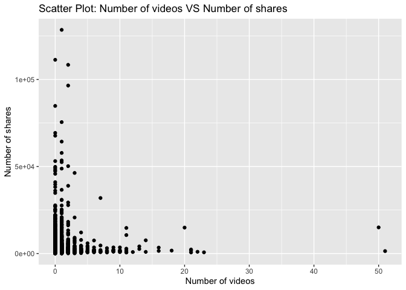

Project 3
================
Shaoyu Wang, Aniket Walimbe
2022-11-14

- <a href="#introduction" id="toc-introduction">Introduction</a>
- <a href="#required-packages" id="toc-required-packages">Required
  Packages</a>
- <a href="#data" id="toc-data">Data</a>
- <a href="#summarizations" id="toc-summarizations">Summarizations</a>
- <a href="#model" id="toc-model">Model</a>
- <a href="#comparison" id="toc-comparison">Comparison</a>
- <a href="#automation" id="toc-automation">Automation</a>

# Introduction

This [online news popularity data
set](https://archive.ics.uci.edu/ml/datasets/Online+News+Popularity)
summarizes a heterogeneous set of features about articles published by
Mashable in a period of two years.

# Required Packages

First, we need to load the required packages:

``` r
# Load libraries
library(readr)
library(tidyverse)
library(dplyr)
library(caret)
library(leaps)
library(ggplot2)
library(corrplot)
library(GGally)
library(randomForest)
```

# Data

Read in the data and subset the data to work on the data channel of
interest. We found that there are seven similar columns for weekday from
Monday to Sunday, so we merged these columns and named the new variable
as `publish_weekday`. For this step, we also removed the non-predictive
variables.

``` r
#Read in the data file
newsData <- read_csv("OnlineNewsPopularity.csv", show_col_types = FALSE)
#Choose the data channel of interest
if (params$channelID != "") {
  paramChannelName <- params$channelID
} else {
  paramChannelName <- "lifestyle"
}
channelID <- paste("data_channel_is_", paramChannelName, sep = "")
#Merge the weekday columns as one single column.
news <- newsData %>% 
  filter(.data[[channelID]] == 1) %>% 
  select(url, starts_with("weekday_is_")) %>% 
  pivot_longer(-url) %>% 
  filter(value != 0) %>% 
  mutate(publish_weekday = substr(name, 12, 20)) %>% 
  left_join(newsData, by = "url") %>% 
#Remove non predictive variables
  select(-c(url, name, value, timedelta, starts_with("data_channel_is_"), starts_with("weekday_is_")))
news$publish_weekday <- as.factor(news$publish_weekday)
news
```

Split the data into a training set and a test set.

``` r
set.seed(111)
trainIndex <- createDataPartition(news$shares, p = 0.7, list = FALSE)
newsTrain <- news[trainIndex,]
newsTest <- news[-trainIndex,]
#newsTrain
```

# Summarizations

For this part, we created some basic summary statistics and plots about
the training data.

- Tables

Firstly, let’s look at some tables. We summarized the training data, so
that we can know all of the variables roughly. For example, this table
shows each count for published on weekdays, we can see which has the
most count and which has the least count. It also shows the minimum, 1st
quantile, median, mean, 3rd quantile and maximum of other variables.

``` r
summary(newsTrain)
```

    ##   publish_weekday n_tokens_title  n_tokens_content n_unique_tokens  n_non_stop_words n_non_stop_unique_tokens
    ##  friday   : 915   Min.   : 4.00   Min.   :   0.0   Min.   :0.0000   Min.   :0.0000   Min.   :0.0000          
    ##  monday   : 947   1st Qu.: 9.00   1st Qu.: 328.0   1st Qu.:0.4654   1st Qu.:1.0000   1st Qu.:0.6285          
    ##  saturday : 369   Median :11.00   Median : 505.5   Median :0.5199   Median :1.0000   Median :0.6839          
    ##  sunday   : 407   Mean   :10.58   Mean   : 595.3   Mean   :0.5109   Mean   :0.9693   Mean   :0.6653          
    ##  thursday :1083   3rd Qu.:12.00   3rd Qu.: 764.0   3rd Qu.:0.5750   3rd Qu.:1.0000   3rd Qu.:0.7354          
    ##  tuesday  :1087   Max.   :23.00   Max.   :4661.0   Max.   :0.9762   Max.   :1.0000   Max.   :1.0000          
    ##  wednesday:1092                                                                                              
    ##    num_hrefs      num_self_hrefs      num_imgs        num_videos      average_token_length  num_keywords   
    ##  Min.   :  0.00   Min.   : 0.000   Min.   : 0.000   Min.   : 0.0000   Min.   :0.000        Min.   : 3.000  
    ##  1st Qu.:  5.00   1st Qu.: 1.000   1st Qu.: 1.000   1st Qu.: 0.0000   1st Qu.:4.654        1st Qu.: 6.000  
    ##  Median :  8.00   Median : 2.000   Median : 1.000   Median : 0.0000   Median :4.823        Median : 7.000  
    ##  Mean   : 10.15   Mean   : 2.409   Mean   : 2.837   Mean   : 0.5464   Mean   :4.679        Mean   : 7.277  
    ##  3rd Qu.: 13.00   3rd Qu.: 3.000   3rd Qu.: 2.000   3rd Qu.: 1.0000   3rd Qu.:4.975        3rd Qu.: 9.000  
    ##  Max.   :120.00   Max.   :38.000   Max.   :79.000   Max.   :51.0000   Max.   :6.124        Max.   :10.000  
    ##                                                                                                            
    ##    kw_min_min       kw_max_min      kw_avg_min        kw_min_max       kw_max_max       kw_avg_max    
    ##  Min.   : -1.00   Min.   :    0   Min.   :   -1.0   Min.   :     0   Min.   :     0   Min.   :     0  
    ##  1st Qu.: -1.00   1st Qu.:  431   1st Qu.:  117.6   1st Qu.:     0   1st Qu.:843300   1st Qu.:178708  
    ##  Median : -1.00   Median :  630   Median :  206.9   Median :  1100   Median :843300   Median :220308  
    ##  Mean   : 16.46   Mean   : 1012   Mean   :  265.9   Mean   :  6836   Mean   :783618   Mean   :227409  
    ##  3rd Qu.:  4.00   3rd Qu.:  946   3rd Qu.:  324.3   3rd Qu.:  5100   3rd Qu.:843300   3rd Qu.:274600  
    ##  Max.   :217.00   Max.   :80400   Max.   :10171.4   Max.   :208300   Max.   :843300   Max.   :640800  
    ##                                                                                                       
    ##    kw_min_avg       kw_max_avg       kw_avg_avg    self_reference_min_shares self_reference_max_shares
    ##  Min.   :  -1.0   Min.   :     0   Min.   :    0   Min.   :     0.0          Min.   :     0           
    ##  1st Qu.:   0.0   1st Qu.:  3451   1st Qu.: 2065   1st Qu.:   465.8          1st Qu.:   691           
    ##  Median : 838.3   Median :  3585   Median : 2401   Median :   978.0          Median :  1700           
    ##  Mean   : 838.7   Mean   :  4694   Mean   : 2514   Mean   :  2886.1          Mean   :  6148           
    ##  3rd Qu.:1588.0   3rd Qu.:  4707   3rd Qu.: 2784   3rd Qu.:  1800.0          3rd Qu.:  4500           
    ##  Max.   :3009.0   Max.   :112787   Max.   :15722   Max.   :690400.0          Max.   :690400           
    ##                                                                                                       
    ##  self_reference_avg_sharess   is_weekend         LDA_00            LDA_01            LDA_02            LDA_03       
    ##  Min.   :     0.0           Min.   :0.0000   Min.   :0.01818   Min.   :0.01818   Min.   :0.02001   Min.   :0.01818  
    ##  1st Qu.:   674.2           1st Qu.:0.0000   1st Qu.:0.02500   1st Qu.:0.02256   1st Qu.:0.52632   1st Qu.:0.02500  
    ##  Median :  1427.9           Median :0.0000   Median :0.03066   Median :0.02858   Median :0.73332   Median :0.02964  
    ##  Mean   :  4157.4           Mean   :0.1315   Mean   :0.06679   Mean   :0.05474   Mean   :0.67098   Mean   :0.07234  
    ##  3rd Qu.:  3200.0           3rd Qu.:0.0000   3rd Qu.:0.04001   3rd Qu.:0.04000   3rd Qu.:0.86323   3rd Qu.:0.04004  
    ##  Max.   :690400.0           Max.   :1.0000   Max.   :0.81801   Max.   :0.79489   Max.   :0.92000   Max.   :0.81994  
    ##                                                                                                                     
    ##      LDA_04        global_subjectivity global_sentiment_polarity global_rate_positive_words
    ##  Min.   :0.01819   Min.   :0.0000      Min.   :-0.32273          Min.   :0.00000           
    ##  1st Qu.:0.02857   1st Qu.:0.3572      1st Qu.: 0.02190          1st Qu.:0.02187           
    ##  Median :0.04000   Median :0.4140      Median : 0.07331          Median :0.03056           
    ##  Mean   :0.13515   Mean   :0.4030      Mean   : 0.07672          Mean   :0.03133           
    ##  3rd Qu.:0.19995   3rd Qu.:0.4659      3rd Qu.: 0.12641          3rd Qu.:0.03970           
    ##  Max.   :0.82312   Max.   :0.9500      Max.   : 0.52000          Max.   :0.11273           
    ##                                                                                            
    ##  global_rate_negative_words rate_positive_words rate_negative_words avg_positive_polarity min_positive_polarity
    ##  Min.   :0.00000            Min.   :0.0000      Min.   :0.0000      Min.   :0.0000        Min.   :0.00000      
    ##  1st Qu.:0.01088            1st Qu.:0.5333      1st Qu.:0.2444      1st Qu.:0.2819        1st Qu.:0.05000      
    ##  Median :0.01644            Median :0.6429      Median :0.3438      Median :0.3315        Median :0.10000      
    ##  Mean   :0.01699            Mean   :0.6234      Mean   :0.3459      Mean   :0.3250        Mean   :0.08907      
    ##  3rd Qu.:0.02223            3rd Qu.:0.7430      3rd Qu.:0.4500      3rd Qu.:0.3790        3rd Qu.:0.10000      
    ##  Max.   :0.07143            Max.   :1.0000      Max.   :1.0000      Max.   :0.8667        Max.   :0.80000      
    ##                                                                                                                
    ##  max_positive_polarity avg_negative_polarity min_negative_polarity max_negative_polarity title_subjectivity
    ##  Min.   :0.0000        Min.   :-1.0000       Min.   :-1.0000       Min.   :-1.00000      Min.   :0.0000    
    ##  1st Qu.:0.5000        1st Qu.:-0.3096       1st Qu.:-0.8000       1st Qu.:-0.10000      1st Qu.:0.0000    
    ##  Median :0.7000        Median :-0.2457       Median :-0.5000       Median :-0.10000      Median :0.0000    
    ##  Mean   :0.6991        Mean   :-0.2523       Mean   :-0.5597       Mean   :-0.09429      Mean   :0.2465    
    ##  3rd Qu.:0.9000        3rd Qu.:-0.1901       3rd Qu.:-0.4000       3rd Qu.:-0.05000      3rd Qu.:0.4545    
    ##  Max.   :1.0000        Max.   : 0.0000       Max.   : 0.0000       Max.   : 0.00000      Max.   :1.0000    
    ##                                                                                                            
    ##  title_sentiment_polarity abs_title_subjectivity abs_title_sentiment_polarity     shares      
    ##  Min.   :-1.00000         Min.   :0.0000         Min.   :0.0000               Min.   :    41  
    ##  1st Qu.: 0.00000         1st Qu.:0.2000         1st Qu.:0.0000               1st Qu.:   827  
    ##  Median : 0.00000         Median :0.5000         Median :0.0000               Median :  1100  
    ##  Mean   : 0.03457         Mean   :0.3611         Mean   :0.1288               Mean   :  2272  
    ##  3rd Qu.: 0.09370         3rd Qu.:0.5000         3rd Qu.:0.2000               3rd Qu.:  1900  
    ##  Max.   : 1.00000         Max.   :0.5000         Max.   :1.0000               Max.   :128500  
    ## 

Then we can check our response variable `shares`. It shows that the
mean, standard deviation, median, IQR of `shares` as follows.

``` r
#numerical summary for the variable shares
newsTrain %>% 
  summarise(mean = round(mean(shares), 0), sd = round(sd(shares), 0), 
            median = round(median(shares), 0), IQR = round(IQR(shares), 0))
```

We also obtain the numerical summaries on some subgroups.

``` r
#numerical summaries on subgroups
newsTrain %>% 
  group_by(publish_weekday) %>% 
  summarise(mean = round(mean(shares), 0), sd = round(sd(shares), 0), 
            median = round(median(shares), 0), IQR = round(IQR(shares), 0))
newsTrain %>% 
  group_by(num_imgs) %>% 
  summarise(mean = round(mean(shares), 0), sd = round(sd(shares), 0), 
            median = round(median(shares), 0), IQR = round(IQR(shares), 0))
newsTrain %>% 
  group_by(num_keywords) %>% 
  summarise(mean = round(mean(shares), 0), sd = round(sd(shares), 0), 
            median = round(median(shares), 0), IQR = round(IQR(shares), 0))
```

Moreover, we divide the title subjectivity into 3 categories:  
1. High: greater than 0.8  
2. Medium: 0.4 to less than 0.8  
3. Low: less than 0.4  
The contingency table is then shown below.

``` r
newsTrain$subject_activity_type <- ifelse(newsTrain$title_subjectivity >= 0.8, "High", 
                                          ifelse(newsTrain$title_subjectivity >= 0.4, "Medium",
                                                 ifelse(airquality$Wind >= 0, "Low")))
table(newsTrain$subject_activity_type)
```

    ## 
    ##   High    Low Medium 
    ##    551   4055   1294

- Plots

Plotting the correlation between numeric variables.

``` r
newsTrainsub <- newsTrain %>% select(-c(publish_weekday, subject_activity_type))
correlation <- cor(newsTrainsub, method = "spearman")
corrplot(correlation, tl.col = "black", tl.cex = 0.5)
```

<!-- --> From the
correlation graph above, we can see that some variables are strongly
correlated.

For further EDA, we are plotting several graphs to see trends between
different variables with respect to the number of shares.

A plot between number of shares and article published day: This plot
shows the number of shares an article has based on the day it has been
published.

``` r
newsTrainday <- newsTrain %>%
  select(publish_weekday, shares) %>%
  group_by(publish_weekday) %>% 
  summarise(total_shares=sum(shares))

g <- ggplot(data = newsTrainday, aes(x=publish_weekday, y=total_shares))
g + geom_col(fill = "lightblue")+
  labs(title = " Shares for articles published based on weekdays")
```

<!-- -->

Here, we have plotted the histogram for number of words in a title for
the data. It can be seen that the graph shows the variable following
normal distribution.

``` r
g <- ggplot(newsTrain, aes(x = n_tokens_title))
g + geom_histogram(fill = "lightblue", binwidth = 1) + 
  labs(x = "Number of words in the title",
       title = "Histogram: Number of words in the title")
```

<!-- -->

Then we have plotted the histogram for number of words in content for
the data.

``` r
g <- ggplot(newsTrain, aes(x = n_tokens_content))
g + geom_histogram(fill = "lightblue") + 
  labs(x = "Number of words in the content", 
       title = "Histogram: Number of words in the content")
```

<!-- -->

A histogram for text subjectivity.

``` r
g <- ggplot(newsTrain, aes(x = global_subjectivity))
g + geom_histogram(fill = "lightblue") + 
  labs(x = "Text subjectivity", 
       title = "Histogram: Text subjectivity")
```

<!-- -->

A histogram for text sentiment polarity.

``` r
g <- ggplot(newsTrain, aes(x = global_sentiment_polarity))
g + geom_histogram(fill = "lightblue") + 
  labs(x = "Text sentiment polarity", 
       title = "Histogram: Text sentiment polarity")
```

<!-- -->

A plot between number of images and number of shares.

``` r
g <- ggplot(data = newsTrain, aes(x = num_imgs, y = shares))
g + geom_point() +
  labs(x = "Number of images" , y = "Number of shares", 
       title = "Scatter Plot: Number of images VS Number of shares") 
```

<!-- -->

A plot between average length of words in content and number of shares:
We can inspect the trend of the shares as a function of average length
of words in content.

``` r
g <- ggplot(newsTrain, aes(x = average_token_length, y = shares))
g + geom_point() + 
  labs(x = "Average token length" , y = "Number of shares", 
       title = "Scatter Plot: Average token length VS Number of shares")
```

<!-- -->

A plot between title subjectivity and number of shares: We can inspect
the trend of the shares as a function of title subjectivity.

``` r
g <- ggplot(data = newsTrain, aes(x = title_subjectivity, y = shares))
g + geom_point() + 
  labs(x = "Title subjectivity" , y = "Number of shares", 
       title = "Scatter Plot: Title subjectivity VS Number of shares") 
```

<!-- -->

Select predictors: publish_weekday, n_tokens_title, n_tokens_content,
num_self_hrefs, num_imgs, average_token_length, num_keywords,
kw_avg_avg, self_reference_avg_sharess, LDA_04, global_subjectivity,
global_sentiment_polarity, avg_positive_polarity, avg_negative_polarity,
title_subjectivity, shares.

``` r
set.seed(111)
Train <- newsTrain %>% 
  select(publish_weekday, n_tokens_title, n_tokens_content, num_self_hrefs, num_imgs, average_token_length, num_keywords, kw_avg_avg, self_reference_avg_sharess, LDA_04, global_subjectivity, global_sentiment_polarity, avg_positive_polarity, avg_negative_polarity, title_subjectivity, shares)
Test <- newsTest %>% 
  select(publish_weekday, n_tokens_title, n_tokens_content, num_self_hrefs, num_imgs, average_token_length, num_keywords, kw_avg_avg, self_reference_avg_sharess, LDA_04, global_subjectivity, global_sentiment_polarity, avg_positive_polarity, avg_negative_polarity, title_subjectivity, shares)
#Train
```

# Model

- Linear Regression Model

Here, we have fitted a forward stepwise linear regression model for the
training dataset having 15 variables. The data is centered and scaled
and number of shares is the response variable.

``` r
#forward stepwise
set.seed(111)
fwFit <- train(shares ~ ., data = Train,
               method = "leapForward",
               preProcess = c("center", "scale"))
#summary(fwFit)
fwFit
```

    ## Linear Regression with Forward Selection 
    ## 
    ## 5900 samples
    ##   15 predictor
    ## 
    ## Pre-processing: centered (20), scaled (20) 
    ## Resampling: Bootstrapped (25 reps) 
    ## Summary of sample sizes: 5900, 5900, 5900, 5900, 5900, 5900, ... 
    ## Resampling results across tuning parameters:
    ## 
    ##   nvmax  RMSE      Rsquared    MAE     
    ##   2      5256.425  0.01367514  1899.489
    ##   3      5267.153  0.01383959  1903.106
    ##   4      5252.925  0.01848447  1901.354
    ## 
    ## RMSE was used to select the optimal model using the smallest value.
    ## The final value used for the model was nvmax = 4.

Here, we have fitted a backward stepwise linear regression model for the
training dataset having 15 variables. The data is centered and scaled
and number of shares is the response variable.

``` r
#backward stepwise
set.seed(111)
bwFit <- train(shares ~ ., data = Train,
               method = "leapBackward",
               preProcess = c("center", "scale"))
#summary(bwFit)
bwFit
```

    ## Linear Regression with Backwards Selection 
    ## 
    ## 5900 samples
    ##   15 predictor
    ## 
    ## Pre-processing: centered (20), scaled (20) 
    ## Resampling: Bootstrapped (25 reps) 
    ## Summary of sample sizes: 5900, 5900, 5900, 5900, 5900, 5900, ... 
    ## Resampling results across tuning parameters:
    ## 
    ##   nvmax  RMSE      Rsquared    MAE     
    ##   2      5273.600  0.01057249  1908.428
    ##   3      5261.516  0.01488939  1904.493
    ##   4      5244.597  0.02065032  1896.542
    ## 
    ## RMSE was used to select the optimal model using the smallest value.
    ## The final value used for the model was nvmax = 4.

``` r
#fit a linear regression model with all predictors
set.seed(111)
lrFit <- train(shares ~ ., data = Train,
               method = "lm",
               trControl = trainControl(method = "cv", number = 5))
lrFit
```

    ## Linear Regression 
    ## 
    ## 5900 samples
    ##   15 predictor
    ## 
    ## No pre-processing
    ## Resampling: Cross-Validated (5 fold) 
    ## Summary of sample sizes: 4720, 4719, 4720, 4721, 4720 
    ## Resampling results:
    ## 
    ##   RMSE      Rsquared  MAE     
    ##   4915.815  0.029417  1881.572
    ## 
    ## Tuning parameter 'intercept' was held constant at a value of TRUE

- Random Forest Model

Here, we have fitted a random forest model which is chosen using the
cross validation method. The RMSE value for the model is as shown below.
The tuning parameter is given as number of columns in the training data
divided by 3.

``` r
set.seed(111)
randomFit <- train(shares ~ ., 
                   data = Train, 
                   method = "rf",
                   preProcess = c("center","scale"),
                   trControl = trainControl(method = "cv", number = 5),
                   tuneGrid = data.frame(mtry = ncol(Train)/3))
randomFit
```

    ## Random Forest 
    ## 
    ## 5900 samples
    ##   15 predictor
    ## 
    ## Pre-processing: centered (20), scaled (20) 
    ## Resampling: Cross-Validated (5 fold) 
    ## Summary of sample sizes: 4720, 4719, 4720, 4721, 4720 
    ## Resampling results:
    ## 
    ##   RMSE      Rsquared   MAE     
    ##   4942.629  0.0371758  1936.438
    ## 
    ## Tuning parameter 'mtry' was held constant at a value of 5.333333

- Boosted Tree Model

Here, we have fitted a random forest model which is chosen using the
cross validation method. The RMSE value for the model is as shown below.
Tuning parameters are n.trees, interaction.depth, shrinkage and
n.minobsinnode.

``` r
set.seed(111)
boostedFit <- train(shares ~ ., 
                    data = Train, 
                    method = "gbm", 
                    preProcess = c("center", "scale"),
                    trControl = trainControl(method = "cv", number = 5),
                    tuneGrid = expand.grid(n.trees = c(25,50,100,150,200), 
                                           interaction.depth = c(1,2,3,4), 
                                           shrinkage = 0.1, 
                                           n.minobsinnode = 10),
                    verbose = FALSE)
boostedFit
```

    ## Stochastic Gradient Boosting 
    ## 
    ## 5900 samples
    ##   15 predictor
    ## 
    ## Pre-processing: centered (20), scaled (20) 
    ## Resampling: Cross-Validated (5 fold) 
    ## Summary of sample sizes: 4720, 4719, 4720, 4721, 4720 
    ## Resampling results across tuning parameters:
    ## 
    ##   interaction.depth  n.trees  RMSE      Rsquared    MAE     
    ##   1                   25      4915.768  0.02898592  1864.446
    ##   1                   50      4908.616  0.03191073  1851.412
    ##   1                  100      4910.861  0.03416651  1857.483
    ##   1                  150      4920.419  0.03309395  1862.820
    ##   1                  200      4912.247  0.03482806  1850.816
    ##   2                   25      4910.702  0.03147987  1852.459
    ##   2                   50      4898.010  0.04174292  1846.302
    ##   2                  100      4917.219  0.03985287  1859.195
    ##   2                  150      4909.532  0.04507074  1867.267
    ##   2                  200      4926.084  0.04407023  1891.964
    ##   3                   25      4877.296  0.04598406  1849.168
    ##   3                   50      4882.604  0.04975395  1842.866
    ##   3                  100      4909.587  0.04920428  1861.648
    ##   3                  150      4943.612  0.04905839  1884.403
    ##   3                  200      4959.883  0.05048467  1900.736
    ##   4                   25      4877.992  0.04559029  1846.179
    ##   4                   50      4893.282  0.04697398  1850.183
    ##   4                  100      4953.576  0.03941133  1888.946
    ##   4                  150      4983.348  0.03999993  1910.265
    ##   4                  200      5003.816  0.04157309  1941.158
    ## 
    ## Tuning parameter 'shrinkage' was held constant at a value of 0.1
    ## Tuning parameter 'n.minobsinnode' was held
    ##  constant at a value of 10
    ## RMSE was used to select the optimal model using the smallest value.
    ## The final values used for the model were n.trees = 25, interaction.depth = 3, shrinkage = 0.1 and n.minobsinnode = 10.

# Comparison

All the models are compared by RMSE on the test set.

``` r
#fit a linear regression model
fw_mod <- postResample(predict(fwFit, newdata = Test), obs = Test$shares)
bw_mod <- postResample(predict(bwFit, newdata = Test), obs = Test$shares)
lr_mod <- postResample(predict(lrFit, newdata = Test), obs = Test$shares)
#random forest
random_mod <- postResample(predict(randomFit, newdata = Test), obs = Test$shares)
#boosted tree
boosted_mod <- postResample(predict(boostedFit, newdata = Test), obs = Test$shares)
#compare all models
tibble(model = c("Forward",
                 "Backward",
                 "LR with all predictors",
                 "Random Forest",
                 "Boosted Tree"), 
       RMSE = c(fw_mod[1],
                bw_mod[1],
                lr_mod[1],
                random_mod[1],
                boosted_mod[1]))
```

# Automation

``` r
#create channel names
channelID <- data.frame("lifestyle", "entertainment", "bus", "socmed", "tech", "world")
#create filenames
output_file <- paste0(channelID,".md")
#create a list for each channel with the channel name parameter
params = lapply(channelID, FUN = function(x){list(channelID = x)})
#put into a data frame
reports <- tibble(output_file, params)
#render code
apply(reports, MARGIN = 1,
          FUN = function(x){
             rmarkdown::render(input = "project3.Rmd",
             output_format = "github_document",
             output_file = x[[1]],
             params = x[[2]],
             output_options = list(toc=TRUE, toc_depth=1, toc_float=TRUE))
             })
```
